<font face="Consolas">


| | | |
| ---- | ---- | ---- |
| |**[Git](#Git_22 "Git")**| |
|[00_Git常用命令](#00_Git_23 "00_Git常用命令")|[01_课程介绍](#01__78 "01_课程介绍")|[02_官网介绍](#02__107 "02_官网介绍")|
|[03_概述_版本控制介绍](#03___123 "03_概述_版本控制介绍")|[04_概述_分布式版本控制VS集中式版本控制](#04__VS_137 "04_概述_分布式版本控制VS集中式版本控制")|[05_概述_发展历史](#05___164 "05_概述_发展历史")|
|[06_概述_工作机制和代码托管中心](#06___168 "06_概述_工作机制和代码托管中心")|[07_安装_安装和客户端的使用](#07___184 "07_安装_安装和客户端的使用")|[08_命令_设置用户签名](#08___194 "08_命令_设置用户签名")|
|[09_命令_初始化本地库](#09___236 "09_命令_初始化本地库")|[10_命令_查看本地库状态](#10___271 "10_命令_查看本地库状态")|[11_命令_添加暂存区](#11___332 "11_命令_添加暂存区")|
|[12_命令_提交本地库](#12___393 "12_命令_提交本地库")|[13_命令_修改文件](#13___448 "13_命令_修改文件")|[14_命令_版本穿梭](#14___515 "14_命令_版本穿梭")|
|[15_分支_概述和优点](#15___688 "15_分支_概述和优点")|[16_分支_查看&创建&切换](#16___704 "16_分支_查看&创建&切换")|[17_分支_合并分支(正常合并)](#17___821 "17_分支_合并分支(正常合并)")|
|[18_分支_合并分支(冲突合并)](#18___884 "18_分支_合并分支(冲突合并)")|[19_团队协作_团队内协作和跨团队协作](#19___1170 "19_团队协作_团队内协作和跨团队协作")| |
| |**[Github](#Github_1180 "Github")**| |
|[20_GitHub_创建远程库&创建别名](#20_GitHub__1182 "20_GitHub_创建远程库&创建别名")|[21_GitHub_推送本地库到远程库](#21_GitHub__1231 "21_GitHub_推送本地库到远程库")|[22_GitHub_拉取远程库到本地库](#22_GitHub__1265 "22_GitHub_拉取远程库到本地库")|
|[23_GitHub_克隆远程库到本地](#23_GitHub__1346 "23_GitHub_克隆远程库到本地")|[24_GitHub_团队内协作](#24_GitHub__1408 "24_GitHub_团队内协作")|[25_GitHub_跨团队协作](#25_GitHub__1501 "25_GitHub_跨团队协作")|
|[26_GitHub_SSH免密登录](#26_GitHub_SSH_1565 "26_GitHub_SSH免密登录")|[27_IDEA集成Git_环境准备](#27_IDEAGit__1750 "27_IDEA集成Git_环境准备")|[28_IDEA集成Git_初始化&添加&提交](#28_IDEAGit__1817 "28_IDEA集成Git_初始化&添加&提交")|
|[29_IDEA集成Git_切换版本](#29_IDEAGit__1865 "29_IDEA集成Git_切换版本")|[30_IDEA集成Git_创建分支&切换分支](#30_IDEAGit__1877 "30_IDEA集成Git_创建分支&切换分支")|[31_IDEA集成Git_合并分支(正常合并)](#31_IDEAGit__1909 "31_IDEA集成Git_合并分支(正常合并)")|
|[32_IDEA集成Git_合并分支(冲突合并)](#32_IDEAGit__1928 "32_IDEA集成Git_合并分支(冲突合并)")|[33_IDEA集成GitHub_设置GitHub账号](#33_IDEAGitHub_GitHub_1958 "33_IDEA集成GitHub_设置GitHub账号")|[34_IDEA集成GitHub_分享项目到GitHub](#34_IDEAGitHub_GitHub_1996 "34_IDEA集成GitHub_分享项目到GitHub")|
|[35_IDEA集成GitHub_推送代码到远程库](#35_IDEAGitHub__2004 "35_IDEA集成GitHub_推送代码到远程库")|[36_IDEA集成GitHub_拉取远程库代码合并本地库](#36_IDEAGitHub__2015 "36_IDEA集成GitHub_拉取远程库代码合并本地库")|[37_IDEA集成GitHub_克隆代码到本地](#37_IDEAGitHub__2024 "37_IDEA集成GitHub_克隆代码到本地")|
| |**[Gitee](#Gitee_2035 "Gitee")**| |
|[38_码云_账号注册登录&创建远程库](#38___2036 "38_码云_账号注册登录&创建远程库")|[39_码云_IDEA集成Gitee码云](#39__IDEAGitee_2061 "39_码云_IDEA集成Gitee码云")|[40_码云_导入GitHub项目](#40__GitHub_2077 "40_码云_导入GitHub项目")|
| |**[GitLab](#GitLab_2081 "GitLab")**| |
|[41_GitLab_简介和安装环境准备](#41_GitLab__2083 "41_GitLab_简介和安装环境准备")|[42_GitLab_安装&初始化服务&启动服务](#42_GitLab__2106 "42_GitLab_安装&初始化服务&启动服务")|[43_GitLab_登录GitLab并创建远程库](#43_GitLab_GitLab_2200 "43_GitLab_登录GitLab并创建远程库")|
|[44_GitLab_IDEA集成GitLab](#44_GitLab_IDEAGitLab_2228 "44_GitLab_IDEA集成GitLab")|[45_课程总结](#45__2234 "45_课程总结")| |

# Git

## 00_Git常用命令

|命令|说明|
| ---- | ---- |
|**安装与配置**||
|sudo apt-get install git|Ubuntu上安装Git命令|
|git config --global user.name 用户名|设置用户签名
（安装Git后务必设置）|
|git config --global user.email email地址|设置用户email地址
（安装Git后务必设置）|
|**获取与创建项目**||
|git init|初始化本地库|
|git clone 远程库地址|从远程库克隆到本地|
|**基本快照**|
|git status|查看本地库状态|
|git add 文件名|添加变动文件到暂存区|
|git add .|添加当前目录下所有变动文件到暂存区|
|git restore --staged 文件名|复位在暂存区的文件（add反悔药）|
|git rm --cached 文件名|移除在暂存区的文件（add反悔药）（同上一条）|
|git commit -m “备注文本” 文件名|提交暂存区文件到本地库
（文件名缺省时，将暂存区所有文件提交）|
|git commit --amend|修改上次提交的备注文本|
|git revert 版本号(7位)|撤销指定的提交（commit反悔药）|
|git reset --hard 版本号(7位)|版本间穿梭（配合git reflog使用）|
|git reset --hard HEAD^|穿梭到上一个版本|
|**分支与合并**||
|git branch|列出所有分支|
|git branch 分支名|创建分支|
|git checkout 分支名|切换分支|
|git merge 分支名B|分支B合并到A
（A为当前工作目录所处分支）|
|git branch -d 分支名|删除分支|
|git tag|列出所有本地标签|
|git tag -l 通配模式文本(*)|根据符合通配模式文本，列出所有本地标签|
|git tag 标签名|为最新提交创建**轻量**标签|
|git tag 标签名 版本号(7位)|为对应版本号提交创建**轻量**标签（在后期打标签）|
|git tag -a 标签名 -m 备注文本|为最新提交创建**附注**标签|
|git tag -d 标签名|删除指定标签|
|**共享与更新项目**||
|git remote add 别名 远程仓库地址|添加远程库|
|git remote -v|查看添加过的远程库|
|git push 远程库地址或其别名 分支名|推送到远程库|
|git push 远程库地址或其别名 --tags|推送所有标签到远程库|
|git fetch|将远程库的最新内容拉到本地|
|git pull 远程库地址或其别名 分支名|将远程仓库对于分支最新内容拉下来后与当前本地分支直接合并，
相当于git fetch + git merge，这样可能会产生冲突，需要手动解决|
|**检查与比较**||
|git show 标签名|显示标签信息和与之对应的提交信息|
|git show 版本号(7位)|显示对应版本对应的提交信息|
|git log|显示当前分支所有提交过的版本信息|
|git log --follow 文件名|显示当前分支所有提交过的关于指定文件版本信息|
|git log --pretty=oneline|显示当前分支所有提交过的版本信息（精简）|
|git log --graph|显示当前分支所有提交过的版本信息（附有分支合并图）|
|git diff 分支一 分支二|显示两分支差异|
|git diff 版本号一(7位) 版本号二(7位)|显示同一分支两版本差异|
|**管理**||
|git reflog|可以查看所有分支的所有操作记录
（包括已被删除的commit记录和reset的操作，git log所不能）|

## 01_课程介绍

[教学视频](https://www.bilibili.com/video/BV1vy4y1s7k6 "教学视频")

- Git
  - Git介绍 分布式版本控制工具 VS 集中式版本控制工具

  - Git安装 基于官网发布的最新版本2.31.1安装讲解

  - Git命令 基于开发案例详细讲解了git的常用命令

  - Git分支 分支特性 分支创建 分支转换 分支合并 代码合并冲突解决

  - Idea集成Git

- GitHub
  - 创建远程库

  - 代码推送Push

  - 代码拉取Pull

  - 代码克隆Clone

  - SSH免密登录

  - Idea集成GitHub

- Gitee码云
  - 码云创建远程库

  - Idea集成Gitee码云

  - 码云连接GitHub进行代码的复制和迁移

- GitLab
  - GitLab服务器的搭建和部署

  - Idea集成GitLab

课程目标：五小时熟练掌握Git GitHub GitLab Gitee码云的使用

## 02_官网介绍

[Git官网](https://git-scm.com/ "Git官网")

[Git官方文档](http://git-scm.com/docs "Git官方文档")

[Git官方书](https://git-scm.com/book/zh/v2 "Git官方书")

[Git下载页面](https://git-scm.com/downloads "Git下载页面")

[Github Git Cheat Sheets - 中文版](https://training.github.com/downloads/zh_CN/github-git-cheat-sheet/ "Github Git Cheat Sheets - 中文版")

Git 是一个免费的、开源的分布式版本控制系统，可以快速高效地处理从小型到大型的各种项目。

Git 易于学习，占地面积小，性能极快。 它具有廉价的本地库，方便的暂存区域和多个工作流分支等特性。 其性能优于 Subversion、 CVS、 Perforce 和 ClearCase 等版本控制工具。

## 03_概述_版本控制介绍

版本控制是一种记录文件内容变化，以便将来查阅特定版本修订情况的系统。

版本控制其实最重要的是可以记录文件修改历史记录，从而让用户能够查看历史版本，方便版本切换。

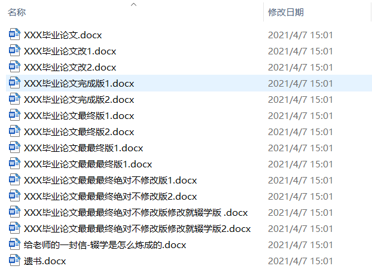

### 为什么需要版本控制

个人开发过渡到团队协作。

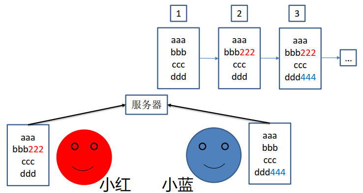

## 04_概述_分布式版本控制VS集中式版本控制

### 集中式版本控制工具

集中化的版本控制系统诸如 CVS、 SVN 等，都有一个单一的集中管理的服务器，保存所有文件的修订版本，而协同工作的人们都通过客户端连到这台服务器，取出最新的文件或者提交更新。多年以来，这已成为版本控制系统的标准做法。

这种做法带来了许多好处，每个人都可以在一定程度上看到项目中的其他人正在做些什么。而管理员也可以轻松掌控每个开发者的权限，并且管理一个集中化的版本控制系统， 要远比在各个客户端上维护本地数据库来得轻松容易。

事分两面，有好有坏。这么做显而易见的**缺点**是中央服务器的单点故障。如果服务器宕机一小时，那么在这一小时内，谁都无法提交更新，也就无法协同工作。

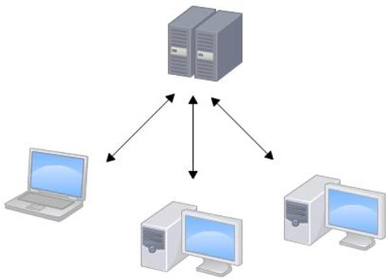

### 分布式版本控制工具

Git、 Mercurial、 Bazaar、 Darcs……

像 Git 这种分布式版本控制工具，客户端提取的不是最新版本的文件快照，而是把代码仓库完整地镜像下来（本地库）。这样任何一处协同工作用的文件发生故障，事后都可以用其他客户端的本地仓库进行恢复。因为每个客户端的每一次文件提取操作，实际上都是一次对整个文件仓库的完整备份。

分布式的版本控制系统出现之后,解决了集中式版本控制系统的缺陷：

1. 服务器断网的情况下也可以进行开发（因为版本控制是在本地进行的）

2. 每个客户端保存的也都是整个完整的项目（包含历史记录， 更加安全）

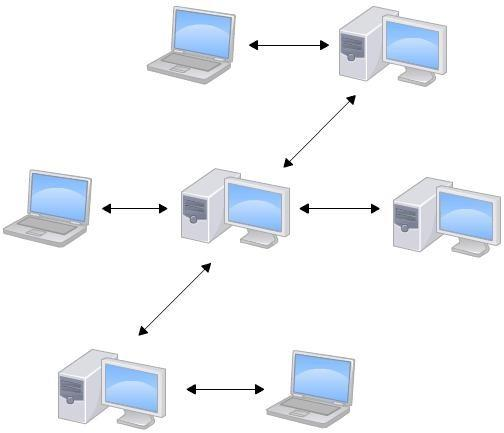

## 05_概述_发展历史

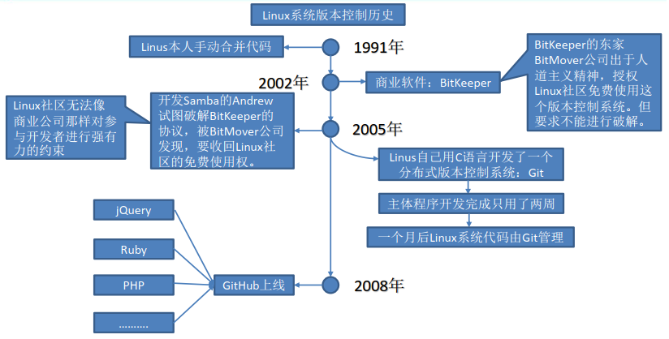

## 06_概述_工作机制和代码托管中心

### 工作机制

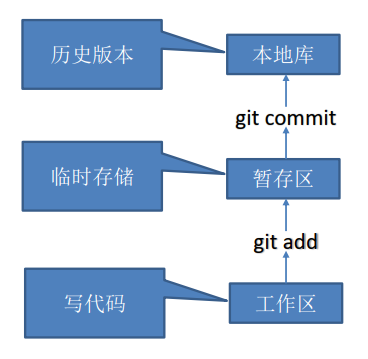

### 代码托管中心

代码托管中心是基于网络服务器的远程代码仓库，一般我们简单称为**远程库**。

- 局域网
  - GitLab

- 互联网
  - GitHub（外网）

  - Gitee 码云（国内网站）

## 07_安装_安装和客户端的使用

在[Git下载页面](https://git-scm.com/downloads "Git下载页面")，选择下载Windows 64位版的Git安装软件。

安装步骤按照安装软件的安装向导安装即可，无需过多配置。

安装成功后，通常在文件浏览器空白处单击击鼠标右键，弹出菜单栏有Git的选项。

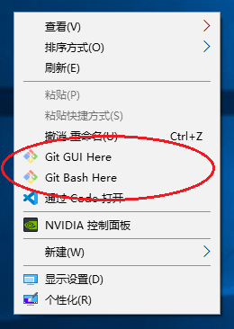

## 08_命令_设置用户签名

### Git 常用命令

|命令名称|作用|
| ---- | ---- |
|git config --global user.name 用户名|设置用户签名|
|git config --global user.email 邮箱|设置用户email地址|
|git init|初始化本地库|
|git status|查看本地库状态|
|git add 文件名|添加到暂存区|
|git commit -m “日志信息” 文件名|提交到本地库|
|git reflog|查看历史记录|
|git reset --hard 版本号|版本穿梭|

### 设置用户签名


git config --global user.name abc #有户名
git config --global user.email abc@123.com


说明：**签名的作用是区分不同操作者身份**。用户的签名信息在每一个版本的提交信息中能够看到，以此确认本次提交是谁做的。 **Git 首次安装必须设置一下用户签名，否则无法提交代码**。

**注意**： 这里设置用户签名和将来登录 GitHub（或其他代码托管中心）的账号没有任何关系。

查看设置过用户签名


```shell
abc@DESKTOP-R85C9HV MINGW64 ~/Desktop
$ cat ~/.gitconfig
[user]
        name = abc
        email = abc@123.com
[core]
        quotepath = false
```


## 09_命令_初始化本地库

基本语法：`git init`

案例实操：


~~~bash
abc@DESKTOP-R85C9HV MINGW64 ~/Desktop
$ mkdir HelloGit

abc@DESKTOP-R85C9HV MINGW64 ~/Desktop (master)
$ cd HelloGit/

abc@DESKTOP-R85C9HV MINGW64 ~/Desktop/HelloGit (master)
$ ls -al
total 4
drwxr-xr-x 1 abc 197121 0 Jul  5 20:18 ./
drwxr-xr-x 1 abc 197121 0 Jul  5 20:19 ../

abc@DESKTOP-R85C9HV MINGW64 ~/Desktop/HelloGit (master)
$ git init
Initialized empty Git repository in C:/Users/abc/Desktop/HelloGit/.git/

# 创建了一个名为.git非空隐藏文件夹
abc@DESKTOP-R85C9HV MINGW64 ~/Desktop/HelloGit (master)
$ ls -al
total 8
drwxr-xr-x 1 abc 197121 0 Jul  5 20:19 ./
drwxr-xr-x 1 abc 197121 0 Jul  5 20:19 ../
drwxr-xr-x 1 abc 197121 0 Jul  5 20:19 .git/


~~~


创建了一个名为.git非空隐藏文件夹。

## 10_命令_查看本地库状态

基本语法：`git status`

案例实操：


~~~bash
abc@DESKTOP-R85C9HV MINGW64 ~/Desktop
$ cd HelloGit/

# 首次查看（工作区没有任何文件）
abc@DESKTOP-R85C9HV MINGW64 ~/Desktop/HelloGit (master)
$ git status
On branch master

No commits yet

nothing to commit (create/copy files and use "git add" to track)

# 新增文件（hello.txt）
abc@DESKTOP-R85C9HV MINGW64 ~/Desktop/HelloGit (master)
$ vim hello.txt

abc@DESKTOP-R85C9HV MINGW64 ~/Desktop/HelloGit (master)
$ cat hello.txt
hello, git!
hello, git!
hello, git!
hello, git!
hello, git!
hello, git!
hello, git!
hello, git!
hello, git!
hello, git!
hello, git!
hello, git!
hello, git!
hello, git!
hello, git!
hello, git!
hello, git!
hello, git!

# 再次查看（检测到未追踪的文件）
abc@DESKTOP-R85C9HV MINGW64 ~/Desktop/HelloGit (master)
$ git status
On branch master

No commits yet

Untracked files:
  (use "git add <file>..." to include in what will be committed)
        hello.txt

nothing added to commit but untracked files present (use "git add" to track)


~~~


## 11_命令_添加暂存区

基本语法：`git add 文件名`

案例实操：


~~~bash
abc@DESKTOP-R85C9HV MINGW64 ~/Desktop/HelloGit (master)
$ git status
On branch master

No commits yet

Untracked files:
  (use "git add <file>..." to include in what will be committed)
        hello.txt

nothing added to commit but untracked files present (use "git add" to track)

#添加至暂存区
abc@DESKTOP-R85C9HV MINGW64 ~/Desktop/HelloGit (master)
$ git add hello.txt
warning: LF will be replaced by CRLF in hello.txt.
The file will have its original line endings in your working directory

abc@DESKTOP-R85C9HV MINGW64 ~/Desktop/HelloGit (master)
$ git status
On branch master

No commits yet

Changes to be committed:
  (use "git rm --cached <file>..." to unstage)
        new file:   hello.txt

#移除暂存区的hello.txt
abc@DESKTOP-R85C9HV MINGW64 ~/Desktop/HelloGit (master)
$ git rm --cached hello.txt
rm 'hello.txt'

abc@DESKTOP-R85C9HV MINGW64 ~/Desktop/HelloGit (master)
$ git status
On branch master

No commits yet

Untracked files:
  (use "git add <file>..." to include in what will be committed)
        hello.txt

nothing added to commit but untracked files present (use "git add" to track)

# 再次添加
abc@DESKTOP-R85C9HV MINGW64 ~/Desktop/HelloGit (master)
$ git add hello.txt
warning: LF will be replaced by CRLF in hello.txt.
The file will have its original line endings in your working directory

~~~


## 12_命令_提交本地库

基本语法：`git commit -m "日志信息" 文件名`

案例实操：


~~~bash
abc@DESKTOP-R85C9HV MINGW64 ~/Desktop/HelloGit (master)
$ git status
On branch master

No commits yet

Untracked files:
  (use "git add <file>..." to include in what will be committed)
        hello.txt

nothing added to commit but untracked files present (use "git add" to track)

abc@DESKTOP-R85C9HV MINGW64 ~/Desktop/HelloGit (master)
$ git add hello.txt
warning: LF will be replaced by CRLF in hello.txt.
The file will have its original line endings in your working directory

#提交本地库
abc@DESKTOP-R85C9HV MINGW64 ~/Desktop/HelloGit (master)
$ git commit -m "first commit"
[master (root-commit) b0006bc] first commit
 1 file changed, 19 insertions(+)
 create mode 100644 hello.txt

abc@DESKTOP-R85C9HV MINGW64 ~/Desktop/HelloGit (master)
$ git status
On branch master
nothing to commit, working tree clean

~~~


查看提交记录


~~~bash
abc@DESKTOP-R85C9HV MINGW64 ~/Desktop/HelloGit (master)
$ git reflog
b0006bc (HEAD -> master) HEAD@{0}: commit (initial): first commit

abc@DESKTOP-R85C9HV MINGW64 ~/Desktop/HelloGit (master)
$ git log
commit b0006bc538b98b7eb77b4b4aaa17b6e333c4289e (HEAD -> master)
Author: abc <abc@123.com>
Date:   Tue Jul 6 00:38:24 2021 +0800

    first commit

~~~


## 13_命令_修改文件

修改hello.txt内容，`git status`会提示该文件修改过


~~~bash
abc@DESKTOP-R85C9HV MINGW64 ~/Desktop/HelloGit (master)
$ vim hello.txt

abc@DESKTOP-R85C9HV MINGW64 ~/Desktop/HelloGit (master)
$ cat hello.txt
hello, git!222
hello, git!
hello, git!
hello, git!
hello, git!
hello, git!
hello, git!
hello, git!
hello, git!
hello, git!
hello, git!
hello, git!
hello, git!
hello, git!
hello, git!
hello, git!
hello, git!
hello, git!
hello, git!
hello, git!

#提示 hello.txt 被修改过（modified）
abc@DESKTOP-R85C9HV MINGW64 ~/Desktop/HelloGit (master)
$ git status
On branch master
Changes not staged for commit:
  (use "git add <file>..." to update what will be committed)
  (use "git restore <file>..." to discard changes in working directory)
        modified:   hello.txt

no changes added to commit (use "git add" and/or "git commit -a")

# 将修改的文件再次添加暂存区
abc@DESKTOP-R85C9HV MINGW64 ~/Desktop/HelloGit (master)
$ git add hello.txt
warning: LF will be replaced by CRLF in hello.txt.
The file will have its original line endings in your working directory

# 第2次提交
abc@DESKTOP-R85C9HV MINGW64 ~/Desktop/HelloGit (master)
$ git commit -m "second commit"
[master 6967bf0] second commit
 1 file changed, 1 insertion(+)

abc@DESKTOP-R85C9HV MINGW64 ~/Desktop/HelloGit (master)
$ git reflog
6967bf0 (HEAD -> master) HEAD@{0}: commit: second commit
b0006bc HEAD@{1}: commit (initial): first commit

abc@DESKTOP-R85C9HV MINGW64 ~/Desktop/HelloGit (master)
$ git status
On branch master
nothing to commit, working tree clean

~~~


## 14_命令_版本穿梭

### 查看历史版本

基本语法：

- `git reflog` 查看版本信息

- `git log` 查看版本详细信息


~~~bash
abc@DESKTOP-R85C9HV MINGW64 ~/Desktop/HelloGit (master)
$ git reflog
41f776b (HEAD -> master) HEAD@{0}: commit: third commit
6967bf0 HEAD@{1}: commit: second commit
b0006bc HEAD@{2}: commit (initial): first commit

abc@DESKTOP-R85C9HV MINGW64 ~/Desktop/HelloGit (master)
$ git log
commit 41f776ba69ea06c42bd449098d818ab73608d4dd (HEAD -> master)
Author: abc <abc@123.com>
Date:   Tue Jul 6 01:18:21 2021 +0800

    third commit

commit 6967bf01bdcbc8e326f1b8c45d45db8bd4c0c868
Author: abc <abc@123.com>
Date:   Tue Jul 6 01:02:10 2021 +0800

    second commit

commit b0006bc538b98b7eb77b4b4aaa17b6e333c4289e
Author: abc <abc@123.com>
Date:   Tue Jul 6 00:38:24 2021 +0800

    first commit


~~~


**git log与git reflog区别**

`git log` 命令可以显示所有提交过的版本信息，如果感觉太繁琐，可以加上参数 `--pretty=oneline`，只会显示版本号和提交时的备注信息。

`git reflog` 可以查看所有分支的所有操作记录（包括已经被删除的 commit 记录和 reset 的操作）。例如，执行 `git reset --hard HEAD~1`，退回到上一个版本，用`git log`则是看不出来被删除的commitid，用`git reflog`则可以看到被删除的commitid，我们就可以买后悔药，恢复到被删除的那个版本。[link](https://blog.csdn.net/u013252047/article/details/80230781 "link")

### 版本穿梭

基本语法：`git reset --hard 版本号`


~~~bash
# 首先查看当前的历史记录
abc@DESKTOP-R85C9HV MINGW64 ~/Desktop/HelloGit (master)
$ git reflog
41f776b (HEAD -> master) HEAD@{0}: commit: third commit
6967bf0 HEAD@{1}: commit: second commit
b0006bc HEAD@{2}: commit (initial): first commit

# 切换到 b0006bc 版本，也就是第一次提交的版本
abc@DESKTOP-R85C9HV MINGW64 ~/Desktop/HelloGit (master)
$ git reset --hard b0006bc
HEAD is now at b0006bc first commit

# 切换完毕之后再查看历史记录，当前成功切换到了 b0006bc 版本
abc@DESKTOP-R85C9HV MINGW64 ~/Desktop/HelloGit (master)
$ git reflog
b0006bc (HEAD -> master) HEAD@{0}: reset: moving to b0006bc
41f776b HEAD@{1}: commit: third commit
6967bf0 HEAD@{2}: commit: second commit
b0006bc (HEAD -> master) HEAD@{3}: commit (initial): first commit

# 然后查看文件 hello.txt，发现文件内容回到第一版本
abc@DESKTOP-R85C9HV MINGW64 ~/Desktop/HelloGit (master)
$ cat hello.txt
hello, git!
hello, git!
hello, git!
hello, git!
hello, git!
hello, git!
hello, git!
hello, git!
hello, git!
hello, git!
hello, git!
hello, git!
hello, git!
hello, git!
hello, git!
hello, git!
hello, git!
hello, git!
hello, git!


~~~


当你在切换版本后，再更改文本内容提交：


~~~bash
abc@DESKTOP-R85C9HV MINGW64 ~/Desktop/HelloGit (master)
$ vim hello.txt

abc@DESKTOP-R85C9HV MINGW64 ~/Desktop/HelloGit (master)
$ git status
On branch master
Changes not staged for commit:
  (use "git add <file>..." to update what will be committed)
  (use "git restore <file>..." to discard changes in working directory)
        modified:   hello.txt

no changes added to commit (use "git add" and/or "git commit -a")

abc@DESKTOP-R85C9HV MINGW64 ~/Desktop/HelloGit (master)
$ git add hello.txt

abc@DESKTOP-R85C9HV MINGW64 ~/Desktop/HelloGit (master)
$ git commit -m "forth commit"
[master 5f8dbf6] forth commit
 1 file changed, 1 insertion(+), 1 deletion(-)

abc@DESKTOP-R85C9HV MINGW64 ~/Desktop/HelloGit (master)
$ git reflog
5f8dbf6 (HEAD -> master) HEAD@{0}: commit: forth commit
b0006bc HEAD@{1}: reset: moving to b0006bc
41f776b HEAD@{2}: commit: third commit
6967bf0 HEAD@{3}: commit: second commit
b0006bc HEAD@{4}: commit (initial): first commit

~~~


再次切换到第一版本：


~~~bash
abc@DESKTOP-R85C9HV MINGW64 ~/Desktop/HelloGit (master)
$ git reset --hard b0006bc
HEAD is now at b0006bc first commit

abc@DESKTOP-R85C9HV MINGW64 ~/Desktop/HelloGit (master)
$ git reflog
b0006bc (HEAD -> master) HEAD@{0}: reset: moving to b0006bc
5f8dbf6 HEAD@{1}: commit: forth commit
b0006bc (HEAD -> master) HEAD@{2}: reset: moving to b0006bc
41f776b HEAD@{3}: commit: third commit
6967bf0 HEAD@{4}: commit: second commit
b0006bc (HEAD -> master) HEAD@{5}: commit (initial): first commit

abc@DESKTOP-R85C9HV MINGW64 ~/Desktop/HelloGit (master)
$ cat hello.txt
hello, git!
hello, git!
hello, git!
hello, git!
hello, git!
hello, git!
hello, git!
hello, git!
hello, git!
hello, git!
hello, git!
hello, git!
hello, git!
hello, git!
hello, git!
hello, git!
hello, git!
hello, git!
hello, git!

~~~


**Git 切换版本， 底层其实是移动的 HEAD 指针。**

## 15_分支_概述和优点

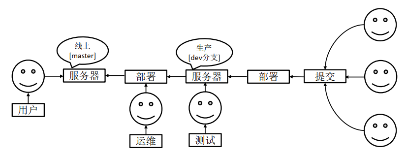

### 什么是分支

在版本控制过程中，同时推进多个任务，为每个任务，我们就可以创建每个任务的单独分支。使用分支意味着程序员可以把自己的工作从开发主线上分离开来， 开发自己分支的时候，不会影响主线分支的运行。对于初学者而言，分支可以简单理解为副本，一个分支就是一个单独的副本。（分支底层其实也是指针的引用）

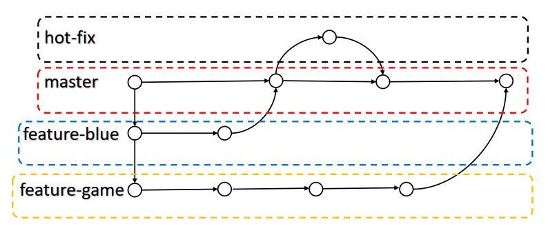

### 分支的好处

同时并行推进多个功能开发，提高开发效率。

各个分支在开发过程中，如果某一个分支开发失败，不会对其他分支有任何影响。失败的分支删除重新开始即可。

## 16_分支_查看&创建&切换

### 分支的操作

|命令名称|作用|
| ---- | ---- |
|git branch 分支名|创建分支|
|git branch -v|查看分支|
|git checkout 分支名|切换分支|
|git merge 分支名|把指定的分支合并到当前分支上|

### 查看分支

基本语法：`git branch -v`


~~~bash
abc@DESKTOP-R85C9HV MINGW64 ~/Desktop/HelloGit (master)
$ git branch -v
* master b0006bc first commit

~~~


### 创建分支

基本语法：`git branch 分支名`


~~~bash
abc@DESKTOP-R85C9HV MINGW64 ~/Desktop/HelloGit (master)
$ git branch hot-fix

abc@DESKTOP-R85C9HV MINGW64 ~/Desktop/HelloGit (master)
$ git branch -v
  hot-fix b0006bc first commit
* master  b0006bc first commit

~~~


**刚创建的新的分支，并将主分支master的内容复制了一份**。

### 切换分支

基本语法：`git checkout 分支名`


~~~bash
abc@DESKTOP-R85C9HV MINGW64 ~/Desktop/HelloGit (master)
$ git checkout hot-fix
Switched to branch 'hot-fix'

# 切换到刚创建的分支上
abc@DESKTOP-R85C9HV MINGW64 ~/Desktop/HelloGit (hot-fix)
$ git branch -v
* hot-fix b0006bc first commit
  master  b0006bc first commit

~~~


切换分支后，在新分支修改文件：


~~~bash
abc@DESKTOP-R85C9HV MINGW64 ~/Desktop/HelloGit (hot-fix)
$ vim hello.txt

abc@DESKTOP-R85C9HV MINGW64 ~/Desktop/HelloGit (hot-fix)
$ cat hello.txt
hello, git!hot-fix
hello, git!
hello, git!
hello, git!
hello, git!
hello, git!
hello, git!
hello, git!
hello, git!
hello, git!
hello, git!
hello, git!
hello, git!
hello, git!
hello, git!
hello, git!
hello, git!
hello, git!
hello, git!

abc@DESKTOP-R85C9HV MINGW64 ~/Desktop/HelloGit (hot-fix)
$ git status
On branch hot-fix
Changes not staged for commit:
  (use "git add <file>..." to update what will be committed)
  (use "git restore <file>..." to discard changes in working directory)
        modified:   hello.txt

no changes added to commit (use "git add" and/or "git commit -a")

abc@DESKTOP-R85C9HV MINGW64 ~/Desktop/HelloGit (hot-fix)
$ git add hello.txt

#在hot-fix提交
abc@DESKTOP-R85C9HV MINGW64 ~/Desktop/HelloGit (hot-fix)
$ git commit -m "hot-fix first commit"
[hot-fix 25f62d6] hot-fix first commit
 1 file changed, 1 insertion(+), 1 deletion(-)

abc@DESKTOP-R85C9HV MINGW64 ~/Desktop/HelloGit (hot-fix)
$ git reflog
25f62d6 (HEAD -> hot-fix) HEAD@{0}: commit: hot-fix first commit
b0006bc (master) HEAD@{1}: checkout: moving from master to hot-fix
b0006bc (master) HEAD@{2}: reset: moving to b0006bc
5f8dbf6 HEAD@{3}: commit: forth commit
b0006bc (master) HEAD@{4}: reset: moving to b0006bc
41f776b HEAD@{5}: commit: third commit
6967bf0 HEAD@{6}: commit: second commit
b0006bc (master) HEAD@{7}: commit (initial): first commit


~~~


## 17_分支_合并分支(正常合并)

基本语法：`git merge 分支名`

在 master 分支上合并 hot-fix 分支（将hot-fix的合并到master）。


~~~bash
# 首先要切换到master分支上
abc@DESKTOP-R85C9HV MINGW64 ~/Desktop/HelloGit (hot-fix)
$ git checkout master
Switched to branch 'master'

#将hot-fix的合并到master
abc@DESKTOP-R85C9HV MINGW64 ~/Desktop/HelloGit (master)
$ git merge hot-fix
Updating b0006bc..25f62d6
Fast-forward
 hello.txt | 2 +-
 1 file changed, 1 insertion(+), 1 deletion(-)

#合并后，可以在master分支上看到hot-fix上分支对文件的修改
abc@DESKTOP-R85C9HV MINGW64 ~/Desktop/HelloGit (master)
$ cat hello.txt
hello, git!hot-fix
hello, git!
hello, git!
hello, git!
hello, git!
hello, git!
hello, git!
hello, git!
hello, git!
hello, git!
hello, git!
hello, git!
hello, git!
hello, git!
hello, git!
hello, git!
hello, git!
hello, git!
hello, git!

#合并后，hot-fix分支依然存在，并未消失
abc@DESKTOP-R85C9HV MINGW64 ~/Desktop/HelloGit (master)
$ git branch -v
  hot-fix 25f62d6 hot-fix first commit
* master  25f62d6 hot-fix first commit

abc@DESKTOP-R85C9HV MINGW64 ~/Desktop/HelloGit (master)
$ git branch hot-fix
fatal: A branch named 'hot-fix' already exists.

abc@DESKTOP-R85C9HV MINGW64 ~/Desktop/HelloGit (master)
$ git checkout hot-fix
Switched to branch 'hot-fix'

abc@DESKTOP-R85C9HV MINGW64 ~/Desktop/HelloGit (hot-fix)
$

~~~


## 18_分支_合并分支(冲突合并)

### 冲突产生的原因

并分支时，两个分支在同一个文件的同一个位置有两套完全不同的修改。 Git 无法替我们决定使用哪一个，因此，必须**人为决定**新代码内容。

### 产生冲突

首先，在master修改文件hello.txt最后一行内容，并提交：


~~~bash
abc@DESKTOP-R85C9HV MINGW64 ~/Desktop/HelloGit (master)
$ vim hello.txt

abc@DESKTOP-R85C9HV MINGW64 ~/Desktop/HelloGit (master)
$ cat hello.txt
hello, git!hot-fix
hello, git!
hello, git!
hello, git!
hello, git!
hello, git!
hello, git!
hello, git!
hello, git!
hello, git!
hello, git!
hello, git!
hello, git!
hello, git!
hello, git!
hello, git!
hello, git!
hello, git!
hello, git!master test

abc@DESKTOP-R85C9HV MINGW64 ~/Desktop/HelloGit (master)
$ git status
On branch master
Changes not staged for commit:
  (use "git add <file>..." to update what will be committed)
  (use "git restore <file>..." to discard changes in working directory)
        modified:   hello.txt

no changes added to commit (use "git add" and/or "git commit -a")

abc@DESKTOP-R85C9HV MINGW64 ~/Desktop/HelloGit (master)
$ git add hello.txt

abc@DESKTOP-R85C9HV MINGW64 ~/Desktop/HelloGit (master)
$ git commit -m "master test"
[master fb0e30b] master test
 1 file changed, 2 insertions(+), 2 deletions(-)


~~~


然后，在hot-fix修改文件hello.txt最后一行内容，并提交：


~~~bash
abc@DESKTOP-R85C9HV MINGW64 ~/Desktop/HelloGit (master)
$ git checkout hot-fix
Switched to branch 'hot-fix'

abc@DESKTOP-R85C9HV MINGW64 ~/Desktop/HelloGit (hot-fix)
$ vim hello.txt

abc@DESKTOP-R85C9HV MINGW64 ~/Desktop/HelloGit (hot-fix)
$ cat hello.txt
hello, git!hot-fix
hello, git!
hello, git!
hello, git!
hello, git!
hello, git!
hello, git!
hello, git!
hello, git!
hello, git!
hello, git!
hello, git!
hello, git!
hello, git!
hello, git!
hello, git!
hello, git!
hello, git!
hello, git!hot-fix test

abc@DESKTOP-R85C9HV MINGW64 ~/Desktop/HelloGit (hot-fix)
$ git add hello.txt

abc@DESKTOP-R85C9HV MINGW64 ~/Desktop/HelloGit (hot-fix)
$ git commit -m "hot-fix test"
[hot-fix 47d2d8f] hot-fix test
 1 file changed, 1 insertion(+), 1 deletion(-)


~~~


切换到master分支，然后将hot-fix分支的合并到master，冲突产生：


~~~bash
abc@DESKTOP-R85C9HV MINGW64 ~/Desktop/HelloGit (hot-fix)
$ git checkout master
Switched to branch 'master'

# 冲突产生
abc@DESKTOP-R85C9HV MINGW64 ~/Desktop/HelloGit (master)
$ git merge hot-fix
Auto-merging hello.txt
CONFLICT (content): Merge conflict in hello.txt
Automatic merge failed; fix conflicts and then commit the result.

# MERGING 出现，表示有冲突待解决
abc@DESKTOP-R85C9HV MINGW64 ~/Desktop/HelloGit (master|MERGING)
$ git status
On branch master
You have unmerged paths.
  (fix conflicts and run "git commit")
  (use "git merge --abort" to abort the merge)

Unmerged paths:
  (use "git add <file>..." to mark resolution)
        both modified:   hello.txt

no changes added to commit (use "git add" and/or "git commit -a")

abc@DESKTOP-R85C9HV MINGW64 ~/Desktop/HelloGit (master|MERGING)
$ cat hello.txt
hello, git!hot-fix
hello, git!
hello, git!
hello, git!
hello, git!
hello, git!
hello, git!
hello, git!
hello, git!
hello, git!
hello, git!
hello, git!
hello, git!
hello, git!
hello, git!
hello, git!
hello, git!
<<<<<<< HEAD
hello, git!hot-fix test
hello, git!master test
=======
hello, git!
hello, git!hot-fix test
>>>>>>> hot-fix


~~~


### 解决冲突

编辑有冲突的文件，**删除特殊符号**，决定要使用的内容

特殊符号：


<<<<<<< HEAD
当前分支的代码 
======= 
合并过来的代码 
>>>>>>> hot-fix


~~~bash
abc@DESKTOP-R85C9HV MINGW64 ~/Desktop/HelloGit (master|MERGING)
$ cat hello.txt
hello, git!hot-fix
hello, git!
hello, git!
hello, git!
hello, git!
hello, git!
hello, git!
hello, git!
hello, git!
hello, git!
hello, git!
hello, git!
hello, git!
hello, git!
hello, git!
hello, git!
hello, git!
<<<<<<< HEAD
hello, git!hot-fix test
hello, git!master test
=======
hello, git!
hello, git!hot-fix test
>>>>>>> hot-fix

abc@DESKTOP-R85C9HV MINGW64 ~/Desktop/HelloGit (master|MERGING)
$ vim hello.txt

abc@DESKTOP-R85C9HV MINGW64 ~/Desktop/HelloGit (master|MERGING)
$ cat hello.txt
hello, git!hot-fix
hello, git!
hello, git!
hello, git!
hello, git!
hello, git!
hello, git!
hello, git!
hello, git!
hello, git!
hello, git!
hello, git!
hello, git!
hello, git!
hello, git!
hello, git!
hello, git!
hello, git!hot-fix test
hello, git!master test

abc@DESKTOP-R85C9HV MINGW64 ~/Desktop/HelloGit (master|MERGING)
$ git status
On branch master
You have unmerged paths.
  (fix conflicts and run "git commit")
  (use "git merge --abort" to abort the merge)

Unmerged paths:
  (use "git add <file>..." to mark resolution)
        both modified:   hello.txt

no changes added to commit (use "git add" and/or "git commit -a")

abc@DESKTOP-R85C9HV MINGW64 ~/Desktop/HelloGit (master|MERGING)
$ git add hello.txt

abc@DESKTOP-R85C9HV MINGW64 ~/Desktop/HelloGit (master|MERGING)
$ git commit -m "conflict solved"
[master 785ab46] conflict solved

# (master|MERGING)的|MERGING消失了，冲突解决
abc@DESKTOP-R85C9HV MINGW64 ~/Desktop/HelloGit (master)
$ git reflog
785ab46 (HEAD -> master) HEAD@{0}: commit (merge): conflict solved
fb0e30b HEAD@{1}: checkout: moving from hot-fix to master
47d2d8f (hot-fix) HEAD@{2}: commit: hot-fix test
25f62d6 HEAD@{3}: checkout: moving from master to hot-fix
fb0e30b HEAD@{4}: commit: master test
25f62d6 HEAD@{5}: checkout: moving from hot-fix to master
25f62d6 HEAD@{6}: checkout: moving from master to hot-fix
25f62d6 HEAD@{7}: checkout: moving from hot-fix to master
25f62d6 HEAD@{8}: checkout: moving from master to hot-fix
25f62d6 HEAD@{9}: merge hot-fix: Fast-forward
b0006bc HEAD@{10}: checkout: moving from hot-fix to master
25f62d6 HEAD@{11}: commit: hot-fix first commit
b0006bc HEAD@{12}: checkout: moving from master to hot-fix
b0006bc HEAD@{13}: reset: moving to b0006bc
5f8dbf6 HEAD@{14}: commit: forth commit
b0006bc HEAD@{15}: reset: moving to b0006bc
41f776b HEAD@{16}: commit: third commit
6967bf0 HEAD@{17}: commit: second commit
b0006bc HEAD@{18}: commit (initial): first commit

abc@DESKTOP-R85C9HV MINGW64 ~/Desktop/HelloGit (master)
$

~~~


### 创建分支和切换分支

master、 hot-fix 其实都是指向具体版本记录的指针。当前所在的分支，其实是由 HEAD决定的。所以创建分支的本质就是多创建一个指针。

- HEAD 如果指向 master，那么我们现在就在 master 分支上。

- HEAD 如果执行 hot-fix，那么我们现在就在 hot-fix 分支上。

所以切换分支的本质就是移动 HEAD 指针。

## 19_团队协作_团队内协作和跨团队协作

### 团队内协作

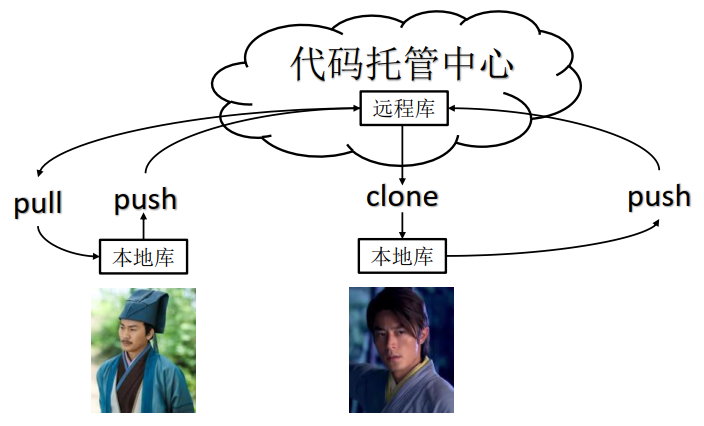

### 跨团队协作

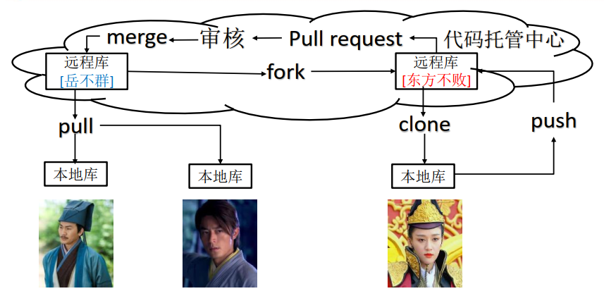

# Github

## 20_GitHub_创建远程库&创建别名

[GitHub网址](https://github.com/ "GitHub网址")

### 创建远程库

登陆后，点击在网页右上角的“+” --> “New repository”，创建远程库。

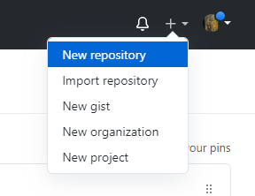

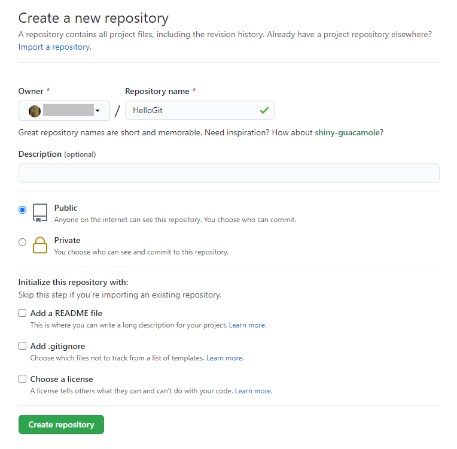

### 远程仓库操作

|命令名称|作用|
| ---- | ---- |
|git remote -v|查看当前所有远程地址别名|
|git remote add 别名 远程地址|起别名|
|git push 别名 分支|推送本地分支上的内容到远程仓库|
|git clone 远程地址|将远程仓库的内容克隆到本地|
|git pull 远程库地址别名 远程分支名|将远程仓库对于分支最新内容拉下来后与 当前本地分支直接合并|

### 创建别名

**基本语法**：

- `git remote -v` 查看当前所有远程地址别名

- `git remote add 别名 远程地址`


~~~bash
abc@DESKTOP-R85C9HV MINGW64 ~/Desktop/HelloGit (master)
$ git remote -v

abc@DESKTOP-R85C9HV MINGW64 ~/Desktop/HelloGit (master)
$ git remote add hellogit https://github.com/abc/HelloGit.git

abc@DESKTOP-R85C9HV MINGW64 ~/Desktop/HelloGit (master)
$ git remote -v
hellogit        https://github.com/abc/HelloGit.git (fetch)
hellogit        https://github.com/abc/HelloGit.git (push)


~~~


https://github.com/abc/HelloGit.git，这个地址在创建完远程仓库后生成的连接 ，如图所示

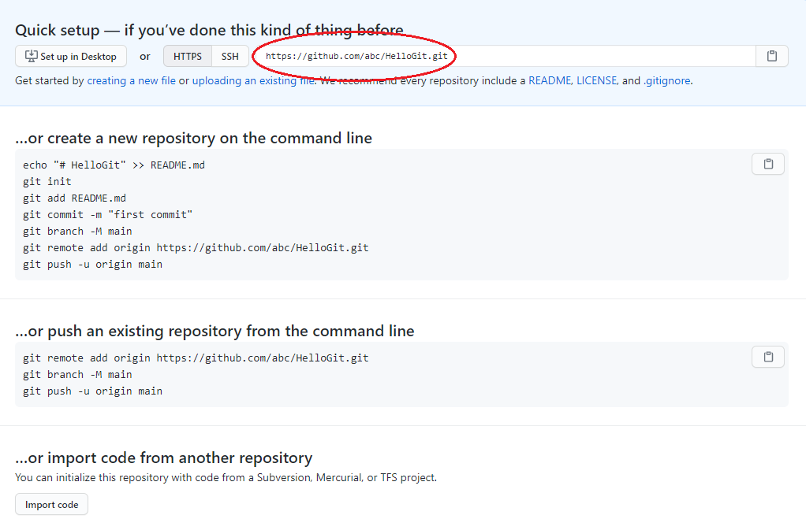

## 21_GitHub_推送本地库到远程库

基本语法：`git push 别名 分支`


~~~bash
# 将master分支推送到别名为hellogit远程地址，
# 也就推送到https://github.com/abc/HelloGit.git（具体看前一节）
# 这里需要授权认证操作（输入账号密码）
abc@DESKTOP-R85C9HV MINGW64 ~/Desktop/HelloGit (master)
$ git push hellogit master
fatal: unable to access 'https://github.com/abc/HelloGit.git/': OpenSSL SSL_read: Connection was reset, errno 10054

abc@DESKTOP-R85C9HV MINGW64 ~/Desktop/HelloGit (master)
$ git push hellogit master
Enumerating objects: 13, done.
Counting objects: 100% (13/13), done.
Delta compression using up to 8 threads
Compressing objects: 100% (9/9), done.
Writing objects: 100% (13/13), 1.02 KiB | 523.00 KiB/s, done.
Total 13 (delta 4), reused 0 (delta 0), pack-reused 0
remote: Resolving deltas: 100% (4/4), done.
To https://github.com/abc/HelloGit.git
 * [new branch]      master -> master


~~~


推送成功后，刷新https://github.com/abc/HelloGit：

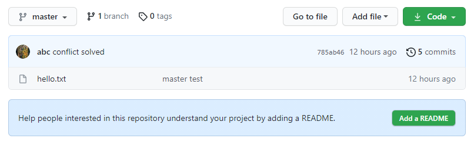

## 22_GitHub_拉取远程库到本地库

基本语法：`git push 别名 分支`

在Github上修改hello.txt文件，并提交。

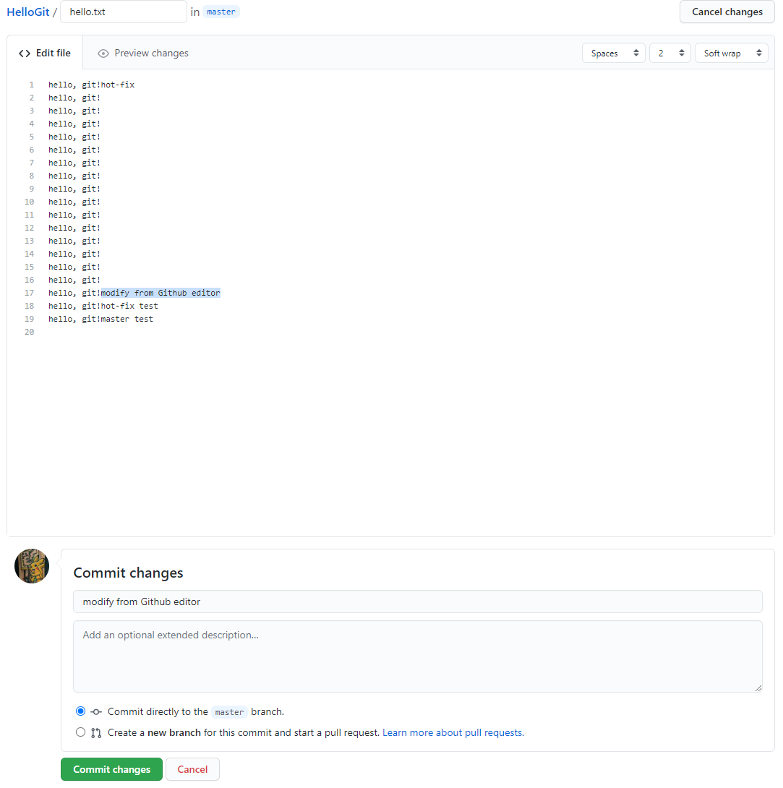


~~~bash
#从hellogit拉取到master分支上
abc@DESKTOP-R85C9HV MINGW64 ~/Desktop/HelloGit (master)
$ git pull hellogit master
remote: Enumerating objects: 5, done.
remote: Counting objects: 100% (5/5), done.
remote: Compressing objects: 100% (2/2), done.
remote: Total 3 (delta 1), reused 0 (delta 0), pack-reused 0
Unpacking objects: 100% (3/3), 672 bytes | 168.00 KiB/s, done.
From https://github.com/JallenKwong/HelloGit
 * branch            master     -> FETCH_HEAD
   785ab46..47e257f  master     -> hellogit/master
Updating 785ab46..47e257f
Fast-forward
 hello.txt | 2 +-
 1 file changed, 1 insertion(+), 1 deletion(-)

# 可看到从Github上修改后痕迹
abc@DESKTOP-R85C9HV MINGW64 ~/Desktop/HelloGit (master)
$ cat hello.txt
hello, git!hot-fix
hello, git!
hello, git!
hello, git!
hello, git!
hello, git!
hello, git!
hello, git!
hello, git!
hello, git!
hello, git!
hello, git!
hello, git!
hello, git!
hello, git!
hello, git!
hello, git!modify from Github editor
hello, git!hot-fix test
hello, git!master test

abc@DESKTOP-R85C9HV MINGW64 ~/Desktop/HelloGit (master)
$ git status
On branch master
nothing to commit, working tree clean

abc@DESKTOP-R85C9HV MINGW64 ~/Desktop/HelloGit (master)
$ git reflog
47e257f (HEAD -> master, hellogit/master) HEAD@{0}: pull hellogit master: Fast-forward
785ab46 HEAD@{1}: commit (merge): conflict solved
fb0e30b HEAD@{2}: checkout: moving from hot-fix to master
47d2d8f (hot-fix) HEAD@{3}: commit: hot-fix test
25f62d6 HEAD@{4}: checkout: moving from master to hot-fix
fb0e30b HEAD@{5}: commit: master test
25f62d6 HEAD@{6}: checkout: moving from hot-fix to master
25f62d6 HEAD@{7}: checkout: moving from master to hot-fix
25f62d6 HEAD@{8}: checkout: moving from hot-fix to master
25f62d6 HEAD@{9}: checkout: moving from master to hot-fix
25f62d6 HEAD@{10}: merge hot-fix: Fast-forward
b0006bc HEAD@{11}: checkout: moving from hot-fix to master
25f62d6 HEAD@{12}: commit: hot-fix first commit
b0006bc HEAD@{13}: checkout: moving from master to hot-fix
b0006bc HEAD@{14}: reset: moving to b0006bc
5f8dbf6 HEAD@{15}: commit: forth commit
b0006bc HEAD@{16}: reset: moving to b0006bc
41f776b HEAD@{17}: commit: third commit
6967bf0 HEAD@{18}: commit: second commit
b0006bc HEAD@{19}: commit (initial): first commit

~~~


## 23_GitHub_克隆远程库到本地

基本语法：`git clone 远程地址`

在远程库获取地址URL

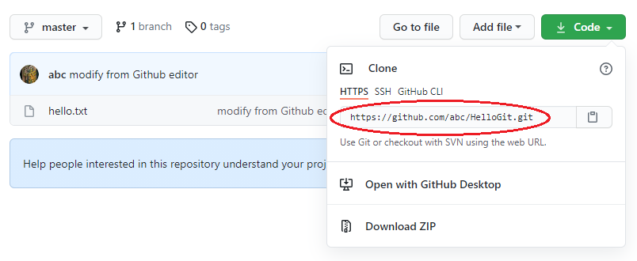


~~~bash
abc@DESKTOP-R85C9HV MINGW64 ~/Desktop/HelloGit (master)
$ cd ..

# 创建一个新文件夹
abc@DESKTOP-R85C9HV MINGW64 ~/Desktop
$ mkdir HelloGit-clone

abc@DESKTOP-R85C9HV MINGW64 ~/Desktop
$ cd HelloGit-clone/

# 在新的文件夹内，克隆远程库到本地
abc@DESKTOP-R85C9HV MINGW64 ~/Desktop/HelloGit-clone
$ git clone https://github.com/abc/HelloGit.git
Cloning into 'HelloGit'...
remote: Enumerating objects: 16, done.
remote: Counting objects: 100% (16/16), done.
remote: Compressing objects: 100% (7/7), done.
remote: Total 16 (delta 5), reused 12 (delta 4), pack-reused 0
Receiving objects: 100% (16/16), done.
Resolving deltas: 100% (5/5), done.
abc@DESKTOP-R85C9HV MINGW64 ~/Desktop/HelloGit-clone

$ git remote -v
fatal: not a git repository (or any of the parent directories): .git

abc@DESKTOP-R85C9HV MINGW64 ~/Desktop/HelloGit-clone
$ ls
HelloGit/

abc@DESKTOP-R85C9HV MINGW64 ~/Desktop/HelloGit-clone
$ cd HelloGit/

abc@DESKTOP-R85C9HV MINGW64 ~/Desktop/HelloGit-clone/HelloGit (master)
$ git remote -v
origin  https://github.com/abc/HelloGit.git (fetch)
origin  https://github.com/abc/HelloGit.git (push)

abc@DESKTOP-R85C9HV MINGW64 ~/Desktop/HelloGit-clone/HelloGit (master)
$ git reflog
47e257f (HEAD -> master, origin/master, origin/HEAD) HEAD@{0}: clone: from https://github.com/JallenKwong/HelloGit.git


~~~


clone 会做如下操作：

1. 拉取代码。

2. 初始化本地仓库。

3. 创建别名。

## 24_GitHub_团队内协作

一、选择邀请合作者。（在仓库设置里操作）

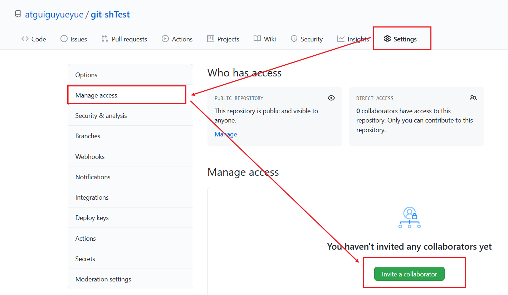

二、填入目标合作者。

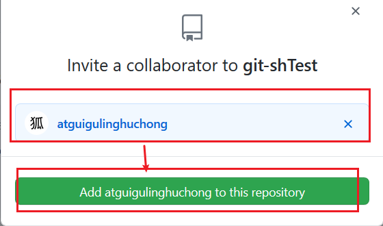

三、复制网址发送给你目标合作者 ， 复制内容如下：https://github.com/atguiguyueyue/git-shTest/invitations。


四、目标合作者接收到网址，用浏览器打开它，点击接受邀请。

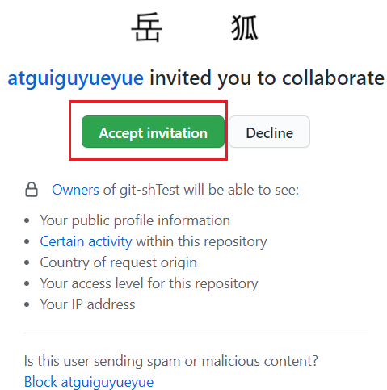

五、接受邀请成功之后，可以在目标合作者Github账号上看到将来共同开发远程仓库。

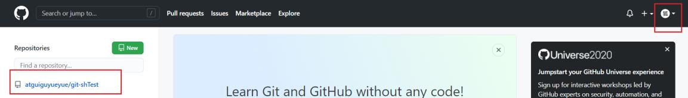

六、目标合作者可以修改内容并 push 到远程仓库。


~~~bash
# 编辑 clone 下来的文件
Layne@LAPTOP-Layne MINGW64 /d/Git-Space/pro-linghuchong/git-shTest(master)
$ vim hello.txt
Layne@LAPTOP-Layne MINGW64 /d/Git-Space/pro-linghuchong/git-shTest(master)
$ cat hello.txt
hello git! hello atguigu! 2222222222222
hello git! hello atguigu! 33333333333333
hello git! hello atguigu!
hello git! hello atguigu!
hello git! hello atguigu! 我是最帅的， 比岳不群还帅
hello git! hello atguigu!
hello git! hello atguigu!
hello git! hello atguigu!
hello git! hello atguigu!
hello git! hello atguigu!
hello git! hello atguigu!
hello git! hello atguigu!
hello git! hello atguigu!
hello git! hello atguigu!
hello git! hello atguigu! master test
hello git! hello atguigu! hot-fix test

# 将编辑好的文件添加到暂存区
Layne@LAPTOP-Layne MINGW64 /d/Git-Space/pro-linghuchong/git-shTest(master)
$ git add hello.txt

# 将暂存区的文件上传到本地库
Layne@LAPTOP-Layne MINGW64 /d/Git-Space/pro-linghuchong/git-shTest(master)
$ git commit -m "lhc commit" hello.txt
[master 5dabe6b] lhc commit
1 file changed, 1 insertion(+), 1 deletion(-)

# 将本地库的内容 push 到远程仓库
Layne@LAPTOP-Layne MINGW64 /d/Git-Space/pro-linghuchong/git-shTest
(master)
$ git push origin master
Logon failed, use ctrl+c to cancel basic credential prompt.
Username for 'https://github.com': atguigulinghuchong
Counting objects: 3, done.
Delta compression using up to 12 threads.
Compressing objects: 100% (2/2), done.
Writing objects: 100% (3/3), 309 bytes | 309.00 KiB/s, done.
Total 3 (delta 1), reused 0 (delta 0)
remote: Resolving deltas: 100% (1/1), completed with 1 local object.
To https://github.com/atguiguyueyue/git-shTest.git
7cb4d02..5dabe6b master -> master

~~~


七、回到发送合作邀请者的 GitHub 远程仓库中可以看到，最后一次是目标合作者提交的。

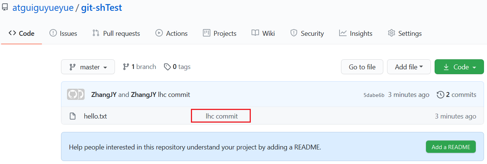

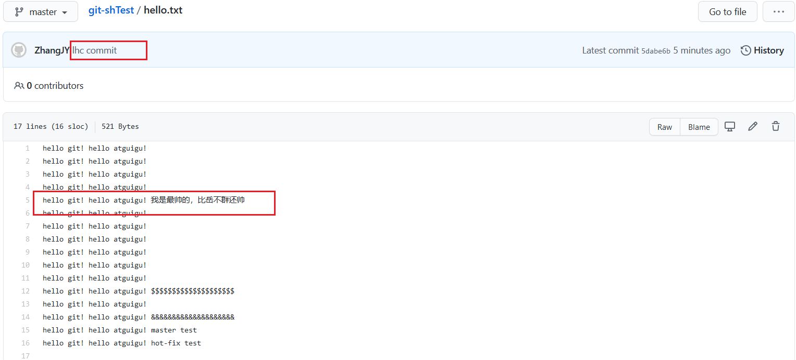

## 25_GitHub_跨团队协作


一、将远程仓库的地址复制发给邀请跨团队协作的人，比如东方不败。

二、在东方不败的 GitHub 账号里的地址栏复制收到的链接，然后点击 网页右上方的Fork按钮，将项目叉到自己的本地仓库。

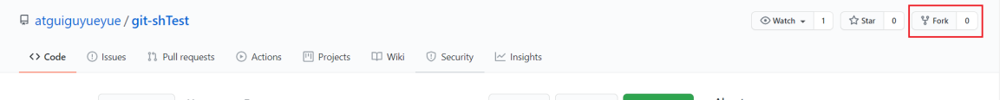

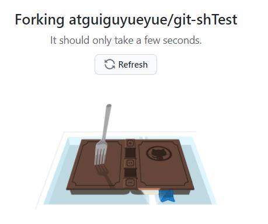

叉成功后可以看到当前仓库信息。

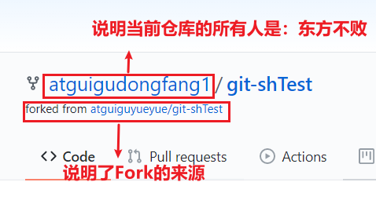

三、东方不败就可以在线编辑叉取过来的文件。

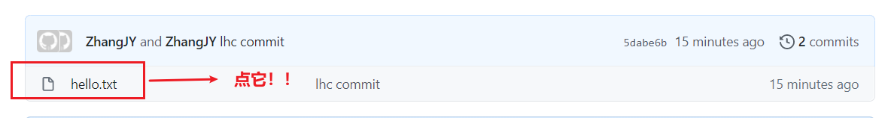

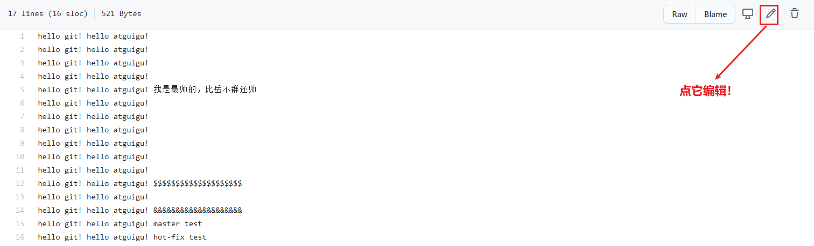

四、编辑完毕后，填写描述信息并点击左下角绿色按钮提交。

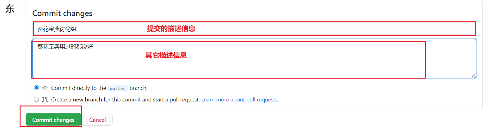

五、接下来点击上方的 Pull 请求，并创建一个新的请求。

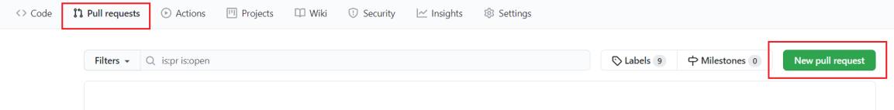

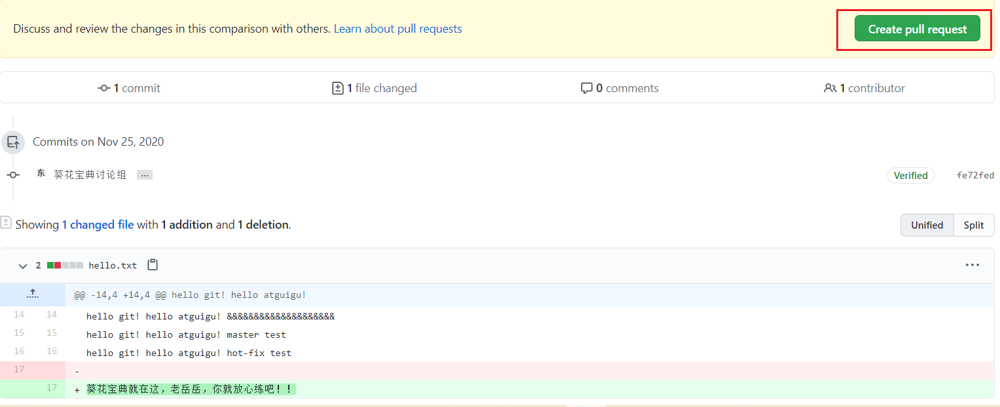

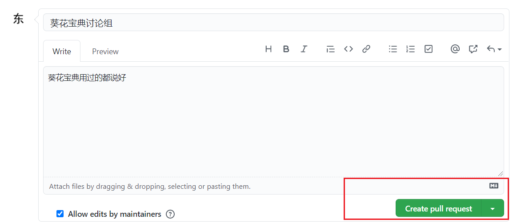

六、回到岳岳 GitHub 账号可以看到有一个 Pull request 请求。


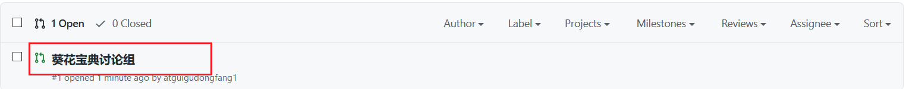

进入到聊天室，可以讨论代码相关内容。

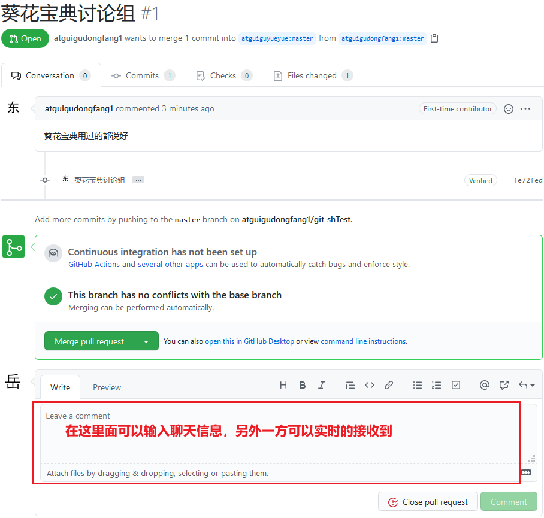

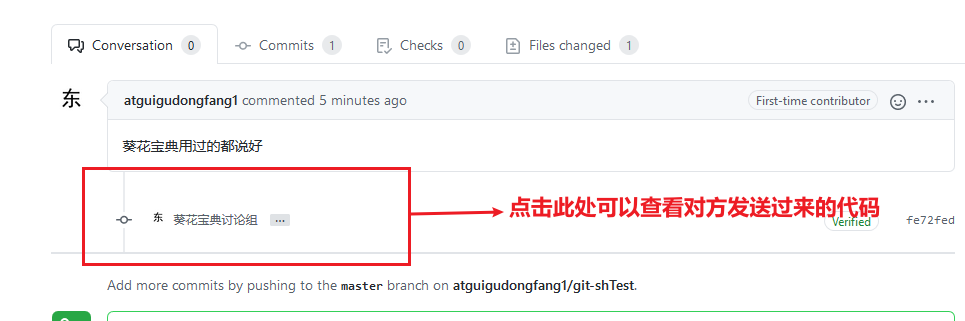

七、如果代码没有问题，可以点击 Merge pull reque 合并代码。

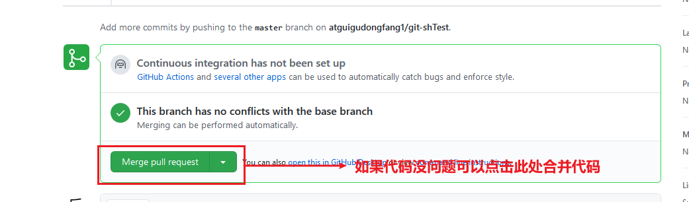

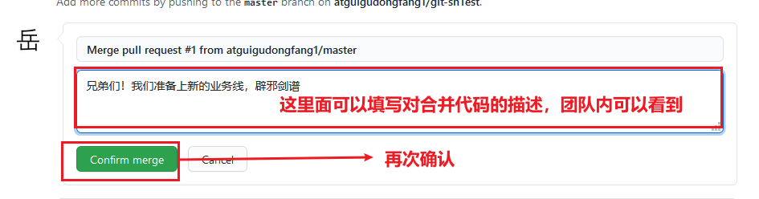

## 26_GitHub_SSH免密登录

我们可以看到远程仓库中还有一个 SSH 的地址，因此我们也可以使用 SSH 进行访问。

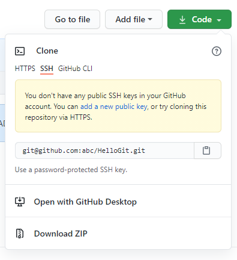

先到用户的主页目录，删除.ssh文件夹（如果没有.ssh文件夹，忽略此步）：


~~~bash
abc@DESKTOP-R85C9HV MINGW64 ~
$ cd ~

abc@DESKTOP-R85C9HV MINGW64 ~
$ pwd
/c/Users/abc

abc@DESKTOP-R85C9HV MINGW64 ~
$ ls -a .ssh
./  ../  id_rsa  id_rsa.pub

abc@DESKTOP-R85C9HV MINGW64 ~
$ rm -rf .ssh

abc@DESKTOP-R85C9HV MINGW64 ~
$ ls -a .ssh
ls: cannot access '.ssh': No such file or directory


~~~


运行命令ssh-keygen生成.ssh目录：


~~~bash
abc@DESKTOP-R85C9HV MINGW64 ~/Desktop/HelloGit-clone/HelloGit (master)
$ ssh-keygen -t rsa -C abc@123.com
Generating public/private rsa key pair.
Enter file in which to save the key (/c/Users/abc/.ssh/id_rsa):
Created directory '/c/Users/abc/.ssh'.
Enter passphrase (empty for no passphrase):
Enter same passphrase again:
Your identification has been saved in /c/Users/abc/.ssh/id_rsa
Your public key has been saved in /c/Users/abc/.ssh/id_rsa.pub
The key fingerprint is:
SHA256:aeNMB/hP2yiH/Dka2jK9BJciSgA8yKKLlKXX8oei7J0 jallenkwong@163.com
The key's randomart image is:
+---[RSA 3072]----+
|=                |
|++ .   .         |
|+ = . . .        |
|.= o . . +       |
|o.o + + S o      |
|o. o + @ * +     |
|. o . ..O = .    |
| o. . o+.=..     |
|.. E  .o+oo.     |
+----[SHA256]-----+

abc@DESKTOP-R85C9HV MINGW64 ~
$ ls -a .ssh
./  ../  id_rsa  id_rsa.pub

# 生成公钥
abc@DESKTOP-R85C9HV MINGW64 ~
$ cat .ssh/id_rsa.pub
ssh-rsa AAAAB3NzaC1yc2EAAAADAQABAAABgQChXy8I20br9nu4GCNeZSDkozfHvlRFpXiImYnVlHVvyvFgjct1/zMeJgot1J6+yArSJbA4TMlS9nG8owCE6C9yqhPceDlKtQbARKS2pW7IyP5OhIbcqVmWmvvd+IMmsWrWgK9S6jqp0xSqv3Z3mlcHWOAK18oOe6wF6b3SyGgCP/EcwwUGX4NG7jukhK+In9joSuAxchEg/Ba2/LVjqtfBn3hXZx/SEt+rJ0UVPIT/eEe32HflrzokNcO7l0IgyLntv5QEAsSC2hiGxrM6vF5tQpb12MVZnt1/01ytP0ruQn2TVTI96vsOAa3Cj98dAH2Z0JdqZUSVBw+o3AqXP5oeF1JWkDHZzHQjLgu741wnUZn+vVXFBu1xQyApbvH7y7cNbq8PaxU+SyZbVXbq3RwTywJsyFQvsIOM5l0tG7jUD0QAd6dP3rcNODjFTaafJaBsR9aMwvKQd/d7H+BdwFPYOFp8HB2JAzhRpvlS4Av9MCIe0474wZ0T2QOJmcs7mns= abc@123.com


~~~


然后，将生成的公钥添加至Github账号SSH设置

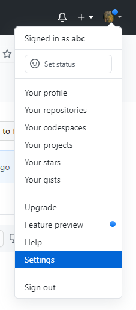

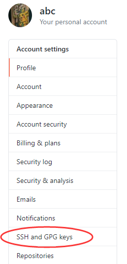

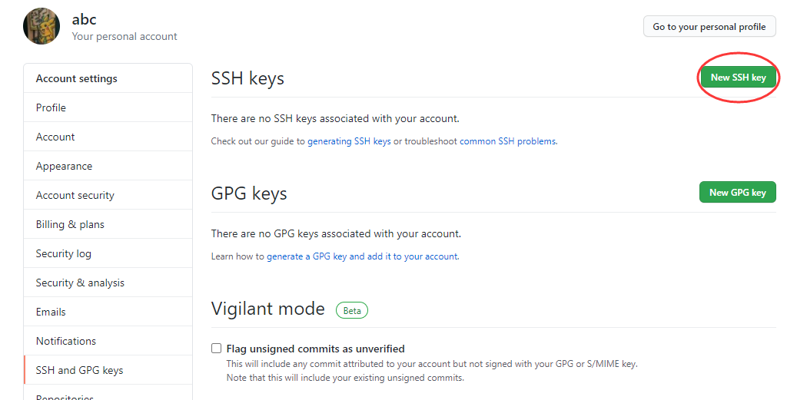

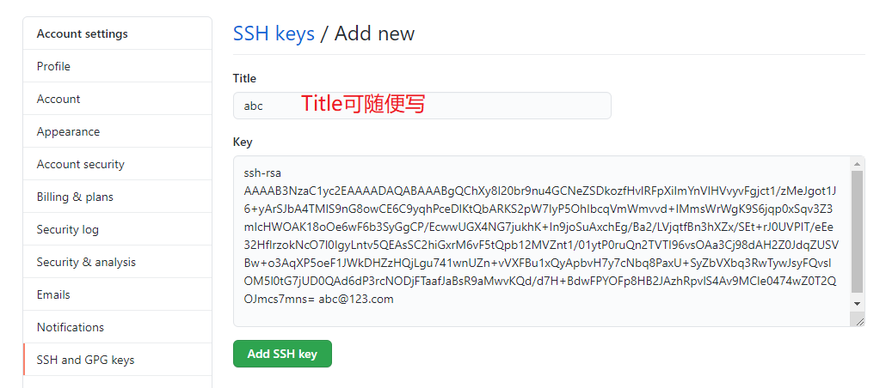

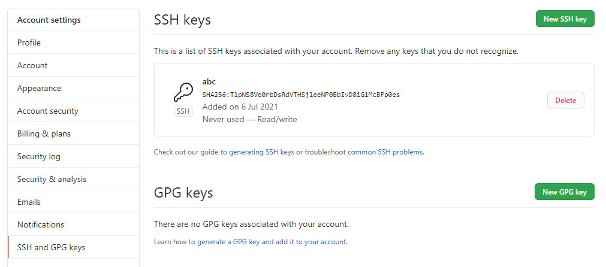

添加公钥后，可不用输入Github账号密码便可推送。

接下来通过SSH方式提交hello.txt。

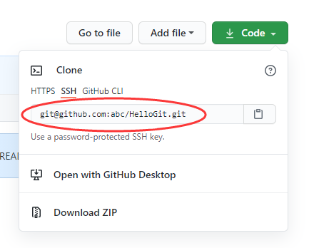


~~~bash
abc@DESKTOP-R85C9HV MINGW64 ~/Desktop/HelloGit-clone/HelloGit (master)
$ cat hello.txt
hello, git!hot-fix
hello, git!
hello, git!
hello, git!
hello, git!
hello, git!
hello, git!
hello, git!
hello, git!
hello, git!
hello, git!
hello, git!
hello, git!
hello, git!
hello, git!
hello, git!
hello, git!modify from Github editor
hello, git!hot-fix test
hello, git!master test

abc@DESKTOP-R85C9HV MINGW64 ~/Desktop/HelloGit-clone/HelloGit (master)
$ vim hello.txt

abc@DESKTOP-R85C9HV MINGW64 ~/Desktop/HelloGit-clone/HelloGit (master)
$ cat hello.txt
hello, git!hot-fix
hello, git!
hello, git!
hello, git!
hello, git!
hello, git!
hello, git!
hello, git!
hello, git!ssh test
hello, git!
hello, git!
hello, git!
hello, git!
hello, git!
hello, git!
hello, git!
hello, git!modify from Github editor
hello, git!hot-fix test
hello, git!master test

abc@DESKTOP-R85C9HV MINGW64 ~/Desktop/HelloGit-clone/HelloGit (master)
$ git add .

abc@DESKTOP-R85C9HV MINGW64 ~/Desktop/HelloGit-clone/HelloGit (master)
$ git status
On branch master
Your branch is up to date with 'origin/master'.

Changes to be committed:
  (use "git restore --staged <file>..." to unstage)
        modified:   hello.txt

abc@DESKTOP-R85C9HV MINGW64 ~/Desktop/HelloGit-clone/HelloGit (master)
$ git commit -m "ssh test"
[master 9602a37] ssh test
 1 file changed, 1 insertion(+), 1 deletion(-)

# 通过SSH推送
abc@DESKTOP-R85C9HV MINGW64 ~/Desktop/HelloGit-clone/HelloGit (master)
$ git push git@github.com:abc/HelloGit.git master
The authenticity of host 'github.com (13.250.177.223)' can't be established.
RSA key fingerprint is SHA256:nThbg6kXUpJWGl7E1IGOCspRomTxdCARLviKw6E5SY8.
Are you sure you want to continue connecting (yes/no/[fingerprint])? yes
Warning: Permanently added 'github.com,13.250.177.223' (RSA) to the list of known hosts.
Enumerating objects: 5, done.
Counting objects: 100% (5/5), done.
Delta compression using up to 8 threads
Compressing objects: 100% (2/2), done.
Writing objects: 100% (3/3), 283 bytes | 283.00 KiB/s, done.
Total 3 (delta 1), reused 0 (delta 0), pack-reused 0
remote: Resolving deltas: 100% (1/1), completed with 1 local object.
To github.com:JallenKwong/HelloGit.git
   47e257f..9602a37  master -> master


~~~


推送成功。

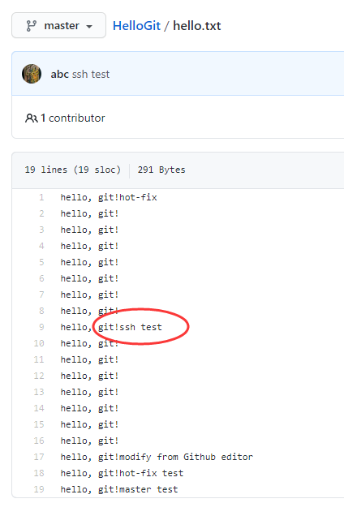

## 27_IDEA集成Git_环境准备

实操的IDEA版本为ultimate 2020.1。

### 配置 Git 忽略文件

与项目的实际功能无关，不参与服务器上部署运行。把它们忽略掉能够屏蔽 IDE 工具之
间的差异。例如，Maven工程根据src生成的target。

创建忽略规则文件 xxxx.ignore（前缀名随便起，建议是 git.ignore），这个文件的存放位置原则上在哪里都可以，为了便于让~/.gitconfig 文件引用，**建议**也放在用户家目录下。

git.ignore 文件模版内容如下：


# Compiled class file
*.class

# Log file
*.log

# BlueJ files
*.ctxt

# Mobile Tools for Java (J2ME)
.mtj.tmp/

# Package Files #
*.jar
*.war
*.nar
*.ear
*.zip
*.tar.gz
*.rar

# virtual machine crash logs, see http://www.java.com/en/download/help/error_hotspot.xml
hs_err_pid*
.classpath
.project
.settings
target
.idea
*.iml


在.gitconfig 文件中引用忽略配置文件（此文件在 Windows 的家目录中）


[user]
    name = Layne
    email = Layne@atguigu.com
[core]
	excludesfile = C:/Users/asus/git.ignore


注意：这里要使用“正斜线（/）”，不要使用“反斜线（）”

### 在IDEA配置Git程序

在菜单栏File->Setting->搜索栏搜Git，配置Git的安装路径。

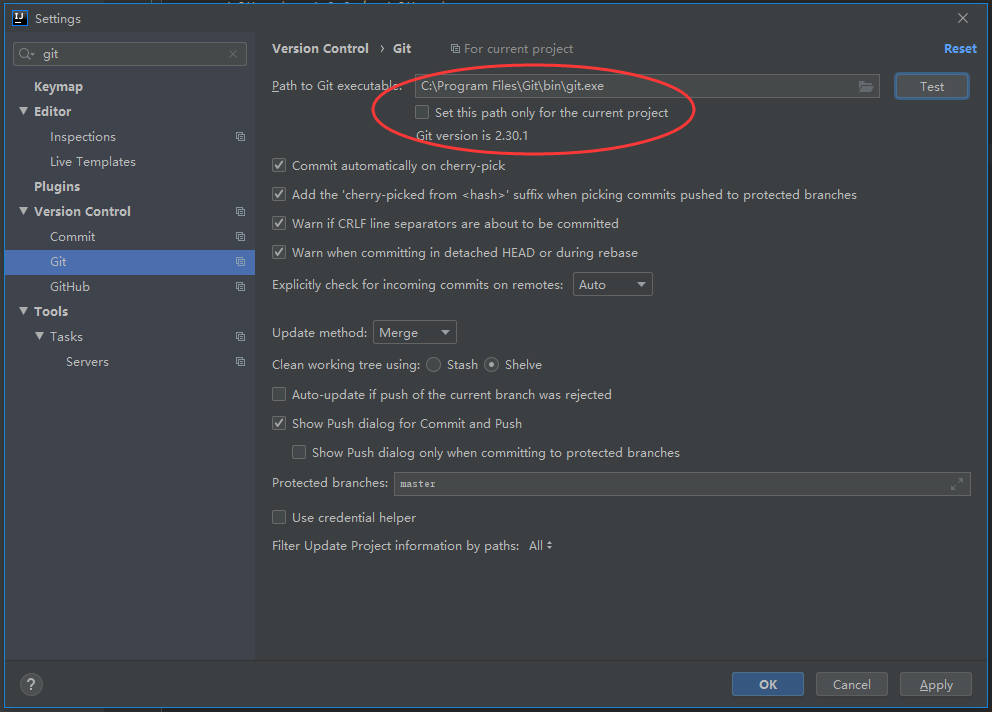

## 28_IDEA集成Git_初始化&添加&提交

先创建一个名叫HelloGit的Maven工程。

### 初始化Git

在菜单栏VCS -> Import into Version Control -> Create Git Repository

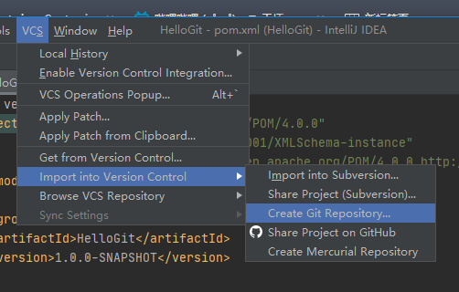

选择要创建 Git 本地仓库的工程，也就是HelloGit工程，然后添加OK。

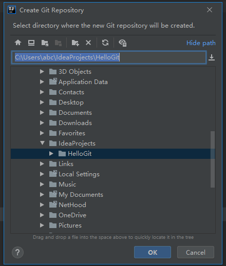

### 添加到暂存区

创建一个HelloGit类，将其添加Git暂存区。

右键点击HelloGit类，选择Git->Add。可以右键点击HelloGit，更大范围地添加文件到暂存区。

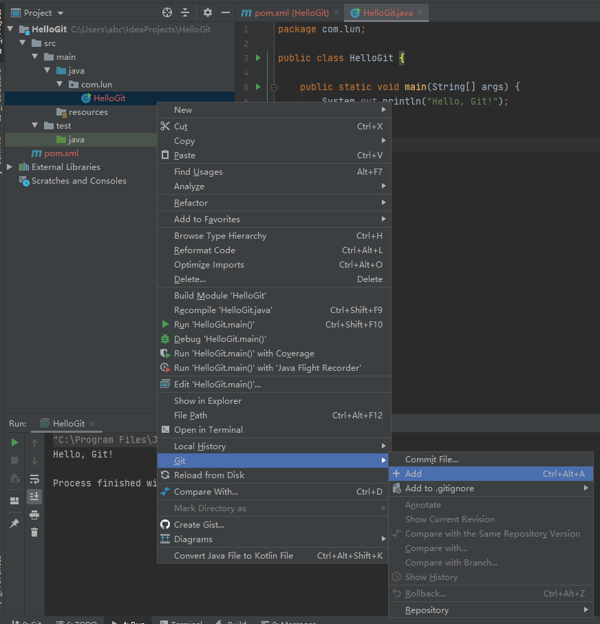

添加成功后，文件名会从红色变成绿色。

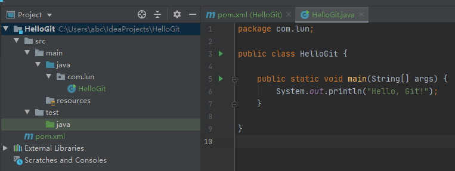

### 提交至本地库

右键点击HelloGit，选择Git->Commit Directory。


添加注释后提交：


添加成功后，后台打印相关信息。


## 29_IDEA集成Git_切换版本

在 IDEA 的左下角，点击 Git，然后点击 Log 查看版本


右键选择要切换的版本，然后在菜单里点击 Checkout Revision。


## 30_IDEA集成Git_创建分支&切换分支

### 创建分支

右键点击HelloGit，Git -> Repository -> Branches，或者点击IDEA的右下角，如图红圈所示部位：


选择点击New Branch：


创建新分支：


### 切换分支

跟**创建分支**步骤相似，如点击IDEA的右下角（它显示项目正处在那条分支），如图红圈所示部位，选择你想要切换的分支，然后checkout：


或者在log窗口，右键点击分支，选择checkout：


## 31_IDEA集成Git_合并分支(正常合并)

先在hot-fix分支修改HelloGit类，并将其提交：


然后切换到master分支，右下角的hot-fix会变为master：


然后，点击IDEA 窗口的右下角的master，将 hot-fix 分支合并到当前 master 分支。选择hot-fix->Merge into Current


如果代码没有冲突， 分支直接合并成功，分支合并成功以后，代码自动提交，无需手动
提交本地库。


## 32_IDEA集成Git_合并分支(冲突合并)

分别在master，hot-fix分支修改HelloGit类同一行，并提交，故意制作冲突：


切换到master分支，将hot-fix的合并到master分支：


冲突产生，需要人工解决：


代码冲突解决，将代码提交本地库后，如图所示：


## 33_IDEA集成GitHub_设置GitHub账号

在菜单栏File->Setting->搜索栏搜GitHub，添加GitHub账号：


由于网络问题，会时常登陆不了：


解决方法：可通过Token登陆。


登陆Github网站，**获取Token**，操作步骤看下图：


将生成的token用来IDEA登录。


## 34_IDEA集成GitHub_分享项目到GitHub


## 35_IDEA集成GitHub_推送代码到远程库


注意： push 是将本地库代码推送到远程库，如果本地库代码跟远程库代码版本不一致，
push 的操作是会被拒绝的。也就是说， 要想 push 成功，一定要保证本地库的版本要比远程库的版本高！ **因此一个成熟的程序员在动手改本地代码之前，一定会先检查下远程库跟本地代码的区别！如果本地的代码版本已经落后，切记要先 pull 拉取一下远程库的代码，将本地代码更新到最新以后，然后再修改，提交，推送！**

## 36_IDEA集成GitHub_拉取远程库代码合并本地库

右键点击项目，可以将远程仓库的内容 pull 到本地仓库。


注意： pull 是拉取远端仓库代码到本地，如果远程库代码和本地库代码不一致，会自动
合并，如果自动合并失败，还会涉及到手动解决冲突的问题。

## 37_IDEA集成GitHub_克隆代码到本地

在菜单栏的File->Close Project->Get from Version Control。


或者在菜单栏VCS->Get from Version Control。


# Gitee

## 38_码云_账号注册登录&创建远程库

### 码云简介

众所周知， GitHub 服务器在国外， 使用 GitHub 作为项目托管网站，如果网速不好的话，严重影响使用体验，甚至会出现登录不上的情况。针对这个情况， 大家也可以使用国内的项目托管网站-码云。

码云是开源中国推出的基于 Git 的代码托管服务中心， 网址是 https://gitee.com/ ，使用
方式跟 GitHub 一样，而且它还是一个中文网站，如果你英文不是很好，它是最好的选择。

### 账号注册登录

略

### 创建远程库

跟Github的类似。


另外，可以从GitHub与GitLab中导入仓库。


## 39_码云_IDEA集成Gitee码云

首先，要在IDEA安装Gitee插件。

在菜单栏选File->Settings->Plugins，搜Gitee。


安装插件成功后，重启IDEA。

功能跟在IDEA的Github插件，功能类似，如添加Gitee账号等，可参考前文IDEA的Github插件，触类旁通。


## 40_码云_导入GitHub项目

略

# GitLab

## 41_GitLab_简介和安装环境准备

### GitLab简介

GitLab 是由 GitLab Inc.开发，使用 MIT 许可证的基于网络的 Git 仓库管理工具，且具有wiki 和 issue 跟踪功能。使用 Git 作为代码管理工具，并在此基础上搭建起来的 web 服务。（可搭建局域网Git仓库）。

GitLab 由乌克兰程序员 DmitriyZaporozhets 和 ValerySizov 开发，它使用 Ruby 语言写成。后来，一些部分用 Go 语言重写。截止 2018 年 5 月，该公司约有 290 名团队成员，以及 2000 多名开源贡献者。 GitLab 被 IBM， Sony， JülichResearchCenter， NASA， Alibaba，Invincea， O’ReillyMedia， Leibniz-Rechenzentrum(LRZ)， CERN， SpaceX 等组织使用。

### GitLab官网地址

[官网地址](https://about.gitlab.com/ "官网地址")

[安装说明](https://about.gitlab.com/installation/ "安装说明")

### GitLab安装准备

1. 准备一个系统为 CentOS7 以上版本的服务器， 要求内存 4G，磁盘 50G。

2. 关闭防火墙， 并且配置好主机名和 IP，保证服务器可以上网。

3. 此教程使用虚拟机：主机名： gitlab-server IP 地址： 192.168.6.200

4. Yum 在线安装 gitlab- ce 时，需要下载几百 M 的安装文件，非常耗时，所以最好提前把所需 RPM 包下载到本地，然后使用离线 rpm 的方式安装。[下载地址](https://packages.gitlab.com/gitlab/gitlab-ce/packages/el/7/gitlab-ce-13.10.2-ce.0.el7.x86_64.rpm "下载地址")。注：资料里提供了此 rpm 包，直接将此包上传到服务器/opt/module 目录下即可。

## 42_GitLab_安装&初始化服务&启动服务

### 编写安装脚本

安装 gitlab 步骤比较繁琐，因此我们可以参考[官网编写 gitlab 的安装脚本](https://packages.gitlab.com/install/repositories/gitlab/gitlab-ce/script.rpm.sh "官网编写 gitlab 的安装脚本")。


~~~bash
[root@gitlab-server module]# vim gitlab-install.sh
sudo rpm -ivh /opt/module/gitlab-ce-13.10.2-ce.0.el7.x86_64.rpm

sudo yum install -y curl policycoreutils-python openssh-server cronie

sudo lokkit -s http -s ssh

sudo yum install -y postfix

sudo service postfix start

sudo chkconfig postfix on

curl https://packages.gitlab.com/install/repositories/gitlab/gitlabce/script.rpm.sh | sudo bash

sudo EXTERNAL_URL="http://gitlab.example.com" yum -y install gitlabce

~~~


给脚本增加执行权限


~~~bash
[root@gitlab-server module]# chmod +x gitlab-install.sh
[root@gitlab-server module]# ll
总用量 403104
-rw-r--r--. 1 root root 412774002 4 月 7 15:47 gitlab-ce-13.10.2-
ce.0.el7.x86_64.rpm
-rwxr-xr-x. 1 root root 416 4 月 7 15:49 gitlab-install.sh

~~~


然后执行该脚本，开始安装 gitlab-ce。注意一定要保证服务器可以上网。


~~~bash
[root@gitlab-server module]# ./gitlab-install.sh
警告： /opt/module/gitlab-ce-13.10.2-ce.0.el7.x86_64.rpm: 头 V4
RSA/SHA1 Signature, 密钥 ID f27eab47: NOKEY
准备中... #################################
[100%]
正在升级/安装...
1:gitlab-ce-13.10.2-ce.0.el7
################################# [100%]
。 。 。 。 。 。

~~~


### 初始化GitLab服务

执行以下命令初始化 GitLab 服务，过程大概需要几分钟，耐心等待…


~~~bash
[root@gitlab-server module]# gitlab-ctl reconfigure
。 。 。 。 。 。
Running handlers:
Running handlers complete
Chef Client finished, 425/608 resources updated in 03 minutes 08
seconds
gitlab Reconfigured!

~~~


### 启动GitLab服务

执行以下命令启动 GitLab 服务，如需停止，执行 gitlab-ctl stop


~~~bash
[root@gitlab-server module]# gitlab-ctl start
ok: run: alertmanager: (pid 6812) 134s
ok: run: gitaly: (pid 6740) 135s
ok: run: gitlab-monitor: (pid 6765) 135s
ok: run: gitlab-workhorse: (pid 6722) 136s
ok: run: logrotate: (pid 5994) 197s
ok: run: nginx: (pid 5930) 203s
ok: run: node-exporter: (pid 6234) 185s
ok: run: postgres-exporter: (pid 6834) 133s
ok: run: postgresql: (pid 5456) 257s
ok: run: prometheus: (pid 6777) 134s
ok: run: redis: (pid 5327) 263s
ok: run: redis-exporter: (pid 6391) 173s
ok: run: sidekiq: (pid 5797) 215s
ok: run: unicorn: (pid 5728) 221s

~~~


## 43_GitLab_登录GitLab并创建远程库

### 登录GitLab

使用主机名或者 IP 地址即可访问 GitLab 服务。可配一下 windows 的 hosts 文件（C:WindowsSystem32driversetc）。


首次登陆之前，需要修改下 GitLab 提供的 root 账户的密码，要求 8 位以上，包含大小写子母和特殊符号。

然后使用修改后的密码登录 GitLab。


GitLab 登录成功。


### 创建远程库


## 44_GitLab_IDEA集成GitLab


接下来插件配置，Git操作等与Github、Gitee的IDEA插件大同小异，不再赘述，自己触类旁通吧！

## 45_课程总结

略


</font>