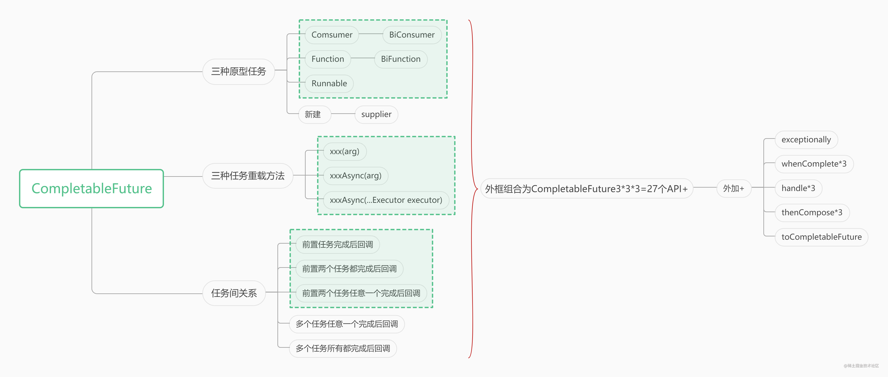

# CompletableFuture中的API使用说明


https://juejin.cn/post/7022086461386129415#heading-0

# CompletableFuture与Future有什么不同

#### 开发背景

在使用多线程处理任务时，经常会需要等待某一阶段的任务执行完成之后，根据阶段结果再开启新的异步任务。

这个逻辑可以使用Future来实现，通过Future的isDone方法或get方法来判断异步任务是否完成或获取结果。这种方法的问题在于，isDone轮询会消耗CPU资源，并且不能够及时的获取的任务完成的状态；get方法会使调用的线程阻塞，无法处理后续逻辑。

CompletableFuture提供了回调机制和丰富的Stream API，可以很好的完成异步任务的回调和后续任务处理。并且CompletableFuture可以很好的描述各个异步任务之间的关系，让逻辑更清晰直观。内部的无锁并发栈也能够高性能的完成异步任务之间的并行调用。

#### 对比举例

> 模拟场景：
>
> 小白去餐厅吃饭，点了一份西红柿鸡蛋和一碗米饭。点完之后就完王者等吃饭。 此时服务员开始做米饭，厨师开始炒菜。做好之后由服务员打饭上菜，叫小白吃饭。

#### Future实现

```java
     @Test
    public void FutureExample2() throws ExecutionException, InterruptedException {
        ExecutorService waiters = Executors.newFixedThreadPool(2);
        ExecutorService cookers = Executors.newFixedThreadPool(2);
        printTimeAndThread("小白进入餐厅");
        printTimeAndThread("小白点了 番茄炒蛋 + 一碗米饭");

        Future<String> makeRice = waiters.submit(() -> {
            ThreadTools.sleepSeconds(2);
            printTimeAndThread("饭好了");
            return "米饭";
        });

        Future<String> cookDish = cookers.submit(() -> {
            ThreadTools.sleepSeconds(2);
            printTimeAndThread("菜好了");
            return "番茄炒蛋";
        });

        Future<String> getRice = waiters.submit(() -> {
            final long start = System.currentTimeMillis();
            String rice = makeRice.get();
            String dish = cookDish.get();
            ThreadTools. sleepSeconds(2);
            printTimeAndThread(String.format("服务员打饭完成，耗时%d", System.currentTimeMillis() - start));
            return String.format("%s + %s 好了", dish, rice);
        });
        printTimeAndThread("小白在打王者");
        printTimeAndThread(String.format("%s ,小白开吃", getRice.get()));
    }
复制代码
```

结果

```css
1634092703854	|	main	|	小白进入餐厅
1634092703854	|	main	|	小白点了 番茄炒蛋 + 一碗米饭
1634092703856	|	main	|	小白在打王者
1634092705874	|	pool-2-thread-1	|	菜好了
1634092705874	|	pool-1-thread-1	|	饭好了
1634092707884	|	pool-1-thread-2	|	服务员打饭完成，耗时4028
1634092707885	|	main	|	番茄炒蛋 + 米饭 好了 ,小白开吃
复制代码
```

#### CompletableFuture实现

```java
    @Test
    public void CPExample2() {
        printTimeAndThread("小白进入餐厅");
        printTimeAndThread("小白点了 番茄炒蛋 + 一碗米饭");

        CompletableFuture<String> makeRice = CompletableFuture.supplyAsync(() -> {
            sleepSeconds(300);
            FutureTaskTest.printTimeAndThread("做米饭");
            return "米饭";
        });
        CompletableFuture<String> makeDish = CompletableFuture.supplyAsync(() -> {
            sleepSeconds(200);
            printTimeAndThread("厨师炒菜");
            return "番茄炒蛋";
        });
        final CompletableFuture<String> allDone = makeDish.thenCombine(makeRice, (dish, rice) -> {
            final long start = System.currentTimeMillis();
            sleepSeconds(200);
            printTimeAndThread(String.format("服务员打饭完成，耗时%d", System.currentTimeMillis() - start));
            return String.format("%s + %s 好了", dish, rice);
        });
        printTimeAndThread("小白在打王者");
        printTimeAndThread(String.format("%s ,小白开吃", allDone.join()));
    }
//代码引用自：https://gitee.com/phui/share-concurrent/tree/master
复制代码
```

结果

```css
1634092882975	|	main	|	小白进入餐厅
1634092882975	|	main	|	小白点了 番茄炒蛋 + 一碗米饭
1634092882981	|	main	|	小白在打王者
1634092885005	|	ForkJoinPool.commonPool-worker-2	|	厨师炒菜
1634092886001	|	ForkJoinPool.commonPool-worker-1	|	做米饭
1634092888010	|	ForkJoinPool.commonPool-worker-1	|	服务员打饭完成，耗时2009
1634092888011	|	main	|	番茄炒蛋 + 米饭 好了 ,小白开吃
复制代码
```

#### 不同点

1. CompletableFuture是在前两个任务完成后，自动调用后续任务的；而Future则阻塞了一个线程，用来等待前两个任务完成。
2. Future需要显示的指定线程池，而CompletableFuture可以默认使用ForkJoinPool。
3. CompletableFuture可以使用类似Stream表达式的API表现出任务之间的逻辑关系，而Future不能在语法上直观的表示出这个关系。
4. CompletableFuture获取结果的join方法抛出的是RuntimeException，而get方法抛出的是受检异常InterruptedException, ExecutionException

# CompletableFuture的基本使用

## 创建一个异步任务

CompletableFuture提供了两个API用于开启一个异步任务。分别是使用Runnable接口对象作为参数的runAsync方法与使用Supplier接口对象对作为参数的supplyAsync方法。**两种API的区别就是Runnable接口与Supplier接口的区别，即runAsync方法没有返回值，而supplyAsync方法有返回值。**

```java
public static CompletableFuture<Void> runAsync(Runnable runnable)
public static <U> CompletableFuture<U> supplyAsync(Supplier<U> supplier) 
复制代码
```

两个方法使用默认的ForkJoinPool作为线程池执行异步任务。如果需要指定其他的线程池，可以使用以下重载API：

```java
public static CompletableFuture<Void> runAsync(Runnable runnable,Executor executor)
public static <U> CompletableFuture<U> supplyAsync(Supplier<U> supplier,Executor executor)
复制代码
```

使用举例：

```java
    @Test
    public void CompletableFutureStart() {
        CompletableFuture.runAsync(() -> {
            ThreadTools.sleepSeconds(1);
            System.out.printf("run on %s %n", Thread.currentThread().getName());
        });
        CompletableFuture.supplyAsync(() -> {
            ThreadTools.sleepSeconds(2);
            System.out.printf("run on %s %n", Thread.currentThread().getName());
            return "success";
        });
        ThreadTools.sleepSeconds(5);
    }
复制代码
```

执行结果：

```java
run on ForkJoinPool.commonPool-worker-1 
run on ForkJoinPool.commonPool-worker-2 
复制代码
```

## 获取任务结果

**与Future的区别** CompletableFuture比Future多提供了两种获取结果的方法：getNow与Join。

```java
public T    get()
public T    get(long timeout, TimeUnit unit)
public T    getNow(T valueIfAbsent)
public T    join()
复制代码
```

1. getNow类似于Java8的Stream中的optional.orElse()方法，当结果不存在或没有完成时返回给定的结果。
2. join与get类似，都会阻塞线程，二者区别在于抛出的异常不同。join可能抛出unchecked exception，不需要强制try catch。get在方法签名中声明了受检异常，必须要在编码时进行处理。

**使用举例**

```java
@Test
public void CompletableFutureGet() {
    try {
        final Void unused = CompletableFuture.runAsync(() -> {
            ThreadTools.sleepSeconds(1);
            System.out.printf("run on %s %n", Thread.currentThread().getName());
        }).get();
        System.out.println("CompletableFuture task 1 result "+unused);
    } catch (InterruptedException | ExecutionException e) {
        e.printStackTrace();
    }
    
    final String result = CompletableFuture.supplyAsync(() -> {
        ThreadTools.sleepSeconds(2);
        System.out.printf("run on %s %n", Thread.currentThread().getName());
        return "success";
    }).join();
    System.out.println("CompletableFuture task2 result "+result);
    ThreadTools.sleepSeconds(5);
}
复制代码
```

**结果**

```csharp
run on ForkJoinPool.commonPool-worker-1 
CompletableFuture task 1 result null
run on ForkJoinPool.commonPool-worker-1 
CompletableFuture task2 result success
复制代码
```

## 依赖于前置任务的回调

#### thenApplyXXX    ->  参数：function

作用：当前阶段（调用该方法的CompletionStage对象）非异常完成时，以**当前阶段的结果为入参**，执行给定的函数，**函数有返回值。**

```java
public <U> CompletionStage<U> thenApply(Function<? super T,? extends U> fn);
public <U> CompletionStage<U> thenApplyAsync(Function<? super T,? extends U> fn);
public <U> CompletionStage<U> thenApplyAsync(Function<? super T,? extends U> fn,Executor executor);
复制代码
```

#### thenAcceptXXXX     ->    参数：consumer

作用：与thenApply类似。当前阶段非异常完成时，**以当前结果为入参**，执行给定的consumer函数，**函数没有返回值**。方法返回CompletionStage对象，对象的阶段结果为null。

```java
public CompletionStage<Void> thenAccept(Consumer<? super T> action);
 public CompletionStage<Void> thenAcceptAsync(Consumer<? super T> action);
 public CompletionStage<Void> thenAcceptAsync(Consumer<? super T> action,Executor executor);
复制代码
```

#### thenRunXXX      ->    参数：runnable

作用：当前阶段非异常完成时，执行制定动作。**没有入参和返回值**。

```java
public CompletionStage<Void> thenRun(Runnable action);
public CompletionStage<Void> thenRunAsync(Runnable action);
public CompletionStage<Void> thenRunAsync(Runnable action,Executor executor);
复制代码
```

#### whenCompleteXXX       ->     参数：biconsumer

作用：当前阶段完成时给定的BiConsumer函数被调用，**入参为抛出的异常（正常结束时为null）和结果（异常结束时为null）**，**函数无返回值**，方法返回的CompletionStage对象，含的结果或异常与当前阶段相同（不改变上一阶段的结果）。

特点：可同时处理正常与异常的情况。

```java
public CompletionStage<T> whenComplete(BiConsumer<? super T, ? super Throwable> action);
public CompletionStage<T> whenCompleteAsync(BiConsumer<? super T, ? super Throwable> action);
public CompletionStage<T> whenCompleteAsync(BiConsumer<? super T, ? super Throwable> action,Executor executor);
复制代码
```

#### handleXXX      -> 参数：biconsumer, function

作用：当前阶段完成时给定的BiFunction函数被调用，**入参为抛出的异常（正常结束时为null）和结果（异常结束时为null）**，**函数有返回值**。返回的CompletionStage对象为函数式接口的结果包装。

```java
public <U> CompletionStage<U> handle(BiFunction<? super T, Throwable, ? extends U> fn);
public <U> CompletionStage<U> handleAsync(BiFunction<? super T, Throwable, ? extends U> fn);
public <U> CompletionStage<U> handleAsync(BiFunction<? super T, Throwable, ? extends U> fn,Executor executor);
复制代码
```

#### thenComposeXXX    -> function, CompletionStage

作用：当前阶段非异常完成时，执行给定的函数。函数使用当前阶段的结果作为入参，**函数**返回另一个CompletionStage对象。thenCompose方法会将这个对象展开，避免结果的嵌套。执行效果类似于Stream中的flatMap。

```java
public <U> CompletionStage<U> thenCompose(Function<? super T, ? extends CompletionStage<U>> fn);
public <U> CompletionStage<U> thenComposeAsync(Function<? super T, ? extends CompletionStage<U>> fn);
public <U> CompletionStage<U> thenComposeAsync(Function<? super T, ? extends CompletionStage<U>> fn,Executor executor);
复制代码
```

举例：

```java
  	/**
     * thenCompose举例
     */
    @Test
    public void FutureTaskTestCompose() {
        CompletableFuture<String> future1 = CompletableFuture.supplyAsync(() -> "task 1");
        final CompletableFuture<String> future2 = CompletableFuture.supplyAsync(() -> "next stage");
        CompletableFuture<String> nextFuture = future1.thenCompose((result) -> {
            System.out.printf("future1 result is \"%s\"%n", result);
            return future2;
        });
        System.out.println(future2 == nextFuture);
        final String join = nextFuture.join();
        System.out.printf("nextFuture result is \"%s\"%n", join);
    }

    /**
     * thenCompose对比thenApply
     */
    @Test
    public void FutureTaskTestCompose2() {
        CompletableFuture<String> future1 = CompletableFuture.supplyAsync(() -> "task 1");
        final CompletableFuture<String> future2 = CompletableFuture.supplyAsync(() -> "next stage");
        //thenApply返回一个CompletableFuture对象
        final CompletableFuture<CompletableFuture<String>> nextFuture = future1.thenApply((result) -> {
            System.out.printf("future1 result is \"%s\"%n", result);
            return future2;
        });
        final CompletableFuture<String> innerStage = nextFuture.join();//获取到的结果为CompletableFuture对象
        final String result = innerStage.join();//获取返回的CompletableFuture对象执行的结果
        System.out.printf("nextFuture result is \"%s\"%n", result);
    }
复制代码
```

**thenCompose结果输出**

```csharp
future1 result is "task 1"
false
nextFuture result is "next stage"
复制代码
```

**thenApply结果输出**

```csharp
future1 result is "task 1"
nextFuture result is "next stage"
复制代码
```

## 依赖于两个任务的回调

有时后续的任务可能需要依赖于前两个任务的结果，针对这种情况，CompletableFuture也提供了对应的API。分为两类，分别是前两个任务都完成，前两个任务任意一个完成后，调用后续任务执行逻辑。具体如下：

### 前置两个任务都完成后

#### thenAcceptBothXXX

作用：与thenAccep类似，但依赖于两个阶段。当前阶段与给定的阶段都非异常的执行完成时，**以两个阶段的结果为入参**，执行给定的函数，**函数无返回值**。阶段的结果CompletableFuture对象中result字段值为null。

```java
public <U> CompletionStage<Void> thenAcceptBoth(CompletionStage<? extends U> other,BiConsumer<? super T, ? super U> action);
public <U> CompletionStage<Void> thenAcceptBothAsync(CompletionStage<? extends U> other,BiConsumer<? super T, ? super U> action);
public <U> CompletionStage<Void> thenAcceptBothAsync(CompletionStage<? extends U> other,BiConsumer<? super T, ? super U> action, Executor executor);
复制代码
```

#### runAfterBothXXX

作用：与thenRun类似，当前阶段与给点的阶段都异常的完成时，执行给点的函数。**函数无入参，无返回值**。阶段的结果CompletableFuture对象中result字段值为null。

```java
public CompletionStage<Void> runAfterBoth(CompletionStage<?> other,Runnable action);
public CompletionStage<Void> runAfterBothAsync(CompletionStage<?> other,Runnable action);
public CompletionStage<Void> runAfterBothAsync(CompletionStage<?> other,Runnable action,Executor executor);
复制代码
```

#### thenCombineXXX

当调用该方法的前置任务与给点的前置任务都完成时，执行BiFunction函数。**函数的入参为前置两阶段的返回结果，函数无返回值。**阶段的结果CompletableFuture对象中result字段值为函数计算结果。

```java
public <U,V> CompletionStage<V> thenCombine(CompletionStage<? extends U> other,BiFunction<? super T,? super U,? extends V> fn);
public <U,V> CompletionStage<V> thenCombineAsync (CompletionStage<? extends U> other, BiFunction<? super T,? super U,? extends V> fn);
public <U,V> CompletionStage<V> thenCombineAsync (CompletionStage<? extends U> other, BiFunction<? super T,? super U,? extends V> fn,Executor executor);
复制代码
```

### 前置任意一个任务完成后

#### applyToEitherXXX

作用：当前阶段或给点的阶段任意一个非异常的完成时，执行给定的函数。**以完成阶段的结果作为函数的入参，函数有返回值。**阶段的结果CompletableFuture对象中result字段值为函数计算结果。

```java
public <U> CompletionStage<U> applyToEither(CompletionStage<? extends T> other,Function<? super T, U> fn);
public <U> CompletionStage<U> applyToEitherAsync(CompletionStage<? extends T> other,Function<? super T, U> fn);
public <U> CompletionStage<U> applyToEitherAsync(CompletionStage<? extends T> other,Function<? super T, U> fn,Executor xecutor);
复制代码
```

#### acceptEitherXXX

作用：同applyToEither。但函数为consumer函数式接口，**无返回值**。

```java
public CompletionStage<Void> acceptEither(CompletionStage<? extends T> other,Consumer<? super T> action);
public CompletionStage<Void> acceptEitherAsync(CompletionStage<? extends T> other,Consumer<? super T> action);
public CompletionStage<Void> acceptEitherAsync(CompletionStage<? extends T> other,Consumer<? super T> action,Executor executor);
复制代码
```

#### runAfterEitherXXX

作用：同applyToEither。但函数为Runnable接口，**无入参，无返回值。**

```java
public CompletionStage<Void> runAfterEither(CompletionStage<?> other,Runnable action);
public CompletionStage<Void> runAfterEitherAsync(CompletionStage<?> other,Runnable action);
public CompletionStage<Void> runAfterEitherAsync(CompletionStage<?> other,Runnable action,Executor executor);
复制代码
```

### 举例

```java
/**
 * 依赖于两个前置任务的API举例
 */
@Test
public void bothOrAny() {

    final CompletableFuture<String> task1 = CompletableFuture.supplyAsync(() -> {
        ThreadTools.sleepSeconds(1);
        return "task 1";
    });
    final CompletableFuture<String> task2 = CompletableFuture.supplyAsync(() -> {
        ThreadTools.sleepSeconds(2);
        return "task 2";
    });
     //依赖于两个前置任务都完成
    final CompletableFuture<Void> both = task2.thenAcceptBothAsync(task1, (r1, r2) -> {
        System.out.printf("两个任务都已经完成。结果1：%s ,结果2: %s%n", r1, r2);
    });
    //依赖于两个前置任务，但有一个完成即可
    final CompletableFuture<Void> any = task1.acceptEitherAsync(task2, (r) -> {
        System.out.printf("有一个任务已经完成，结果是：%s%n", r);
    });
    //阻塞主线程结束
    any.runAfterBoth(both, ()->{}).join();
}
复制代码
```

**输出结果**

```
有一个任务已经完成，结果是：task 1
两个任务都已经完成。结果1：task 2 ,结果2: task 1
复制代码
```

## 依赖于多个任务的回调

除了依赖于一个、两个前置任务的API，更常用的是基于批量任务完成时机的判断。CompletableFuture也提供了对应的api。

### 任意一个完成后--anyOf

```java
public static CompletableFuture<Object> anyOf(CompletableFuture<?>... cfs)
复制代码
```

CompletableFuture提供了静态方法，用来表示当所有的前置任务中，有任意一个任务完成（包括异常）的阶段。可以在此阶段后执行CompletableFuture的其他操作。

### 所有任务都完成后--allOf

```java
public static CompletableFuture<Void> allOf(CompletableFuture<?>... cfs)
复制代码
```

与anyOf类似，allOf静态方法表示传入的所有前置任务都完成的阶段。可以在此阶段后执行CompletableFuture的其他操作。

**注：如果异步任务执行异常，也看作是完成状态。**

### 举例

```java
@Test
public void anyANdAll() {
    final ExecutorService threadPool = Executors.newFixedThreadPool(10);
    final long startAll = System.currentTimeMillis();
    final CompletableFuture[] completableFutures = IntStream.rangeClosed(1, 10).mapToObj(index -> CompletableFuture.supplyAsync(() -> {
        final long start = System.currentTimeMillis();
        try {
            Thread.sleep(100 * index);
        } catch (InterruptedException e) {
            e.printStackTrace();
        }
        System.out.printf("线程'%s'执行完成,花费%d毫秒%n", Thread.currentThread().getName(), System.currentTimeMillis() - start);
        return index;
    }, threadPool)).toArray(CompletableFuture[]::new);
    final Object result = CompletableFuture.anyOf(completableFutures).join();
    System.out.printf("any of 得到结果：%s，共花费%d毫秒%n", result, System.currentTimeMillis() - startAll);
    CompletableFuture.allOf(completableFutures).join();//阻塞主线程
    System.out.printf("all of 得到结果，共花费%d毫秒%n", System.currentTimeMillis() - startAll);
}
复制代码
```

**输出结果**

```python
线程'pool-1-thread-1'执行完成,花费110毫秒
any of 得到结果：1，共花费122毫秒
线程'pool-1-thread-2'执行完成,花费205毫秒
线程'pool-1-thread-3'执行完成,花费300毫秒
线程'pool-1-thread-4'执行完成,花费411毫秒
线程'pool-1-thread-5'执行完成,花费505毫秒
线程'pool-1-thread-6'执行完成,花费615毫秒
线程'pool-1-thread-7'执行完成,花费710毫秒
线程'pool-1-thread-8'执行完成,花费804毫秒
线程'pool-1-thread-9'执行完成,花费915毫秒
线程'pool-1-thread-10'执行完成,花费1011毫秒
all of 得到结果，共花费1024毫秒
复制代码
```

## 异常处理

处理异常的API与其他回调API类似，但触发时机不同而已。

**exceptionally**

作用：当前阶段异常时，以异常为入参执行给定的函数。当前阶段非异常执行完成时，不执行逻辑，方法返回与当前阶段相同的非异常返回值。

```java
public CompletionStage<T> exceptionally(Function<Throwable, ? extends T> fn);
复制代码
```

举例

```java
@Test
public void CPExceptional() {
    CompletableFuture<String> supplyAsync(() -> {
        throw new RuntimeException("抛出的异常");
    }).exceptionally((e) -> {
        System.out.printf("异常消息%s%n", e.getMessage());
        return "new result";
    }).thenAccept(r -> {
        System.out.printf("最终结果1:%s%n", r);
    });

    CompletableFuture.<String>supplyAsync(() -> "没有抛出异常")
            .exceptionally((e) -> {
                System.out.printf("异常消息%s%n", e.getMessage());
                return "new result";
            }).thenAccept(r ->
            System.out.printf("最终结果2:%s%n", r));
}
复制代码
```

**输出结果**

```makefile
异常消息java.lang.RuntimeException: 抛出的异常
最终结果1:new result
最终结果2:没有抛出异常
复制代码
```

# API的分类与总结

## 三种基本任务类型

CompletableFuture对于每一种任务执行时机，都提供了多个API。这些APi可以与接口参数的函数式接口形成对应关系。 **只关心前置任务完成的Runable**:这种API以Runable函数式接口为参数，Runable接口的特点是没有入参，没有返回值。因此这是一种只关系前置任务是否完成的API。**对应CompletableFuture中的xxxRun方法。**

**关心前置任务结果的消费者Consumer**：这种API以Consumer函数式接口为参数，Consumer接口有入参，没有返回值。因此这是一种关心前置任务结果，但只消费前置结果的API。对应CompletableFuture中的xxxAccept方法。

**关心前置任务的生产者Function**：这种API以Function函数传接口为参数，Function接口有入参，有返回值。因此这是一种可以对前置任务的结果进行操作的API。**对应的CompletableFuture中的xxxApply方法。**

## 三种重载方法

CompletableFuture描述任务关系的api中，同一个功能的方法大都提供了三个重载方法。类似：xxx，xxxAsync，xxxAsync(...Executor executor)。三个方法的区别如下：

xxx方法，表示当前任务不会主动提交到线程池中执行。

xxxAsync方法，表示任务需要在默认的Fork/Join线程池中异步执行。

xxxAsync(...Executor executor)方法，表示任务需要在指定的线程池中异步执行。

```java
  @Test
    public void thenApplyRunTime() {
        System.out.println("前置任务已完成的情况测试");
        final CompletableFuture<Void> voidCompletableFuture = CompletableFuture.runAsync(() -> {
            System.out.printf("前置任务运行线程：%s%n", Thread.currentThread().getName());
        });
        ThreadTools.sleepSeconds(1);
        voidCompletableFuture.thenRun(() -> System.out.printf("thenRun 运行线程：%s%n", Thread.currentThread().getName())).join();

        System.out.println("----------------------------------------------");

        System.out.println("前置任务未完成的情况测试");
        CompletableFuture.runAsync(() -> {
            System.out.printf("前置任务运行线程：%s%n", Thread.currentThread().getName());
            ThreadTools.sleepSeconds(1);
        }).thenRun(() -> System.out.printf("thenRun 运行线程：%s%n", Thread.currentThread().getName()))
                .thenRunAsync(()->System.out.printf("thenRunAsync 运行线程：%s%n", Thread.currentThread().getName()))
                .join();

        System.out.println("----------------------------------------------");
        System.out.println("前置任务未完成，同时有其他在线程池中执行的任务");
        final CompletableFuture<Void> voidCompletableFuture1 = CompletableFuture.runAsync(() -> {
            ThreadTools.sleepSeconds(2);
            System.out.printf("前置任务运行线程：%s%n", Thread.currentThread().getName());
        });
        voidCompletableFuture1.thenRun(() ->{ ThreadTools.sleepMillis(100); System.out.printf("thenRun 运行线程：%s%n", Thread.currentThread().getName());});
        voidCompletableFuture1.thenRun(() ->{ ThreadTools.sleepMillis(100); System.out.printf("thenRun 运行线程：%s%n", Thread.currentThread().getName());});
        voidCompletableFuture1.thenRun(() ->{ ThreadTools.sleepMillis(100); System.out.printf("thenRun 运行线程：%s%n", Thread.currentThread().getName());});
        voidCompletableFuture1.thenRun(() ->{ ThreadTools.sleepMillis(100); System.out.printf("thenRun 运行线程：%s%n", Thread.currentThread().getName());});
        voidCompletableFuture1.thenRun(() ->{ ThreadTools.sleepMillis(100); System.out.printf("thenRun 运行线程：%s%n", Thread.currentThread().getName());});
        voidCompletableFuture1.thenRunAsync(()->System.out.printf("thenRunAsync 运行线程：%s%n", Thread.currentThread().getName()))
                .join();
          ThreadTools.sleepSeconds(10);
    }
复制代码
```

**结果输出**

```markdown
前置任务已完成的情况测试
前置任务运行线程：ForkJoinPool.commonPool-worker-9
thenRun 运行线程：main
----------------------------------------------
前置任务未完成的情况测试
前置任务运行线程：ForkJoinPool.commonPool-worker-9
thenRun 运行线程：ForkJoinPool.commonPool-worker-9
thenRunAsync 运行线程：ForkJoinPool.commonPool-worker-9
----------------------------------------------
前置任务未完成，同时有其他在线程池中执行的任务
前置任务运行线程：ForkJoinPool.commonPool-worker-2
thenRunAsync 运行线程：ForkJoinPool.commonPool-worker-9
thenRun 运行线程：ForkJoinPool.commonPool-worker-2
thenRun 运行线程：ForkJoinPool.commonPool-worker-9
thenRun 运行线程：ForkJoinPool.commonPool-worker-2
thenRun 运行线程：ForkJoinPool.commonPool-worker-9
thenRun 运行线程：ForkJoinPool.commonPool-worker-2

Process finished with exit code 0

复制代码
```

## 分类

CompletableFuture的API有三种维度可以进行分类：

1. 描述的任务关系
2. 任务的基本类型
3. API的重载方法。 三种分类维度相互组合，构成了CompletableFuture中的大部分API。




作者：灯塔123
链接：https://juejin.cn/post/7022086461386129415
来源：稀土掘金
著作权归作者所有。商业转载请联系作者获得授权，非商业转载请注明出处。