### 多线程学习： 


[参考视频](https://www.bilibili.com/video/BV1Wa4y1H7c7)

h学习多线程： 


`并发`： 单核单线程得cpu执行 多个程序， 快速切换以让多个程序执行，但实际只有一个线程在运行中。


`并行`： 多核多线程得cpu同时执行多个程序。


#### 02 创建线程

##### 初识Java线程状态

##### new -> runnable -> terminated

- new() 创建新线程 则在堆中创建线程对象，此时状态为new

- start() 则线程进入runnable状态，加入到栈中，等待cpu的执行

- 线程执行结束则 进入terminated 状态


线程状体可以通过getState() 方法获取状态

案例：

```java
public class LearnThread {

    public static void main(String[] args) throws InterruptedException {
        Thread thread = new Thread();
        System.out.println("1 -> " + thread.getState());
        thread.start();
        System.out.println("2 -> " + thread.getState());
        TimeUnit.SECONDS.sleep(1);
        System.out.println("3 -> " + thread.getState());
    }
}
```

出现结果：

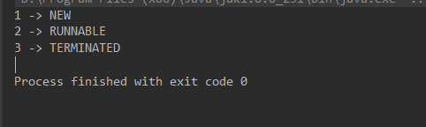


##### 把任务告诉线程的方式一共有3种

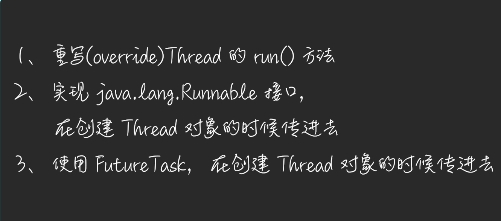


###### **01_ 重写Thread的run() 方法**

```java
public class LearnThread_02 {
    public static void main(String[] args) {
        Thread thread = new Thread(){
            @Override
            public void run() {
                System.out.println("我是子线程");
            }
        };

        thread.start();
        System.out.println("main 结束");

    }
}
```

执行结果：

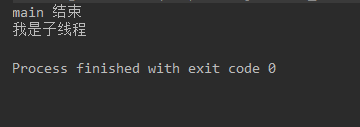

执行过程：

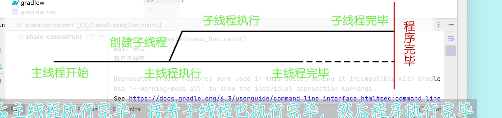


###### **02_创建线程时，传入Runnable对象**

```java
public class LearnThread_02_B {
    public static void main(String[] args) {
        Thread thread = new Thread(
                () -> System.out.println("我是子线程")
        );

        thread.start();
        System.out.println("main 结束");

    }
}
```

执行结果：

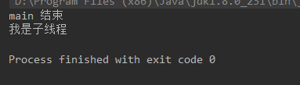

执行过程


前两种方式本质都是一样的， 调用Thread类中的run 方法， 无非一个重写，一个是以对象形式进行调用。


###### **03_ 使用FutureTask，在创建Thread对象的时候传进去**

FutureTask 其实就是Runnable 类的子类，所以跟第二种方式是一样的。

不过拥有了返回值也可以抛出异常，

所以是封装了线程间的通信。

案例：

```java
public class _03_CreateThread_FutureTask {
    public static void main(String[] args) {
        Callable<String> callable = () -> {
            System.out.println("我是子任务");
            return "sub task done";
        };
        FutureTask<String> task = new FutureTask(callable);
        Thread thread = new Thread(task);
        thread.start();
        System.out.println("子线程启动");
        try {
            String subResult = task.get(5, TimeUnit.MINUTES);		// 获取子线程的返回值
            System.out.println("子线程返回值：" + subResult);			
        } catch (InterruptedException e) {
            e.printStackTrace();							// 线程中断异常
        } catch (ExecutionException e) {
            Throwable cause = e.getCause();					// 捕获子线程的异常
            e.printStackTrace();
        } catch (TimeoutException e) {		
            e.printStackTrace();							// 超时异常
        }
        System.out.println("main 结束");
    }
}

```

执行结果

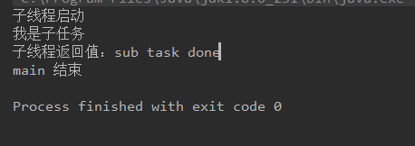

FutureTask 使用场景， 需要多个线程同时完成才能继续往下时使用。

案例：


**FutureTask 并不常用。可以全部忘记** 

因为有更好的方式实现多线程


#### 03 初识CompletableFuture 


##### 多线程状态的小工具

```java
import java.util.StringJoiner;

/**
 * 小工具
 */
public class SmallTool {

    public static void sleepMillis(long millis) {
        try {
            Thread.sleep(millis);
        } catch (InterruptedException e) {
            e.printStackTrace();
        }
    }

    public static void printTimeAndThread(String tag) {
        String result = new StringJoiner("\t|\t")
                .add(String.valueOf(System.currentTimeMillis()))
                .add(String.valueOf(Thread.currentThread().getId()))
                .add(Thread.currentThread().getName())
                .add(tag)
                .toString();
        System.out.println(result);
    }

}
```

##### 重要的Api 

###### **supplyAsyc(Supplier<U> supplier)  开启异步任务**

- supplier 接口， 没有入参， 生成返回值。
- **调用此方法会使其中的代码进入另外的线程去执行。**

###### **thenCompose(Function<? super T, ? extends CompletionStage<U>> fn) 连接两个任务**

- Function<T, R>   接口， 传入T, 返回R
- 源码中有体现： R apply(T t);
- 此方法，入参为上个方法的返回值， 出参是一个CompletionStage 的实现， 是CompletableFuture的父接口，
- 调用此方法可以实现线程的连接， 把前一个线程的结果交给下一个异步任务，
-  **注意：在前一个任务完成，有结果后，下一个任务才会触发。**

###### **thenCombine( CompletionStage<? extends U> other, **BiFunction<? super T,? super U,? extends V> fn）合并两个任务

- 把上一个任务与这个任务一起执行，等两个任务都执行完成之后，得到两个结果，
- 然后使用BiFunction 函数 将两个结果加工为一个结果进行输出。

###### **join()**  

- 获取CompletableFuture的返回值

###### **get()** 

- 获取CompletableFuture的返回值

###### join() 与 get() 的异同

一.**相同点**：

>  join()和get()方法都是用来获取CompletableFuture异步之后的返回值

二.**区别**：

> 1.join()方法抛出的是uncheck异常（即未经检查的异常),不会强制开发者抛出，
>
> 会将异常包装成CompletionException异常 /CancellationException异常，但是本质原因还是代码内存在的真正的异常，
>
> 2.get()方法抛出的是经过检查的异常，ExecutionException, InterruptedException 需要用户手动处理（抛出或者 try catch）

　　

　　文档说明：

###### 01_supplyAsyn 异步任务的开始

场景描述： 小白进入餐厅，点菜，然后打游戏，上菜吃饭

```java
public class _01_supplyAsync {
    public static void main(String[] args) {
        SmallTool.printTimeAndThread("小白进入餐厅");
        SmallTool.printTimeAndThread("小白点了 番茄炒蛋 + 一碗米饭");

        CompletableFuture<String> cf1 = CompletableFuture.supplyAsync(() -> {
            SmallTool.printTimeAndThread("厨师炒菜");
            SmallTool.sleepMillis(200);
            SmallTool.printTimeAndThread("厨师打饭");
            SmallTool.sleepMillis(100);
            return "番茄炒蛋 + 米饭 做好了";
        });

        SmallTool.printTimeAndThread("小白在打王者");
        SmallTool.printTimeAndThread(String.format("%s ,小白开吃", cf1.join()));
    }
}

```

执行结果：

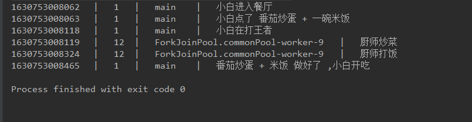

###### 02_thenCompose  异步任务的连接

场景描述： 小白进入餐厅，点菜，坐下打游戏，厨师炒菜，炒完之后让服务行打饭并交给小白，小白吃饭

```java
public class _02_thenCompose {
    public static void main(String[] args) {
        SmallTool.printTimeAndThread("小白进入餐厅");
        SmallTool.printTimeAndThread("小白点了 番茄炒蛋 + 一碗米饭");

        CompletableFuture<String> cf1 = CompletableFuture.supplyAsync(() -> {
            SmallTool.printTimeAndThread("厨师炒菜");
            SmallTool.sleepMillis(200);
            return "番茄炒蛋";
        }).thenCompose(dish -> CompletableFuture.supplyAsync(() -> {
            SmallTool.printTimeAndThread("服务员打饭");
            SmallTool.sleepMillis(100);
            return dish + " + 米饭";
        }));

        SmallTool.printTimeAndThread("小白在打王者");
        SmallTool.printTimeAndThread(String.format("%s 好了,小白开吃", cf1.join()));
    }

    /**
     * 用 applyAsync 也能实现
     */
    private static void applyAsync() {
        SmallTool.printTimeAndThread("小白进入餐厅");
        SmallTool.printTimeAndThread("小白点了 番茄炒蛋 + 一碗米饭");

        CompletableFuture<String> cf1 = CompletableFuture.supplyAsync(() -> {
            SmallTool.printTimeAndThread("厨师炒菜");
            SmallTool.sleepMillis(200);
            CompletableFuture<String> race = CompletableFuture.supplyAsync(() -> {
                SmallTool.printTimeAndThread("服务员打饭");
                SmallTool.sleepMillis(100);
                return " + 米饭";
            });
            return "番茄炒蛋" + race.join();
        });

        SmallTool.printTimeAndThread("小白在打王者");
        SmallTool.printTimeAndThread(String.format("%s 好了,小白开吃", cf1.join()));
    }
}
```

执行结果

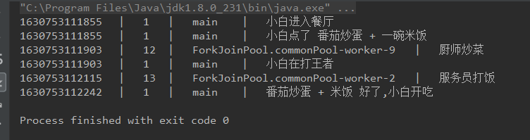

###### 03_thenCombine 异步任务的结合

场景描述：小白进入餐厅点菜，坐下打游戏，厨师炒菜，服务员煮饭，等都做好后呈上来给小白，小白吃饭。

```java
public class _03_thenCombine {
    public static void main(String[] args) {
        SmallTool.printTimeAndThread("小白进入餐厅");
        SmallTool.printTimeAndThread("小白点了 番茄炒蛋 + 一碗米饭");

        CompletableFuture<String> cf1 = CompletableFuture.supplyAsync(() -> {
            SmallTool.printTimeAndThread("厨师炒菜");
            SmallTool.sleepMillis(200);
            return "番茄炒蛋";
        }).thenCombine(CompletableFuture.supplyAsync(() -> {
            SmallTool.printTimeAndThread("服务员蒸饭");
            SmallTool.sleepMillis(300);
            return "米饭";
        }), (dish, rice) -> {   // 运行慢的线程进行合并两个结果
            SmallTool.printTimeAndThread("服务员打饭");
            SmallTool.sleepMillis(100);
            return String.format("%s + %s 好了", dish, rice);
        });

        SmallTool.printTimeAndThread("小白在打王者");
        SmallTool.printTimeAndThread(String.format("%s ,小白开吃", cf1.join()));

    }


    /**
     * 用 applyAsync 也能实现
     */
    private static void applyAsync() {
        SmallTool.printTimeAndThread("小白进入餐厅");
        SmallTool.printTimeAndThread("小白点了 番茄炒蛋 + 一碗米饭");

        CompletableFuture<String> cf1 = CompletableFuture.supplyAsync(() -> {
            SmallTool.printTimeAndThread("厨师炒菜");
            SmallTool.sleepMillis(200);
            return "番茄炒蛋";
        });
        CompletableFuture<String> race = CompletableFuture.supplyAsync(() -> {
            SmallTool.printTimeAndThread("服务员蒸饭");
            SmallTool.sleepMillis(300);
            return "米饭";
        });
        SmallTool.printTimeAndThread("小白在打王者");

        String result = String.format("%s + %s 好了", cf1.join(), race.join());
        SmallTool.printTimeAndThread("服务员打饭");
        SmallTool.sleepMillis(100);

        SmallTool.printTimeAndThread(String.format("%s ,小白开吃", result));
    }
}

```

执行结果

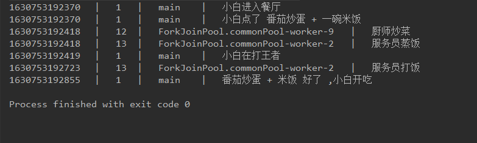


三个例子： 好好看

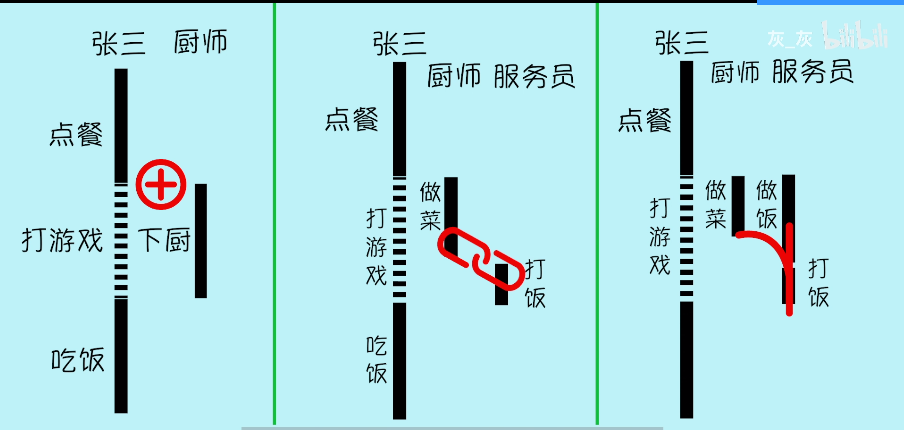

**异步任务的开始：                                   异步任务的连接：                                         异步任务的结合：**


###### 04_allof  等待所有异步线程的使用

```java
public static void main(String[] args) {
    	// 创建list
        List<CompletableFuture<Integer>> futures = new ArrayList<>();
        for (int i = 0; i < 2; i++) {
            int finalI = i;
            // 统统加入list
            futures.add(CompletableFuture.supplyAsync(() -> finalI));
        }
        //等待全部完成
		// 如此使用可等待完成
        CompletableFuture.allOf(futures.toArray(new CompletableFuture[0])).join();

//获取内容
        for (CompletableFuture<Integer> future : futures) {
            try {
                Integer s = future.get();
                System.out.println(s);
            } catch (InterruptedException | ExecutionException e) {
                e.printStackTrace();
            }
        }
    }
```


#### 04 CompletableFuture 进阶

##### 重要的Api

###### thenApply(Function<? super T,? extends U> fn)  异步任务的后续处理。转换结果，相当于stream中的map映射

**直接使用thenApply 则 JVM 会将两块代码块当作一个任务进行执行 ，**

**使用thenApplyAsyn 作用与 thenCompose 相当，可以作用于异步任务的连接**

**关于thenApply 与 thenCompose 的区别，** 

thenCompose 相当于 stream流中 flatMap（）

thenApply()  相当于 stram流中的Map()

​	专栏 [](https://blog.csdn.net/winterking3/article/details/116026768)
​			

>  thenApply（）转换的是泛型中的类型，是同一个CompletableFuture，相当于将CompletableFuture<T> 转换成CompletableFuture<U>
>
> thenCompose（）用来连接两个CompletableFuture，是生成一个新的CompletableFuture。


###### applyToEither( CompletionStage<? extends T> other, Function<? super T, U> fn)  选择一个异步任务的结果

**两个异步任务同时执行，先执行成功的进入function 函数中进行处理并返回。**

###### exceptionally (Function<Throwable, ? extends T> fn)  优雅的处理异步任务的结果


###### 01_thenApply   任务的后置处理

场景再现： 小白吃完饭，服务员 付款结账开发票，同时接电话，收好发票回家


```java

public class _01_thenApply {
    public static void main(String[] args) {
        SmallTool.printTimeAndThread("小白吃好了");
        SmallTool.printTimeAndThread("小白 结账、要求开发票");

        CompletableFuture<String> invoice = CompletableFuture.supplyAsync(() -> {
            SmallTool.printTimeAndThread("服务员收款 500元");
            SmallTool.sleepMillis(500);
            return "500";
        }).thenApplyAsync(money -> {
            SmallTool.printTimeAndThread(String.format("服务员开发票 面额 %s元", money));
            SmallTool.sleepMillis(200);
            return String.format("%s元发票", money);
        });

        SmallTool.printTimeAndThread("小白 接到朋友的电话，想一起打游戏");

        SmallTool.printTimeAndThread(String.format("小白拿到%s，准备回家", invoice.join()));

        System.out.println("====================");
        three();
    }

    // 使用thenCompose 实现
    private static void three() {
        SmallTool.printTimeAndThread("小白吃好了");
        SmallTool.printTimeAndThread("小白 结账、要求开发票");

        CompletableFuture<String> invoice = CompletableFuture.supplyAsync(() -> {
            SmallTool.printTimeAndThread("服务员收款 500元");
            SmallTool.sleepMillis(500);
            return "500";
        }).thenCompose(money -> CompletableFuture.supplyAsync(() -> {
            SmallTool.printTimeAndThread("服务员打印发票...");
            SmallTool.sleepMillis(200);
            return "发票" + money;
        }));

        SmallTool.printTimeAndThread("小白 接到朋友的电话，想一起打游戏");

        SmallTool.printTimeAndThread(String.format("小白拿到%s，准备回家", invoice.join()));


    }


    private static void one() {
        SmallTool.printTimeAndThread("小白吃好了");
        SmallTool.printTimeAndThread("小白 结账、要求开发票");

        CompletableFuture<String> invoice = CompletableFuture.supplyAsync(() -> {
            SmallTool.printTimeAndThread("服务员收款 500元");
            SmallTool.sleepMillis(100);
            SmallTool.printTimeAndThread("服务员开发票 面额 500元");
            SmallTool.sleepMillis(200);
            return "500元发票";
        });

        SmallTool.printTimeAndThread("小白 接到朋友的电话，想一起打游戏");

        SmallTool.printTimeAndThread(String.format("小白拿到%s，准备回家", invoice.join()));
    }


    private static void two() {
        SmallTool.printTimeAndThread("小白吃好了");
        SmallTool.printTimeAndThread("小白 结账、要求开发票");

        CompletableFuture<String> invoice = CompletableFuture.supplyAsync(() -> {
            SmallTool.printTimeAndThread("服务员收款 500元");
            SmallTool.sleepMillis(100);

            CompletableFuture<String> waiter2 = CompletableFuture.supplyAsync(() -> {
                SmallTool.printTimeAndThread("服务员开发票 面额 500元");
                SmallTool.sleepMillis(200);
                return "500元发票";
            });

            return waiter2.join();
        });

        SmallTool.printTimeAndThread("小白 接到朋友的电话，想一起打游戏");

        SmallTool.printTimeAndThread(String.format("小白拿到%s，准备回家", invoice.join()));
    }
}

```

执行结果：

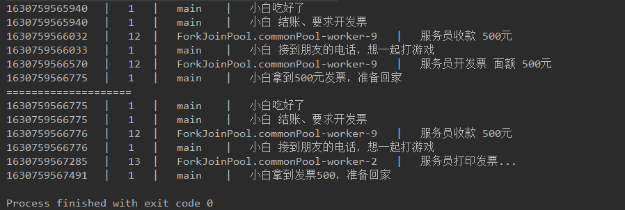


###### 02_applyToEither 获取最先完成的任务

场景再现： 小白吃完饭坐公交回家，哪个先到坐哪辆

```java

public class _02_applyToEither {
    public static void main(String[] args) {
        SmallTool.printTimeAndThread("张三走出餐厅，来到公交站");
        SmallTool.printTimeAndThread("等待 700路 或者 800路 公交到来");

        CompletableFuture<String> bus = CompletableFuture.supplyAsync(() -> {
            SmallTool.printTimeAndThread("700路公交正在赶来");
            SmallTool.sleepMillis(100);
            return "700路到了";
        }).applyToEither(CompletableFuture.supplyAsync(() -> {
            SmallTool.printTimeAndThread("800路公交正在赶来");
            SmallTool.sleepMillis(200);
            return "800路到了";
        }), firstComeBus -> firstComeBus);

        SmallTool.printTimeAndThread(String.format("%s,小白坐车回家", bus.join()));
    }
}

```

运行结果

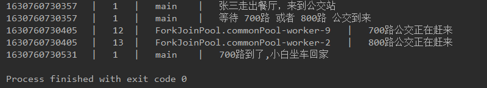


###### 03_exceptionally 异步任务中的异常处理

```java

public class _03_exceptionally {
    public static void main(String[] args) {
        SmallTool.printTimeAndThread("张三走出餐厅，来到公交站");
        SmallTool.printTimeAndThread("等待 700路 或者 800路 公交到来");

        CompletableFuture<String> bus = CompletableFuture.supplyAsync(() -> {
            SmallTool.printTimeAndThread("700路公交正在赶来");
            SmallTool.sleepMillis(100);
            return "700路到了";
        }).applyToEither(CompletableFuture.supplyAsync(() -> {
            SmallTool.printTimeAndThread("800路公交正在赶来");
            SmallTool.sleepMillis(200);
            return "800路到了";
        }), firstComeBus -> {
            SmallTool.printTimeAndThread(firstComeBus);
            if (firstComeBus.startsWith("700")) {
                throw new RuntimeException("撞树了……");
            }
            return firstComeBus;
        }).exceptionally(e -> {
            SmallTool.printTimeAndThread(e.getMessage());	// 获取异步任务的异常。
            SmallTool.printTimeAndThread("小白叫出租车");
            return "出租车 叫到了";
        });

        SmallTool.printTimeAndThread(String.format("%s,小白坐车回家", bus.join()));
    }
}

```

执行结果

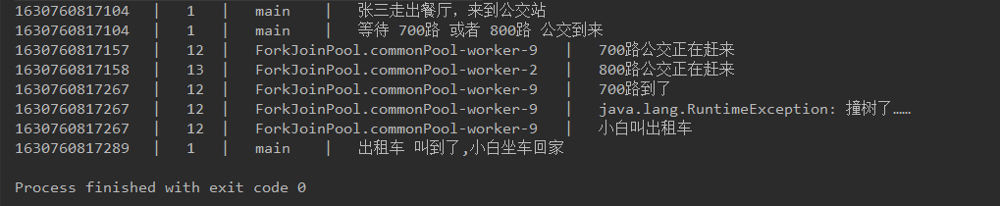


#### 05 CompletableFuture 扩展

###### api 特性

- xxx(args)							普通方法

- xxxAsyn(args)               异步方法

- xxxAsyn(args, Executor executor)         带有线程池的异步方法


###### 有关**thenCompose** 的说法、

在03初始CompletableFuture 中 讲到过 此api是将两个异步任务连接。

那 thenComposeAsyn 呢

场景再现： 厨师炒菜，让服务员A去打饭，结果服务员A被老板叫走，让服务员B打饭，

```java
public class _02_thenCompose {
    public static void main(String[] args) {
        CompletableFuture<String> cf1 = CompletableFuture.supplyAsync(() -> {
            SmallTool.printTimeAndThread("厨师炒菜");
            SmallTool.sleepMillis(200);
            return "番茄炒蛋";
        }).thenCompose(dish -> {
            SmallTool.printTimeAndThread("服务员A 准备打饭，但是被领导叫走，打饭交接给服务员B");

            return CompletableFuture.supplyAsync(() -> {
                SmallTool.printTimeAndThread("服 务员B 打饭");
                SmallTool.sleepMillis(100);
                return dish + " + 米饭";
            });
        });

        SmallTool.printTimeAndThread(cf1.join()+"好了，开饭");
    }
}

```

执行结果：

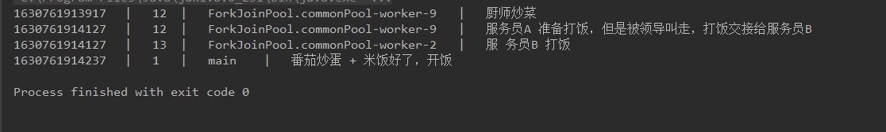

将 thenCompose 换成 thenComposeAsyn 

执行结果


开启了异步任务， 服务员B在12线程是因为 JVM对于线程的优化结果， 线程的复用

正确是包含了3个异步任务。


###### 其他Api

supplyAsyn 				开启异步任务 ， 有返回值

runAsyn						开启异步任务， 没有返回值


thenApply   				接收参数，并返回值

thenAccept				接收参数，没有返回值

thenRun						不接受参数，没有返回值


thenCombine 			接收两个异步任务的结果，然后处理得到一个返回值

thenAccpetBoth		接收两个异步任务的结果， 没有返回值

runAfterBoth 				不关心两个异步任务的结果，没有返回值


applyToEither			获取两个异步任务中最先执行完成的结果， 然后处理返回一个结果

acceptEithe				得到最快执行完任务的结果， 没有返回值

runAfterEither				不关心两个异步任务的结果，没有返回值


exceptionally 			处理前面异步任务的异常，并修正为正常值 再返回

handle						如果前面的线程正常执行，则收到正常执行的结果，如果线程异常，则接收异常，无论是否异常，都会返回一个结果		 

whenComplete		跟handle 有点像， 但是没有返回值


##### 总结：

xxxAsyn 为 异步执行

带有executor 参数则 是传入线程池。


apply   有参数有返回值

accept   有参数，无返回值

run       无参数，无返回值


#### 06 线程池

线程池在 java.util.concurrent 中的 ThreadPoolExecutor

获取线程池  new ThreadPoolExecutor()

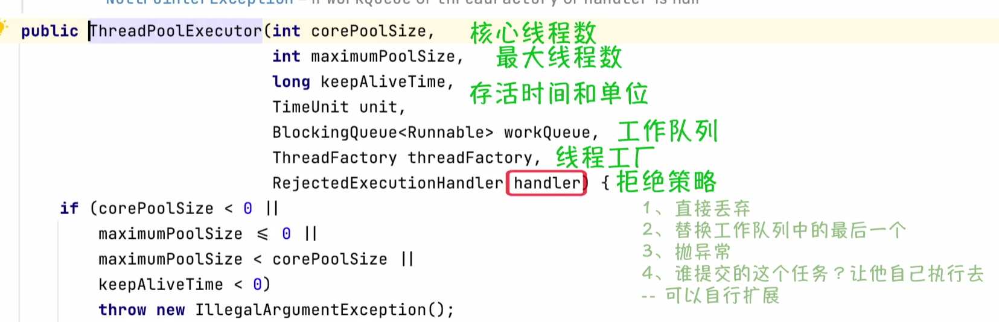


好用的线程工具类  Executors 

```java
public class _01_ThreadPool {
    public static void main(String[] args) {

        // 创建只有一个线程的线程池
        Executors.newSingleThreadExecutor();

        // 创建出最大线程池，核心线程数为0，最大线程数为最大
        Executors.newCachedThreadPool();

        // 创造出固定线程数量的线程池
        ExecutorService executorService = Executors.newFixedThreadPool(3);

    }
}
```

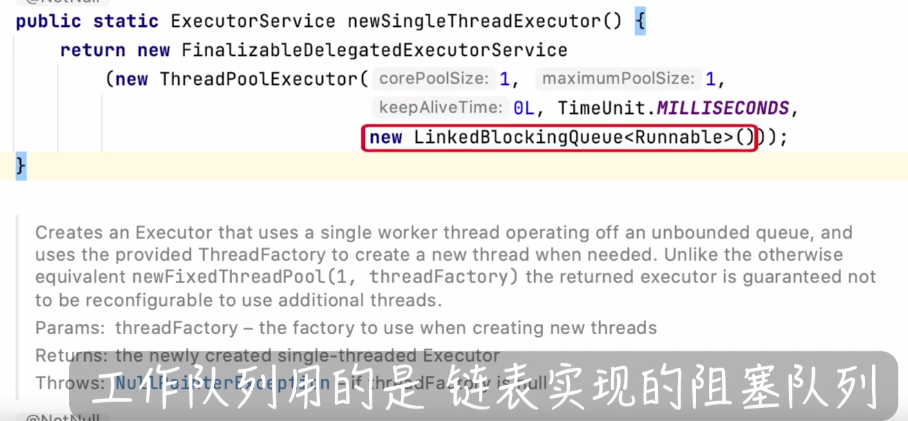


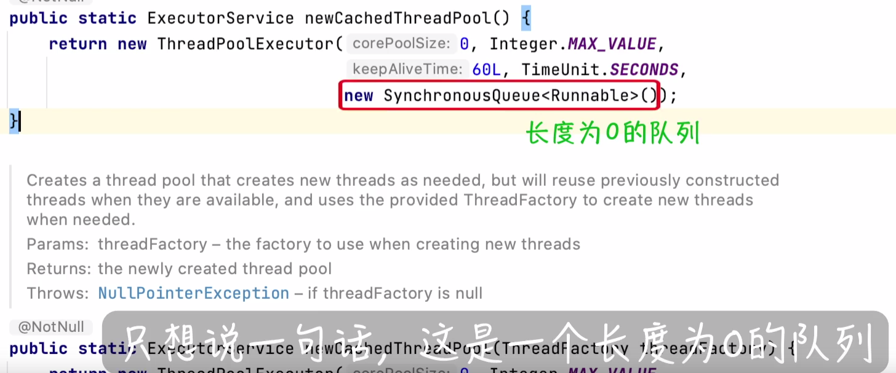

当任务来临，如果有空闲线程就直接去执行，如果没有空闲线程，就直接创建新的线程去执行


#### 07 CompletableFuture 性能

##### 场景再现： 小白跟朋友一起去吃饭，点菜。

```java

/**
 * 菜
 */
public class Dish {
    // 菜名
    private String name;
    // 制作时长 (秒)
    private Integer productionTime;

    public Dish(String name, Integer productionTime) {
        this.name = name;
        this.productionTime = productionTime;
    }

    // 做菜
    public void make() {
        SmallTool.sleepMillis(TimeUnit.SECONDS.toMillis(this.productionTime));
        SmallTool.printTimeAndThread(this.name + " 制作完毕，来吃我吧");
    }

    // 做菜
    public void makeUseCPU() {
        SmallTool.printTimeAndThread(this.name + " 制作完毕，来吃我吧" + compute());
    }

    /**
     * 用来模拟 1秒钟的耗时操作
     * 如果你的电脑比较强，可以增大循环次数，否则，需要减少循环次数
     */
    private static long compute() {
        long startTime = System.currentTimeMillis();
        long result = 0;
        // 只是用来模拟耗时操作，没有任何意义
        for (int i = 0; i < Integer.MAX_VALUE / 3; i++) {
            result += i * i % 3;
        }
        return System.currentTimeMillis() - startTime;
    }

    public static void main(String[] args) {
        System.out.println(compute());
    }


}

```

糟糕的做法

```java
public class _01_terribleCode {
    public static void main(String[] args) {

        SmallTool.printTimeAndThread("小白和小伙伴们 进餐厅点菜");
        long startTime = System.currentTimeMillis();

        ArrayList<Dish> dishes = new ArrayList<>();
        // 点菜
        for (int i = 1; i <= 10; i++) {
            Dish dish = new Dish("菜" + i, 1);
            dishes.add(dish);
        }
        // 做菜
        for (Dish dish : dishes) {
            CompletableFuture.runAsync(() -> dish.make()).join();
        }

        SmallTool.printTimeAndThread("菜都做好了，上桌 " + (System.currentTimeMillis() - startTime));

    }
}
```


```java
public class _02_terribleCodeImprove {
    public static void main(String[] args) {

        SmallTool.printTimeAndThread("小白和小伙伴们 进餐厅点菜");
        long startTime = System.currentTimeMillis();
        // 点菜
        ArrayList<Dish> dishes = new ArrayList<>();
        for (int i = 1; i <= 10; i++) {
            Dish dish = new Dish("菜" + i, 1);
            dishes.add(dish);
        }
        // 做菜
        ArrayList<CompletableFuture> cfList = new ArrayList<>();
        for (Dish dish : dishes) {
            CompletableFuture<Void> cf = CompletableFuture.runAsync(() -> dish.make());
            cfList.add(cf);
        }
        // 等待所有任务执行完毕
        CompletableFuture.allOf(cfList.toArray(new CompletableFuture[cfList.size()])).join();

        SmallTool.printTimeAndThread("菜都做好了，上桌 " + (System.currentTimeMillis() - startTime));

    }
}
```


```java
public class _03_goodCode {
    public static void main(String[] args) {
        //-Djava.util.concurrent.ForkJoinPool.common.parallelism=8
        System.setProperty("java.util.concurrent.ForkJoinPool.common.parallelism", "12");

        SmallTool.printTimeAndThread("小白和小伙伴们 进餐厅点菜");
        long startTime = System.currentTimeMillis();

        CompletableFuture[] dishes = IntStream.rangeClosed(1, 12)
                .mapToObj(i -> Dish("菜" + i, 1))
                .map(dish -> CompletableFuture.runAsync(dish::make))
                .toArray(size -> new CompletableFuture[size]);

        CompletableFuture.allOf(dishes).join();

        SmallTool.printTimeAndThread("菜都做好了，上桌 " + (System.currentTimeMillis() - startTime));

    }
}
```


##### 查看电脑线程数量

```java
public class _04_commonPoolSize {
    public static void main(String[] args) {

        // Returns the number of processors available to the Java virtual machine
        // 查看电脑 线程核心数量  此电脑，6核12线程
        System.out.println(Runtime.getRuntime().availableProcessors());
        // 查看 当前线程数
        System.out.println(ForkJoinPool.commonPool().getPoolSize());
        // 查看 最大线程数
        System.out.println(ForkJoinPool.getCommonPoolParallelism());

    }
}
```


##### 创建审查状态的线程池

线程执行完任务就直接销毁。方便查看各个任务的线程真实情况，防止线程的复用干扰判断。

```java
public class _06_thenRunAsync_threadReuse {
    public static void main(String[] args) {
        ThreadPoolExecutor executor = new ThreadPoolExecutor(0, Integer.MAX_VALUE,
                0, TimeUnit.MILLISECONDS,
                new SynchronousQueue<Runnable>());

        CompletableFuture.runAsync(() -> SmallTool.printTimeAndThread("A"), executor)
                .thenRunAsync(() -> SmallTool.printTimeAndThread("B"), executor)
                .join();

    }
}
```

