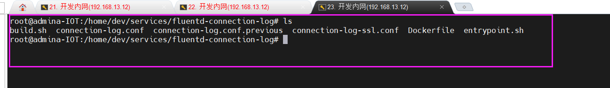
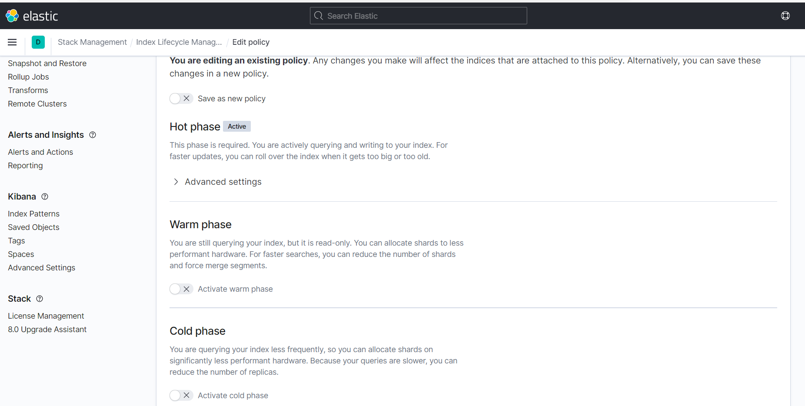
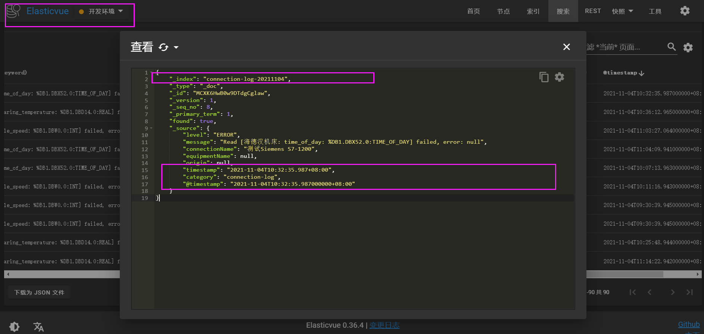

# fluentd 做日志采集

（**fluentd与es的配置**）https://blog.csdn.net/wb1046329430/article/details/119155735

> 重点关注这个up 主， 各种官网文档的翻译官


开发服务器  192.168.13.12     --->     58.247.122.126

fluentd 相关设置

> /home/dev/server/fluent-*
>
> 其中两个服务， 
>
> /home/dev/services/fluentd-connection-log
>
> /home/dev/services/fluentd-service-log

 

首先关注连接日志， 



其中 conneciton-log.conf 是相关服务配置


优先 了解fluentd 相关知识

（**fluentd理论知识**）[分布式日志采集工具：fluentd-20200708-王子健_哔哩哔哩_bilibili](https://www.bilibili.com/video/BV1yp4y1S75C?from=search&seid=16752068514647630861&spm_id_from=333.337.0.0)


简述视频理论：

1. 通过tag 打入标记，方便之后操作
2. parse, 转换格式，统一化
3. filter, 过滤筛选处理


主要是通过插件进行日志流的处理

包括：

**Input**    输入， 在这里进行tag标记， 以便于后续操作						<source>

**Parser**   转换	内置于input 																	<parse>

**Filter**   过滤																								<filter>

**Output**   输出																							<match>

**Formatter**  格式   内置于output  															<format>		

**Buffer**    缓冲		内置于 output 															<buffer>	

Storage

Service Discovery


内置插件    （各种类型）

Input :  	tail  forward  udp  tcp  http 等等， 可自由安装插件 ： sql dstat

parse:       regexp  apache2   nginx   csv   json   multine 等等，  

filter:         record_transformer   grep  等等，   使用record_transformer   可增加信息

Output:     file  forward  http   copy  kafka  elasticsearch   等等， 若一个tap需要多个output, 使用copy 处理

buffer:		file  memory  默认使用memory


对应查看一下相关的配置

```json
<source>
  @type rabbitmq
  tag  connection-log
  host rabbit
  user guest
  pass guest

  vhost /
  exchange hiot
  exchange_type direct
  queue log.connection.queue
  routing_key hiot.log.connection
  durable true
  passive false
  payload_only false
  content_type application/octet-stream
  priority 0
  <parse>
    @type json
  </parse>
</source>

<source>
  @type rabbitmq
  tag  event-log
  host rabbit
  user guest
  pass guest

  vhost /
  exchange hiot
  exchange_type direct
  queue log.event.queue
  routing_key hiot.log.event
  durable true
  passive false
  payload_only false
  content_type application/octet-stream
  priority 0
  <parse>
    @type json
  </parse>
</source>

<filter connection-log>
  @type record_transformer
  <record>
    category connection-log
  </record>
</filter>

<filter event-log>
  @type record_transformer
  <record>
    category event-log
  </record>
</filter>


<match connection-log>
  @type copy
  <store>
    @type stdout
    <format>
      @type stdout
      output_type single_value
      message_key log
      add_newline true
    </format>
  </store>

  <store>
    @type elasticsearch
    host elasticsearch
    port 9200
    logstash_format true
    logstash_prefix connection-log
    logstash_dateformat %Y%m%d
    time_key timestamp
    include_timestamp true
    flush_interval 1s
  </store>
</match>

<match event-log>
  @type copy
  <store>
    @type stdout
    <format>
      @type stdout
      output_type single_value
      message_key log
      add_newline true
    </format>
  </store>

  <store>
    @type elasticsearch
    host elasticsearch
    port 9200
    logstash_format true
    logstash_prefix event-log
    logstash_dateformat %Y%m%d
    time_key timestamp
    include_timestamp true
    flush_interval 1s
  </store>
</match>
root@admina-IOT:/home/dev/services/fluentd-connection-log#
root@admina-IOT:/home/dev/services/fluentd-connection-log# cat connection-log.conf
<source>
  @type rabbitmq
  tag  connection-log
  host rabbit
  user guest
  pass guest

  vhost /
  exchange hiot
  exchange_type direct
  queue log.connection.queue
  routing_key hiot.log.connection
  durable true
  passive false
  payload_only false
  content_type application/octet-stream
  priority 0
  <parse>
    @type json
  </parse>
</source>

<source>
  @type rabbitmq
  tag  event-log
  host rabbit
  user guest
  pass guest

  vhost /
  exchange hiot
  exchange_type direct
  queue log.event.queue
  routing_key hiot.log.event
  durable true
  passive false
  payload_only false
  content_type application/octet-stream
  priority 0
  <parse>
    @type json
  </parse>
</source>

<filter connection-log>
  @type record_transformer
  <record>
    category connection-log
  </record>
</filter>

<filter event-log>
  @type record_transformer
  <record>
    category event-log
  </record>
</filter>


<match connection-log>
  @type copy
  <store>
    @type stdout
    <format>
      @type stdout
      output_type single_value
      message_key log
      add_newline true
    </format>
  </store>

  <store>
    @type elasticsearch
    host elasticsearch
    port 9200
    logstash_format true
    logstash_prefix connection-log
    logstash_dateformat %Y%m%d
    time_key timestamp
    include_timestamp true
    flush_interval 1s
  </store>
</match>

<match event-log>
  @type copy
  <store>
    @type stdout
    <format>
      @type stdout
      output_type single_value
      message_key log
      add_newline true
    </format>
  </store>

  <store>
    @type elasticsearch
    host elasticsearch
    port 9200
    logstash_format true
    logstash_prefix event-log
    logstash_dateformat %Y%m%d
    time_key timestamp
    include_timestamp true
    flush_interval 1s
  </store>
</match>

```


由此引出 es 索引生命周期管理。

> es使用版本 7.11  kibana使用版本 7.11

首先在kibana 中 创建索引生命周期策略， 这里使用最基础的方式， 将其余全部关闭， 仅存自动删除




如此创建出来，映射至索引中没有发生异常，不然会有es保护机制。目前尚不清楚

然后使用kibana 将此生命周期对应到想要管理的索引中。 即可实现自动删除


而对于自动生成的索引， 可设置索引模板， 

因为生成的索引均为  connection-log-20211102

所以创建索引模板， 对应模板索引匹配 指定 为  connection-log-*  即可在创建时自动映射模板

然后将模板交予生命周期管理， 即可实现了自动删除

由此又引出新的问题， 如何动态更改模板删除时长， 通过es官网可知

（**索引生命周期api**）https://www.elastic.co/guide/en/elasticsearch/reference/7.12/ilm-get-lifecycle.html


```console
GET _ilm/policy/my_policy(索引名)
```


因此， 有办法做索引的自动删除，且可动态修改， 

TODO :  还有当索引已创建并映射了对应的生命周期， 然后修改生命周期，是否会对此index有所影响， 明天测试


另外：在查阅 connection-log时还发现， 多余了时间字段， 并且当前时间00点35分 并未产生最新的索引，将11.05的日志放在了11.04中。




elasticVue 真是个好东西。


