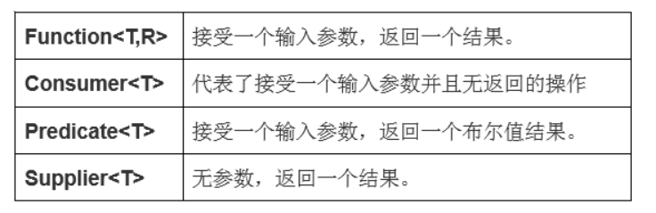

### 函数式接口

#### @FunctionalInterface





这样理解：

传统的函数调用：指的是提前定义好方法名，参数，执行体，返回值等等。

调用者只需要根据方法名，传递参数即可。


而函数式编程，指的是提前定义好执行。根据不同的接口定义，例如（Function, Consummer, Supplier, Predicate ）

然后由用户来决定真正的方法体执行。

用户传递的是方法本身。


Function 函数， 给定输入值，然后调用者决定怎样的转换并返回。


Consumer函数， 给定输入值，然后调用者决定如何消费。


Predicate函数， 给定输入值，调用者决定该值的boolean


Supplier 函数， 调用者决定生产怎样的数据。


```
driverClasses.stream().sorted( (d1,d2) -> {
    // 进行排序
    Integer sort1 = d1.info.getModels().get(0).getCategory().orderNum();
    Integer sort2 = d2.info.getModels().get(0).getCategory().orderNum();
    if ( sort1.equals(sort2)) {
        return d1.info.getName().compareTo(d2.info.getName());
    } else {
        return sort1.compareTo(sort2);
    }
});
```

