### Collection 集合接口


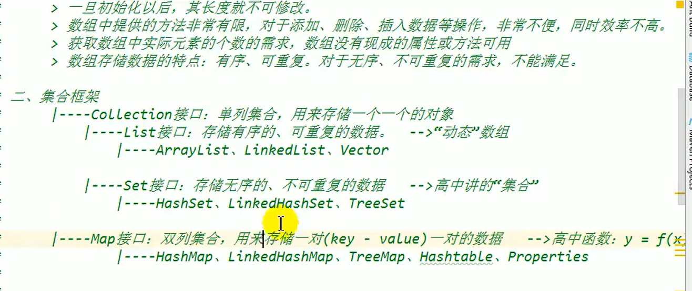


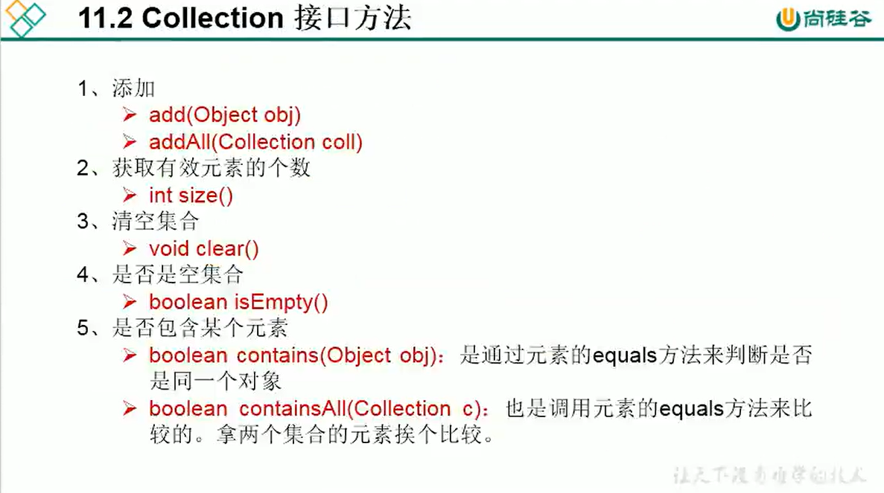

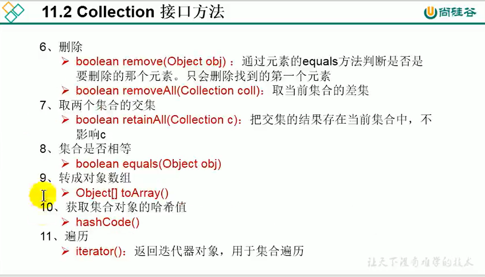


**集合中的contains 方法是依靠equals() 方法进行对比的。**

**removeAll(Collection coll)  取当前集合的差集**

**retainAll(Collection coll)  取当前集合的交集。**

**equals()  比较两个集合内容是否一致，每个元素进行equals**

****

----


快速生成集合的方式

数组---> 集合

```java

List<String> list = Arrays.asList(new String[]{"123","456","abc"});

// 谨慎一点：
List<int[]> list = Arrays.asList(new int[]{1,2,3});
// 此时，集合中存放的int[] 数组的集合， 不是数组元素的集合。

// 这样是元素
List<Integer> list = Arrays.asList(new Integer[]{1,2,3});
List<Integer> list = Arrays.asList(1,2,3,4);

 
```


集合---> 数组

```java
Object[] arr = list.toArray();
```


### List 集合接口


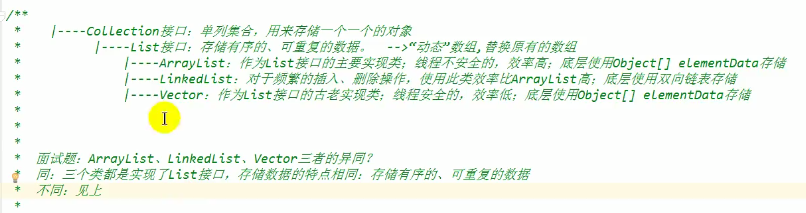

即使Vector 是线程安全的ArrayList， 但使用线程时也不采用

使用 Collections.synchronizedList(List<> list ) 可以返回线程安全的ArrayList

 

ArrayList 源码分析

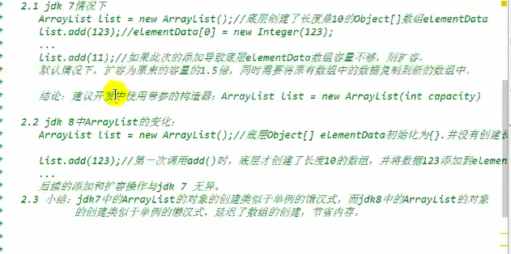


vector 源码分析

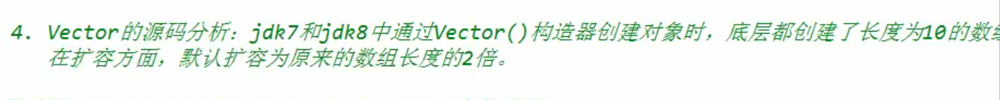


LinkedList 源码分析

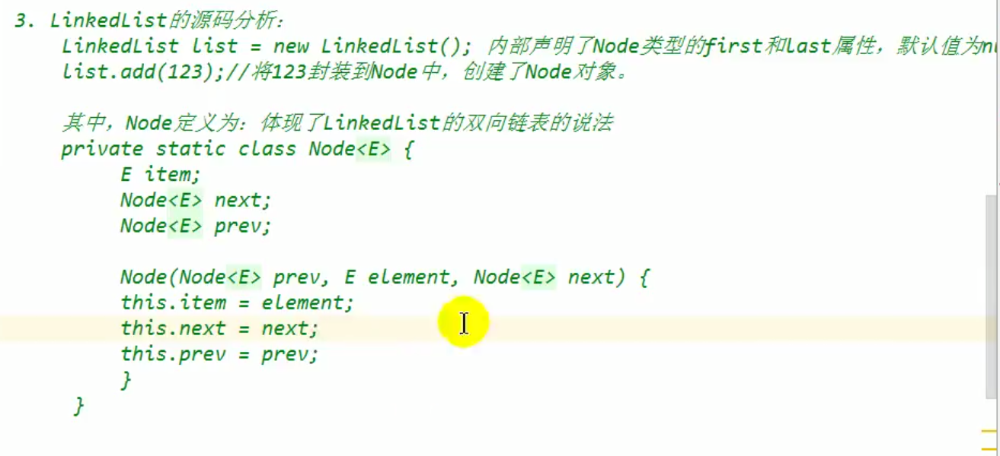


list 常用方法

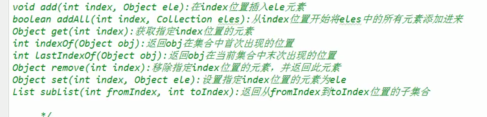


subList()    左闭右开

```java
ArrayList list = Arrays.asList(1,2,3,4,5,6);
ArrayList subList = list.subList(2,4);
// 返回 3,4
```


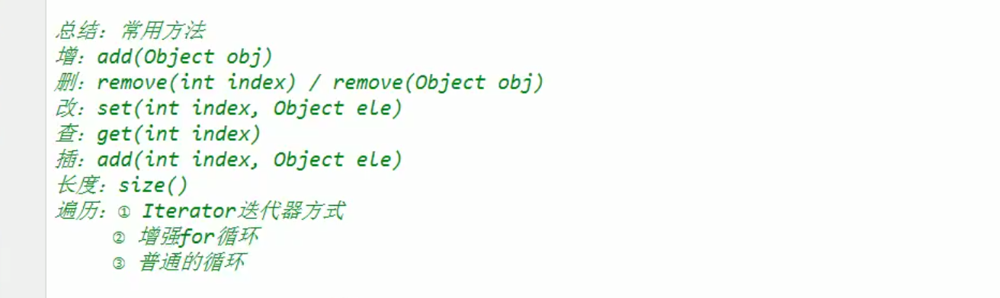


小练习


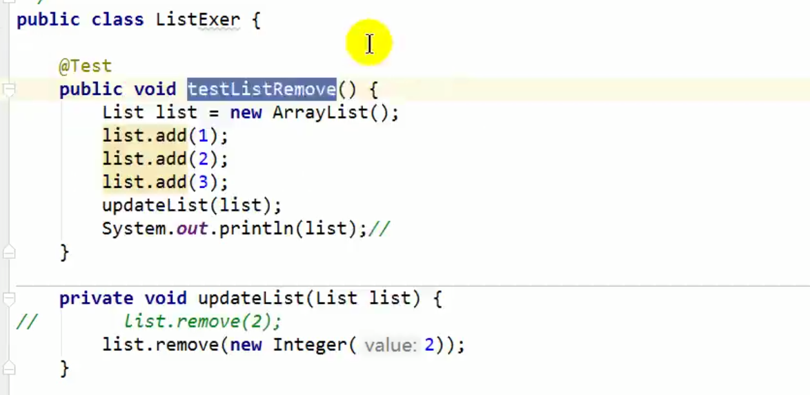

因为 add() 方法 存储的是对象， 存储2 则直接装箱为Integer 对象

直接调用remove（） 方法 实则是调用 remove(int index)

若想要删除元素2 ， 必须使用 手动装箱来决定删除对象。 remove(Object o)


### Set 集合接口


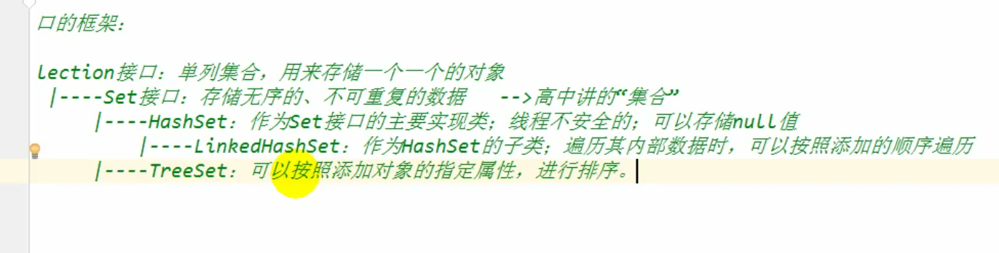


#### Set集合的解释：

- 无序性：并非随机性，也是按照一定的规律。  底层一样是数组， 只不过添加时是根据hash值决定数组中					的位置
  - 若使用HashSet 则添加顺序与遍历顺序基本不同
  - 若使用LinkedHashSet , 则添加顺序与遍历顺序一致。 **可依旧是无需列表**。
- 不可重复性： 添加元素时先进行hash值得地址计算，然后根据equals() 判断是否相同。
  - 对于自定义的对象，要重写hash 与 equals 才能保证不同。


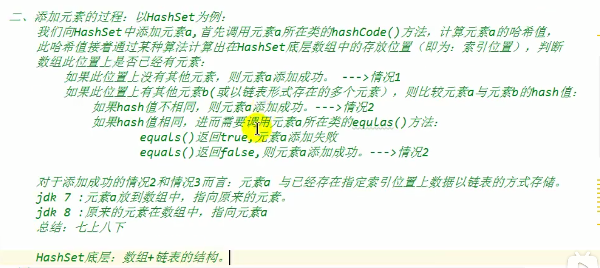


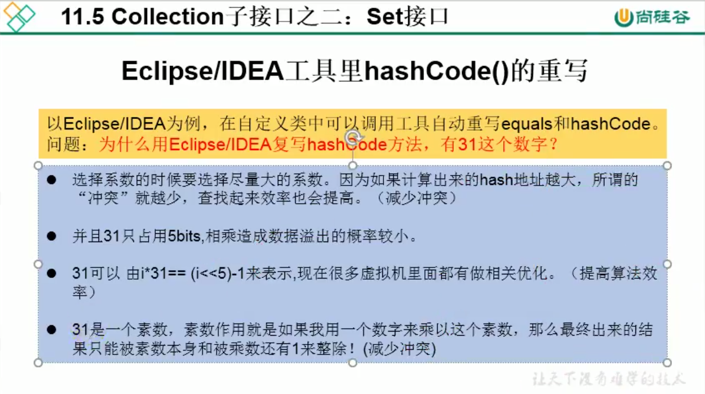

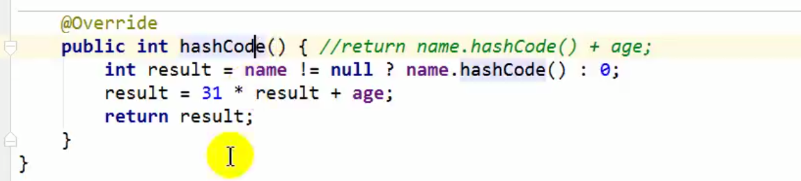


若使用自写的hashCode() 因算法不严谨， 可能导致 22 + 24 与 24 + 22 出现相同的hashCode 值， 效率较低


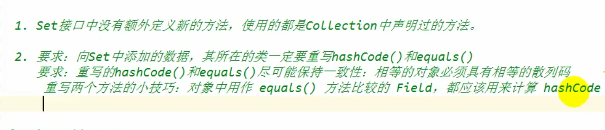


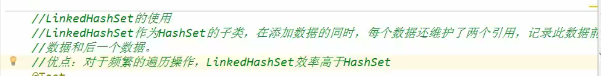


TreeSet

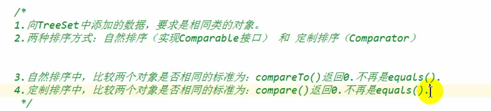

TreeSet 判断元素是否相同，是否能添加进set集合，依靠 compareTo() 接口的实现。 


542


