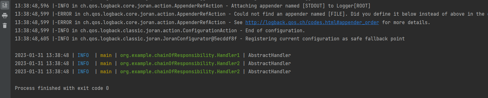

## 为日志配置颜色

没有颜色的日志输出，在日常开发环境中是很苦恼的一件事情。logback可以很好的解决这个问题，解决办法也非常简单：

### 第一步：定义一个颜色pattern变量

```
  <property name="CONSOLE_LOG_PATTERN"
              value="%date{yyyy-MM-dd HH:mm:ss} | %highlight(%-5level) | %boldYellow(%thread) | %boldGreen(%logger) | %msg%n"/>12
```

### 第二步：使用变量

```
    <appender name="console" class="ch.qos.logback.core.ConsoleAppender">
        <encoder charset="UTF-8">
            <pattern>${CONSOLE_LOG_PATTERN}</pattern>
        </encoder>
    </appender>12345
```

当然了，你也可以合并成一步直接写在`<pattern></pattern>` 里面。

最重要的就是 颜色值的使用了。

输出效果如下：

