# MongoDB 实战

- 文档地址: https://docs.mongodb.com/manual/

## 简介

### 说明

- 官方
  
  MongoDB是一个`文档数据库`，旨在方便应用开发和扩展。
  
  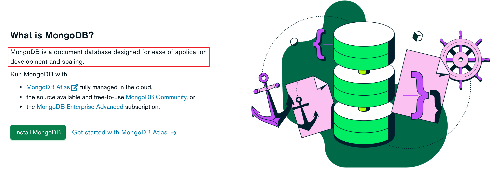

- 百度百科

MongoDB是一个`基于分布式文件存储的数据库`。由C++语言编写。旨在`为WEB应用提供可扩展高性能数据存储解决方案`。

MongoDB是一个`介于关系数据库和非关系数据库`之间的产品，是非关系数据库当中功能最丰富，最像关系数据库的。他支持的数据结构非常松散，是类似json的bson格式，因此可以存储比较复杂的数据类型 。Mongo最大的特点是他支持的查询语言非常强大，其语法有点类似于面向对象的查询语言，`几乎可以实现类似关系数据库单表查询的绝大部分功能，而且还支持对数据建立索引`。

总结: mongoDB 是一个非关系型文档数据库

### 历史

- 2009年2月，MongoDB数据库首次在数据库领域亮相，打破了关系型数据库一统天下的局面；
- 2010年8月, MongoDB 1.6发布。这个版本最大的一个功能就是Sharding，自动分片
- 2014年12月, MongoDB3.0发布。由于收购了WiredTiger 存储引擎，大幅提升了MongoDB的写入性能；
- 2015年12月，3.2版本发布，开始支持了关系型数据库的核心功能：关联。你可以一次同时查询多个MongoDB的集合。
- 2016年, MongoDB推出Atlas，在AWS、 Azure 和GCP上的MongoDB托管服务；
- 2017年10月，MongoDB成功在纳斯达克敲钟，成为26年来第一家以数据库产品为主要业务的上市公司。
- 2018年6月, MongoDB4.0 发布推出ACID事务支持，成为第一个支持强事务的NoSQL数据库；
- 2018年--至今，MongoDB已经从一个在数据库领域籍籍无名的“小透明”，变成了话题度和热度都很高的“流量”数据库。

## 特点

### 特点

-  面向集合存储，易存储对象类型的数据
-  支持查询,以及动态查询
-  支持RUBY，PYTHON，JAVA，C++，PHP，C#等多种语言
-  文件存储格式为BSON（一种JSON的扩展）
-  支持复制和故障恢复和分片
-  支持事务支持
-  索引 聚合 关联....

### 应用场景

- 游戏应用：使用云数据库MongoDB作为游戏服务器的数据库存储用户信息。用户的游戏装备、积分等直接以内嵌文档的形式存储，方便进行查询与更新。
- 物流应用：使用云数据库MongoDB存储订单信息，订单状态在运送过程中会不断更新，以云数据库MongoDB内嵌数组的形式来存储，一次查询就能将订单所有的变更读取出来，方便快捷且一目了然。
- 社交应用：使用云数据库MongoDB存储用户信息以及用户发表的朋友圈信息，通过地理位置索引实现附近的人、地点等功能。并且，云数据库MongoDB非常适合用来存储聊天记录，因为它提供了非常丰富的查询，并在写入和读取方面都相对较快。
- 视频直播：使用云数据库MongoDB存储用户信息、礼物信息等。
- 大数据应用：使用云数据库MongoDB作为大数据的云存储系统，随时进行数据提取分析，掌握行业动态。

## 安装

### 传统方式

```markdown
# 1.下载 MongoDB
- https://www.mongodb.com/try/download/community
```

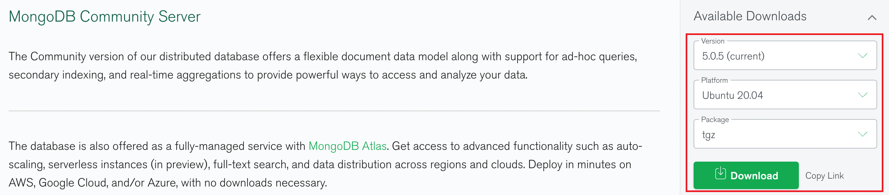

```markdown
# 2.将下载安装包上传到 linux 系统
- tar -zxf mongodb-linux-aarch64-ubuntu2004-5.0.5.tgz 
```


```markdown
# 3.查看安装目录
- ls
	`bin`目录   用来存放启动mongoDB的服务以及客户端链接的脚本文件等
```

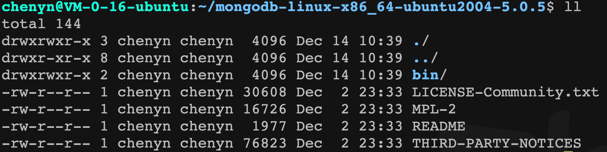

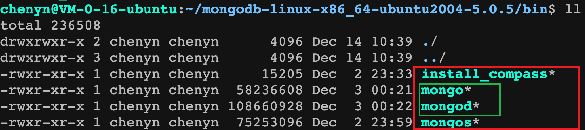

```markdown
# 4.启动 MongoDB 服务
- ./mongod --port=27017 --dbpath=../data --logpath=../logs/mongo.log
	`--port`    指定服务监听端口号 默认为 27017
	`--dbpath`  指定 mongodb 数据存放目录 启动要求目录必须存在
	`--logpath` 指定 mongodb 日志文件存放位置
```


`注意: 由于指定日志文件因此启动时日志输出到日志中终端不显示任何日志`

```markdown
# 5.客户端连接
- ./mongo --port=27017
```


### Docker方式

```markdown
# 1.拉取 mongodb 镜像
- docker pull mongo:5.0.5
```

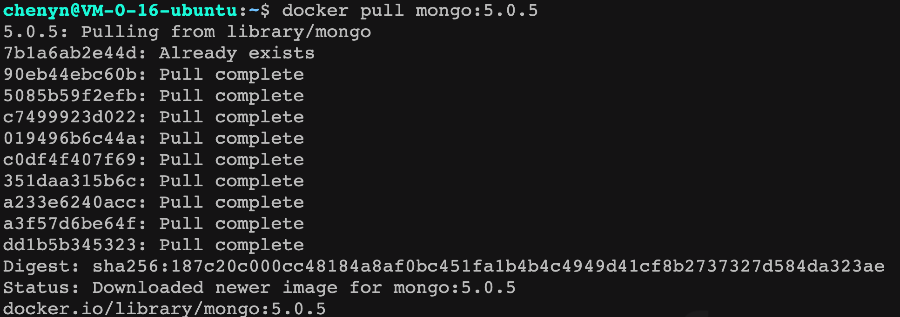

```markdown
# 2.运行 mongo 镜像
- docker run -d --name mongo --p 27017:27017 mongo:5.0.5
```

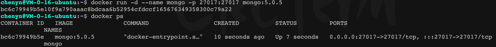

```markdown
# 3.进入 mongo 容器
- docker exec -it bc6c bash
```


## 核心概念

### 库<DataBase>

​	`mongodb中的库就类似于传统关系型数据库中库的概念，用来通过不同库隔离不同应用数据`。mongodb中可以建立多个数据库。每一个库都有自己的集合和权限，不同的数据库也放置在不同的文件中。默认的数据库为"test"，数据库存储在启动指定的data目录中。

### 集合<Collection>

​	`集合就是 MongoDB 文档组，类似于 RDBMS （关系数据库管理系统：Relational Database Management System)中的表的概念`。

集合存在于数据库中，一个库中可以创建多个集合。每个集合没有固定的结构，这意味着你在对集合可以插入不同格式和类型的数据，但通常情况下我们插入集合的数据都会有一定的关联性。

### 文档<Document>

文档集合中一条条记录，是一组键值(key-value)对(即 BSON)。MongoDB 的文档不需要设置相同的字段，并且相同的字段不需要相同的数据类型，这与关系型数据库有很大的区别，也是 MongoDB 非常突出的特点。

一个简单的文档例子如下：

```json
{"site":"www.baizhiedu.xin", "name":"编程不良人"}
```

### 关系总结

| RDBMS            | MongoDB          |
| ---------------- | ---------------- |
| 数据库<database> | 数据库<database> |
| 表<table>        | 集合<collection> |
| 行<row>          | 文档<document>   |
| 列<colume>       | 字段<field>      |

## 基本操作

### 库<database>

- 查看所有库

  ```sql
  > show databases; | show dbs;
  ```

  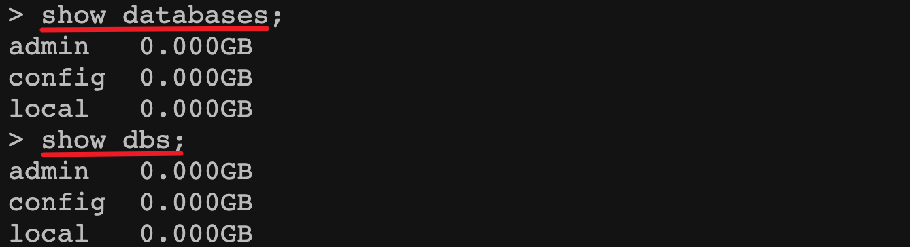

  `注意:`

  - **`admin`**： 从权限的角度来看，这是"root"数据库。要是将一个用户添加到这个数据库，这个用户自动继承所有数据库的权限。一些特定的服务器端命令也只能从这个数据库运行，比如列出所有的数据库或者关闭服务器。
  - **`local`**: 这个数据永远不会被复制，可以用来存储限于本地单台服务器的任意集合
  - **`config`**: 当Mongo用于分片设置时，config数据库在内部使用，用于保存分片的相关信息。

- 创建数据库

  ```sql
  > use 库名
  ```

  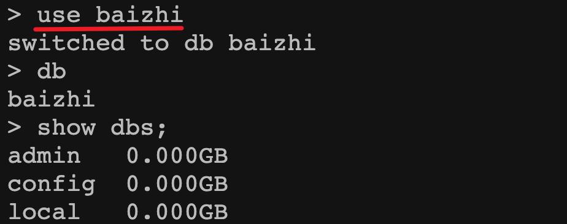

  `注意: use 代表创建并使用,当库中没有数据时默认不显示这个库`

  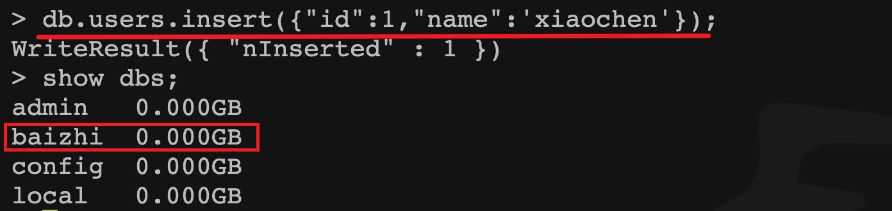

- 删除数据库

  - `默认删除当前选中的库`

  ```sql
  > db.dropDatabase()
  ```

  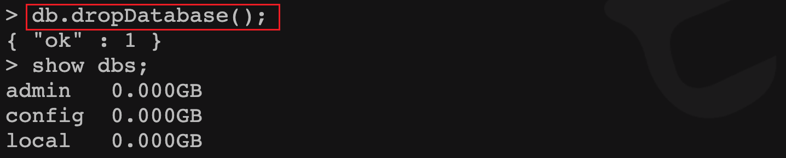

- 查看当前所在库

  ```sql
  > db;
  ```

  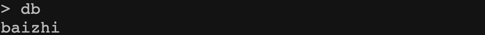

### 集合<Collection>

- 查看库中所有集合

  ```sql
  > show collections; | show tables;
  ```

  

- 创建集合

  ```sql
  > db.createCollection('集合名称', [options])
  ```

  

  `options可以是如下参数：`

  | 字段   | 类型 | 描述                                                         |
  | :----- | :--- | :----------------------------------------------------------- |
  | capped | 布尔 | （可选）如果为 true，则创建固定集合。固定集合是指有着固定大小的集合，当达到最大值时，它会自动覆盖最早的文档。 **当该值为 true 时，必须指定 size 参数。** |
  | size   | 数值 | （可选）为固定集合指定一个最大值，即字节数。 **如果 capped 为 true，也需要指定该字段。** |
  | max    | 数值 | （可选）指定固定集合中包含文档的最大数量。                   |

​		`注意:当集合不存在时,向集合中插入文档也会自动创建该集合。`

- 删除集合

  ```sql
  > db.集合名称.drop();
  ```

  

### 文档<document>

参考文档: https://docs.mongodb.com/manual/reference/method/

- 插入文档

  - 单条文档

    ```sql
    > db.集合名称.insert({"name":"编程不良人","age":23,"bir":"2012-12-12"});
    ```

  - 多条文档

    ```sql
    > db.集合名称.insertMany(
       [ <document 1> , <document 2>, ... ],
       {
     	 writeConcern: 1,//写入策略，默认为 1，即要求确认写操作，0 是不要求。
          ordered: true //指定是否按顺序写入，默认 true，按顺序写入。
       }
    )
    > db.集合名称.insert([
      	{"name":"不良人","age":23,"bir":"2012-12-12"},
      	{"name":"小黑","age":25,"bir":"2012-12-12"}
    ]);
    ```

  - 脚本方式

    ```javascript
    for(let i=0;i<100;i++){
        db.users.insert({"_id":i,"name":"编程不良人_"+i,"age":23});
    }
    ```

  `注意:在 mongodb 中每个文档都会有一个_id作为唯一标识,_id默认会自动生成如果手动指定将使用手动指定的值作为_id 的值。`

- 查询所有

  ```sql
  > db.集合名称.find();
  ```

- 删除文档

  ```sql
  db.集合名称.remove(
     <query>,
     {
       justOne: <boolean>,
       writeConcern: <document>
     }
  )
  ```

  **参数说明：**

  - **query** :`可选`删除的文档的条件。
  - **justOne** : `可选`如果设为 true 或 1，则只删除一个文档，如果不设置该参数，或使用默认值 false，则删除所有匹配条件的文档。
  - **writeConcern** :`可选`抛出异常的级别。

- 更新文档

  ```sql
  db.集合名称.update(
     <query>,
     <update>,
     {
       upsert: <boolean>,
       multi: <boolean>,
       writeConcern: <document>
     }
  );
  ```

  **参数说明：**

  - **query** : update的查询条件，类似sql update查询内where后面的。
  - **update** : update的对象和一些更新的操作符（如$,$inc...）等，也可以理解为sql update查询内set后面的
  - **upsert** : `可选`，这个参数的意思是，如果不存在update的记录，是否插入objNew,true为插入，默认是false，不插入。
  - **multi** : `可选`，mongodb 默认是false,只更新找到的第一条记录，如果这个参数为true,就把按条件查出来多条记录全部更新。
  - **writeConcern** :`可选`，抛出异常的级别。
  
  ```markdown
  - db.集合名称.update({"name":"zhangsan"},{name:"11",bir:new date()}) 
  	`这个更新是将符合条件的全部更新成后面的文档,相当于先删除在更新`
  - db.集合名称.update({"name":"xiaohei"},{$set:{name:"mingming"}})
  	`保留原来数据更新,但是只更新符合条件的第一条数据`
  - db.集合名称.update({name:”小黑”},{$set:{name:”小明”}},{multi:true})		
  	`保留原来数据更新,更新符合条件的所有数据`
  - db.集合名称.update({name:”小黑”},{$set:{name:”小明”}},{multi:true,upsert:true})
  	`保留原来数据更新,更新符合条件的所有数据 没有条件符合时插入数据
  ```

## 文档查询

**MongoDB 查询文档使用 find() 方法。find() 方法以非结构化的方式来显示所有文档。**

### 语法

```sql
> db.集合名称.find(query, projection)
```

- **query** ：可选，使用查询操作符指定查询条件
- **projection** ：可选，使用投影操作符指定返回的键。查询时返回文档中所有键值， 只需省略该参数即可（默认省略）。

如果你需要以易读的方式来读取数据，可以使用 pretty() 方法，语法格式如下：

```sql
> db.集合名称.find().pretty()
```

`注意: pretty() 方法以格式化的方式来显示所有文档。`

### 对比语法

如果你熟悉常规的 SQL 数据，通过下表可以更好的理解 MongoDB 的条件语句查询：

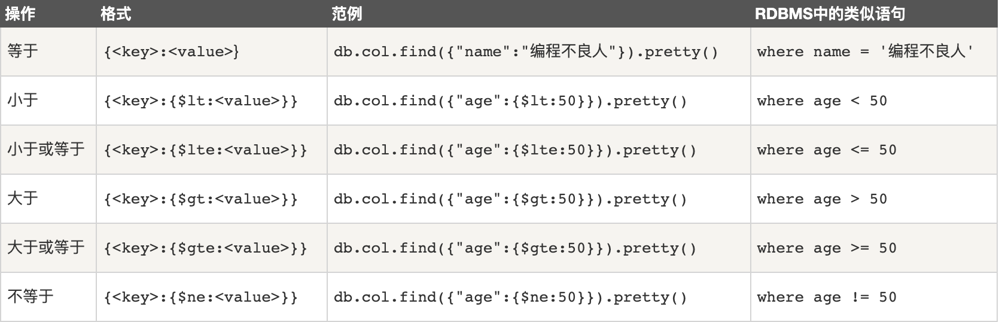

### AND

```sql
> db.集合名称.find({key1:value1, key2:value2,...}).pretty()
```

`类似于 WHERE 语句：WHERE key1=value1 AND key2=value2`

`**如果使用同一个字段进行了多次条件and, 则以后面的条件为准**`

### OR

MongoDB OR 条件语句使用了关键字 **$or**,语法格式如下：

```sql
> db.集合名称.find(
   {
      $or: [
         {key1: value1}, {key2:value2}
      ]
   }
).pretty()
```

`类似于 WHERE 语句：WHERE key1=value1 or key2=value2`

### AND 和 OR 联合

`类似SQL语句为：'where age >50 AND (name = '编程不良人' OR name = 'MongoDB')'`

```sql
> db.集合名称.find({"age": {$gt:50}, $or: [{"name": "编程不良人"},{"name": "MongoDB"}]}).pretty();
```

### 数组中查询

```sql
-- 测试数据
> db.集合名称.insert({ "_id" : 11, "age" : 29, "likes" : [ "看电视", "读书xx", "美女" ], "name" : "不良人_xx_11" })
-- 执行数组查询
> db.users.find({likes:"看电视"})
-- $size 按照数组长度查询
> db.users.find({likes:{$size:3}});
```

### 模糊查询

`类似 SQL 中为 'where name like '%name%''`

```sql
> db.users.find({likes:/良/});
```

`注意:在 mongoDB 中使用正则表达式可以是实现近似模糊查询功能`

### 排序

```sql
> db.集合名称.find().sort({name:1,age:1}),
- 1 升序  -1 降序
```

`类似 SQL 语句为: 'order by name,age'`

### 分页

```sql
> db.集合名称.find().sort({条件}).skip(start).limit(rows);
```

`类似于 SQL 语句为: 'limit start,rows'`，

`默认展示前20条数据，不给分页`

### 总条数

```sql
> db.集合名称.count();
> db.集合名称.find({"name":"编程不良人"}).count();
```

`类似于 SQL 语句为: 'select count(id) from ....'`

### 去重

```sql
> db.集合名称.distinct('字段')
> db.users.distinct('age')
```

`类似于 SQL 语句为: 'select distinct name from ....'`

### 指定返回字段

```sql
> db.集合名称.find({条件},{name:1,age:1}) 
- 参数2: 1 返回  0 不返回    `注意:1和0不能同时使用`
```

## $type

### 说明

$type操作符是基于BSON类型来检索集合中匹配的数据类型，并返回结果。

MongoDB 中可以使用的类型如下表所示：

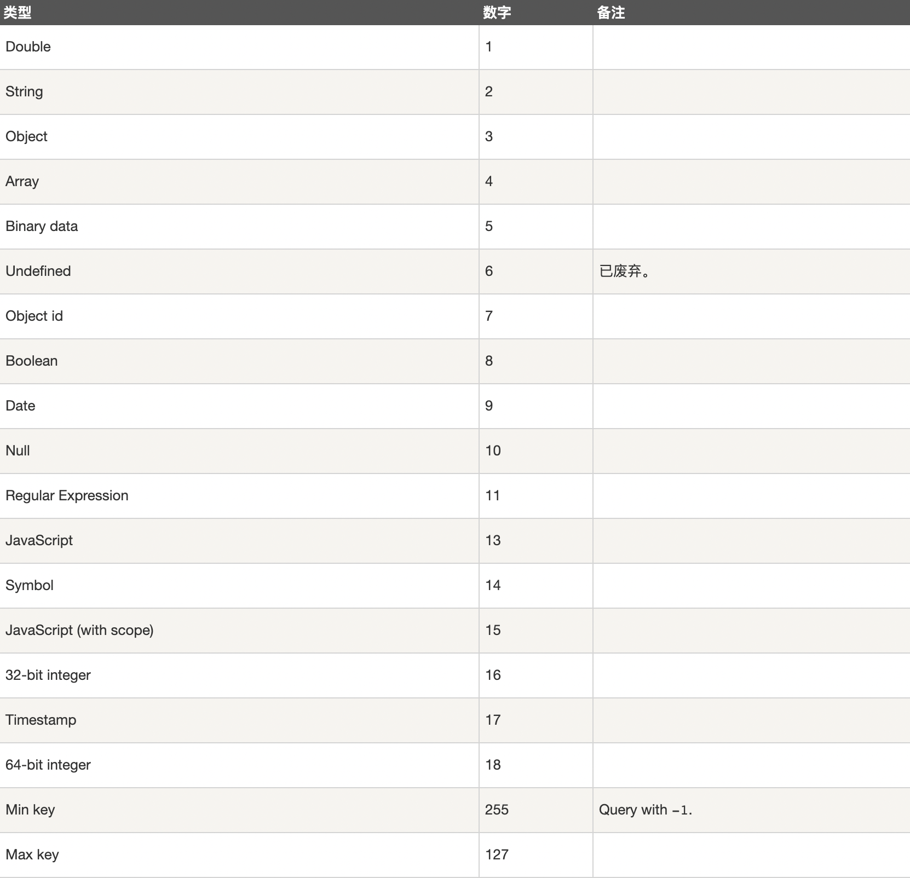

### 使用

```sql
> db.col.insert({
    title: 'PHP 教程', 
    description: 'PHP 是一种创建动态交互性站点的强有力的服务器端脚本语言。',
    by: '编程不良人',
    url: 'http://www.baizhiedu.xin',
    tags: ['php'],
    likes: 200
});

> db.col.insert({
    title: 'Java 教程', 
    description: 'Java 是由Sun Microsystems公司于1995年5月推出的高级程序设计语言。',
    by: '编程不良人',
    url: 'http://www.baizhiedu.xin',
    tags: ['java'],
    likes: 550
});

> db.col.insert({
    title: 'MongoDB 教程', 
    description: 'MongoDB 是一个 Nosql 数据库',
    by: '编程不良人',
    url: 'http://www.baizhiedu.xin',
    tags: ['mongodb'],
    likes: 100
});

> db.col.insert({
    title: 2233, 
    description: '2233 是一个 B站的',
    by: '编程不良人',
    url: 'http://www.baizhiedu.xin',
    tags: ['2233'],
    likes: 100
});
```

- 如果想获取 "col" 集合中 title 为 String 的数据，你可以使用以下命令：

  `mangodb中 不指定数据类型数字值均被处理为double类型`

```sql
db.col.find({"title" : {$type : 2}}).pretty();
或
db.col.find({"title" : {$type : 'string'}}).pretty();
```

- 如果想获取 "col" 集合中 tags 为 Array 的数据，你可以使用以下命令：

```sql
dge
或
db.col.find({"tags" : {$type : 'array'}}).pretty();
```

## 索引<index>

https://docs.mongodb.com/manual/indexes/

### 说明

索引通常能够极大的提高查询的效率，如果没有索引，MongoDB在读取数据时必须扫描集合中的每个文件并选取那些符合查询条件的记录。这种扫描全集合的查询效率是非常低的，特别在处理大量的数据时，查询可以要花费几十秒甚至几分钟，这对网站的性能是非常致命的。索引是特殊的数据结构，索引存储在一个易于遍历读取的数据集合中，索引是对数据库表中一列或多列的值进行排序的一种结构。

### 原理

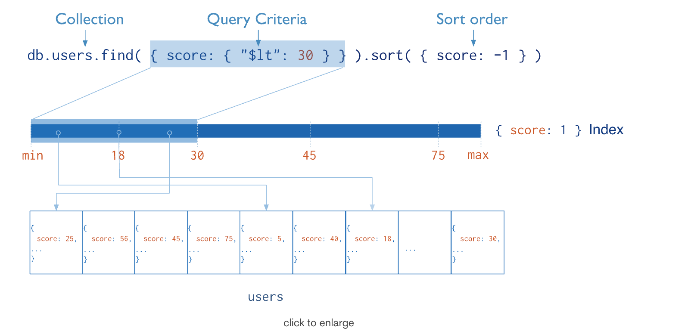

从根本上说，MongoDB中的索引与其他数据库系统中的索引类似。MongoDB在集合层面上定义了索引，并支持对MongoDB集合中的任何字段或文档的子字段进行索引。

### 操作

0、创建索引

```sql
> db.集合名称.createIndex(keys, options)
> db.集合名称.createIndex({"title":1,"description":-1})
```

`说明: 语法中 Key 值为你要创建的索引字段，1 为指定按升序创建索引，如果你想按降序来创建索引指定为 -1 即可。`

createIndex() 接收可选参数，可选参数列表如下：

| Parameter            | Type          | Description                                                  |
| :------------------- | :------------ | :----------------------------------------------------------- |
| `background`         | Boolean       | 建索引过程会阻塞其它数据库操作，background可指定以后台方式创建索引，即增加 "background" 可选参数。 "background" 默认值为**false**。 |
| `unique`             | Boolean       | 建立的索引是否唯一。指定为true创建唯一索引。默认值为**false**. |
| `name`               | string        | 索引的名称。如果未指定，MongoDB的通过连接索引的字段名和排序顺序生成一个索引名称。 |
| sparse               | Boolean       | 对文档中不存在的字段数据不启用索引；这个参数需要特别注意，如果设置为true的话，在索引字段中不会查询出不包含对应字段的文档.。默认值为 **false**. |
| `expireAfterSeconds` | integer       | 指定一个以秒为单位的数值，完成 TTL设定，设定集合的生存时间。 |
| `v`                  | index version | 索引的版本号。默认的索引版本取决于mongod创建索引时运行的版本。 |
| weights              | document      | 索引权重值，数值在 1 到 99,999 之间，表示该索引相对于其他索引字段的得分权重。 |
| default_language     | string        | 对于文本索引，该参数决定了停用词及词干和词器的规则的列表。 默认为英语 |
| language_override    | string        | 对于文本索引，该参数指定了包含在文档中的字段名，语言覆盖默认的language，默认值为 language. |

1、查看集合索引

```sql
> db.集合名称.getIndexes()
```

2、查看集合索引大小

```sql
> db.集合名称.totalIndexSize()
```

3、删除集合所有索引

```sql
> db.集合名称.dropIndexes()
```

4、删除集合指定索引

```sql
> db.集合名称.dropIndex("索引名称")
```

### 复合索引

​	说明: 一个索引的值是由多个 key 进行维护的索引的称之为复合索引

```sql
> db.集合名称.createIndex({"title":1,"description":-1})
```

​	`注意: mongoDB 中复合索引和传统关系型数据库一致都是左前缀原则`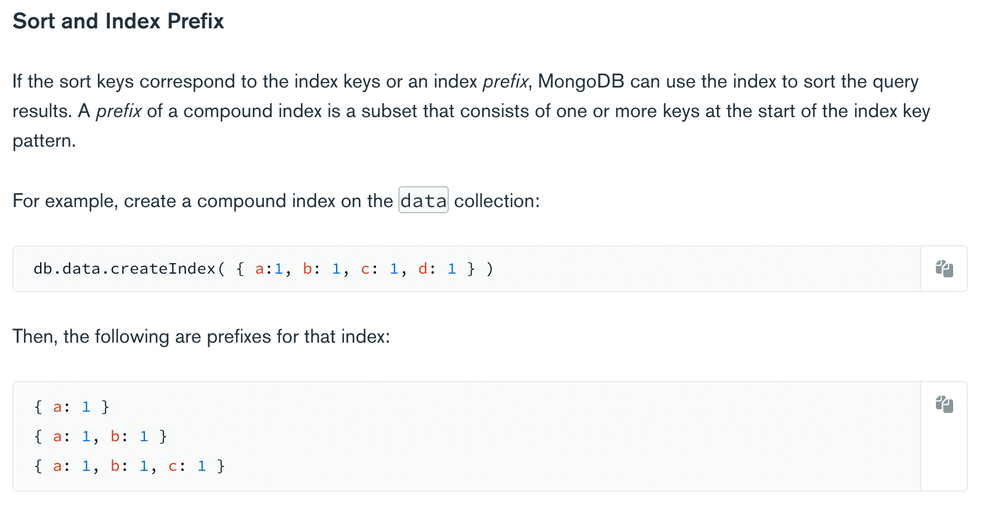

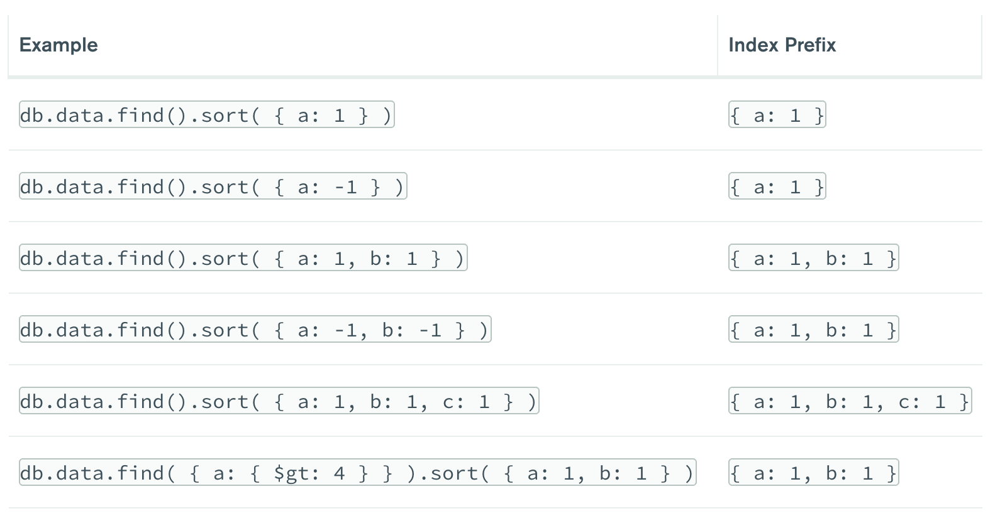

## 聚合<aggregate>

### 说明

MongoDB 中聚合(aggregate)主要用于处理数据(诸如统计平均值，求和等)，并返回计算后的数据结果。有点类似 **SQL** 语句中的 **count(*)**。

### 使用

```sql
{
   title: 'MongoDB Overview', 
   description: 'MongoDB is no sql database',
   by_user: 'runoob.com',
   url: 'http://www.runoob.com',
   tags: ['mongodb', 'database', 'NoSQL'],
   likes: 100
},
{
   title: 'NoSQL Overview', 
   description: 'No sql database is very fast',
   by_user: 'runoob.com',
   url: 'http://www.runoob.com',
   tags: ['mongodb', 'database', 'NoSQL'],
   likes: 10
},
{
   title: 'Neo4j Overview', 
   description: 'Neo4j is no sql database',
   by_user: 'Neo4j',
   url: 'http://www.neo4j.com',
   tags: ['neo4j', 'database', 'NoSQL'],
   likes: 750
}
```

现在我们通过以上集合计算每个作者所写的文章数，使用aggregate()计算结果如下：

```sql
> db.集合名称.aggregate([{$group : {_id : "$by_user", num_tutorial : {$sum : 1}}}])
```

### 常见聚合表达式

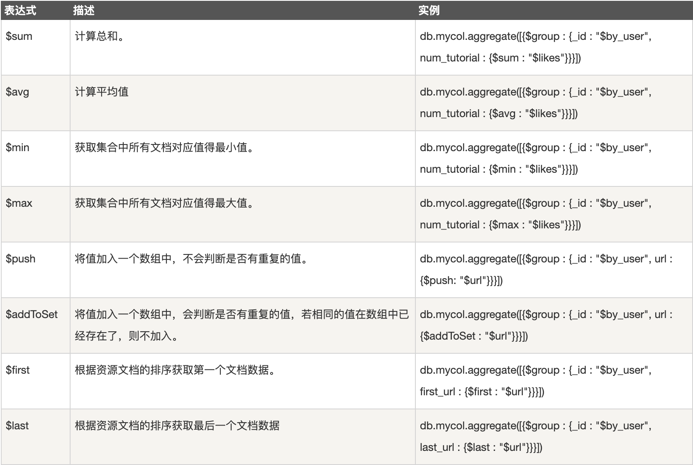

## 整合应用

**说明: 这里主要以 springboot 应用为基础应用进行整合开发。**

Spring Data : `Spring 数据框架 JPA 、Redis、Elasticsearch、AMQP、MongoDB`

`JdbcTemplate`

`RedisTemplate`

`ElasticTempalte`

`AmqpTemplate`

`MongoTemplate`

SpringBoot  Spring Data  MongoDB

### 环境搭建

```markdown
# 引入依赖
```

```xml
<dependency>
  <groupId>org.springframework.boot</groupId>
  <artifactId>spring-boot-starter-data-mongodb</artifactId>
</dependency>
```

```markdown
# 编写配置
```

```properties
# mongodb 没有开启任何安全协议
# mongodb(协议)://121.5.167.13(主机):27017(端口)/baizhi(库名)
spring.data.mongodb.uri=mongodb://121.5.167.13:27017/baizhi


# mongodb 存在密码
#spring.data.mongodb.host=tx.chenyn.cn
#spring.data.mongodb.port=27017
#spring.data.mongodb.database=baizhi
#spring.data.mongodb.username=root
#spring.data.mongodb.password=root
```

### 集合操作

- 创建集合

  ```java
  @Test
  public void testCreateCollection(){
    mongoTemplate.createCollection("users");//参数: 创建集合名称
  }
  ```

  `注意:创建集合不能存在,存在报错`

- 删除集合

  ```java
  @Test
  public void testDeleteCollection(){
    mongoTemplate.dropCollection("users");
  }
  ```

### 相关注解

- `@Document`
  - 修饰范围: 	用在类上
  - 作用:    用来映射这个类的一个对象为 mongo 中一条文档数据
  - 属性：(`value 、collection` )用来指定操作的集合名称
- `@Id`
  - 修饰范围:  用在成员变量、方法上
  - 作用：       用来将成员变量的值映射为文档的_id 的值
- `@Field`
  - 修饰范围:  用在成员变量、方法上
  - 作用:          用来将成员变量以及值映射为文档中一个key、value对
  - 属性:         ( `name,value `)用来指定在文档中 key 的名称,默认为成员变量名
- `@Transient`
  - 修饰范围: 用在成员变量、方法上
  - 作用        : 用来指定改成员变量，不参与文档的序列化

### 文档操作

- 查询

  - Criteria

  - 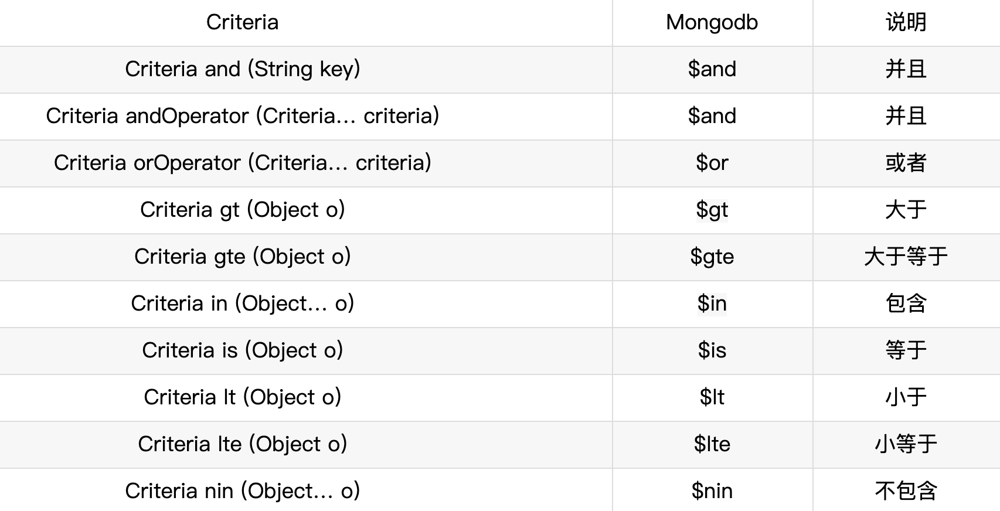

  - 常见查询

    ```java
    @Test
    public void testQuery(){
      //基于 id 查询
      template.findById("1",User.class);
    
      //查询所有
      template.findAll(User.class);
      template.find(new Query(),User.class);
    
      //等值查询
      template.find(Query.query(Criteria.where("name").is("编程不良人")), 
                   User.class);
    
      // > gt  < lt  >= gte  <= lte
      template.find(Query.query(Criteria.where("age").lt(25)),
                    User.class);
      template.find(Query.query(Criteria.where("age").gt(25)),
                    User.class);
      template.find(Query.query(Criteria.where("age").lte(25)),
                    User.class);
      template.find(Query.query(Criteria.where("age").gte(25)),
                    User.class);
    
      //and
      template.find(Query.query(Criteria.where("name").is("编程不良人")
                                .and("age").is(23)),User.class);
    
      //or
      Criteria criteria = new Criteria()
        .orOperator(Criteria.where("name").is("编程不良人_1"),
         Criteria.where("name").is("编程不良人_2"));
      template.find(Query.query(criteria), User.class);
    
      //and or
      Criteria criteria1 = new Criteria()
        .and("age").is(23)
        .orOperator(
        Criteria.where("name").is("编程不良人_1"),
        Criteria.where("name").is("编程不良人_2"));
      template.find(Query.query(criteria1), User.class);
    
      //sort 排序
      Query query = new Query();
      query.with(Sort.by(Sort.Order.desc("age")));//desc 降序  asc 升序
      template.find(query, User.class);
    
    
      //skip limit 分页
      Query queryPage = new Query();
      queryPage.with(Sort.by(Sort.Order.desc("age")))//desc 降序  asc 升序
        .skip(0) //起始条数
        .limit(4); //每页显示记录数
      template.find(queryPage, User.class);
    
    
      //count 总条数
      template.count(new Query(), User.class);
    
      //distinct 去重
      //参数 1:查询条件 参数 2: 去重字段  参数 3: 操作集合  参数 4: 返回类型
      template.findDistinct(new Query(), "name", 
                            User.class, String.class);
      
      //使用 json 字符串方式查询 
            Query query = new BasicQuery(
              "{$or:[{name:'编程不良人'},{name:'徐凤年'}]}", 
              "{name:0}");
    
      template.find(query, User.class);
    }
    ```

- 添加

  ```java
  @Test
  public void testSaveOrUpdate(){
    User user = new User();
    user.setId("1");
    user.setAge(23);
    user.setName("编程不良人_1");
    user.setBir(new Date());
    User userDB = mongoTemplate.insert(user);//返回保存的对象 insert or save
    System.out.println(userDB);
  }
  ```

  - **insert:** 插入重复数据时：`insert`报`DuplicateKeyException`提示主键重复；`save`对已存在的数据进行更新。
  - **save:** 批处理操作时：`insert`可以一次性插入整个数据，效率较高；`save`需遍历整个数据，一次插入或更新，效率较低。

- 更新

  ```java
  @Test
  public void  testUpdate(){
    //1.更新条件
    Query query = Query.query(Criteria.where("age").is(23));
    //2.更新内容
    Update update = new Update();
    update.set("name","编程小陈陈");
  
    //单条更新
    mongoTemplate.updateFirst(query, update, User.class);
    //多条更新
    mongoTemplate.updateMulti(query, update, User.class);
    //更新插入
    mongoTemplate.upsert(query,update,User.class);
  
    //返回值均为 updateResult
    //System.out.println("匹配条数:" + updateResult.getMatchedCount());
    //System.out.println("修改条数:" + updateResult.getModifiedCount());
    //System.out.println("插入id_:" + updateResult.getUpsertedId());
  }
  ```

- 删除

  ```java
  @Test
  public void testDelete(){
    //删除所有
    mongoTemplate.remove(new Query(),User.class);
    //条件删除
    mongoTemplate.remove(
      Query.query(Criteria.where("name").is("编程不良人")),
      User.class
    );
  }
  ```

## 副本集<Replica Set>

### 说明

https://docs.mongodb.com/manual/replication/

MongoDB 副本集（Replica Set）是有自动故障恢复功能的主从集群，有一个Primary节点和一个或多个Secondary节点组成。副本集没有固定的`主节点`,当`主节点`发生故障时整个集群会`选举一个主节点`为系统提供服务以保证系统的高可用。


### Automatic Failover

​	自动故障转移机制: 当主节点未与集合的其他成员通信超过配置的选举超时时间（默认为 10 秒）时，合格的辅助节点将调用选举以将自己提名为新的主节点。集群尝试完成新主节点的选举并恢复正常操作。


### 搭建副本集

- 创建数据目录

  ```markdown
  # 在安装目录中创建
  - mkdir -p ../repl/data1
  - mkdir -p ../repl/data2
  - mkdir -p ../repl/data3
  ```

- 搭建副本集

  ```shell
  $ mongod --port 27017  --dbpath ../repl/data1 --bind_ip 0.0.0.0 --replSet  myreplace/[121.5.167.13:27018,121.5.167.13:27019]
  
  $ mongod --port 27018  --dbpath ../repl/data2 --bind_ip 0.0.0.0 --replSet  myreplace/[121.5.167.13:27019,121.5.167.13:27017]
  
  $ mongod --port 27019  --dbpath ../repl/data3 --bind_ip 0.0.0.0 --replSet  myreplace/[121.5.167.13:27017,121.5.167.13:27018]
  ```

​		`注意: --replSet 副本集  myreplace 副本集名称/集群中其他节点的主机和端口`

-  配置副本集，连接任意节点

  - use admin

  - 初始化副本集

    ```json
    > var config = { 
    		_id:"myreplace", 
    		members:[
    		{_id:0,host:"121.5.167.13:27017"},
    		{_id:1,host:"121.5.167.13:27018"},
    		{_id:2,host:"121.5.167.13:27019"}]
    }
    > rs.initiate(config);//初始化配置 
    ```

  - 设置客户端临时可以访问

    ```sql
    > rs.slaveOk();
    > rs.secondaryOk();
    ```

## 分片集群<Sharding Cluster>

### 说明

​	https://docs.mongodb.com/manual/sharding/

​	`分片(sharding)`是指`将数据拆分,将其分散存在不同机器的过程`，有时也用`分区(partitioning)`来表示这个概念,将数据分散在不同的机器上，不需要功能强大的大型计算机就能存储更多的数据，处理更大的负载。

​	分片目的是通过分片能够增加更多机器来应对不断的增加负载和数据，还不影响应用运行。

​	MongoDB支持`自动分片`,可以摆脱手动分片的管理困扰，集群自动切分数据做负载均衡。MongoDB分片的基本思想就是将集合拆分成多个块，这些快分散在若干个片里，每个片只负责总数据的一部分，应用程序不必知道哪些片对应哪些数据，甚至不需要知道数据拆分了，所以在分片之前会运行一个路由进程，mongos进程，这个路由器知道所有的数据存放位置，应用只需要直接与mongos交互即可。mongos自动将请求转到相应的片上获取数据，从应用角度看分不分片没有什么区别。

### 架构

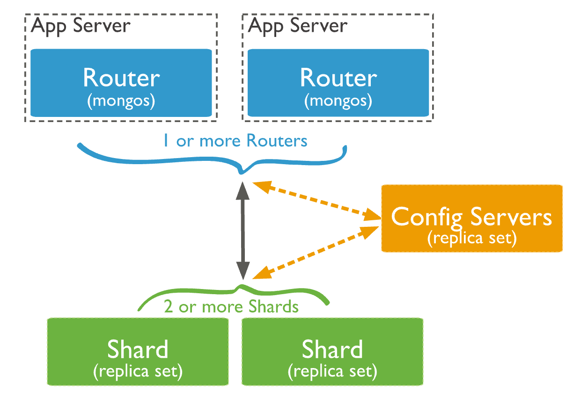

- **Shard:**	用于存储实际的数据块，实际生产环境中一个shard server角色可由几台机器组个一个replica set承担，防止主机单点故障

- **Config Server**:mongod实例，存储了整个 ClusterMetadata。

- **Query Routers**: 前端路由，客户端由此接入，且让整个集群看上去像单一数据库，前端应用可以透明使用。
- **Shard Key**: 片键，设置分片时需要在集合中选一个键,用该键的值作为拆分数据的依据,这个片键称之为(shard key)，片键的选取很重要,片键的选取决定了数据散列是否均匀。

### 搭建

```markdown
# 1.集群规划
- Shard Server 1：27017
- Shard Repl   1：27018

- Shard Server 2：27019
- Shard Repl   2：27020

- Shard Server 3：27021
- Shard Repl   3：27022

- Config Server ：27023
- Config Server ：27024
- Config Server ：27025

- Route Process ：27026

# 2.进入安装的 bin 目录创建数据目录
- mkdir -p ../cluster/shard/s0
- mkdir -p ../cluster/shard/s0-repl

- mkdir -p ../cluster/shard/s1
- mkdir -p ../cluster/shard/s1-repl

- mkdir -p ../cluster/shard/s2
- mkdir -p ../cluster/shard/s2-repl

- mkdir -p ../cluster/shard/config1
- mkdir -p ../cluster/shard/config2
- mkdir -p ../cluster/shard/config3

# 3.启动4个 shard服务

# 启动 s0、r0
> ./mongod --port 27017 --dbpath ../cluster/shard/s0 --bind_ip 0.0.0.0 --shardsvr --replSet r0/121.5.167.13:27018
> ./mongod --port 27018 --dbpath ../cluster/shard/s0-repl --bind_ip 0.0.0.0 --shardsvr --replSet r0/121.5.167.13:27017
-- 1.登录任意节点
-- 2. use admin
-- 3. 执行
		config = { _id:"r0", members:[
      {_id:0,host:"121.5.167.13:27017"},
      {_id:1,host:"121.5.167.13:27018"},
    	]
    }
		rs.initiate(config);//初始化

# 启动 s1、r1
> ./mongod --port 27019 --dbpath ../cluster/shard/s1 --bind_ip 0.0.0.0 --shardsvr  --replSet r1/121.5.167.13:27020
> ./mongod --port 27020 --dbpath ../cluster/shard/s1-repl --bind_ip 0.0.0.0 --shardsvr --replSet r1/121.5.167.13:27019
-- 1.登录任意节点
-- 2. use admin
-- 3. 执行
		config = { _id:"r1", members:[
      {_id:0,host:"121.5.167.13:27019"},
      {_id:1,host:"121.5.167.13:27020"},
    	]
    }
		rs.initiate(config);//初始化

# 启动 s2、r2
> ./mongod --port 27021 --dbpath ../cluster/shard/s2 --bind_ip 0.0.0.0 --shardsvr --replSet r2/121.5.167.13:27022
> ./mongod --port 27022 --dbpath ../cluster/shard/s2-repl --bind_ip 0.0.0.0 --shardsvr --replSet r2/121.5.167.13:27021
-- 1.登录任意节点
-- 2. use admin
-- 3. 执行
		config = { _id:"r2", members:[
      {_id:0,host:"121.5.167.13:27021"},
      {_id:1,host:"121.5.167.13:27022"},
    	]
    }
		rs.initiate(config);//初始化

# 4.启动3个config服务

> ./mongod --port 27023 --dbpath ../cluster/shard/config1 --bind_ip 0.0.0.0 --replSet  config/[121.5.167.13:27024,121.5.167.13:27025] --configsvr

> ./mongod --port 27024 --dbpath ../cluster/shard/config2 --bind_ip 0.0.0.0 --replSet  config/[121.5.167.13:27023,121.5.167.13:27025] --configsvr

> ./mongod --port 27025 --dbpath ../cluster/shard/config3 --bind_ip 0.0.0.0 --replSet  config/[121.5.167.13:27023,121.5.167.13:27024] --configsvr

# 5.初始化 config server 副本集
- `登录任意节点 congfig server`
> 1.use admin 
> 2.在admin中执行
  config = { 
      _id:"config", 
      configsvr: true,
      members:[
          {_id:0,host:"121.5.167.13:27023"},
          {_id:1,host:"121.5.167.13:27024"},
          {_id:2,host:"121.5.167.13:27025"}
        ]
  }
> 3.rs.initiate(config); //初始化副本集配置 

# 6.启动 mongos 路由服务

> ./mongos --port 27026 --configdb config/121.5.167.13:27023,121.5.167.13:27024,121.5.167.13:27025 --bind_ip 0.0.0.0 

# 7.登录 mongos 服务
> 1.登录 mongo --port 27026
> 2.use admin
> 3.添加分片信息
	db.runCommand({ addshard:"r0/121.5.167.13:27017,121.5.167.13:27018",
	"allowLocal":true });
	db.runCommand({ addshard:"r1/121.5.167.13:27019,121.5.167.13:27020",
	"allowLocal":true });
	db.runCommand({ addshard:"r2/121.5.167.13:27021,121.5.167.13:27022",
	"allowLocal":true });
> 4.指定分片的数据库
	db.runCommand({ enablesharding:"baizhi" });

> 5.设置库的片键信息
	db.runCommand({ shardcollection: "baizhi.users", key: { _id:1}});
	db.runCommand({ shardcollection: "baizhi.emps", key: { _id: "hashed"}})
```

