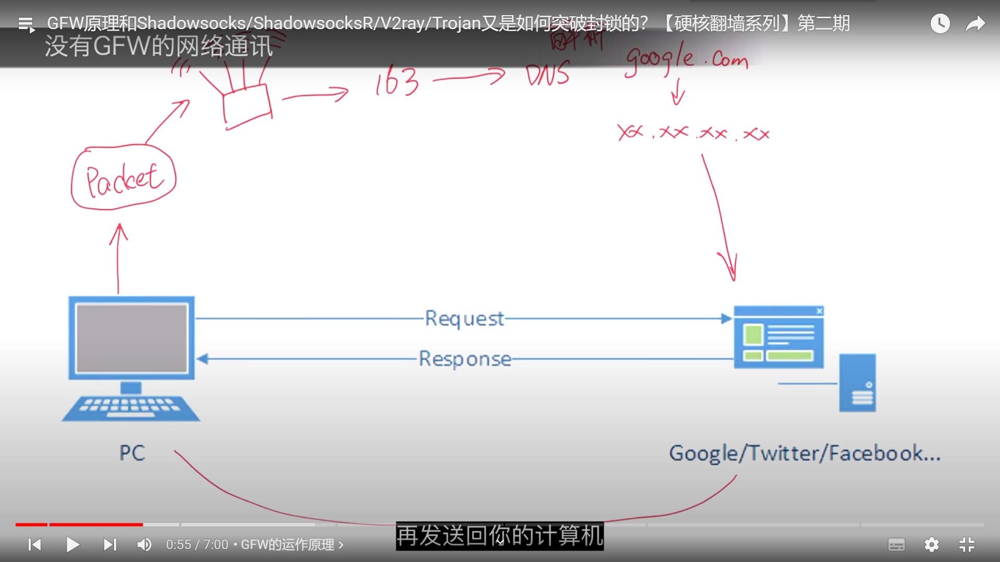
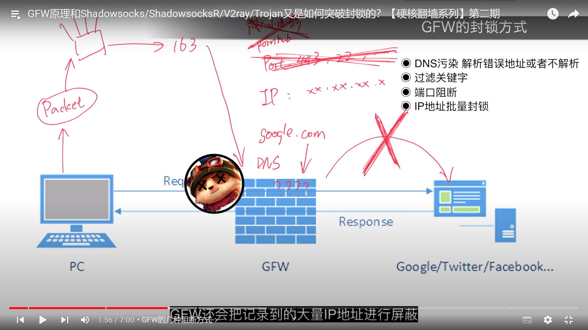
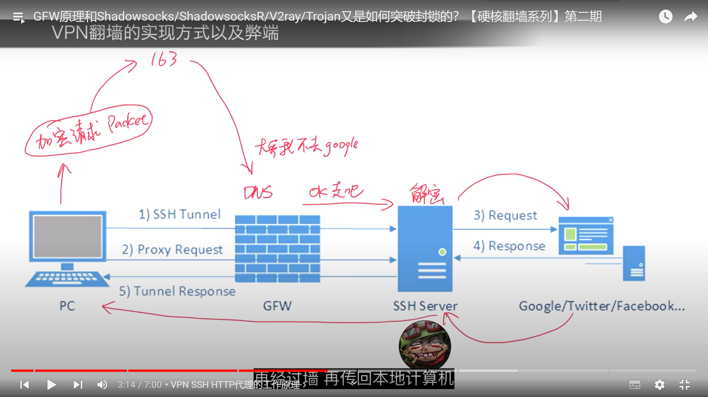
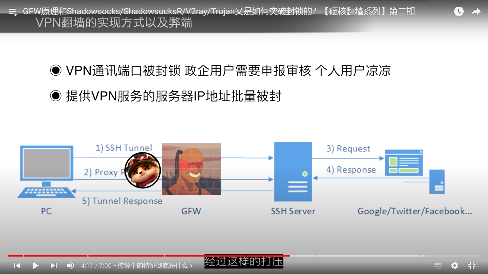
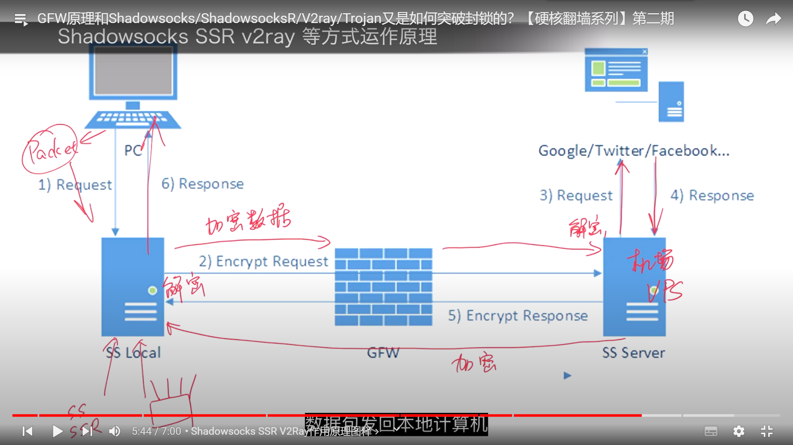

# vps知识

知识来源： https://www.youtube.com/@AkilaZhang

## 防火墙/GFW是什么？为什么会有墙？墙的真正用意是什么？你为什么要搞清楚翻墙的原理？【硬核翻墙系列】第一期

GFW： 防火长城，Great Fire Wall 

## GFW原理和Shadowsocks/ShadowsocksR/V2ray/Trojan又是如何突破封锁的？【硬核翻墙系列】第二期

#### GFW的工作原理：

没有GFW的网络通讯

数据包 -> 路由器 -> 骨干广域网 -> DNS域名解析 -> 真实IP -> 访问到主机 -> 进行响应

GFW的工作方式

1. 污染DNS，解析错误的ip地址，导致无法正常访问
2. http 访问明文传输，进行内容解析，关键字阻拦
3. 监控ip并记录，进行批量封锁
4. 将特定Ip端口直接阻断，无法访问

#### 初代vpn的工作原理：

vpn: virtual private Network: 虚拟私有网络： 流量加密

经过上面的分析，推断，如果访问的是符合GFW的地址，不让GFW探明真实意图即可。使用ssh加密即可做到

将请求进行加密处理，绕过DNS，访问到符合GFW的地址，经过中转服务器解析数据，访问真实地址，然后再返回，即可绕开GFW

该访问方式完美避开了GFW的监控，但是特征明显，优先与服务器建立SSH请求，然后发送代理请求，

GFW应对手段

#### Shadowsocks出现

**革命性变革：后续的SSR, v2ray 都是这个原理**

##### Shadowsocks 工作原理

将代理服务器切分为本地与远程两个系统，

1. 将数据包在本地服务器（指的是Shadowsocks软件或者内置Shadowsocks的硬件路由器）进行加密，
2. 访问骨干网，因本地已加密，GFW无法探测内容，且访问为合理的外网地址，即放行，
3. 之后再远程服务器（VPS或者机场）进行解密，然后代理请求，再加密响应给本机服务器，
4. 完成数据通信

## 翻墙软件 路由器 软路由硬件翻墙 和网关模式翻墙等多种翻墙方式的利弊和特点 你更适合哪一种？【硬核翻墙系列】第三期

### 翻墙分类

- 软件翻墙
- 硬件翻墙
- 网关翻墙

#### 软件翻墙

1. vpn: vpn的流量数据特征太过明显，非常不安全，完全不推荐。

2. Shadowsocks,ShadowsocksR, Shadowrocket, v2ray,Clash, Surge,  SSR, Trojan, WebSocket + TLS, Vmess

   软件翻墙的缺点：软件属于应用层，底层权限一般没有，打开全局代理的意思就是将软件本身能够接管的流量进行代理转发，而有些软件跑在系统层，权限更高，流量不经过应用层，则无法代理。例如UWP应用（如：windows应用程序商店下载的软件），若有些软件可以在本地模拟虚拟网卡，强行接管所有流量，则可以避免该缺陷。

#### 硬件翻墙、路由器翻墙

​	路由器是本地网络接入互联网的最后一个环节，并且独立于设备。

​	路由器翻墙指的就是将翻墙软件下载至路由器中，完全接管所有流量，实现透明翻墙

​	路由器翻墙缺点：一般的路由器的CPU较差，执行加密解密算法会比较吃力，会因为CPU高负荷运作而使得带宽跑不满，性能瓶颈。软路由可以做到，软路由就是改造过的路由器，有更强的CPU，但是较为复杂，建议专业人士操作。

#### 网关模式翻墙（最优）

​	意思就是通过一台计算机上跑的软件来实现路由器的功能。实现网关接管流量

​	代表软件： Windows -> Clash , Mac -> Surge

​	使用方式：将一台设备进行软件安装，全局代理，然后将其他需要翻墙的设备进行对应的网络设置，填写对应的路由和DNS就能实现全部的透明代理。

## 各种线路详解 CN2/BGP/IPLC/GCP/AWS/Azure【硬核翻墙系列】第四期

现在使用的骨干网是163骨干网

### CN2:  China telecom Next Carrier Network （CNCN）

​	中国电信下一代承载网络： 更加高速通畅，也搭载了QoS技术， 主要面对政企大客户来保证高质量的国际访问

​	QoS： Quality of Server 服务质量，

​	QoS能够识别网络中流量的需求，需要延迟低的服务优先通行（比如对带宽没有特别大需求，但是需要低延迟的游戏通讯数据，以及需要大宽带，但是对延迟没有特别需求的流媒体数据），拥有QoS的网络能够动态的根据服务内容进行调节。

​	缺点： 价格昂贵，

包括两种类型：

- CN2GT(Global Transit) 更便宜
- CN2GIA(Global Internet Access)， 最贵最好的

### BGP: Border Gateway Protocol

​	边界网关协议

BGP机房也叫多线机房

BGP机房可以自动识别线路是电信，移动还是联通，并且自动使用最适合连接服务器的线路，网络不通畅时会自动切换其他线路，

以下三家不建议使用，非国内业务，各有各的问题。

### GCP: Google Cloud Platform 谷歌

### AWS: Amazon web service 亚马逊

### Azure: 微软

### PCCW，HKT，HKBN: 香港电信盈科（优先选择，一般没问题，不过还是要实测一下）

### IPLC：International Private Leased Circuit

国际私有租用网络，专线

价格最贵，

IPLC不过墙，用于游戏加速是最好的。

### IEPL： International Ethernet Private Line 

内网专线

## 机场还是VPS？选择哪一种更适合你？【硬核翻墙系列】第五期

大机场推荐： 

- Linode
- Vultr
- Bandwagon

有个毒药的网站，进行机场的分析和汇总

https://www.duyaoss.com/

## 协议之战 原版SS SSR V2Ray的WS+TLS还是trojan？【硬核翻墙系列】第六期

### Shadowsocks: 

最简单直接，最原始的代理加密，挺好

### ShadowsocksR: 

作者不是同一人，都类似

### V2Ray: 

支持协议与加密算法多，安全性更高，部署的难度更大，cpu占比更高

​	vmess + websocket + tls 比较主流的加密通信方式

### Torjan: 

v2ray的简化版，部署难度低，只有一种通信协议： websocket + tls,

速度更快一些 

## VPN才是主流？比Shadowsocks和v2ray好在哪里？【硬核翻墙系列】第七期

通信协议：

## 翻墙是不是犯罪？会不会被抓？中国大陆境内翻墙安全的话题，一个视频给你彻底讲清楚！【硬核翻墙系列】第八期

​	

