<font face="Consolas">

[toc]


**目录**

 

[一、简介](#t1 "一、简介")

[1、前端开发最核心技术](#t2 "1、前端开发最核心技术")

[（1）HTML是什么？](#t3 "（1）HTML是什么？")

[（2）CSS](#t4 "（2）CSS")

[（3）JavaScript](#t5 "（3）JavaScript")

[2、前端开发其他技术](#t6 "2、前端开发其他技术")

 

[二、基础内容](#t7 "二、基础内容")

[1.基础总结](#t8 "1.基础总结")

[2.HTML的基本标签](#t9 "2.HTML的基本标签")

[(1)HTML标签](#t10 "(1)HTML标签")

[(2)head标签](#t11 "(2)head标签")

[(3)body标签](#t12 "(3)body标签")

[3、段落与文字](#t13 "3、段落与文字")

[(一)、段落标签](#t14 "(一)、段落标签")

[(二)、网页特殊符号](#t15 "(二)、网页特殊符号")

[(三)、自闭合标签](#t16 "(三)、自闭合标签")

[(四)、块元素和行内元素](#t17 "(四)、块元素和行内元素")

[(五)、练习题](#t18 "(五)、练习题")

[4、列表](#t19 "4、列表")

[(一)、HTML3种列表](#t20 "(一)、HTML3种列表")

[(二)、HTML学习中的误区](#t21 "(二)、HTML学习中的误区")

[(三)、练习题](#t22 "(三)、练习题")

[5、表格](#t23 "5、表格")

[(一)、表格语义记忆](#t24 "(一)、表格语义记忆")

[(二)、表格基本结构](#t25 "(二)、表格基本结构")

[(三)、表格完整结构](#t26 "(三)、表格完整结构")

[(四)、合并行和合并列](#t27 "(四)、合并行和合并列")

[6、图像](#t28 "6、图像")

[(一)、图像标签](#t29 "(一)、图像标签")

[(二)、相对路径和绝对路径](#t30 "(二)、相对路径和绝对路径")

[(三)、图片格式](#t31 "(三)、图片格式")

[7、链接](#t32 "7、链接")

[8、表单](#t33 "8、表单")

[(一)、input标签表单](#t34 "(一)、input标签表单")

[(二)、textarea标签表单](#t35 "(二)、textarea标签表单")

[(三)、select和option](#t36 "(三)、select和option")

[(四)、训练题](#t37 "(四)、训练题")

[9、多媒体](#t38 "9、多媒体")

[(一)、插入音频、视频和flash](#t39 "(一)、插入音频、视频和flash")

[(二)、插入背景音乐](#t40 "(二)、插入背景音乐")

[10、浮动框架iframe](#t41 "10、浮动框架iframe")

[(一)、浮动框架iframe简介](#t42 "(一)、浮动框架iframe简介")

[(二)、设置浮动框架是否显示滚动条scrolling](#t43 "(二)、设置浮动框架是否显示滚动条scrolling")

[三、进阶内容](#t44 "三、进阶内容")

[1、HTML、XHTML和HTML5](#t45 "1、HTML、XHTML和HTML5")

[（一）HTML 和 XHTML](#t46 "（一）HTML 和 XHTML")

[（二）HTML5](#t47 "（二）HTML5")

[2、div和span](#t48 "2、div和span")

[3、id和class](#t49 "3、id和class")

[（一）id 属性](#t50 "（一）id 属性")

[（二）class属性](#t51 "（二）class属性")

[4、浏览器标题栏小图标](#t52 "4、浏览器标题栏小图标")

[5、语义化](#t53 "5、语义化")

[（一）简介](#t54 "（一）简介")

[（二）标题语义化](#t55 "（二）标题语义化")

[（三）图片语义化](#t56 "（三）图片语义化")

[（四）表格语义化](#t57 "（四）表格语义化")

[（五）表单语义化](#t58 "（五）表单语义化")

[（六）其他语义化](#t59 "（六）其他语义化")

[（七）语义化验证](#t60 "（七）语义化验证")

[6、HTML5舍弃的标签](#t61 "6、HTML5舍弃的标签")

[四、HTML5](#t62 "四、HTML5")

[一、什么是 HTML5](#t63 "一、什么是 HTML5")

[1.HTML5 的概念与定义](#t64 "1.HTML5 的概念与定义")

[2.HTML5 拓展了哪些内容](#t65 "2.HTML5 拓展了哪些内容")

[3.HTML5 的现状](#t66 "3.HTML5 的现状")

[二、HTML5 新增标签](#t67 "二、HTML5 新增标签")

[1.什么是语义化](#t68 "1.什么是语义化")

[2.新增了那些语义化标签](#t69 "2.新增了那些语义化标签")

[3.使用语义化标签的注意](#t70 "3.使用语义化标签的注意")

[三、多媒体音频标签](#t71 "三、多媒体音频标签")

[1.多媒体标签有两个，分别是](#t72 "1.多媒体标签有两个，分别是")

[2.audio 标签说明](#t73 "2.audio 标签说明")

[3.audio 支持的音频格式](#t74 "3.audio 支持的音频格式")

[4.audio 的参数](#t75 "4.audio 的参数")

[5、audio 代码演示](#t76 "5、audio 代码演示")

[四、多媒体视频标签](#t77 "四、多媒体视频标签")

[1.video 视频标签](#t78 "1.video 视频标签")

[2.语法格式](#t79 "2.语法格式")

[3.video 参数](#t80 "3.video 参数")

[4.video 代码演示](#t81 "4.video 代码演示")

[5.多媒体标签总结](#t82 "5.多媒体标签总结")

[五、新增 input 标签](#t83 "五、新增 input 标签")

[六、新增表单属性](#t84 "六、新增表单属性")

---

### 预备知识与后续知识及项目案例

[[HTML入门与进阶以及HTML5]](https://blog.csdn.net/wuyxinu/article/details/103515157 "[HTML入门与进阶以及HTML5]")
[[CSS]](https://blog.csdn.net/wuyxinu/article/details/103583618 "[CSS]")
[[JS-上]](https://blog.csdn.net/wuyxinu/article/details/103642800 "[JS-上]")
[[JS-下]](https://blog.csdn.net/wuyxinu/article/details/103646041 "[JS-下]")
[[jQuery]](https://blog.csdn.net/wuyxinu/article/details/103669718 "[jQuery]")
[[Node.js + Gulp 知识点汇总]](https://blog.csdn.net/wuyxinu/article/details/103774211 "[Node.js + Gulp 知识点汇总]")
[[MongoDB + Express 入门及案例代码]](https://blog.csdn.net/wuyxinu/article/details/103836507 "[MongoDB + Express 入门及案例代码]")
[[Vue项目开发-仿蘑菇街电商APP]](https://blog.csdn.net/wuyxinu/article/details/103684950 "[Vue项目开发-仿蘑菇街电商APP]")

# 一、简介

## 1、前端开发最核心技术

我们知道，用所谓的网页三剑客已经不能满足需求了，那前端开发究竟要学习什么技术呢？网页最主要由3部分组成：结构、表现和行为。网页现在新的标准是W3C，目前模式是HTML、CSS和JavaScript。

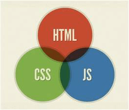

前端开发最核心的3个技术

### （1）HTML是什么？

HTML，全称“Hyper Text Markup Language（超文本标记语言）”，简单来说，网页就是用HTML语言制作的。HTML是一门描述性语言，是一门非常容易入门的语言。

### （2）CSS

CSS，全称“（层叠样式表）”。以后我们在别的地方看到“层叠样式表”、“CSS样式”，指的就是CSS。

### （3）JavaScript

JavaScript是一门脚本语言。

## 2、前端开发其他技术

前端技术最核心的是HTML、CSS和JavaScript，但是对于一个真正的前端工程师来说，哪怕你精通这三个，你也不能称为一个真正的“前端工程师”。因为前端技术除了HTML、CSS和JavaScript这三种，还需要学习Ajax、SEO等。

（1）Ajax

Ajax，即“Asynchronous Javascript And XML（异步JavaScript和XML）”，是指一种创建交互式网页应用的网页开发技术。

通过在后台与服务器进行少量数据交换，Ajax可以使网页实现异步更新。这意味着可以在不重新加载整个网页的情况下，对网页的某部分进行更新。传统的网页（不使用Ajax）如果需要更新内容，必须重载整个页面。

Ajax是前后端交互的技术，主要实现在前端。（不懂？！没关系，我们在Ajax教程中会讲解到）

（2）SEO

SEO，即“Search Engine Optimization（搜索引擎优化）”。SEO优化是专门利用搜索引擎的搜索规则来提高目前网站在有关搜索引擎内的自然排名的方式（国内常见的搜索引擎有百度、360、搜狗等）。

简单来说，你建好了网站并不代表你网站就能被搜索引擎搜索到，我们一般使用百度搜索资料时，搜索出来的网页有很多，但是我们一般看了搜索结果的第一、二页就不再往下看了。SEO，就是为了我们的网站能排在搜索结果的前面，这样你的网站才会有流量。你做网站，相信你也是想让你网站有更多人浏览的吧。

##  

# 二、基础内容

## 1.基础总结

1、从web1.0到web2.0，网页制作已经变为前端开发了。现在对于前端开发，你要学的不是什么“网页三剑客”，而是“HTML+CSS+JavaScript”；

2、前端技术核心元素的是HTML、CSS和JavaScript，但是我们还要学习一些Ajax、SEO知识；

3、前端技术只能开发静态网页，而进一步学习了后端技术，你能开发一个用户交互性更好、功能更加强大的网站；

4、后端技术有ASP.NET（或PHP）、SQL Server等；

5、学习路线：HTML入门→CSS入门→HTML进阶→CSS进阶→JavaScript入门→jQuery入门→ASP.NET入门（或PHP入门）→Ajax→ASP.NET进阶（或PHP进阶）；

6、学习HTML就是学习各种标签，然后针对你想要的内容来使用相应的标签；

7、HTML标签即“HTML元素”；

8、HTML基本结构：

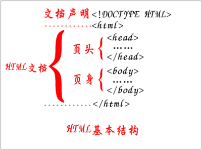

## 2.HTML的基本标签

### (1)HTML标签

整个网页是从<html>这里开始的，然后到</html>结束。

### (2)head标签

[head标签](http://www.lvyestudy.com/les_hj/hj_3.2.aspx "head标签")代表页面的“头”，定义一些特殊内容，这些内容往往都是“不可见内容”（在浏览器不可见）。

| <head>内部标签 | 说明                                   |
| -------------- | -------------------------------------- |
| <title>        | 定义网页的标题                         |
| <meta>         | 定义网页的基本信息（供搜索引擎）       |
| <style>        | 定义CSS样式                            |
| <link>         | 链接外部CSS文件或脚本文件              |
| <script>       | 定义脚本语言                           |
| <base>         | 定义页面所有链接的基础定位（用得很少） |

<head>的内部标签也非常重要，在前期大家只需要感性认知就可以。

### (3)body标签

[body标签](http://www.lvyestudy.com/les_hj/hj_3.3.aspx "body标签")代表页面的“身”，定义网页展示内容，这些内容往往都是“可见内容”（在浏览器可见）。

后续课程讲解的标签都是在<body>标签内部的各种标签。

## 3、段落与文字

### (一)、段落标签

**(1)、段落与文字标签**

| 标签      | 语义            | 说明             |
| --------- | --------------- | ---------------- |
| <h1>~<h6> | header          | 标题             |
| <p>       | paragraph       | 段落             |
| <br>      | break           | 换行             |
| <hr>      | horizontal rule | 水平线           |
| <div>     | division        | 分割（块元素）   |
| <span>    | span            | 区域（行内元素） |

**(2)、文本格式化标签**

| 标签     | 语义                  | 说明 |
| -------- | --------------------- | ---- |
| <strong> | strong（加强）        | 加粗 |
| <em>     | emphasized（强调）    | 斜体 |
| <cite>   | cite（引用）          | 斜体 |
| <sup>    | superscripted（上标） | 上标 |
| <sub>    | subscripted（下标）   | 下标 |

### **(二)、网页特殊符号**

[网页特殊符号](http://www.lvyestudy.com/les_hj/hj_4.7.aspx "网页特殊符号")只需要记忆一个就行了，就是HTML空格“&nbsp;”，其他的特殊符号我们不需要记忆，当我们需要的时候再回来查找一下特殊符号表就OK了。

### (三)、自闭合标签

HTML标签分为2种，一种是“一般标签”，另外一种是“自闭合标签”。一般标签有开始符号和结束符号，自闭合标签只有开始符号没有结束符号。

一般标签可以在开始符号和结束符号之间插入其他标签或文字。

自闭合标签由于没有结束符号，不能插入其他标签或文字，只能定义自身的属性。

**(1)、一般标签**

举例：<body></body>

**(2)、自闭合标签**

举例：<br/>、<hr/>

### (四)、块元素和行内元素

(1)、HTML元素根据浏览器表现形式分为两类：①块元素；②行内元素；

(2)、块元素特点：

- （1）独占一行，排斥其他元素跟其位于同一行，包括块元素和行内元素；

- （2）块元素内部可以容纳其他块元素或行元素；

常见块元素有：h1~h6、p、hr、div等。

(3)、行内元素特点：

- （1）可以与其他行内元素位于同一行；

- （2）行内内部可以容纳其他行内元素，但不可以容纳块元素，不然会出现无法预知的效果；

常见行内元素有：strong、em、span等。

### (五)、练习题

(1)、下面是一个网页在浏览器上的效果，请制作一张一模一样的网页。

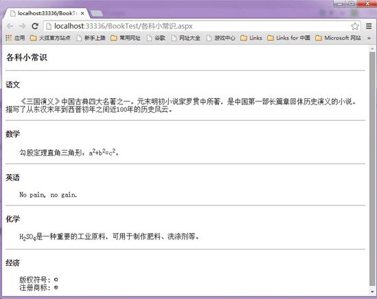

HTML段落与文字训练题

```java
1
```


(6)标签的语意

| 标签名   | 英文全称               | 中文解释             |
| -------- | ---------------------- | -------------------- |
| div      | division               | 分割（块元素）       |
| span     | span                   | 区域（行内元素）     |
| p        | paragraph              | 段落                 |
| ol       | ordered list           | 有序列表             |
| ul       | unordered list         | 无序列表             |
| li       | list item              | 列表项               |
| dl       | definition list        | 定义列表             |
| dt       | definition term        | 定义术语             |
| dd       | definition description | 定义描述             |
| h1~h6    | header1 ~header6       | 标题1~标题6          |
| hr       | horizontal rule        | 水平线               |
| a        | anchor                 | 锚点，超链接         |
| strong   | strong                 | 强调（粗体）         |
| em       | emphasized             | 强调（斜体）         |
| sup      | superscripted          | 上标                 |
| sub      | subscripted            | 下标                 |
| br       | break                  | 换行                 |
| fieldset | fieldset               | 域集                 |
| legend   | legend                 | 图例                 |
| caption  | caption                | （表格、图像等）标题 |
| thead    | table head             | 表头                 |
| tbody    | table body             | 表身                 |
| tfoot    | table foot             | 表脚                 |
| th       | table header           | 表头单元格           |
| td       | td                     | 表身单元格           |

## 4、列表

3种列表的语义记忆：

| 标签 | 语义            | 说明     |
| ---- | --------------- | -------- |
| ol   | ordered list    | 有序列表 |
| ul   | unordered list  | 无序列表 |
| dl   | definition list | 定义列表 |

### (一)、HTML3种列表

列表有3种：有序列表、无序列表和定义列表。

有序列表和无序列表都比较常用，而定义列表比较少用。在实际应用中，最常用的是无序列表，请大家重点掌握。

目录列表和菜单列表已经被废除，大家可以直接忽略这两种列表。

**(1)、有序列表**

|| 1

2

3

4

5

| `<``ol``>`

`    ``<``li``>有序列表项</``li``>`

`    ``<``li``>有序列表项</``li``>`

`    ``<``li``>有序列表项</``li``>`

`</``ol``>`

|

| type属性值 | 列表项的序号类型         |
| ---------- | ------------------------ |
| 1          | 数字1、2、3……            |
| a          | 小写英文字母a、b、c……    |
| A          | 大写英文字母A、B、C……    |
| i          | 小写罗马数字i、ii、iii…… |
| I          | 大写罗马数字I、II、III…… |

学习了[CSS入门教程](http://www.lvyestudy.com/les_cj/css_list.aspx "CSS入门教程")之后，有序列表列表项符号由[list-style-type属性](http://www.lvyestudy.com/les_cj/cj_9.2.aspx "list-style-type属性")定义，到时候应该摒弃type属性。

**(2)、无序列表**

无序列表是三个列表中最为重要的列表。

语法：

|| 1

2

3

4

5

| `<``ul`  `type``=``"列表项符号"``>`

`    ``<``li``>无序列表项</``li``>`

`    ``<``li``>无序列表项</``li``>`

`    ``<``li``>无序列表项</``li``>`

`</``ul``>`

|

| type属性值 | 列表项的序号类型  |
| ---------- | ----------------- |
| disc       | 默认值，实心圆“●” |
| circle     | 空心圆“○”         |
| square     | 实心正方形“■”     |

学习了CSS之后，无序列表列表项符号由list-style-type定义，到时候应该摒弃type属性。

**(3)、定义列表**

语法：

|| 1

2

3

4

5

| `<``dl``>`

`    ``<``dt``>定义名词</``dt``>`

`    ``<``dd``>定义描述</``dd``>`

`    ``……`

`</``dl``>`

|

说明：

<dl>即“definition list（定义列表）”，<dt>即“definition term（定义名词）”，而<dd>即“definition description（定义描述）”。

在该语法中，<dl>标记和</dl>标记分别定义了定义列表的开始和结束，<dt>后面添加要解释的名词，而在<dd>后面则添加该名词的具体解释。

### (二)、HTML学习中的误区

学习HTML的目的就是在你需要的地方用到符合语义的标签，把标签用“对”这才是HTML学习的目的。例如一段文字，应该使用p标签，而不是使用div标签或者其他标签。

网页语义结构良好，对于搜索引擎来说也是极为重要的一点。

### (三)、练习题

1、问卷调查：下面是一个网页在浏览器上的效果，请制作一张一模一样的问卷调查网页。

要求：

- （1）大标题使用<h3>标签；

- （2）问卷调查题目使用<h4>标签

- （3）前2个问题选项使用有序列表；

- （4）最后一个问题选项使用无序列表

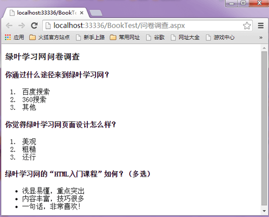

```java
2
```


## 5、表格

### (一)、表格语义记忆

通过语义化记忆表格标签：

| 标签  | 语义                          | 说明   |
| ----- | ----------------------------- | ------ |
| table | table（表格）                 | 表格   |
| tr    | table row（表格行）           | 行     |
| td    | table data cell（表格单元格） | 单元格 |

| 标签  | 语义         | 说明       |
| ----- | ------------ | ---------- |
| thead | table head   | 表头       |
| tbody | table body   | 表身       |
| tfoot | table foot   | 表脚       |
| th    | table header | 表头单元格 |

### (二)、表格基本结构

<table>、<tr>和<td>是HTML表格最基本的3个标签，其他标题标签<caption>、表头单元格<th>可以没有，但是这3者必须要有。


语法：

|| 1

2

3

4

5

6

7

8

9

10

| `<``table``>`

`    ``<``tr``>`

`        ``<``td``>单元格1</``td``>`

`        ``<``td``>单元格2</``td``>`

`    ``</``tr``>`

`    ``<``tr``>`

`        ``<``td``>单元格1</``td``>`

`        ``<``td``>单元格2</``td``>`

`    ``</``tr``>`

`</``table``>`

|

说明：

<table>和</table>标记着表格的开始和结束，<tr>和</tr>标记着行的开始和结束，在表格中包含几组<tr></tr>就表示该表格为几行。<td>和</td>标记着单元格的开始和结束。

### (三)、表格完整结构

表格完整结构应该包括表格标题（caption）、表头（thead）、表身（tbody）和表脚（tfoot）4部分。

表格语义化之后，使得代码更清晰和更利于后期维护。

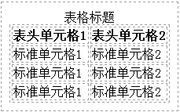

语法：

|| 1

2

3

4

5

6

7

8

9

10

11

12

13

14

15

16

17

18

19

20

21

22

23

24

25

26

27

28

| `<``table``>`

`    ``<``caption``>表格标题</``caption``>`

`    ``<!--表头-->`

`    ``<``thead``>`

`        ``<``tr``>`

`            ``<``th``>表头单元格1</``th``>`

`    ``<``th``>表头单元格2</``th``>`

`        ``</``tr``>`

`    ``</``thead``>`

`    ``<!--表身-->`

`    ``<``tbody``>`

`        ``<``tr``>`

`            ``<``td``>标准单元格1</``td``>`

`            ``<``td``>标准单元格2</``td``>`

`        ``</``tr``>`

`        ``<``tr``>`

`            ``<``td``>标准单元格1</``td``>`

`            ``<``td``>标准单元格2</``td``>`

`        ``</``tr``>`

`    ``</``tbody``>`

`    ``<!--表脚-->`

`    ``<``tfoot``>`

`        ``<``tr``>`

`            ``<``td``>标准单元格1</``td``>`

`            ``<``td``>标准单元格2</``td``>`

`        ``</``tr``>`

`    ``</``tfoot``>`

`</``table``>`

|

说明：

<thead>、<tbody>和<tfoot>这三个标签分别表示表头、表身、表脚。th表示表头单元格，th表示表身单元格。每一对“<tr></tr>”表示一行。

### (四)、合并行和合并列

合并行使用td标签的[rowspan属性](http://www.lvyestudy.com/les_hj/hj_6.5.aspx "rowspan属性")，而合并列则用到td标签的[colspan属性](http://www.lvyestudy.com/les_hj/hj_6.6.aspx "colspan属性")。

**(1)、合并行**

语法：

<td rowspan="跨度的行数">

举例：

|| 1

2

3

4

5

6

7

8

9

10

11

12

13

14

15

16

17

18

19

20

21

22

23

24

| `<!DOCTYPE html> `

`<``html` `xmlns``=``"[http://www.w3.org/1999/xhtml](http://www.w3.org/1999/xhtml "http://www.w3.org/1999/xhtml")"``>`

`<``head``>`

`    ``<``title``>合并行rowspan</``title``>`

`</``head``>`

`<``body``>`

`    ``<``table``>`

`        ``<!--第1行-->`

`        ``<``tr``>`

`            ``<``td``>姓名:</``td``>`

`            ``<``td``>小明</``td``>`

`        ``</``tr``>`

`        ``<!--第2行-->`

`        ``<``tr``>`

`            ``<``td` `rowspan``=``"2"``>喜欢水果:</``td``>`

`            ``<``td``>苹果</``td``>`

`        ``</``tr``>`

`        ``<!--第3行-->`

`        ``<``tr``>`

`            ``<``td``>香蕉</``td``>`

`        ``</``tr``>`

`    ``</``table``>`

`</``body``>`

`</``html``>`

|

在浏览器预览效果如下：

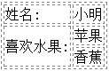

**(2)、合并列**

语法：

<td colspan="跨度的列数">

举例：

|| 1

2

3

4

5

6

7

8

9

10

11

12

13

14

15

16

17

18

19

20

21

22

23

24

| `<!DOCTYPE html> `

`<``html` `xmlns``=``"[http://www.w3.org/1999/xhtml](http://www.w3.org/1999/xhtml "http://www.w3.org/1999/xhtml")"``>`

`<``head``>`

`    ``<``title``>合并列colspan</``title``>`

`</``head``>`

`<``body``>`

`    ``<``table``>`

`        ``<!--第1行-->`

`        ``<``tr``>`

`            ``<``td` `colspan``=``"2"``>绿叶学习网精品教程</``td``>`

`        ``</``tr``>`

`        ``<!--第2行-->`

`        ``<``tr``>`

`            ``<``td``>HTML教程</``td``>`

`            ``<``td``>CSS教程</``td``>`

`        ``</``tr``>`

`        ``<!--第3行-->`

`        ``<``tr``>`

`            ``<``td``>jQuery教程</``td``>`

`            ``<``td``>SEO教程</``td``>`

`        ``</``tr``>`

`    ``</``table``>`

`</``body``>`

`</``html``>`

|

在浏览器预览效果如下：

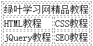

## 6、图像

### (一)、图像标签

在HTML中，图像标签为。是一个自闭合标签。[img标签](http://www.lvyestudy.com/les_hj/hj_7.1.aspx "img标签")只需要掌握3个属性就可以了：src、alt、title。

语法：


| 属性  | 说明                       |
| ----- | -------------------------- |
| src   | 图像的文件地址             |
| alt   | 图片显示不出来时的提示文字 |
| title | 鼠标移到图片上的提示文字   |

src和alt这两个属性是img标签必不可少的属性。其他属性我们一般用不到，所以只需要掌握这两个属性即可，大家要是在别的书籍上看到还有别的属性，你不用去记忆它们。

### (二)、相对路径和绝对路径

相对路径，指的是同一个网站下，不同文件之间的的位置定位。引用的文件位置是相对当前文件的位置而言，从而得到相对路径。

绝对路径，指的是文件的完整路径。

详细复习内容，请查看[相对路径和绝对路径](http://www.lvyestudy.com/les_hj/hj_7.2.aspx "相对路径和绝对路径")。

### (三)、图片格式

虽然[图片格式](http://www.lvyestudy.com/les_hj/hj_7.3.aspx "图片格式")这一节知识比较多，大部分我们只需要了解就可以了，我们只需要掌握.jpg、.png和.gif三种图片格式的区别即可。

1、JPG可以很好处理大面积色调的图像，如相片、网页一般的图片。

2、PNG格式图片体积小，而且无损压缩，能保证网页的打开速度。最重要的是PNG格式图片支持透明信息。PNG格式图片可以称为“网页设计专用格式”。

3、GIF格式图片图像效果很差，但是可以制作动画。

## 7、链接

超链接使用[a标签](http://www.lvyestudy.com/les_hj/hj_8.2.aspx "a标签")，语法如下：

<a href="链接地址" target="目标窗口的打开方式">

| target属性值 | 说明                           |
| ------------ | ------------------------------ |
| _self        | 默认方式，即在当前窗口打开链接 |
| _blank       | 在一个全新的空白窗口中打开链接 |
| _top         | 在顶层框架中打开链接           |
| _parent      | 在当前框架的上一层里打开链接   |

我们只需要掌握“_self”和“_blank”这两个属性值就可以了，其他两个用不到。

超链接根据链接对象的不同分为：

（1）外部链接

（2）内部链接：①内部页面链接；②锚点链接；

举例：

|| 1

2

3

4

5

6

7

8

9

10

11

12

13

14

15

16

17

18

19

20

21

22

23

24

25

26

27

28

29

30

31

32

33

34

35

36

37

38

39

40

41

42

43

44

45

46

47

48

49

50

51

52

53

54

55

| `<!DOCTYPE html> `

`<``html` `xmlns``=``"[http://www.w3.org/1999/xhtml](http://www.w3.org/1999/xhtml "http://www.w3.org/1999/xhtml")"``>`

`<``head``>`

`    ``<``title``>锚点链接</``title``>`

`</``head``>`

`<``body``>`

`    ``<``div``>`

`        ``<``a` `href``=``"#music"``>推荐音乐</``a``><``br` `/>`

`        ``<``a` `href``=``"#movie"``>推荐电影</``a``><``br` `/>`

`        ``<``a` `href``=``"#article"``>推荐文章</``a``><``br` `/>`

`    ``</``div``>`

`    ``……<``br` `/>`

`    ``……<``br` `/>`

`    ``……<``br` `/>`

`    ``……<``br` `/>`

`    ``……<``br` `/>`

`    ``……<``br` `/>`

`    ``<``div` `id``=``"music"``>`

`        ``<``h3``>推荐音乐</``h3``>`

`        ``<``ul``>`

`            ``<``li``>林俊杰-被风吹过的下图</``li``>`

`            ``<``li``>曲婉婷-在我的歌声里</``li``>`

`            ``<``li``>许嵩-灰色头像</``li``>`

`        ``</``ul``>`

`    ``</``div``>`

`    ``……<``br` `/>`

`    ``……<``br` `/>`

`    ``……<``br` `/>`

`    ``……<``br` `/>`

`    ``……<``br` `/>`

`    ``……<``br` `/>`

`    ``<``div` `id``=``"movie"``>`

`        ``<``h3``>推荐电影</``h3``>`

`        ``<``ul``>`

`            ``<``li``>蜘蛛侠系列</``li``>`

`            ``<``li``>钢铁侠系统</``li``>`

`            ``<``li``>复仇者联盟</``li``>`

`        ``</``ul``>`

`    ``</``div``>`

`    ``……<``br` `/>`

`    ``……<``br` `/>`

`    ``……<``br` `/>`

`    ``……<``br` `/>`

`    ``……<``br` `/>`

`    ``……<``br` `/>`

`    ``<``div` `id``=``"article"``>`

`        ``<``h3``>推荐文章</``h3``>`

`        ``<``ul``>`

`            ``<``li``>朱自清-荷塘月色</``li``>`

`            ``<``li``>余光中-乡愁</``li``>`

`            ``<``li``>鲁迅-阿Q正传</``li``>`

`        ``</``ul``>`

`    ``</``div``>`

`</``body``>`

`</``html``>`

|

 

锚点链接，就是点击某一个超链接，它就会跳到当前页面的某一部分。如下图：

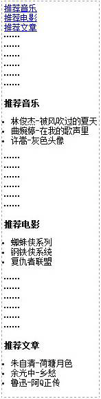

只要我们点击“推荐音乐”、“推荐电影”和“推荐文章”这三个超链接，滚动条就会滚动到相应的版块。

## 8、表单

表单标签共有4个：<input>、<textarea>、<select>和<option>。其中<select>和<option>是配合使用的。

我们通过一张表单来把所有input标签囊括：


### (一)、input标签表单

大部分表单都是用[input标签](http://www.lvyestudy.com/les_hj/hj_9.3.aspx "input标签")完成的。

语法：

<input type="表单类型"/>

说明：

表1中的表单都是使用input标签，所不同的就是type属性值不同。

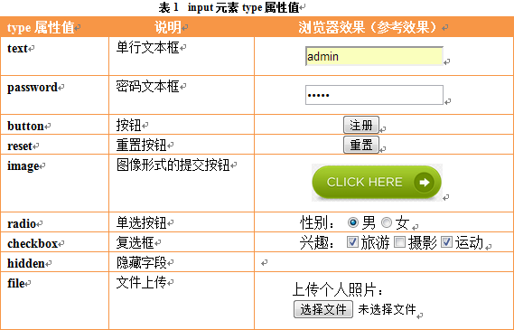

### (二)、textarea标签表单

**(1)、多行文本框**

语法：

<textarea rows="行数" cols="列数">多行文本框内容</textarea>

表现形式如下：

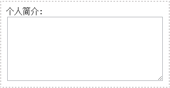

**(2)、3种文本框对比**

单行文本框和密码文本框使用<input>标签，而多行文本框使用<textarea>标签。

①单行文本框

语法：

<input type="text" value="默认文字" size="文本框长度" maxlength="最多输入字符数"/>

①密码文本框

语法：

<input type="password">

①多行文本框

语法：

<textarea rows="行数" cols="列数">多行文本框内容</textarea>

### **(三)、select和option**

 

下拉列表由<select>标签和<option>标签配合使用。

语法：

|| 1

2

3

4

5

| `<``select` `multiple``=``"mutiple"` `size``=``"可见列表项的数目"``>`

`    ``<``option` `value``=``"选项值"` `selected``=``"selected"``>选项显示的内容</``option``>`

`    ``……`

`    ``<``option` `value``=``"选项值"``>选项显示的内容</``option``>`

`</``select``>`

|

表现形式如下：

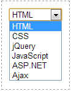

### (四)、训练题

1、使用你在这一章学习到的表单标签制作下面的一个表单：

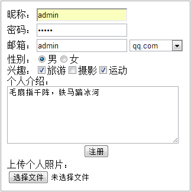

```java
3
```


## 9、多媒体

### (一)、插入音频、视频和flash

在网页中插入音频、视频和flash都是使用embed标签。

语法：

<embed src="多媒体文件地址" width="播放界面的宽度" height="播放界面的高度"></embed>

说明：

多媒体文件地址可以是相对地址，也可以是绝对地址。

width和height使用px作为单位。

### (二)、插入背景音乐

为某个网页设置背景音乐，使用的是bgsound标签。不过bgsound标签只适用于IE浏览器，在Firefox等浏览器中未必适用。

设置网页背景音乐时常用的方法除了使用bgsound标签，还有使用embed标签和object标签。

语法：

<bgsound src="背景音乐的地址"/>

说明：

loop="2"表示重复2次，loop="infinite"表示无限次循环播放，也可以使用loop="-1"表示无限次循环播放。

 

## 10、浮动框架iframe

### (一)、浮动框架iframe简介

由于HTML5已经舍弃了frameset标签（框架集标签），所以在这一章，我们不讲解框架集frameset，只讲解一个标签：iframe标签（浮动框架标签）。

浮动框架是一种较为特殊的框架，它是在浏览器窗口中嵌套的子窗口，整个页面并不一定是框架页面，但要包含一个框架窗口。<iframe>框架可以完全由设计者定义宽度和高度，并且可以放置在一个网页的任何位置，这极大地扩展了框架页面的应用范围。

<frameset>生成的框架结构是依赖上级空间尺寸的，它的宽度或者高度必须有一个和上级框架相同。而<iframe>浮动框架可以完全由指定宽度和高度决定。

语法：

<iframe src="浮动框架的源文件" width="浮动框架的宽" height="浮动框架的高"></iframe>

说明：

src属性是iframe的必须属性，它定义浮动框架页面的源文件地址。

在普通框架结构中，由于框架就是整个浏览器的窗口，因此不需要设置其大小。但是在浮动框架中，框架是插入到普通HTML页面中，所以可以调整框架的大小。浮动框架的宽度和高度都是以像素为单位。width和height这2个都是可选属性。

举例：

|| 1

2

3

4

5

6

7

8

9

10

11

12

| `<!DOCTYPE html> `

`<``html` `xmlns``=``"[http://www.w3.org/1999/xhtml](http://www.w3.org/1999/xhtml "http://www.w3.org/1999/xhtml")"``>`

`<``head``>`

`    ``<``title``></``title``>`

`</``head``>`

`<``body``>`

`    ``<``div` `id``=``"main"``>`

`        ``<``h3``>绿叶学习网</``h3``>`

`        ``<``iframe` `src``=``"[http://www.baidu.com](http://www.baidu.com/ "http://www.baidu.com")"` `width``=``"400px"` `height``=``"300px"``></``iframe``>`

`    ``</``div``>`

`</``body``>`

`</``html``>`

|

在浏览器预览效果如下；

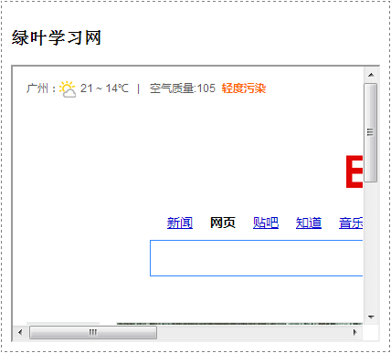

iframe标签

分析：

在这段代码中，设置了iframe的src属性值为“http://www.baidu.com”（百度首页地址），宽width为400px，高height为300px。

大家在浏览器查看到该页面嵌入了一个子页面，而这个子页面就是百度的首页。

### (二)、设置浮动框架是否显示滚动条scrolling

对于浮动框架iframe的的滚动条，我们可以使用scrolling属性来控制。scrolling属性有3种情况：根据需要显示、总是显示和不显示。

语法：

<iframe src="浮动框架的源文件" width="浮动框架的宽" height="浮动框架的高" scrolling="取值"></iframe>

说明：

scrolling属性取值如下：

| scrolling属性值 | 说明                                                         |
| --------------- | ------------------------------------------------------------ |
| auto            | 默认值，整个表格在浏览器页面中左对齐                         |
| yes             | 总是显示滚动条，即使页面内容不足以撑满框架范围，滚动条的位置也预留 |
| no              | 在任何情况下都不显示滚动条                                   |

举例：

|| 1

2

3

4

5

6

7

8

9

10

11

12

| `<!DOCTYPE html> `

`<``html` `xmlns``=``"[http://www.w3.org/1999/xhtml](http://www.w3.org/1999/xhtml "http://www.w3.org/1999/xhtml")"``>`

`<``head``>`

`    ``<``title``></``title``>`

`</``head``>`

`<``body``>`

`    ``<``div` `id``=``"main"``>`

`        ``<``h3``>绿叶学习网</``h3``>`

`        ``<``iframe` `src``=``"[http://www.baidu.com](http://www.baidu.com/ "http://www.baidu.com")"` `width``=``"400px"` `height``=``"300px"` `scrolling``=``"no"``></``iframe``>`

`    ``</``div``>`

`</``body``>`

`</``html``>`

|

在浏览器预览效果如下；

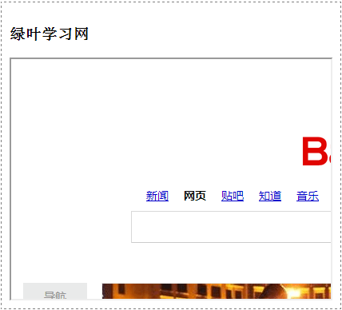

iframe标签

分析：

大家可以看到，浮动框架iframe的滚动条都消失了。大家可以在“在线测试工具”中修改一下scrolling属性值，看看不同属性值下有什么不同的效果。

浮动框架，说白了就是在一个页面嵌入一个或多个子页面，这样大家好理解了吧。

 

# 三、进阶内容

## 1、<font color=#000000>HTML</font><font color=#000000>、</font><font color=#000000>XHTML</font><font color=#000000>和</font><font color=#000000>HTML5</font>

<font color=#000000>很多新手往往分不清</font><font color=#000000>HTML、XHTML</font><font color=#000000>和</font><font color=#000000>HTML5,</font><font color=#000000>这一节给大家详细讲解一下这三者 的关系和区别。</font>

### **<font color=#000000>**（一）HTML **</font>**<font color=#000000>和 </font>**<font color=#000000>**XHTML**</font>**

<font color=#000000>HTML,</font><font color=#000000>全称</font><font color=#000000>HyperText Mark-up Language (</font><font color=#000000>超文本标记语言)，是构成网页文档的 主要语言。我们常说的</font><font color=#000000>HTML</font><font color=#000000>指的是</font><font color=#000000>HTML </font><font color=#000000>4.01。</font>

<font color=#000000>XHTML,</font><font color=#000000>全称 </font><font color=#000000>Extensible HyperText Mark-up Language (</font><font color=#000000>扩展的超文本标记语言), 它是</font><font color=#000000>XML</font><font color=#000000>风格的</font><font color=#000000>HTML 4.01,</font><font color=#000000>我们可以称之为更严格、更纯净的</font><font color=#000000>HTML 4.01。</font>

<font color=#000000>HTML</font><font color=#000000>语法书写比较松散，利于开发者编写。但是对于机器，如电脑、手机等来说，语 法越松散，处理起来越困难。因此为了让机器更好地处理</font><font color=#000000>HTML,</font><font color=#000000>我们才在</font><font color=#000000>HTML</font><font color=#000000>基础上引入了 </font><font color=#000000>XHTML</font>

<font color=#000000>XHTML</font><font color=#000000>相对于</font><font color=#000000>HTML</font><font color=#000000>来说，在语法上更加严格。</font><font color=#000000>XHTML</font><font color=#000000>和</font><font color=#000000>HTML</font><font color=#000000>主要区别如下。</font>

**<font color=#000000>1、XHTML标签必须闭合。</font>**

<font color=#000000>在</font><font color=#000000>XHTML</font><font color=#000000>中，所有标签必须闭合，例如</font><font color=#000000>“<p></p>" “<div></div>”</font><font color=#000000>等。此外，空标 签也需要闭合，例如</font><font color=#000000><br></font><font color=#000000>要写成</font><font color=#000000><br/>。</font>

<font color=#000000>错误写法：</font><font color=#000000><p></font><font color=#000000>欢迎来到绿叶学习网</font>

<font color=#000000>正确写法：</font><font color=#000000><p></font><font color=#000000>欢迎来到绿叶学习网</font><font color=#000000></p></font>

**<font color=#000000>2、XHTML标签以及属性必须小写。</font>**

<font color=#000000>在</font><font color=#000000>XHTML</font><font color=#000000>中，所有标签以及标签属性必须小写，不能大小写混合，也不能全部都是大 写。不过标签的属性值可以大写。</font>

<font color=#000000>错误写法：</font><font color=#000000><Body><DIV></DlV></Body></font>

<font color=#000000>正确写法：</font><font color=#000000><body><div></div></body></font>

**<font color=#000000>3、XHTML标签属性必须用引号。</font>**

<font color=#000000>在</font><font color=#000000>XHTML</font><font color=#000000>中，标签属性值必须用引号括起来，单引号、双引号都可以。</font>

<font color=#000000>错误写法：</font><font color=#000000><input id=txt type=text/></font>

<font color=#000000>正确写法：</font><font color=#000000><input id="txt" type="text"/></font>

**<font color=#000000>4、XHTML标签用jd属性代替name属性。</font>**

<font color=#000000>在</font><font color=#000000>XHTML</font><font color=#000000>中，除了表单元素之外的所有元素，都应该用</font><font color=#000000>id</font><font color=#000000>而不是</font><font color=#000000>name。</font>

<font color=#000000>错误写法：</font><font color=#000000><div name="wrapper"></div></font>

<font color=#000000>正确写法：</font><font color=#000000><div id="wrapper"></div></font>

<font color=#000000>下面是一个完整的</font><font color=#000000>XHTML</font><font color=#000000>文档。</font>

```java
<!DOCTYPE html>
<html xmlns="http://www.w3.org/1999/xhtml">
<head>
    <title></title>
</head>
<body>
    <p>“<span style="font-weight:bold;color:Red;">视觉化思考</span>”能以独特而有效的方式，让你的心有更大的空间来解决问题。</p>
</body>
</html>
 
```


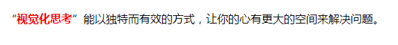

### （二）HTML5

<font color=#000000>HTML</font><font color=#000000>指的是</font><font color=#000000>HTML 4.01, XHTML</font><font color=#000000>是</font><font color=#000000>HTML</font><font color=#000000>的过渡版本，</font><font color=#000000>XHTML</font><font color=#000000>是</font><font color=#000000>XML</font><font color=#000000>风</font><font color=#000000>格的HTML </font><font color=#000000>4.01。而</font><font color=#000000>HTML </font><font color=#000000>5指的是下一代的</font><font color=#000000>HTML,</font><font color=#000000>也就是</font><font color=#000000>HTML 4.01</font><font color=#000000>的升级版。</font>

<font color=#000000>不过</font><font color=#000000>HTML </font><font color=#000000>5已经不再是单纯意义上的标签了，它已经远远超越了标签的范畴。</font><font color=#000000>HTML </font><font color=#000000>5 除了新增部分标签之外，还增加了一组技术，包括</font><font color=#000000>canvas、SVG、WebSocket.</font><font color=#000000>本地存储等。这些新增的技术都是使用</font><font color=#000000>JavaScript</font><font color=#000000>来操作。也就是说，</font><font color=#000000>HTML </font><font color=#000000>5使得</font><font color=#000000>HTML</font><font color=#000000>从一门</font><font color=#000000>“标记</font><font color=#000000>语言” 转变为一门</font><font color=#000000>“编</font><font color=#000000>程语言”。</font>

<font color=#000000>对于</font><font color=#000000>HTML </font><font color=#000000>5中的新技术，在此不做详细介绍。单纯从新增的标签上来看，</font><font color=#000000>HTML </font><font color=#000000>5有 以下几个特点。</font>

**1、文档类型说明**

<font color=#000000>基于</font><font color=#000000>HTML </font><font color=#000000>5设计准则中的</font><font color=#000000>“化繁</font><font color=#000000>为简”原则，页面的文档类型<</font><font color=#000000>!DOCTYPE></font><font color=#000000>被极大地 简化了。</font>

<font color=#000000>XHTML</font><font color=#000000>文档声明如下：</font>

<font color=#000000><!</font><font color=#000000>DOCTYPE html PUBLIC "-//W3C//DTD XHTML 1.0 Transitional//EN" "http:// </font>[www.w3.org/TR/xhtmll/DTD/xhtmll-transitional.dtdn](http://www.w3.org/TR/xhtmll/DTD/xhtmll-transitional.dtdn "www.w3.org/TR/xhtmll/DTD/xhtmll-transitional.dtdn")<font color=#000000>></font>

<font color=#000000>HTML5</font><font color=#000000>文档声明如下：</font>

<font color=#000000><!DOCTYPE html></font>

**2、标签不再区分大小写**

<font color=#000000><div></font><font color=#000000>绿叶学习网</font><font color=#000000></DIV></font>

<font color=#000000>上面这种写法也是完全符合</font><font color=#000000>HTML5</font><font color=#000000>规范的。但是在实际开发中，建议所有标签以及属 性都采用小写方式。</font>

**3、允许属性值不加引号**

<font color=#000000><div id=wrapper style=co1or</font><font color=#000000>: </font><font color=#000000>red> </font><font color=#000000>绿叶学习网 </font><font color=#000000></div></font>

<font color=#000000>上面这种写法也是完全符合</font><font color=#000000>HTML5</font><font color=#000000>规范的。但是在实际开发中，建议标签所有属性值 都加引号，单引号或双引号都可以。</font>

**4、允许部分属性的属性值省略**

<font color=#000000>在</font><font color=#000000>HTML5</font><font color=#000000>中，部分具有特殊性属性的属性值是可以省略的。例如，下面代码是完全符 合</font><font color=#000000>HTML </font><font color=#000000>5规范的：</font>

```java
<input type=ntext" readonly/>
 
<input type="checkbox" checked/>
```


<font color=#000000>上面两句代码等价于：</font>

```java
<input type="textM readonly="readonly"/>
 
<input type="checkbox" checked="checked"/>
```


<font color=#000000>在</font><font color=#000000>HTML 5</font><font color=#000000>中，可以省略属性值的属性如表所示。</font>

|| <font color=#000000>表</font><font color=#000000>1 -1</font> <font color=#000000>HTML5</font><font color=#000000>中可以省略属性值的属性</font>

|
| <font color=#000000>省略形式</font>

| <font color=#000000>等价于</font>

|
| <font color=#000000>checked</font>

| <font color=#000000>checked=</font><font color=#000000>n</font><font color=#000000>checked"</font>

|
| <font color=#000000>readonly</font>

| <font color=#000000>readonly="readonly"</font>

|
| <font color=#000000>defer</font>

| <font color=#000000>defer="</font><font color=#000000>defer"</font>

|
| <font color=#000000>ismap</font>

| <font color=#000000>ismap="ismap"</font>

|
| <font color=#000000>nohref</font>

| <font color=#000000>nohref="</font><font color=#000000>nohref"</font>

|
| <font color=#000000>noshade</font>

| <font color=#000000>noshade</font><font color=#000000>="</font><font color=#000000>noshade"</font>

|
| <font color=#000000>nowrap</font>

| <font color=#000000>nowrap="nowrap"</font>

|
| <font color=#000000>selected</font>

| <font color=#000000>selected="selected"</font>

|
| <font color=#000000>disabled</font>

| <font color=#000000>ciisabled</font><font color=#000000>="</font><font color=#000000>disableci"</font>

|
| <font color=#000000>multiple</font>

| <font color=#000000>multiple</font><font color=#000000>="</font><font color=#000000>multiple"</font>

|
| <font color=#000000>noresize</font>

| <font color=#000000>noresize="disabled"</font>

|

<font color=#000000>一句话概括 </font><font color=#000000>HTML、XHTML </font><font color=#000000>和 </font><font color=#000000>HTML </font><font color=#000000>5 就是：</font><font color=#000000>HTML </font><font color=#000000>指的是 </font><font color=#000000>HTML 4.01, XHTML </font><font color=#000000>是</font><font color=#000000>HTML</font><font color=#000000>的过渡版，</font><font color=#000000>HTML5是HTML</font><font color=#000000>的升级版。</font>

## 2、div和span

<font color=#000000>对于</font><font color=#000000>div</font><font color=#000000>和</font><font color=#000000>span</font><font color=#000000>这两个元素，不少新手也不知道它们之间有什么区别，使用起来也很随便。因此，这里有必要简单介绍一下。</font>

<font color=#000000>div</font><font color=#000000>和</font><font color=#000000>span</font><font color=#000000>没有任何语义,正是因为没有语义，这两个标签一般都是配合</font><font color=#000000>CSS</font><font color=#000000>来定义元素 样式的。</font>

<font color=#000000>div</font><font color=#000000>和</font><font color=#000000>span</font><font color=#000000>区别如下：</font>

<font color=#000000>(1 ) </font><font color=#000000>div</font><font color=#000000>是块元素，可以包含任何块元素和行内元素，不会与其他元素位于同一行；</font><font color=#000000>span </font><font color=#000000>是行内元素，可以与其他行内元素位于同一行。</font>

<font color=#000000>(2 ) </font><font color=#000000>div</font><font color=#000000>常用于页面中较大块的结构划分，然后配合</font><font color=#000000>CSS</font><font color=#000000>来操作；</font><font color=#000000>span </font><font color=#000000>一般用来包含文字等, 它没有结构的意义，纯粹是应用样式。当其他行内元素都不适合的时候，可以用</font><font color=#000000>span</font><font color=#000000>来配合</font><font color=#000000>CSS </font><font color=#000000>操作。</font>

<font color=#000000><font color=#000000>其实，除了 </font><font color=#000000>div</font><font color=#000000>和</font><font color=#000000>span</font><font color=#000000>外，还有一个</font><font color=#000000>label</font><font color=#000000>标签。</font><font color=#000000>div</font><font color=#000000>和</font><font color=#000000>span</font><font color=#000000>是无语义标签，但</font><font color=#000000>label </font><font color=#000000>是有语义标签。</font><font color=#000000>label 只</font><font color=#000000>适用于表单中，用于显示在输入控件旁边的说明性文字。</font></font>

```java
<!DOCTYPE html>
<html xmlns="http://www.w3.org/1999/xhtml">
<head>
    <title></title>
</head>
<body>
    <p>“<span style="font-weight:bold;color:Red;">视觉化思考</span>”能以独特而有效的方式，让你的心有更大的空间来解决问题。</p>
</body>
</html>
 
```


<font color=#000000>在这个例子中，我们想要对</font><font color=#000000>“视</font><font color=#000000>觉化思考”这几个文字加粗或者改变颜色，此时可以 使用</font><font color=#000000>span</font><font color=#000000>包含文字，然后再进行样式修改。事实上，</font><font color=#000000>span</font><font color=#000000>标签往往都是用来配合</font><font color=#000000>CSS</font><font color=#000000>来 修饰元素的。</font>

## 3、id和class

<font color=#000000>id</font><font color=#000000>和</font><font color=#000000>class</font><font color=#000000>是</font><font color=#000000>HTML</font><font color=#000000>元素中两个最基本的公共属性。一般情况下，</font><font color=#000000>id</font><font color=#000000>和</font><font color=#000000>class</font><font color=#000000>都用来选 择元素，以便进行</font><font color=#000000>CSS</font><font color=#000000>操作或者</font><font color=#000000>JavaScript</font><font color=#000000>操作。但是很多新手对</font><font color=#000000>id</font><font color=#000000>和</font><font color=#000000>class</font><font color=#000000>这两个属性感 到很迷茫，不知道什么时候用</font><font color=#000000>id,</font><font color=#000000>什么时候用</font><font color=#000000>class,</font><font color=#000000>甚至随便使用。1</font>

### **<font color=#000000>**（一）id **</font>**<font color=#000000>属性</font>

<font color=#000000>id</font><font color=#000000>属性具有唯一性，也就是说在一个页面中相同的</font><font color=#000000>id</font><font color=#000000>只允许出现一次。</font><font color=#000000>W3C</font><font color=#000000>建议，对 于页面关键的结构或者大结构，我们才使用</font><font color=#000000>id。</font><font color=#000000>所谓的关键结构，指的是诸如</font><font color=#000000>LOGO、</font><font color=#000000>导航、 主体内容、底部信息栏等结构。对于一些小地方，还是建议使用</font><font color=#000000>class</font><font color=#000000>属性。</font>

<font color=#000000>我们知道搜索引擎识别一个页面结构，是根据标签的语义以及</font><font color=#000000>id</font><font color=#000000>属性来识别的。因此 </font><font color=#000000>id</font><font color=#000000>属性不要轻易使用。此外，</font><font color=#000000>id</font><font color=#000000>的命名也十分关键，特别是对搜索引擎优化而言。对于</font><font color=#000000>id</font><font color=#000000>和 </font><font color=#000000>class</font><font color=#000000>的命名，我们在</font><font color=#000000>CSS</font><font color=#000000>进阶部分会详细介绍。</font>

### **<font color=#000000>**（二）class**</font>**<font color=#000000>属性</font>

<font color=#000000>class,</font><font color=#000000>顾名思义，就是</font><font color=#000000>“类</font><font color=#000000>”。它釆用的思想跟</font><font color=#000000>C、Java</font><font color=#000000>等编程语言中的</font><font color=#000000>“类”</font><font color=#000000>相似。 我们可以为同一个页面的相同元素或者不同元素设置相同的</font><font color=#000000>class,</font><font color=#000000>然后使得相同</font><font color=#000000>class</font><font color=#000000>的元 素具有相同的</font><font color=#000000>CSS</font><font color=#000000>样式。</font>

<font color=#000000>如果你要为两个或者两个以上元素定义相同的样式，建议使用</font><font color=#000000>class</font><font color=#000000>属性。因为这样可以 减少大量的重复代码。</font>

<font color=#000000>注意，对于一个元素而言，我们可以定义多个</font><font color=#000000>classo </font><font color=#000000>一般来说，定义多个</font><font color=#000000>class</font><font color=#000000>的目的 在于：一般用一个</font><font color=#000000>class</font><font color=#000000>抽取公共样式，然后用另外一个</font><font color=#000000>class</font><font color=#000000>定义单独样式。</font>

<font color=#000000>对于</font><font color=#000000>id</font><font color=#000000>和</font><font color=#000000>class,</font><font color=#000000>我们总结一下：对于页面关键结构，建议使用</font><font color=#000000>id；</font><font color=#000000>对于小地方，建议 使用</font><font color=#000000>class。</font><font color=#000000>就算我们不需要对关键结构进行</font><font color=#000000>CSS</font><font color=#000000>操作或者</font><font color=#000000>JavaScript</font><font color=#000000>操作，也建议加上</font><font color=#000000>id.以便搜索引擎识别页面结构。</font>

## 4、<font color=#000000>浏览器标题栏小图标</font>

<font color=#000000><font color=#000000>在浏览网页的时候，我们会发现几乎所有网站的页面在浏览器标题栏前面都会有一个小 图标</font></font>

<font color=#000000>想要实现这个效果，我们只需要在</font><font color=#000000>head</font><font color=#000000>标签添加一个</font><font color=#000000>link</font><font color=#000000>标签即可。</font>

<font color=#000000>语法：</font>

```java
<link rel="shortcut icon" type="image/x-icon" href="favicon.icon"/>
```


<font color=#000000>说明：</font>

<font color=#000000>rel</font><font color=#000000>和</font><font color=#000000>type</font><font color=#000000>这两个属性的取值是固定形式，无需多讲。</font><font color=#000000>href</font><font color=#000000>属性取值为小图标的地址, 这个地址是根据小图标在站点文件夹路径而定的，跟图片引用路径是一样的道理。</font>

<font color=#000000>这里注意一下，小图标格式是</font><font color=#000000>.ico,</font><font color=#000000>而不是</font><font color=#000000>.jpeg、.png、.gif</font><font color=#000000>等格式。对于</font><font color=#000000>.ico</font><font color=#000000>格式的 图标制作，我们可以搜索一下</font><font color=#000000>“在线</font><font color=#000000>icon"</font><font color=#000000>,会发现很多不错的在线工具，大家可以收藏一下。</font>

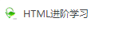

```java
<!DOCTYPE html>
<html xmlns="http://www.w3.org/1999/xhtml">
<head>
    <title>HTML进阶学习</title> 
    <link rel="shortcut icon" type="image/x-icon" href="images/favicon.ico"/>
</head>
<body>
</body>
</html>
```


## 5、语义化

### （一）简介

<font color=#000000>由于</font><font color=#000000>HTML</font><font color=#000000>简单，很多初学者对它存在一种偏见，觉得它没多少东西，因此在学习的过 程中随便对待。其实，学习</font><font color=#000000>HTML</font><font color=#000000>的重点不在于掌握了多少标签，而是在于掌握标签的语义 以及如何编写一个语义结构良好的页面。</font>

<font color=#000000>在实际开发过程中，很多人由于对标签语义不熟悉，常常用某一个标签代替另外一个标 签来实现某些效果。</font>

举例：

```java
<!DOCTYPE html>
<html xmlns="http://www.w3.org/1999/xhtml">
 
<head>
    <style type="text/css">
        .body {
            font-family: "微软雅黑";
            font-size: 14px;
        }
 
        .content {
            width: 300px;
            padding: 10px;
            border: 1px dashed gray;
        }
 
        .content div {
            font-size: 16px;
            font-weight: bold;
            height: 24px;
            line-height: 24px;
        }
    </style>
</head>
 
<body>
    <div class='content'>
        <div>web 前端开发 </div>
        <p>web前端开发最核心3个技术：HTML、CSS和JavaScript HTML控制网页的 结构，CSS控制网页的样式，JavaScript控制网页的行为。</p>
    </div>
</body>
 
</html>
```


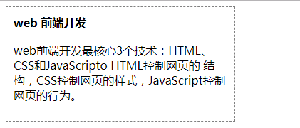

<font color=#000000>在浏览器预览效果如图</font><font color=#000000>所示。</font>

<font color=#000000>对于上面的标题效果，正确的做法应该是</font>

<font color=#000000>使用</font><font color=#000000>h1 </font><font color=#000000>~ </font><font color=#000000>h6</font><font color=#000000>标签来实现，但这里却使用</font><font color=#000000>div </font><font color=#000000>来代替了。虽然页面效果一样，但是这种</font><font color=#000000>“用某一</font><font color=#000000>个标签代替另外一个标签来实现相同效果”的做法是完全不可取的，因为它违背了 </font><font color=#000000>HTML</font><font color=#000000>这 门语言的初衷。</font>

<font color=#000000>HTML</font><font color=#000000>的精髓就在于标签的语义。在</font><font color=#000000>HTML</font><font color=#000000>中，大部分标签都有它自身的语义，例如</font><font color=#000000>p</font><font color=#000000>标签，表示的是</font><font color=#000000>"paragraph"</font><font color=#000000>,标记的是一个段落；</font><font color=#000000>hl</font><font color=#000000>标签，表示</font><font color=#000000>“headerl”</font><font color=#000000>,标记的是一 个最高级标题</font><font color=#000000>……</font><font color=#000000>而</font><font color=#000000>div</font><font color=#000000>和</font><font color=#000000>span</font><font color=#000000>是无语义的标签，我们应该尽可能少用。</font>

<font color=#000000>HTML</font><font color=#000000>很简单，因此很多初学者往往忽略了它的目的和重要性。我们学习</font><font color=#000000>HTML</font><font color=#000000>并不 是看自己学了多少标签，更重要的是在你需要的地方能否用到正确的语义化标签。把标签用在对的地方，这才是</font><font color=#000000>HTML</font><font color=#000000>学习的目的所在。</font>

<font color=#000000>我们都知道前端最核心的技术是</font><font color=#000000>HTML、CSS</font><font color=#000000>和</font><font color=#000000>JavaScript</font><font color=#000000>这三种。.其中</font><font color=#000000>HTML</font><font color=#000000>是网 页的结构，</font><font color=#000000>CSS</font><font color=#000000>是网页的外观，</font><font color=#000000>JavaScript</font><font color=#000000>是网页的行为。在这三大元素中，</font><font color=#000000>HTML</font><font color=#000000>才是最 重要的，而</font><font color=#000000>CSS</font><font color=#000000>和</font><font color=#000000>.JavaScript</font><font color=#000000>只是用来修饰结构的。就像你盖房子，房子装饰得再漂亮，如果结构不稳也容易塌。</font>

<font color=#000000>整站开发时，编写的代码往往都是成千上万行，如果我们全部使用</font><font color=#000000>div</font><font color=#000000>和</font><font color=#000000>span</font><font color=#000000>来代替 语义化标签，后期维护会非常困难。此外对于一个页面来说，我们可以根据一个页面的外观来判断哪些是标题，哪些是图片。但是搜索引擎跟人不一样，它可</font><font color=#000000>“看</font><font color=#000000>不懂” 一个页面长什 么样的。它只会根据</font><font color=#000000>HTML</font><font color=#000000>代码来识别。搜索引擎一般都是根据</font><font color=#000000>HTML</font><font color=#000000>标签来识别这里是 一个</font><font color=#000000>img</font><font color=#000000>标签，那里是一个</font><font color=#000000>p</font><font color=#000000>标签等。如果整个页面都是</font><font color=#000000>div</font><font color=#000000>和</font><font color=#000000>span,</font><font color=#000000>捜索引擎小蜘蛛肯 定会迷路，可能以后都不想来光顾你这个站点。要是这样的话，你崩溃了，你的老板也跟着 崩溃了。</font>

<font color=#000000><font color=#000000>从上面我们知道，编写一个语义结构良好的页面在实际开发中极其重要。主要有两个最大的优点：①利于开发调试和后期维护；②利于搜索引擎优化。</font></font>

### （二）标题语义化

<font color=#000000>h1 </font><font color=#000000>- </font><font color=#000000>h6</font><font color=#000000>是标题标签，</font><font color=#000000>h</font><font color=#000000>表示</font><font color=#000000>“header”。h1</font><font color=#000000>~ </font><font color=#000000>h6</font><font color=#000000>在</font><font color=#000000>HTML</font><font color=#000000>语义化中占有极其重要的地位。 </font><font color=#000000>h1 </font><font color=#000000>~ </font><font color=#000000>h6</font><font color=#000000>按照标题的重要性依次递减，其中</font><font color=#000000>h1</font><font color=#000000>重要性最高，</font><font color=#000000>h6</font><font color=#000000>重要性最低。</font>

<font color=#000000>相对于其他语义化标签，</font><font color=#000000>h1</font><font color=#000000>~ </font><font color=#000000>h6</font><font color=#000000>在搜索引擎优化(即</font><font color=#000000>SEO)</font><font color=#000000>中占有相当重要的地位。 在一个页面中，</font><font color=#000000>h1 </font><font color=#000000>~ </font><font color=#000000>h6</font><font color=#000000>这6个标签，我们不需要全部都用上，都是根据需要才用的。对于 </font><font color=#000000>h1</font><font color=#000000>~ </font><font color=#000000>h6,</font><font color=#000000>—般情况下我们只会用到</font><font color=#000000>h1</font><font color=#000000>、</font><font color=#000000>h2、h3</font><font color=#000000>和</font><font color=#000000>h4，</font><font color=#000000>很少再会去用</font><font color=#000000>h5</font><font color=#000000>和</font><font color=#000000>h6,</font><font color=#000000>因为一个页面不可能用到那么多级的标题。并且从搜索引擎优化的角度来说，</font><font color=#000000>h1、h2、h3</font><font color=#000000>和</font><font color=#000000>h4</font><font color=#000000>这4个 标签会被赋予一定的权重，而</font><font color=#000000>h5</font><font color=#000000>和</font><font color=#000000>h6</font><font color=#000000>的权重跟普通标签差不多，在</font><font color=#000000>SEO</font><font color=#000000>优化上意义不大。</font>

<font color=#000000>对于标题</font><font color=#000000>h1 </font><font color=#000000>~ </font><font color=#000000>h6</font><font color=#000000>的语义化，我们需要注意以下四个方面。</font>

<font color=#000000>（1）一个页面只能有一个</font><font color=#000000>h1</font><font color=#000000>标签。</font>

<font color=#000000>（2）hl </font><font color=#000000>~ </font><font color=#000000>h6</font><font color=#000000>之间不要断层。</font>

<font color=#000000>（3）不要用h1 ~ </font><font color=#000000>h6</font><font color=#000000>来定义样式。</font>

<font color=#000000>（4）不要用</font><font color=#000000>div</font><font color=#000000>来代替</font><font color=#000000>h1 </font><font color=#000000>~ </font><font color=#000000>h6.</font>

**<font color=#000000>1.一个页面只能有一个h1标签</font>**

<font color=#000000>hl</font><font color=#000000>标签表示每个页面中最高层级的标题，捜索引擎会赋予</font><font color=#000000>hl</font><font color=#000000>标签最高权重。虽然</font><font color=#000000>W3C </font><font color=#000000>没有明确规定一个页面不能有多个</font><font color=#000000>hl</font><font color=#000000>标签，但是我们还是推荐</font><font color=#000000>“一</font><font color=#000000>个页面一个</font><font color=#000000>hl</font><font color=#000000>标签”的 做法。如果一个页面出现多个</font><font color=#000000>hl,</font><font color=#000000>对搜索引擎可能不好，也可能会被判以作弊。就像你写文 章一样，一个页面就等于一篇文章，你见过一篇文章有多个主标题的么？</font>

**<font color=#000000>2.h1~h6之间不要出现断层</font>**

<font color=#000000>搜索引擎对</font><font color=#000000>hl </font><font color=#000000>~ </font><font color=#000000>h6</font><font color=#000000>标签比较敏感，尤其是</font><font color=#000000>hl</font><font color=#000000>和</font><font color=#000000>h2。</font><font color=#000000>一个语义良好的页面，</font><font color=#000000>hl </font><font color=#000000>~ </font><font color=#000000>h6 </font><font color=#000000>应该是完整有序而没有出现断层的。也就是说，要按照</font><font color=#000000>“hl、h2、h3、h4”</font><font color=#000000>这样的顺序依次 排列下来，不要出现</font><font color=#000000>“hl、h3、h4”</font><font color=#000000>而漏掉</font><font color=#000000>h2</font><font color=#000000>的情况。</font>

**<font color=#000000>3.不要用h1~h6来定义样式</font>**

<font color=#000000>我们都知道</font><font color=#000000>h1 </font><font color=#000000>~ </font><font color=#000000>h6</font><font color=#000000>是有默认样式的，如图</font><font color=#000000>所示。在实际开发中，很多时候我们需 要为文本定义字体加粗或者字体大小。有些人喜欢用</font><font color=#000000>h1 </font><font color=#000000>~ </font><font color=#000000>h6</font><font color=#000000>来代替</font><font color=#000000>CSS,</font><font color=#000000>使用标签来控制 样式，这是一种非常不好的做法。我们一定要记住，</font><font color=#000000>HTML</font><font color=#000000>关注的是结构(语义)，</font><font color=#000000>CSS</font><font color=#000000>关注 的是样式，结构跟样式应该分离。</font>

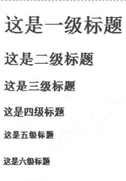

**<font color=#000000>4.不要用div来代替h1~h6</font>**

<font color=#000000>从语义上来说，一个页面的标题应该使用</font><font color=#000000>h1</font><font color=#000000>〜</font><font color=#000000>h6</font><font color=#000000>标签，不要使用</font><font color=#000000>div</font><font color=#000000>来代替。</font>

<font color=#000000>分析：</font>

<font color=#000000><font color=#000000>div</font><font color=#000000>是无语义的标签，如果使用</font><font color=#000000>div</font><font color=#000000>来代替h</font><font color=#000000>1</font><font color=#000000>〜</font><font color=#000000>h6,</font><font color=#000000>后期维护比较困难，而且对</font><font color=#000000>SEO </font><font color=#000000>影响也非常大。因为这种做法会让一个页面丢失大量的权重。</font></font>

### （三）图片语义化

<font color=#000000>在</font><font color=#000000>HTML</font><font color=#000000>中，我们使用</font><font color=#000000>img</font><font color=#000000>标签来表示图片。对于图片的语义化，我们从以下两个方面 来深入探讨一下。</font>

<font color=#000000>（1） alt</font><font color=#000000>属性和</font><font color=#000000>title</font><font color=#000000>属性。</font>

<font color=#000000>（2） </font><font color=#000000>figure </font><font color=#000000>元素和 </font><font color=#000000>figcaption </font><font color=#000000>元素。</font>

**1、<font color=#000000>alt</font><font color=#000000>属性和</font><font color=#000000>title</font><font color=#000000>属性</font>**

<font color=#000000>img</font><font color=#000000>标签有两个重要属性：</font><font color=#000000>alt</font><font color=#000000>和</font><font color=#000000>title。</font>

<font color=#000000>alt</font><font color=#000000>属性用于图片描述，这个描述文字是给捜索引擎看的。并且当图片无法显示时，页面 会显示</font><font color=#000000>alt</font><font color=#000000>中的文字。</font>

<font color=#000000>title</font><font color=#000000>属性也用于图片描述，不过这个描述文字是给用户看的。并且当鼠标指针移到图片 上时，会显示</font><font color=#000000>title</font><font color=#000000>中的内容。</font>

<font color=#000000>语法：</font>

```java

```


<font color=#000000>说明：</font>

<font color=#000000>搜索引擎跟人不一样，它看不出一张图片描绘的是什么东西，它只会査看</font><font color=#000000>HTML</font><font color=#000000>代码， 通过</font><font color=#000000>img</font><font color=#000000>标签的</font><font color=#000000>alt</font><font color=#000000>属性或者页面上下文来判断图片的内容。因此，对于</font><font color=#000000>img</font><font color=#000000>标签，我们一定 要添加</font><font color=#000000>alt</font><font color=#000000>属性，以便搜索引擎识别图片的内容。</font><font color=#000000>alt</font><font color=#000000>属性在搜索引擎优化中也很重要，并且会 被赋予一定的权重。</font>

<font color=#000000>请一定要注意；</font><font color=#000000>alt</font><font color=#000000>属性是</font><font color=#000000>img</font><font color=#000000>标签必需属性，一定要添加；</font><font color=#000000>title</font><font color=#000000>属性是</font><font color=#000000>img</font><font color=#000000>标签可选属 性，可加可不加。建议大家在实际开发中，对于</font><font color=#000000>img</font><font color=#000000>标签，要记得在</font><font color=#000000>alt</font><font color=#000000>属性中添加必要的描述信息。</font>

<font color=#000000>**2、figure **</font>**<font color=#000000>元素和 </font><font color=#000000>figcaption </font><font color=#000000>元素</font>**

 

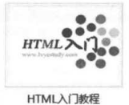

 

<font color=#000000>对于如图</font><font color=#000000>所示的这种</font><font color=#000000>“图片</font><font color=#000000>+图注”的效果，我们可以使用如下代码来实现。</font>

```java
<div class="img-list">
 
    
 
    <span>HTML入门教程 </span>
 
<div>
```


<font color=#000000>但是这种实现方式的语义并不好。在</font><font color=#000000>HTML </font><font color=#000000>5中，引</font><font color=#000000>入了 </font><font color=#000000>figure</font><font color=#000000>和</font><font color=#000000>figcaption</font><font color=#000000>两个元素 来增强图片的语义化。</font>

<font color=#000000>语法：</font>

```java
<figure>
 
    
 
    <figcaption></figcaption>
 
</figure>
```


<font color=#000000>说明：</font>

<font color=#000000>figure</font><font color=#000000>元素用于包含图片和图注，</font><font color=#000000>figcaption</font><font color=#000000>元素用于表示图注文字。在实际开发中， 对于</font><font color=#000000>“图片</font><font color=#000000>+图注”效果，我们都建议使用</font><font color=#000000>figure</font><font color=#000000>和</font><font color=#000000>figcaption</font><font color=#000000>这两个元素来实现，从而使 得页面的语义更加良好。</font>

### <font color=#000000>（四）表格语义化</font>

<font color=#000000>在实际开发中，我们不建议使用表格布局，应该使用浮动布局或者定位布局。虽然表格拿来做布局的方式被抛弃了，但是这并没有说明表格就一无是处了。</font>

<font color=#000000>问大家一个问题：如图所示的这种表格数据的展示，应该怎么实现呢？不少得了 </font><font color=#000000>“table</font><font color=#000000>恐惧症”的小伙伴可能会想到使用</font><font color=#000000>div</font><font color=#000000>来模拟表格。事实上，对于这种表格数据形式, 最好的选择还是</font><font color=#000000>table。</font>

|| **<font color=#000000>**font-weight属性值**</font>**

| <font color=#000000>说明</font>

|
| **<font color=#000000>**normal**</font>**

| <font color=#000000>默认值</font><font color=#000000>,</font><font color=#000000>正常体</font>

|
| **<font color=#000000>**lighter**</font>**

| 较细

|
| **<font color=#000000>**bold**</font>**

| 较粗

|
| **<font color=#000000>**bolder**</font>**

| <font color=#000000>很粗（效果跟</font><font color=#000000>bold</font><font color=#000000>差不多）</font>

|

 

<font color=#000000>在表格中，我们比较常用的标签是</font><font color=#000000>table, tr</font><font color=#000000>和</font><font color=#000000>td</font><font color=#000000>这3个。不过为了加强表格的语义 化，</font><font color=#000000>W3C</font><font color=#000000>还增加了 5个标签：</font><font color=#000000>th、caption、thead、tbody</font><font color=#000000>和</font><font color=#000000>tfoot。th</font><font color=#000000>表示“表头单元格”； </font><font color=#000000>caption</font><font color=#000000>表示</font><font color=#000000>“表</font><font color=#000000>格标题”。</font><font color=#000000>thead、tbody</font><font color=#000000>和</font><font color=#000000>tfoot</font><font color=#000000>这3个标签把表格从语义上分为三部分: 表头、表身和表脚。有了这几个标签，表格语义更加良好，结构更加清晰。对于这5个标签, 我们在本书的姊妹篇中已经做了详细的介绍，这里就不再赘述。表格标签如表</font><font color=#000000>2-1</font><font color=#000000>所示。</font>

|| **<font color=#000000>**表**</font>**<font color=#000000>2-1</font>

| **<font color=#000000>**表格标签**</font>**

|
| <font color=#000000>标 签</font>

| <font color=#000000>说 明</font>

|
| <font color=#000000>table</font>

| <font color=#000000>表格</font>

|
| <font color=#000000>caption</font>

| <font color=#000000>标题</font>

|
| <font color=#000000>thead</font>

| <font color=#000000>表头（语义划分）</font>

|
| <font color=#000000>tbody</font>

| <font color=#000000>表身（语义划分）</font>

|
| <font color=#000000>tfoot</font>

| <font color=#000000>表尾（语义划分）</font>

|
| <font color=#000000>tr</font>

| <font color=#000000>行</font>

|
| <font color=#000000>th</font>

| <font color=#000000>表头单元格</font>

|
| <font color=#000000>td</font>

| <font color=#000000>表格单元格</font>

|

举例：

```java
<!DOCTYPE html>
<html xmlns="http://www.w3.org/1999/xhtml">
 
<head>
    <style type="text/css">
        .body {
            font-family: "微软雅黑";
            font-size: 14px;
        }
 
    </style>
</head>
 
<body>
    <div class='content'>
        <table>
            
            <caption> 表格标题 </caption> 
            <!--表头-->
            <thead>
            <tr>
            <th>表头单元格l</th>
            <th>表头单元格2</th> </tr>
            </thead>
            <!--表身-->
            <tbody>
            <tr>
            <td>标准单元格l</td>
            <td>标准单元格2</td> </tr>
            <tr>
            <td>标准单元格l</td>
            <td>标准单元格2</td> </tr>
            </tbody>
            <!--表脚-->
            <tfoot>
            <tr>
            <td>标准单元格l</td>
            <td>标准单元格2</td> </tr>
            </tfoot>
            </table>
    </div>
</body>
 
</html>
```


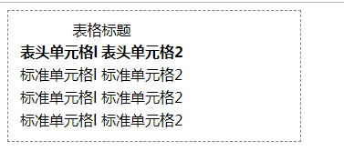

<font color=#000000>说明：</font>

<font color=#000000>thead, tbody</font><font color=#000000>和</font><font color=#000000>tfoot</font><font color=#000000>这三个标签也是表格中非常重要的标签，它从语义上区分了表头、 表身和表脚。很多人容易忽略这三个标签。</font>

<font color=#000000>举例：</font>

```java
<!DOCTYPE html>
<html xmlns="http://www.w3.org/1999/xhtml">
<head>
    <title></title>
    <style type="text/css">
        table, thead, tbody, tfoot, th, td 
        {
            border: 1px dashed gray;
        }
    </style>
</head>
<body>
    <table>
        <caption>考试成绩表</caption>
        <thead>
            <tr>
                <th>姓名</th>
                <th>语文</th>
                <th>英语</th>
                <th>数学</th>
            </tr>
        </thead>
        <tbody>
            <tr>
                <td>小明</td>
                <td>80</td>
                <td>80</td>
                <td>80</td>
            </tr>
            <tr>
                <td>小红</td>
                <td>90</td>
                <td>90</td>
                <td>90</td>
            </tr>
            <tr>
                <td>小杰</td>
                <td>100</td>
                <td>100</td>
                <td>100</td>
            </tr>
        </tbody>
        <tfoot>
            <tr>
                <td>平均</td>
                <td>90</td>
                <td>90</td>
                <td>90</td>
            </tr>
        </tfoot>
    </table>
</body>
</html>
```


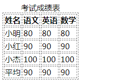

<font color=#000000>分析：</font>

<font color=#000000>对于</font><font color=#000000>thead</font><font color=#000000>x</font><font color=#000000> tbody</font><font color=#000000>和</font><font color=#000000>tfoot</font><font color=#000000>这3个标签，不一定能够全部都用得上，例如</font><font color=#000000>tfoot</font><font color=#000000>就很少用。 一般情况下，我们都是根据实际需要来使用这3个标签的。</font>

### （五）表单语义化

<font color=#000000>表单跟表格，这是两个完全不一样的概念，不过还是有不少初学者傻傻分不清。对于表单语义化，我们从2个方面来探究一下。</font>

<font color=#000000>（1）</font><font color=#000000>label </font><font color=#000000>标签。</font>

<font color=#000000>（2）</font><font color=#000000>fieldset </font><font color=#000000>标签和 </font><font color=#000000>legend </font><font color=#000000>标签。</font>

**<font color=#000000>1、label 标签</font>**

<font color=#000000>W3C</font><font color=#000000>规范定义，</font><font color=#000000>label</font><font color=#000000>标签用于显示在输入控件旁边的说明性文字。也就是将某个表单元素和某段说明文字关联起来。</font>

<font color=#000000>语法：</font>

<font color=#000000><label for=""</font><font color=#000000>> </font><font color=#000000>说明性文字 </font><font color=#000000></label></font>

<font color=#000000>说明：</font>

<font color=#000000>label</font><font color=#000000>标签</font><font color=#000000>for</font><font color=#000000>属性值为所关联的表单元素的</font><font color=#000000>id</font><font color=#000000>,例如</font><font color=#000000><input id="name" type="text"/></font><font color=#000000>, 则其所关联的</font><font color=#000000>label</font><font color=#000000>标签应该为</font><font color=#000000><label for="name"></lable></font>

<font color=#000000>label</font><font color=#000000>标签的</font><font color=#000000>for</font><font color=#000000>属性有两个作用。</font>

<font color=#000000>①语义上绑定了 </font><font color=#000000>label</font><font color=#000000>元素和表单元素。</font>

<font color=#000000>②增强了鼠标可用性。也就是说我们点击</font><font color=#000000>label</font><font color=#000000>中的文本时，其所关联的表单元素也会 获得焦点。</font>

<font color=#000000>举例：</font>

```java
<!DOCTYPE html>
<html xmlns="http://www.w3.org/1999/xhtml">
<head>
    <title></title>
</head>
<body>
    <div>
        <input id="Radio1" type="radio"/>单选框
        <input id="Checkbox1" type="checkbox" />复选框
    </div>
    <hr />
    <div>
        <input id="rdo" name="rdo" type="radio"/><label for="rdo">单选框</label>
        <input id="cbk" name="cbk" type="checkbox" /><label for="cbk">复选框</label>
    </div>
</body>
</html>
 
```


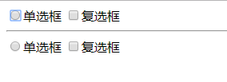

<font color=#000000>分析；</font>

<font color=#000000>从这个例子可以看到，在第一组表单中，我们只能点击单选框才能选中单选框，点击它旁边的说明文字是不能选中的。在第二组表单中，我们可以点击单选框来选中单选</font><font color=#000000> 框，并且点击它旁边的说明文字同样也可以选中单选框。而对于复选框来说，也是一样的效果。</font>

<font color=#000000>其实，这就是</font><font color=#000000>label</font><font color=#000000>标签</font><font color=#000000>for</font><font color=#000000>属性的作用。</font><font color=#000000>for</font><font color=#000000>属性使得鼠标单击的范围扩大到</font><font color=#000000>label</font><font color=#000000>元素 上，极大地提高了用户单击的可操作性。事实上，</font><font color=#000000>label</font><font color=#000000>标签有两种关联方式，我们拿复选框来说，下面两行代码是等价的。</font>

```java
<input id="cbk" type="checkbox" /><label for="cbk"> 复选框 </label> 
<label>复选框<input id="cbk" type="checkbox"/></label>
```


<font color=#000000><font color=#000000>对于图中的效果，我们使用</font><font color=#000000>label</font><font color=#000000>标签来增强语义化，修改后的代码如下</font></font>

```java
<!DOCTYPE html>
<html xmlns="http://www.w3.org/1999/xhtml">
 
<head>
    <title></title>
</head>
 
<body>
    <form action="index.aspx" method="post">
        <div>登录绿叶学习网</div>
        <p>
            <label for="name"> 账号：</1abel><input type="text" id="name" name="name" />
        </p>
        <label for="pwd"> 密码：</label><input type="password" id="pwd" name="pwd" />
        </p>
        <input type="checkbox" id= "remember-me" name="remember-me"/> <label for="remember-me"> 记住我 </label>
        <input type="submit" value="登录"/>
    </form>
</body>
 
</html>
```


**2.<font color=#000000>fieldset </font><font color=#000000>标签和 </font><font color=#000000>legend </font><font color=#000000>标签。</font>**

<font color=#000000>语法：</font>

```java
<fieldset>
 
    <legend> 表单组标题 </legend>
 
</fieldset>
```


<font color=#000000>说明：</font>

<font color=#000000>使用</font><font color=#000000>fieldset</font><font color=#000000>和</font><font color=#000000>legend</font><font color=#000000>标签有两个作用。</font>

<font color=#000000>（1）增强表单的语义。</font>

<font color=#000000>（2）可以定义</font><font color=#000000>fieldset</font><font color=#000000>元素的</font><font color=#000000>disabled</font><font color=#000000>属性来禁用整个组中的表单元素。</font>

<font color=#000000>对于图</font><font color=#000000>中的效果，我们使用</font><font color=#000000>fieldset</font><font color=#000000>和</font><font color=#000000>legend</font><font color=#000000>这两个标签来增强语义化，修改后的代码如下。</font>

```java
<!DOCTYPE html>
<html xmlns="http://www.w3.org/1999/xhtml">
 
<head>
    <title></title>
</head>
 
<body>
    <form action="index.aspx" method="post">
        <fieldset>
            <legend>登录绿叶学习网</legend>
            <p>
                <label for="name"> 账号：</1abel><input type="text" id="name" name="name" />
            </p>
            <label for="pwd"> 密码：</label><input type="password" id="pwd" name="pwd" />
            </p>
            <input type="checkbox" id="remember-me" name="remember-me" /> <label for="remember-me"> 记住我 </label>
            <input type="submit" value="登录" />
 
        </fieldset>
    </form>
</body>
 
</html>
```


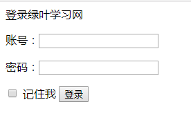

<font color=#000000>分析：</font>

<font color=#000000><font color=#000000>我们可以看到，使用了 </font><font color=#000000>fieldset</font><font color=#000000>和</font><font color=#000000>legend</font><font color=#000000>这两个标签之后，表单形成了非常美观的</font><font color=#000000>“书</font><font color=#000000>签”效果</font></font>

### （六）其他语义化

**1、 <font color=#000000>换行符 <br/></font>**

<font color=#000000>很多新手会使用</font><font color=#000000>＜br/＞</font><font color=#000000>标签来换行，或者使用多个</font><font color=#000000>＜br/＞</font><font color=#000000>标签来实现元素之间的上下间距。</font>

**<font color=#000000>**举例：**</font>**

```java
<div>
 
    <span> 标题 </span><br/><br/>
 
    <span>第 1 部分内容 </span><br/>
 
    <span>第 2 部分内容 </span><br/>
 
    <span>第 3 部分内容 </span> 
 
</div>
```


<font color=#000000>上面两个例子使用</font><font color=#000000>＜br/＞</font><font color=#000000>标签的方式是错误的，这也是</font><font color=#000000>＜br/＞</font><font color=#000000>标签很常见的错误用法。 事实上，</font><font color=#000000>＜br/＞</font><font color=#000000>标签有自己特定的语义，不能随便用来实现换行效果。</font><font color=#000000>W3C</font><font color=#000000>标准规定，</font><font color=#000000>＜br/＞ </font><font color=#000000>标签仅仅用于段落中的换行，不能用于其他情况。也就是说，</font><font color=#000000>＜br/＞</font><font color=#000000>标签只适合用于</font><font color=#000000>p</font><font color=#000000>标签内 部的换行，不能用于其他标签。</font>

**2、无序列表ul**

<font color=#000000>在实际开发中，对于列表型的数据，为了实现良好的语义，我们还是建议使用无序列表 或者有序列表，不建议使用</font><font color=#000000>div</font><font color=#000000>等来实现。</font>

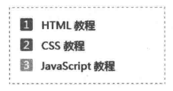

<font color=#000000>对于如图</font><font color=#000000>所示效果，不少新手很可能会写出如下代码来实现。</font>

```java
<div>
    <div><span>l</span>HTML 教程 </div>
    <div><span>2</span>CSS 教程 </div> 
    <div><span>3</span>JavaScript 教程 </div> 
</div>
```


<font color=#000000>这种实现方式缺乏语义化，并且也不利于维护。正确的做法是:</font>

```java
<ul>
    <li><span>l</span>HTML 教程 </li>
    <li><span>2</span>CSS 教程 </li>
    <li><Sp^n>3</span>JavaScript 教程 </li> 
</ul>
```


<font color=#000000>有人问，每一个列表项前都有数字，不应该使用有序列表来实现吗？为什么这里使用无序 列表来实现呢？假如使用有序列表，我们是做不到这种外观效果的。因为有序列表前的数字外 观是固定的。在实际开发中，大多数情况下都是使用无序列表，极少情况下会使用有序列表。</font>

**<font color=#000000>3、strong标签和em标签</font>**

<font color=#000000>**<font color=#000000>strong</font>**<font color=#000000>用于实现加粗文本，</font>**<font color=#000000>em</font>**<font color=#000000>用于实现斜体文本。基于 结构和样式分离的原则，标签仅仅是为了实现简单的加粗或者 斜体效果，我们一般不会用这两个。实际上，</font><font color=#000000>W3C</font><font color=#000000>对这两个标 签赋予</font><font color=#000000>“强</font><font color=#000000>调”的语义，在</font><font color=#000000>strong</font><font color=#000000>或者</font><font color=#000000>em</font><font color=#000000>标签内部的文本被 强调为重要文本。并且搜索引擎对这两个标签也赋予一定的权 重。如果在一个页面中，为了 </font><font color=#000000>SEO</font><font color=#000000>而想要突出某些关键字，可以使用</font><font color=#000000>strong</font><font color=#000000>和</font><font color=#000000>em</font><font color=#000000>这两个标 签。一般情况下，我们都是去掉</font><font color=#000000>strong</font><font color=#000000>和</font><font color=#000000>em</font><font color=#000000>的默认样式，然后使用</font><font color=#000000>CSS</font><font color=#000000>重新定义新的样式, 但这并不影响这两个标签的语义。也就是说，样式只会改变标签的外观，但不会改变标签的语 义。</font></font>

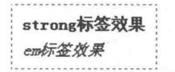

**<font color=#000000>4、del标签和ins标签</font>**

<font color=#000000>在</font><font color=#000000>HTM L</font><font color=#000000>中，</font><font color=#000000>del</font><font color=#000000>和</font><font color=#000000>ins</font><font color=#000000>这两个标签是配合使用的。</font><font color=#000000>del</font><font color=#000000>表示</font><font color=#000000>“delete”，</font><font color=#000000>用于定义被删 除的文本。</font><font color=#000000>ins</font><font color=#000000>表示</font><font color=#000000>“insert”，</font><font color=#000000>用于定义被更新的文本。一般情况下，我们会使用</font><font color=#000000>CSS</font><font color=#000000>来重 新定义</font><font color=#000000>del</font><font color=#000000>和</font><font color=#000000>ins</font><font color=#000000>标签的样式。</font>

<font color=#000000>举例：</font>

```java
<!DOCTYPE html>
<html xmlns="http://www.w3.org/1999/xhtml">
<head>
    <title></title>
</head>
<body>
    <p>新鲜的新西兰奇异果</p>
    <p><del>原价:￥6.50/kg</del></p>
    <p><ins>现在仅售：￥4.00/kg</ins></p>
</body>
</html>
```


**<font color=#000000>5、img标签</font>**

<font color=#000000>想要在页面显示一张图片，我们有两种方式：一是使用</font><font color=#000000>img</font><font color=#000000>标签；二是使用背景图片。 这两种实现方式最明显的区别在于：使用</font><font color=#000000>img</font><font color=#000000>标签添加图片，是通过</font><font color=#000000>HTML</font><font color=#000000>来实现；使用背 景图片，是通过</font><font color=#000000>CSS</font><font color=#000000>来实现。</font>

<font color=#000000>在实际开发中，很多人添加图片的方式很随意。对于什么时候使用</font><font color=#000000>img</font><font color=#000000>标签，什么时候 使用背景图片，并不是很清楚我们应该根据</font><font color=#000000>HTML</font><font color=#000000>的语义来判断。如果图片作为</font><font color=#000000>HTML</font><font color=#000000>的一 部分，并且想要被捜索引擎识别，则应该使用</font><font color=#000000>img</font><font color=#000000>标签，例如常见的各种图片列表。如果图 片仅仅是起到修饰作用，并且不想被搜索引擎识别，则应该使用背景图片。</font>

<font color=#000000>举个例子，图左</font><font color=#000000>这个页面中的图标图片就应该使用背景图片实现，因为这些图标并不 需要被搜索引擎识别，也不作为</font><font color=#000000>HTML</font><font color=#000000>的一部分。而图</font><font color=#000000>右</font><font color=#000000>页面中应该使用</font><font color=#000000>img</font><font color=#000000>标签来实 现，因为这是页面</font><font color=#000000>HTML</font><font color=#000000>结构的一部分，并且希望被搜索引擎识别。</font>

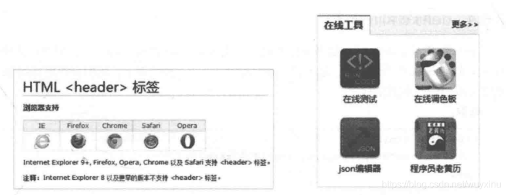

**<font color=#000000>**【总结】**</font>**

<font color=#000000>以上只是列举了在实际开发中比较常见的语义标签，其实</font><font color=#000000>HTML5</font><font color=#000000>新增了很多结构语义 标签，例如</font><font color=#000000>header、nav、aside、footer、article、section</font><font color=#000000>等。如果想要实现语义更为良好 的页面，我们也应该去关注这些新增的标签。不过结构语义标签是</font><font color=#000000>HTML5</font><font color=#000000>的内容，因此这里不展开介绍。</font>

### （七）语义化验证

<font color=#000000>前面这几节，我们介绍了页面语义化需要注意的各个地方。那么平常有什么好的办法来 判断一个页面是否语义良好呢？ 一个很简单的办法就是：去掉</font><font color=#000000>CSS</font><font color=#000000>样式，然后看页面是否还 具有很好的可读性。</font>

<font color=#000000>我们都知道，很多</font><font color=#000000>HTML</font><font color=#000000>标签都有一定的默认样式，例如</font><font color=#000000>p</font><font color=#000000>标签有上下边距、</font><font color=#000000>strong</font><font color=#000000>标 签对字体加粗、</font><font color=#000000>ul</font><font color=#000000>标签有缩进效果，等等。</font>

<font color=#000000>在前面我们接触过，我们可以使用一个标签来代替另外一个标签，并且使用</font><font color=#000000>CSS</font><font color=#000000>修饰来</font><font color=#000000><font color=#000000>实现相同的效果。也就是说，不同的HTML</font><font color=#000000>标签可以通过不同的</font><font color=#000000>CSS</font><font color=#000000>来实现相同的效果。但 是</font><font color=#000000>“一</font><font color=#000000>个语义良好的页面”跟</font><font color=#000000>“一</font><font color=#000000>个语义不好的页面”在去除样式之后的表现却是截然不同的。</font></font>

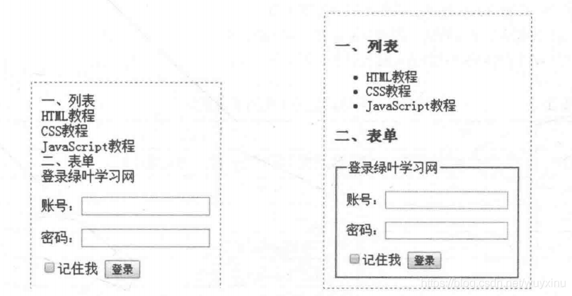

 语义不好的页面和语义好的页面

<font color=#000000>从上面两张图我们可以看出：一个语义良好的页面在</font><font color=#000000>“CSS</font><font color=#000000>裸奔”之后，可读性也是非 常高的。想要查看一个页面在</font><font color=#000000>“CSS</font><font color=#000000>裸奔”下的效果，我们可以使用</font><font color=#000000>Firefox</font><font color=#000000>浏览器的一款网 页调试插件</font><font color=#000000>"Web Developer"</font><font color=#000000>来测试。</font>

<font color=#000000>在 </font><font color=#000000>Web Developer ZL</font><font color=#000000>具栏找到</font><font color=#000000>“CSS” —</font><font color=#000000>►</font><font color=#000000> "Disable Styles" —'"Disable All Styles" </font><font color=#000000>并且选中，就可以查看页面去掉样式后的效果，如图</font><font color=#000000>2-21</font><font color=#000000>所示。</font><font color=#000000>Web Developer</font><font color=#000000>插件的安装 和使用，请自行搜索，很简单。</font>

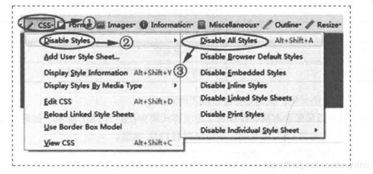

## <font color=#000000>6、HTML5舍弃的标签</font>

<font color=#000000>在</font><font color=#000000>HTML5</font><font color=#000000>中，除了新增标签之外，也有不少标签被舍弃了，如表</font><font color=#000000>1</font><font color=#000000>和表</font><font color=#000000>2</font><font color=#000000>所示。</font>
<font color=#000000>为了实现页面的语义化，我们在实际开发中不应该再去使用这些标签。因此了解哪些标签已经 被舍弃是非常有必要的。</font>

<font color=#000000>对于这些被舍弃的标签，总体可以分为两大类。</font>

<font color=#000000>（1）仅仅为了定义样式，没有任何语义，因此被舍弃。</font>

<font color=#000000>（2）很少使用或者已经被新标签代替，因此被舍弃。</font>

|| <font color=#000000>表1 </font><font color=#000000>HTML5</font><font color=#000000>舍弃的标签(仅为了定义样式)</font>

|
| <font color=#000000>标 签</font>

| <font color=#000000>说 明</font>

|
| <font color=#000000>basefont</font>

| <font color=#000000>定义页面文本的默认字体、颜色或尺寸</font>

|
| <font color=#000000>big</font>

| <font color=#000000>定义大字号文本</font>

|
| <font color=#000000>center</font>

| <font color=#000000>定义文本居中</font>

|
| <font color=#000000>font</font>

| <font color=#000000>定义文本的字体样式</font>

|
| <font color=#000000>strike</font>

| <font color=#000000>定义删除线文本</font>

|
| <font color=#000000>s</font>

| <font color=#000000>定义删除线文本</font>

|
| <font color=#000000>u</font>

| <font color=#000000>定义下划线文本</font>

|
| <font color=#000000>表</font><font color=#000000>2</font> <font color=#000000>HTML5</font><font color=#000000>舍弃的标签</font><font color=#000000>(</font><font color=#000000>很少使用或者已被新标签代替)</font>

|
| <font color=#000000>标 签</font>

| <font color=#000000>说 明</font>

|
| <font color=#000000>dir</font>

| <font color=#000000>定义目录列表，应该用</font><font color=#000000>ul</font><font color=#000000>代替</font>

|
| <font color=#000000>acronym</font>

| <font color=#000000>定义首字母缩写，应该用</font><font color=#000000>abbr</font><font color=#000000>代替</font>

|
| <font color=#000000>applet</font>

| <font color=#000000>定义嵌入的</font><font color=#000000>applet,</font><font color=#000000>应该用</font><font color=#000000>object</font><font color=#000000>代替</font>

|
| <font color=#000000>isindex</font>

| <font color=#000000>定义与文档相关的可搜索索引</font>

|
| <font color=#000000>frame</font>

| <font color=#000000>定义</font><font color=#000000>frameset</font><font color=#000000>中的一个特定的框架</font>

|
| <font color=#000000>frameset</font>

| <font color=#000000>定义一个框架集</font>

|
| <font color=#000000>noframes</font>

| <font color=#000000>为那些不支持框架的浏览器显示文本</font>

|

 

<font color=#000000>对于</font><font color=#000000>HTML</font><font color=#000000>语义化，我们需要注意以下两点。</font>

<font color=#000000>1.我们应该果断舍弃那些仅仅为了定义样式而存在的</font><font color=#000000>HTML</font><font color=#000000>标签。如果仅仅是为了改 变样式，我们应该使用</font><font color=#000000>CSS</font><font color=#000000>来实现，不要使用</font><font color=#000000>HTML</font><font color=#000000>标签。</font>

<font color=#000000>2.在不同的页面部分，我们优先使用正确的语义化标签。如果没有语义标签可用，才去考虑</font><font color=#000000>div</font><font color=#000000>和</font><font color=#000000>span</font><font color=#000000>等无语义标签。</font>

 

# 四、HTML5

## 一、什么是 `HTML5`

### `1.HTML5` 的概念与定义

- 定义：`HTML5` 定义了 `HTML` 标准的最新版本，是对 `HTML` 的第五次重大修改，号称下一代的 `HTML`

- 两个概念：

   -  是一个新版本的 `HTML` 语言，定义了新的标签、特性和属性

   -  拥有一个强大的技术集，这些技术集是指： `HTML5` 、`CSS3` 、`javascript`, 这也是广义上的 `HTML5`

### `2.HTML5` 拓展了哪些内容

- 语义化标签

- 本地存储

- 兼容特性

- `2D`、`3D`

- 动画、过渡

- `CSS3` 特性

- 性能与集成

### `3.HTML5` 的现状

绝对多数新的属性，都已经被浏览器所支持，最新版本的浏览器已经开始陆续支持最新的特性，

总的来说：`HTML5` 已经是大势所趋

 

## 二、`HTML5` 新增标签

### 1.什么是语义化

### 2.新增了那些语义化标签

 

- `header` --- 头部标签

- `nav` --- 导航标签

- `article` --- 内容标签

- `section` --- 块级标签

- `aside` --- 侧边栏标签

- `footer` --- 尾部标签

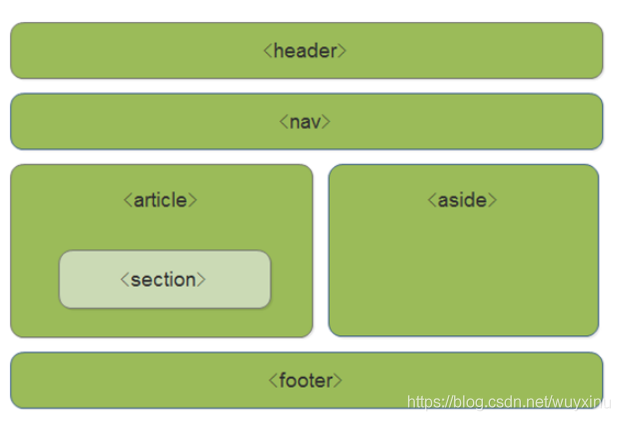

### 3.使用语义化标签的注意

- 语义化标签主要针对搜索引擎

- 新标签可以使用一次或者多次

- 在 `IE9` 浏览器中，需要把语义化标签都转换为块级元素

- 语义化标签，在移动端支持比较友好，

- 另外，`HTML5` 新增的了很多的语义化标签，随着课程深入，还会学习到其他的

## 三、多媒体音频标签

### 1.多媒体标签有两个，分别是

- 音频 -- `audio`

- 视频 -- `video`

### `2.audio` 标签说明

- 可以在不使用标签的情况下，也能够原生的支持音频格式文件的播放，

- 但是：播放格式是有限的

### 3.audio 支持的音频格式

 

- audio 目前支持三种格式

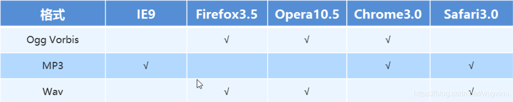

### 4.audio 的参数

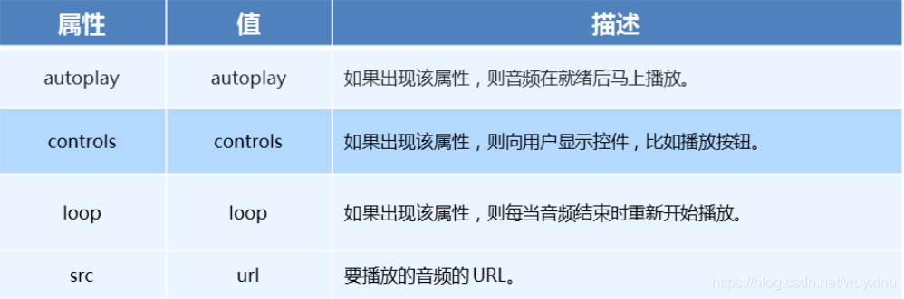

 

### 5、audio 代码演示

```java
<body>
  <!-- 注意：在 chrome 浏览器中已经禁用了 autoplay 属性 -->
  <!-- <audio src="./media/snow.mp3" controls autoplay></audio> -->

  <!-- 
    因为不同浏览器支持不同的格式，所以我们采取的方案是这个音频准备多个文件
   -->
  <audio controls>
    <source src="./media/snow.mp3" type="audio/mpeg" />
  </audio>
</body>
```


## 四、多媒体视频标签

### 1.video 视频标签

 

- 目前支持三种格式


### 2.语法格式

```java
<video src="./media/video.mp4" controls="controls"></video>
```


### 3.video 参数

 

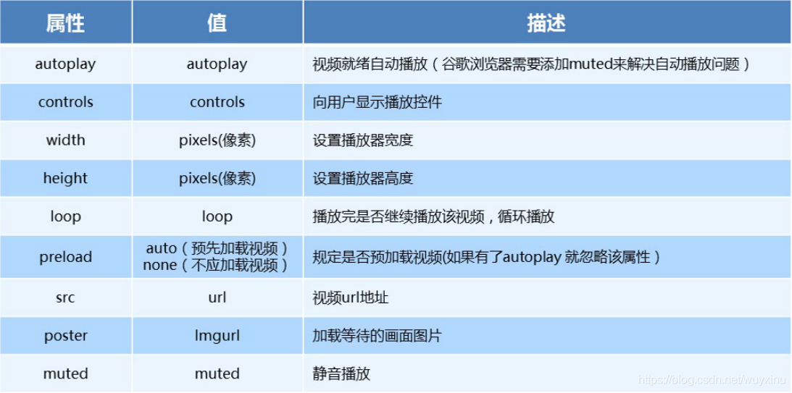

### 4.video 代码演示

```java
<body>
  <!-- <video src="./media/video.mp4" controls="controls"></video> -->

  <!-- 谷歌浏览器禁用了自动播放功能，如果想自动播放，需要添加 muted 属性 -->
  <video controls="controls" autoplay muted loop poster="./media/pig.jpg">
    <source src="./media/video.mp4" type="video/mp4">
    <source src="./media/video.ogg" type="video/ogg">
  </video>
</body>
```


### 5.多媒体标签总结

- 音频标签与视频标签使用基本一致

- 多媒体标签在不同浏览器下情况不同，存在兼容性问题

- 谷歌浏览器把音频和视频标签的自动播放都禁止了

- 谷歌浏览器中视频添加 muted 标签可以自己播放

- 注意：重点记住使用方法以及自动播放即可，其他属性可以在使用时查找对应的手册

## 五、新增 input 标签

 

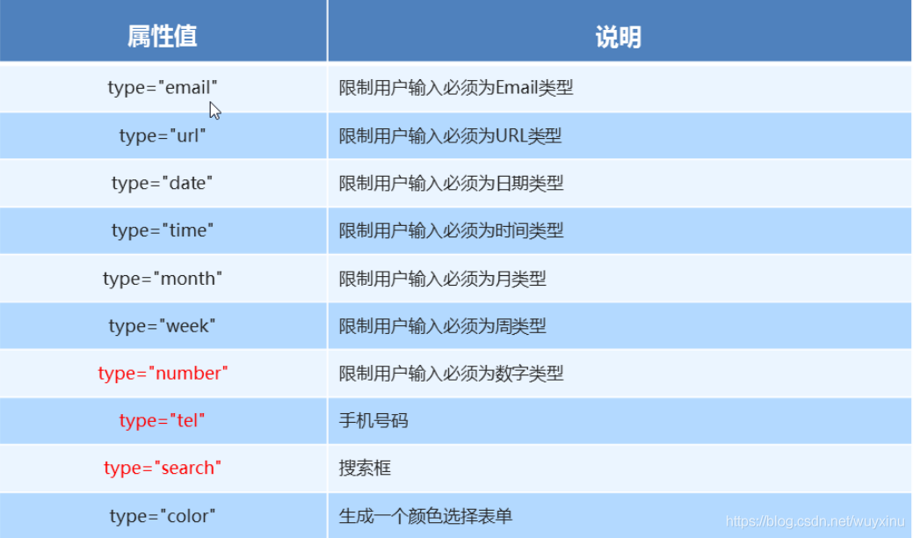

## 六、新增表单属性

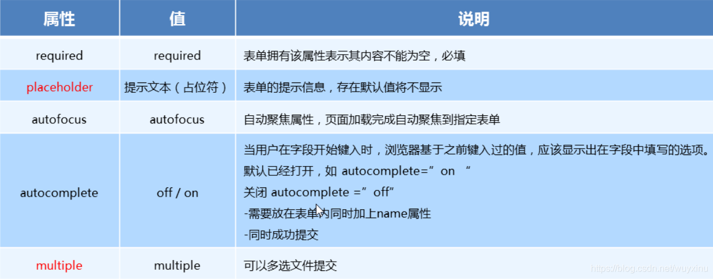

 

<font color=#000000>好了，以上就是HTML的入门与进阶的所有内容，谢谢观看，如果有兴趣学习前端内容的，可以点个赞+关注，博客里面的其余文章有兴趣的同学也可以去看看。</font>

 

 


</font>