<font face="Consolas">


### 文章目录

- [Vue](#Vue_2 "Vue")

-
   - 
      - [预备知识与后续知识及项目案例](#_4 "预备知识与后续知识及项目案例")

   - [一、简介](#_15 "一、简介")

   - 
      - [1.Vue (读音 /vjuː/，类似于 view)的简单认识](#1Vue__vju_view_17 "1.Vue (读音 /vjuː/，类似于 view)的简单认识")

      - [2.Vue.js安装](#2Vuejs_38 "2.Vue.js安装")

   - [二、Vue知识量化](#Vue_66 "二、Vue知识量化")

   - [三、内容](#_70 "三、内容")

   - 
      - [1、Vue中的MVVM](#1VueMVVM_74 "1、Vue中的MVVM")

      - 
         - [（1）什么是MVVM呢？](#1MVVM_76 "（1）什么是MVVM呢？")

         - [（2）Vue的MVVM](#2VueMVVM_82 "（2）Vue的MVVM")

      - [2、Vue的生命周期](#2Vue_126 "2、Vue的生命周期")

      - [3、基础语法](#3_132 "3、基础语法")

      - 
         - [Mustache](#Mustache_134 "Mustache")

         - [v-once](#vonce_144 "v-once")

         - [v-html](#vhtml_159 "v-html")

         - [v-text](#vtext_174 "v-text")

         - [v-pre](#vpre_187 "v-pre")

         - [v-cloak](#vcloak_200 "v-cloak")

         - [v-bind](#vbind_208 "v-bind")

         - 
            - [基础](#_210 "基础")

            - [v-bind语法糖](#vbind_231 "v-bind语法糖")

            - [v-bind绑定class](#vbindclass_238 "v-bind绑定class")

            - [v-bind 动态绑定style](#vbind_style_342 "v-bind 动态绑定style")

         - [计算属性 computed](#_computed_377 "计算属性 computed")

         - 
            - [计算属性的setter和getter](#settergetter_398 "计算属性的setter和getter")

            - [computed区别于method的核心](#computedmethod_414 "computed区别于method的核心")

         - [事件监听 v-on](#_von_426 "事件监听 v-on")

         - [条件判断 v-if、v-else-if、v-else、及条件渲染 v-show](#_vifvelseifvelse_vshow_460 "条件判断 v-if、v-else-if、v-else、及条件渲染 v-show")

         - 
            - [v-if、v-else-if、v-else](#vifvelseifvelse_462 "v-if、v-else-if、v-else")

            - [v-show](#vshow_476 "v-show")

            - [v-show 和 v-if 的区别](#vshow__vif__480 "v-show 和 v-if 的区别")

         - [v-for](#vfor_501 "v-for")

         - 
            - [组件的key属性](#key_529 "组件的key属性")

            - [检测数组更新](#_559 "检测数组更新")

            - [案例：[图书购物车](#shopCart)](#shopCart_582 "案例：[图书购物车](#shopCart)")

         - [v-model](#vmodel_586 "v-model")

         - 
            - [v-model原理](#vmodel_606 "v-model原理")

            - [v-model：radio](#vmodelradio_622 "v-model：radio")

            - [v-model：checkbox](#vmodelcheckbox_628 "v-model：checkbox")

            - [v-model：select](#vmodelselect_646 "v-model：select")

            - [v-model双向绑定数组数据时遇到的天坑](#vmodel_662 "v-model双向绑定数组数据时遇到的天坑")

            - [修饰符](#_719 "修饰符")

      - [4、组件化开发](#4_740 "4、组件化开发")

      - 
         - [认识组件化](#_742 "认识组件化")

         - [Vue组件化思想](#Vue_762 "Vue组件化思想")

         - [注册组件](#_775 "注册组件")

         - [组件其他补充](#_813 "组件其他补充")

         - [组件数据存放](#_850 "组件数据存放")

         - [父子组件通信](#_885 "父子组件通信")

         - [插槽slot(Vue 2.6之前用法)](#slotVue_26_942 "插槽slot(Vue 2.6之前用法)")

         - [**插槽slot(Vue 2.6之后用法)**](#slotVue_26_1059 "**插槽slot(Vue 2.6之后用法)**")

      - [5、模块化开发](#5_1334 "5、模块化开发")

      - 
         - [为什么需要模块化](#_1336 "为什么需要模块化")

         - [CommonJS（了解）](#CommonJS_1388 "CommonJS（了解）")

         - [ES6的export和import](#ES6exportimport_1399 "ES6的export和import")

   - [四、案例](#_1451 "四、案例")

   - 
      - [1、图书购物车](#1span_idshopCartspan_1452 "1、图书购物车")

# Vue

### 预备知识与后续知识及项目案例

[HTML入门与进阶以及HTML5](https://blog.csdn.net/wuyxinu/article/details/103515157 "HTML入门与进阶以及HTML5")
[CSS ](https://blog.csdn.net/wuyxinu/article/details/103583618 "CSS ")
[JS-上](https://blog.csdn.net/wuyxinu/article/details/103642800 "JS-上")
[JS-下](https://blog.csdn.net/wuyxinu/article/details/103646041 "JS-下")
[jQuery](https://blog.csdn.net/wuyxinu/article/details/103669718 "jQuery")
[Node.js + Gulp 知识点汇总](https://blog.csdn.net/wuyxinu/article/details/103774211 "Node.js + Gulp 知识点汇总")
[MongoDB + Express 入门及案例代码](https://blog.csdn.net/wuyxinu/article/details/103836507 "MongoDB + Express 入门及案例代码")
[Vue项目开发-仿蘑菇街电商APP](https://blog.csdn.net/wuyxinu/article/details/103684950 "Vue项目开发-仿蘑菇街电商APP")
[Vue 知识点汇总（下）–附案例代码及项目地址](https://blog.csdn.net/wuyxinu/article/details/103966175 "Vue 知识点汇总（下）–附案例代码及项目地址")

## 一、简介

### 1.Vue (读音 /vjuː/，类似于 view)的简单认识

（1）Vue是一个渐进式的框架，什么是渐进式的呢？

- 渐进式意味着你可以将Vue作为你应用的一部分嵌入其中，带来更丰富的交互体验。

- 或者如果你希望将更多的业务逻辑使用Vue实现，那么Vue的核心库以及其生态系统。

- 比如Core+Vue-router+Vuex，也可以满足你各种各样的需求。

（2）Vue有很多特点和Web开发中常见的高级功能

- 解耦视图和数据

- 可复用的组件

- 前端路由技术

- 状态管理

- 虚拟DOM

这些特点，你不需要一个个去记住，我们在后面的学习和开发中都会慢慢体会到的，一些技术点我也会在后面进行讲解。
（3）学习Vuejs的前提？
从零学习Vue开发，并不需要你具备其他类似于Angular、React，甚至是jQuery的经验。
但是你需要具备一定的HTML、CSS、JavaScript基础。

### 2.Vue.js安装

使用一个框架，我们第一步要做什么呢？安装下载它

安装Vue的方式有很多：

**方式一：直接CDN引入**
你可以选择引入开发环境版本还是生产环境版本

```java
<!-- 开发环境版本，包含了有帮助的命令行警告 --> 
<script src="https://cdn.jsdelivr.net/npm/vue/dist/vue.js"></script>
<!-- 生产环境版本，优化了尺寸和速度 -->
<script src="https://cdn.jsdelivr.net/npm/vue"></script>
```


**方式二：下载和引入**

开发环境 https://vuejs.org/js/vue.js

生产环境 https://vuejs.org/js/vue.min.js

**方式三：NPM安装**

后续通过webpack和CLI的使用，我们使用该方式。

## 二、Vue知识量化


## 三、内容

注：本文多数内容属于Vue2.6之前的内容，只有较为重要的地方才会补充2.6版本之后的内容，望周知。

### 1、Vue中的MVVM

#### （1）什么是MVVM呢？

通常我们学习一个概念，最好的方式是去看维基百科(对，千万别看成了百度百科)
https://zh.wikipedia.org/wiki/MVVM
维基百科的官方解释，我们这里不再赘述。

#### （2）Vue的MVVM

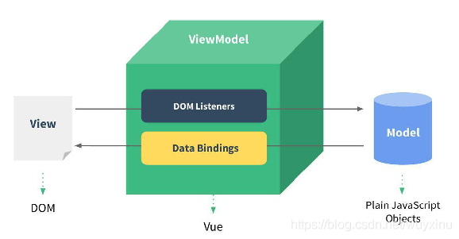

**View层：**

- 视图层

- 在我们前端开发中，通常就是DOM层。

- 主要的作用是给用户展示各种信息。

**Model层：**

- 数据层

- 数据可能是我们固定的死数据，更多的是来自我们服务器，从网络上请求下来的数据。

- 在我们计数器的案例中，就是后面抽取出来的obj，当然，里面的数据可能没有这么简单。

**ViewModel层：**

- 视图模型层

- 视图模型层是View和Model沟通的桥梁。

- 一方面它实现了Data Binding，也就是数据绑定，将Model的改变实时的反应到View中

- 另一方面它实现了DOM Listener，也就是DOM监听，当DOM发生一些事件(点击、滚动、touch等)时，可以监听到，并在需要的情况下改变对应的Data。

1.MVVC 和 MVC

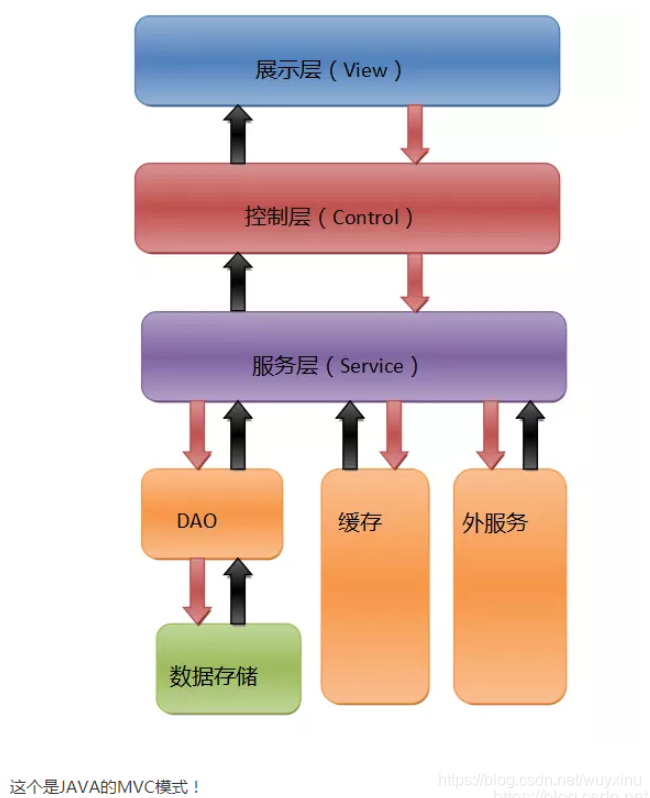

在前端的MVC模式中，M还是表示Modal层，负责与后台交互数据，V表示View，负责页面上DOM的渲染，C表示绑定在DOM元素上的事件，当Controllor中的事件被调用，会去调用Modal中的数据，然后交给View重新渲染数据

[框架篇—MVC、MVP、MVCS、MVVM、VIPER使用关系总结](https://www.jianshu.com/p/b42a26623aeb "框架篇—MVC、MVP、MVCS、MVVM、VIPER使用关系总结")

[mvc和mvvm的区别](https://www.jianshu.com/p/b0aab1ffad93 "mvc和mvvm的区别")

MVC

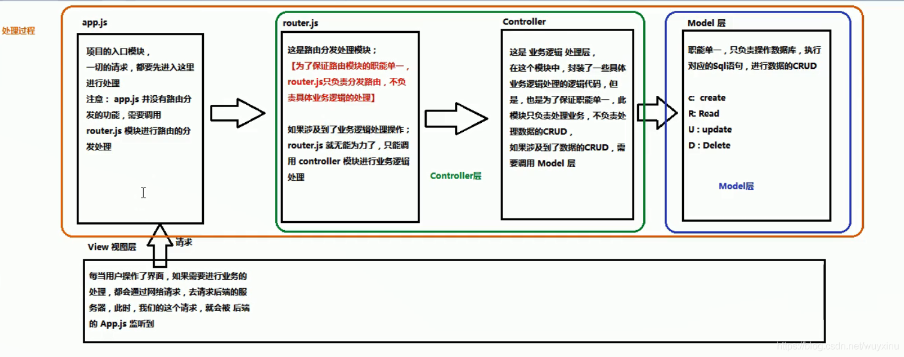

MVVM为前端view里面的

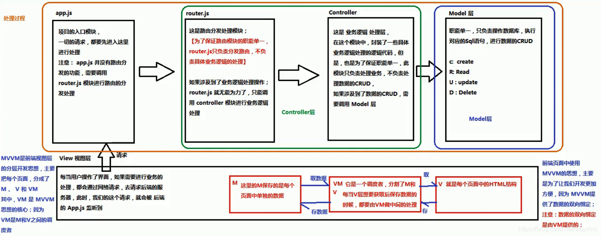

### 2、Vue的生命周期

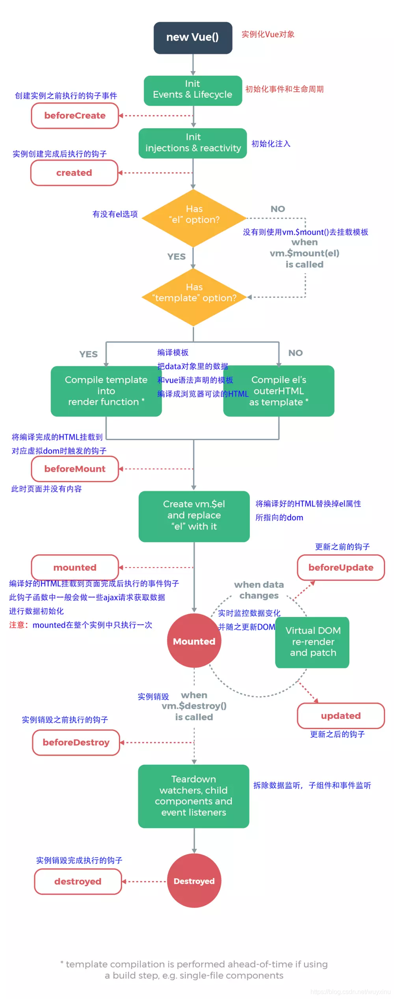

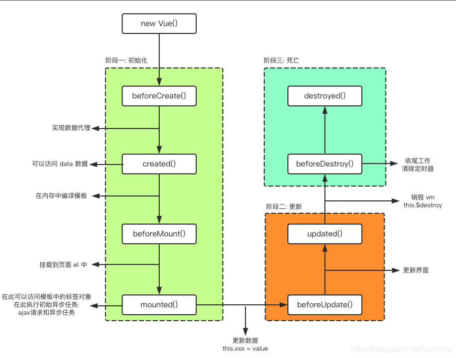

### 3、基础语法

#### Mustache

- 如何将data中的文本数据，插入到HTML中呢？

   - 已经学习过了，可以通过Mustache语法(也就是双大括号)。

   - Mustache: 胡子/胡须.

- 我们可以像下面这样来使用，并且数据是响应式的

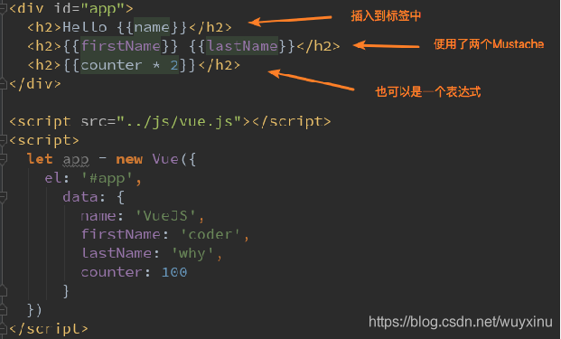

#### v-once

- 但是，在某些情况下，我们可能不希望界面随意的跟随改变

   - 这个时候，我们就可以使用一个Vue的指令

- v-once:

   - 该指令后面不需要跟任何表达式(比如之前的v-for后面是由跟表达式的)

   - 该指令表示元素和组件(组件后面才会学习)只渲染一次，不会随着数据的改变而改变。

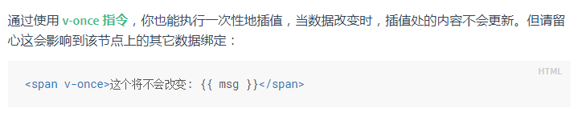

只渲染一次，不会再被改变

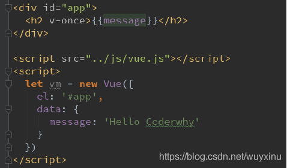

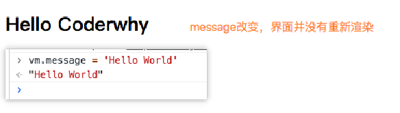

#### v-html

- 某些情况下，我们从服务器请求到的数据本身就是一个HTML代码

   - 如果我们直接通过{{}}来输出，会将HTML代码也一起输出。

   - 但是我们可能希望的是按照HTML格式进行解析，并且显示对应的内容。

- 如果我们希望解析出HTML展示

   - 可以使用v-html指令
      - 该指令后面往往会跟上一个string类型

      - 会将string的html解析出来并且进行渲染

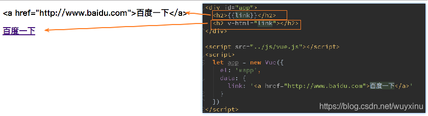

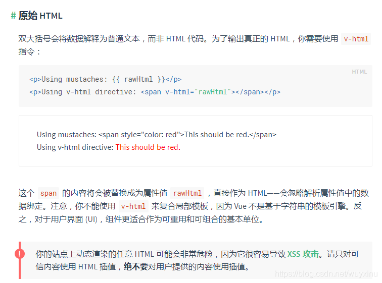

#### v-text

- v-text作用和Mustache比较相似：都是用于将数据显示在界面中

- v-text通常情况下，接受一个string类型

在不想用mustache语法的时候，可以使用这样

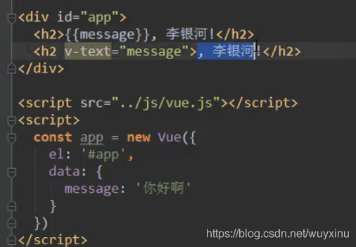


但它不够灵活。建议使用mastache语法

#### v-pre

将代码原封不动的解析出来，不做任何处理

- v-pre用于跳过这个元素和它子元素的编译过程，用于显示原本的Mustache语法。

- 比如下面的代码：
第一个h2元素中的内容会被编译解析出来对应的内容
第二个h2元素中会直接显示{{message}}

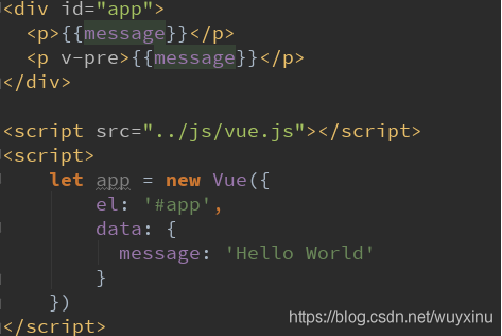


#### v-cloak

将未解析出来的代码块进行隐藏

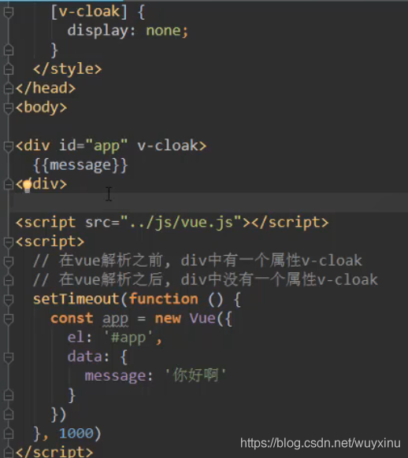

但基本不会用到

#### v-bind

##### 基础

- 前面我们学习的指令主要作用是将值插入到我们模板的内容当中。

- 但是，除了内容需要动态来决定外，某些属性我们也希望动态来绑定。

   - 比如动态绑定a元素的href属性

   - 比如动态绑定img元素的src属性

- 这个时候，我们可以使用v-bind指令：
作用：动态绑定属性
缩写：:
预期：any (with argument) | Object (without argument)
参数：attrOrProp (optional)

- v-bind用于绑定一个或多个属性值，或者向另一个组件传递props值(这个学到组件时再介绍)

- 在开发中，有哪些属性需要动态进行绑定呢？

   - 还是有很多的，比如图片的链接src、网站的链接href、动态绑定一些类、样式等等

- 比如通过Vue实例中的data绑定元素的src和href，代码如下：

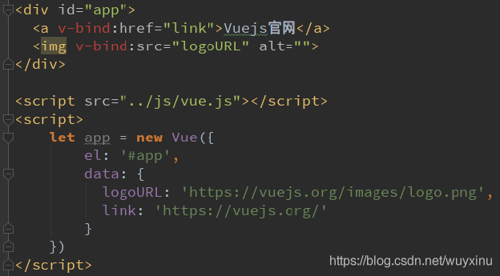


##### v-bind语法糖

v-bind有一个对应的语法糖，也就是简写方式
在开发中，我们通常会使用语法糖的形式，因为这样更加简洁。
简写方式如下：

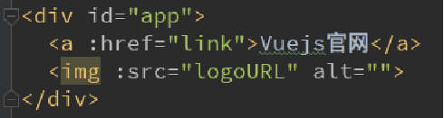

##### v-bind绑定class

- 很多时候，我们希望动态的来切换class，比如：
   - 当数据为某个状态时，字体显示红色。

   - 当数据另一个状态时，字体显示黑色。

- 绑定class有两种方式：
   - 对象语法

   - 数组语法

（1）绑定方式：对象语法

- 对象语法的含义是:class后面跟的是一个对象。

对象语法有下面这些用法：

```java
用法一：直接通过{}绑定一个类
<h2 :class="{'active': isActive}">Hello World</h2>

用法二：也可以通过判断，传入多个值
<h2 :class="{'active': isActive, 'line': isLine}">Hello World</h2>

用法三：和普通的类同时存在，并不冲突
注：如果isActive和isLine都为true，那么会有title/active/line三个类
<h2 class="title" :class="{'active': isActive, 'line': isLine}">Hello World</h2>

用法四：如果过于复杂，可以放在一个methods或者computed中
注：classes是一个计算属性
<h2 class="title" :class="getclasses">Hello World</h2>
```


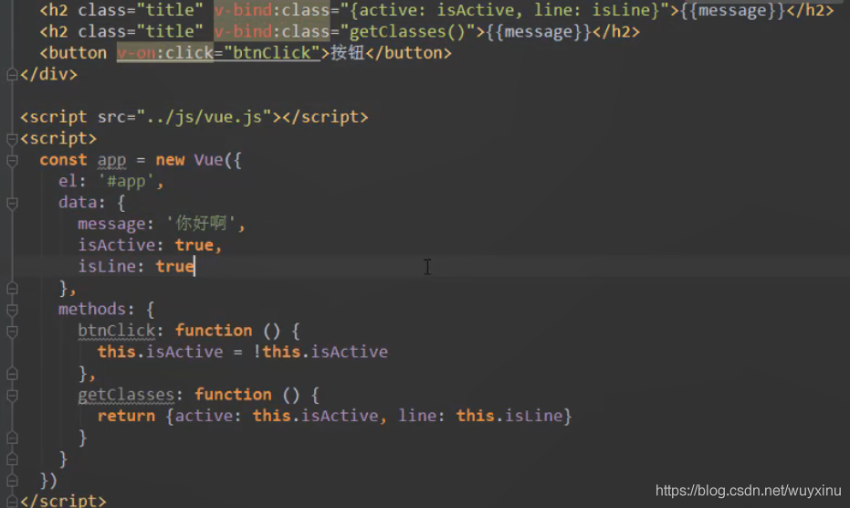

（2）绑定方式：数组语法

- 数组语法的含义是:class后面跟的是一个数组。

数组语法有下面这些用法：

```java
用法一：直接通过{}绑定一个类
<h2 :class="['active']">Hello World</h2>

用法二：也可以传入多个值
<h2 :class=“[‘active’, 'line']">Hello World</h2>

用法三：和普通的类同时存在，并不冲突
注：会有title/active/line三个类
<h2 class="title" :class=“[‘active’, 'line']">Hello World</h2>

用法四：如果过于复杂，可以放在一个methods或者computed中
注：classes是一个计算属性
<h2 class="title" :class="classes">Hello World</h2>
```


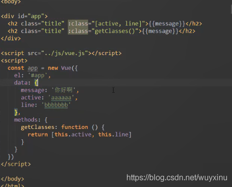

案例：vue v-for出来的列表，点击当前，当前被点击的字体变颜色

```java
<!DOCTYPE html>
<html lang="en">

<head>
    <meta charset="UTF-8">
    <meta name="viewport" content="width=device-width, initial-scale=1.0">
    <meta http-equiv="X-UA-Compatible" content="ie=edge">
    <title>Document</title>
    <style>
        .active {
            color: red;
        }
    </style>
    <script src="../js/vue.js"></script>
</head>

<body>
    <div id="app">
        <ul>
            <li v-for="(m,item) in movies">
                <a @click="btnClick(item)" :key="item" :class="{active:i===item}">{{item}}--{{m}}</a></li>
        </ul>
    </div>

    <script>
        //创建Vue实例,得到 ViewModel
        var vm = new Vue({
            el: '#app',
            data: {
                movies: ['海王', '星际穿越', '大话西游', '少年派', '盗梦空间'],
                i: 0,
            },
            methods: {
                btnClick: function (index) {
                    this.i = index;
                },
            }
        });
    </script>
</body>

</html>
```


##### v-bind 动态绑定style

我们可以利用v-bind:style来绑定一些CSS内联样式。

在写CSS属性名的时候，比如font-size

- 我们可以使用驼峰式 (camelCase) fontSize

- 或短横线分隔 (kebab-case，记得用单引号括起来) ‘font-size’

绑定class有两种方式：

- 对象语法

- 数组语法

（1）绑定方式一：对象语法

```java
:style="{color: currentColor, fontSize: fontSize + 'px'}"
```


style后面跟的是一个对象类型

- 对象的key是CSS属性名称

- 对象的value是具体赋的值，值可以来自于data中的属性

（2）绑定方式二：数组语法

```java
<div v-bind:style="[baseStyles, overridingStyles]"></div>
```


style后面跟的是一个数组类型

多个值以，分割即可

#### 计算属性 computed

我们知道，在模板中可以直接通过插值语法显示一些data中的数据。

但是在某些情况，我们可能需要对数据进行一些转化后再显示，或者需要将多个数据结合起来进行显示

- 比如我们有firstName和lastName两个变量，我们需要显示完整的名称。

- 但是如果多个地方都需要显示完整的名称，我们就需要写多个{{firstName}} {{lastName}}

我们可以将上面的代码换成计算属性：

- OK，我们发现计算属性是写在实例的computed选项中的。

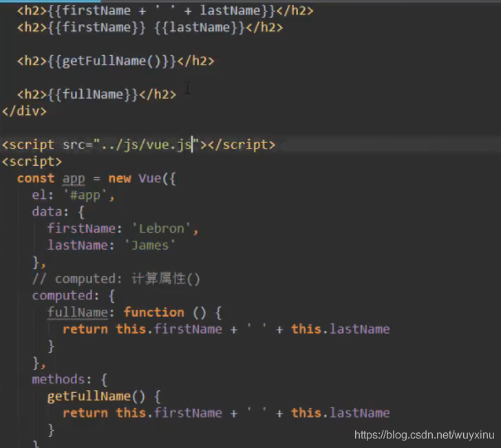

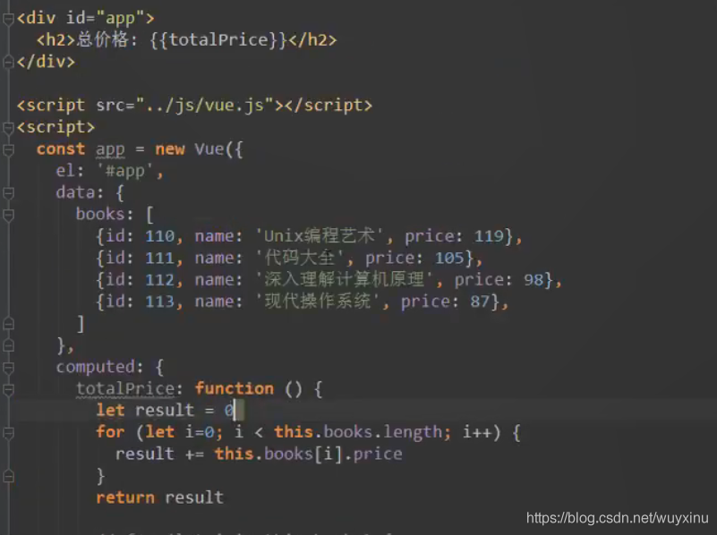

计算属性中也可以进行一些更加复杂的操作，比如下面的例子：

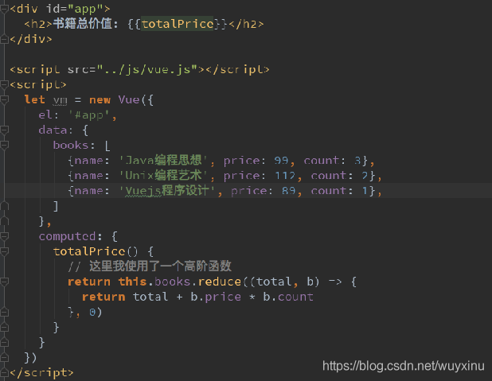

##### 计算属性的setter和getter

每个计算属性都包含一个getter和一个setter

- 在上面的例子中，我们只是使用getter来读取。

- 在某些情况下，你也可以提供一个setter方法（不常用）。

- 在需要写setter的时候，代码如下：

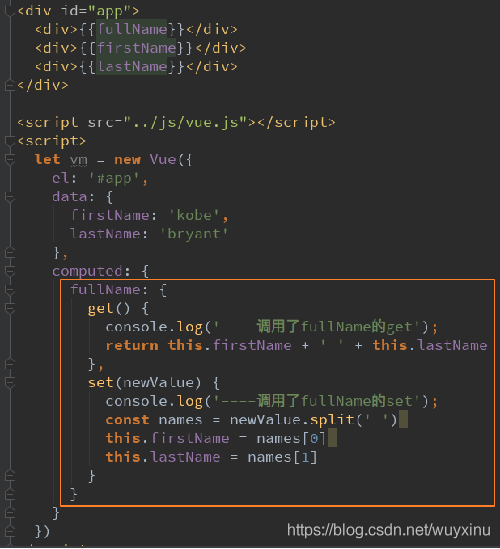

我们可能会考虑这样的一个问题：

- methods和computed看起来都可以实现我们的功能，

- 那么为什么还要多一个计算属性这个东西呢？

- 原因：计算属性会进行缓存，如果多次使用时，计算属性只会调用一次。

##### computed区别于method的核心

在官方文档中，强调了computed区别于method最重要的两点

1. computed是**属性调用**，而methods是**函数调用**

2. computed带有**缓存功能**，而methods不是

3. computed定义的方法我们是以属性访问的形式调用的，`{{computedTest}}`

4. 但是methods定义的方法，我们必须要加上`()`来调用，如`{{methodTest()}}`，**否则，视图会出现test1的情况**，见下图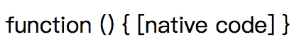

5. 我们可以将同一函数定义为一个方法而不是一个计算属性。两种方式的最终结果确实是**完全相同**的。然而，不同的是计算属性是基于它们的响应式依赖进行缓存的。只在相关响应式依赖发生改变时它们才会重新求值。这就意味着只要 `text` 还没有发生改变，多次访问 `getText` 计算属性会立即返回之前的计算结果，而不必再次执行函数。而方法只要页面中的属性发生改变就会重新执行

6. **对于任何复杂逻辑，你都应当使用计算属性**

7. **computed依赖于data中的数据，只有在它的相关依赖数据发生改变时才会重新求值**

#### 事件监听 v-on

在前端开发中，我们需要经常和用于交互。

- 这个时候，我们就必须监听用户发生的时间，比如点击、拖拽、键盘事件等等

- 在Vue中如何监听事件呢？使用v-on指令

v-on介绍

- 作用：绑定事件监听器

- 缩写：@

- 预期：Function | Inline Statement | Object

- 参数：event

当通过methods中定义方法，以供@click调用时，需要注意参数问题：

- 情况一：如果该方法不需要额外参数，那么方法后的()可以不添加。
但是注意：如果方法本身中有一个参数，那么会默认将原生事件event参数传递进去

- 情况二：如果需要同时传入某个参数，同时需要event时，可以通过$event传入事件。

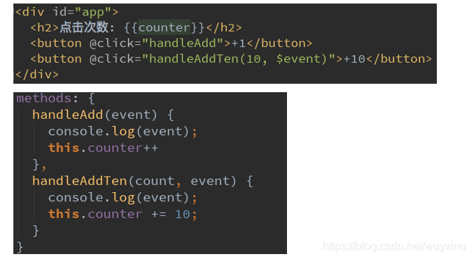

在某些情况下，我们拿到event的目的可能是进行一些事件处理。

Vue提供了修饰符来帮助我们方便的处理一些事件：

- .stop - 调用 event.stopPropagation()。

- .prevent - 调用 event.preventDefault()。

- .{keyCode | keyAlias} - 只当事件是从特定键触发时才触发回调。

- .native - 监听组件根元素的原生事件。

- .once - 只触发一次回调。

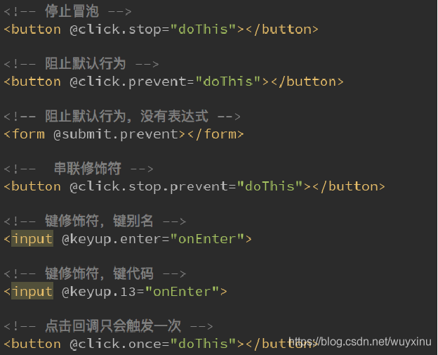

#### 条件判断 v-if、v-else-if、v-else、及条件渲染 v-show

##### v-if、v-else-if、v-else

这三个指令与JavaScript的条件语句if、else、else if类似。

Vue的条件指令可以根据表达式的值在DOM中渲染或销毁元素或组件

简单的案例演示：
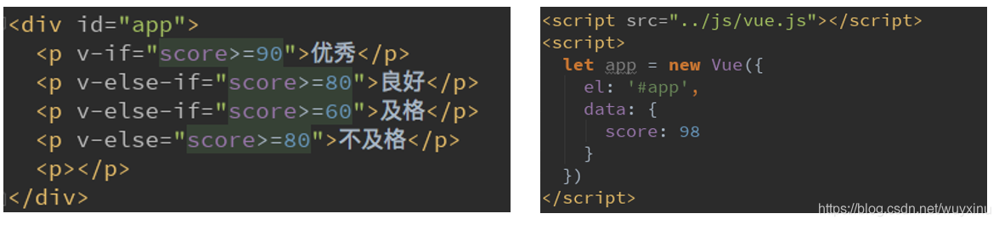

v-if的原理：

- v-if后面的条件为false时，对应的元素以及其子元素不会渲染。

- 也就是根本没有不会有对应的标签出现在DOM中。

##### v-show

v-show的用法和v-if非常相似，也用于决定一个元素是否渲染：

##### v-show 和 v-if 的区别

- v-if是真正的条件渲染，他会确保在切换过程中条件块内的时间和子组件被销毁和重建（组件被重建将会调用created）

- v-show不论如何，都会被渲染在DOM中，当条件为真值时，将会修改条件的css样式

- v-if有更高的切换开销，v-show有更高的初始渲染开销

- v-if是动态的向DOM树内添加或者删除DOM元素；v-show是通过设置DOM元素的display样式属性控制显隐；

- v-if切换有一个局部编译/卸载的过程，切换过程中合适地销毁和重建内部的事件监听和子组件；v-show只是简单的基于css切换；

- v-if是惰性的，如果初始条件为假，则什么也不做；只有在条件第一次变为真时才开始局部编译（编译被缓存？编译被缓存后，然后再切换的时候进行局部卸载); v-show是在任何条件下（首次条件是否为真）都被编译，然后被缓存，而且DOM元素保留；

- v-if有更高的切换消耗；v-show有更高的初始渲染消耗；

- v-if适合运营条件不大可能改变；v-show适合频繁切换。

v-if和v-show都可以决定一个元素是否渲染，那么开发中我们如何选择呢？

- v-if当条件为false时，压根不会有对应的元素在DOM中。

- v-show当条件为false时，仅仅是将元素的display属性设置为none而已。

开发中如何选择呢？

- 当需要在显示与隐藏之间切片很频繁时，使用v-show

- 当只有一次切换时，通过使用v-if

#### v-for

当我们有一组数据需要进行渲染时，我们就可以使用v-for来完成。

v-for的语法类似于JavaScript中的for循环。

- 格式如下：item in items的形式。

我们来看一个简单的案例：

如果在遍历的过程中不需要使用索引值

- v-for=“movie in movies”

- 依次从movies中取出movie，并且在元素的内容中，我们可以使用Mustache语法，来使用movie

如果在遍历的过程中，我们需要拿到元素在数组中的索引值呢？

- 语法格式：v-for=(item, index) in items

- 其中的index就代表了取出的item在原数组的索引值。

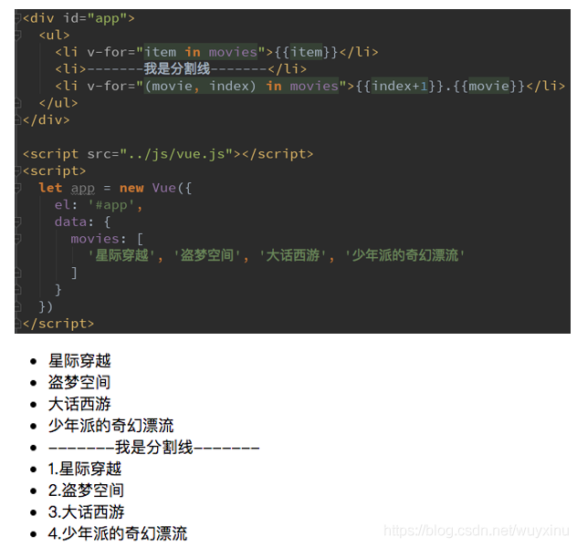

v-for可以用户遍历对象：

比如某个对象中存储着你的个人信息，我们希望以列表的形式显示出来。

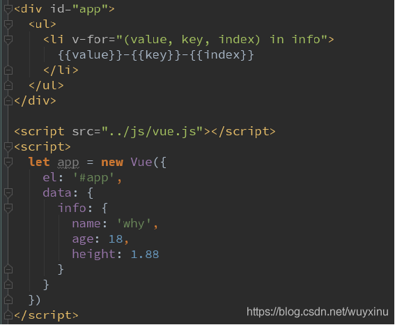

##### 组件的key属性

官方推荐我们在使用v-for时，给对应的元素或组件添加上一个:key属性。

为什么需要这个key属性呢（了解）？

- 这个其实和Vue的虚拟DOM的Diff算法有关系。

- 这里我们借用React’s diff algorithm中的一张图来简单说明一下：

当某一层有很多相同的节点时，也就是列表节点时，我们希望插入一个新的节点

- 我们希望可以在B和C之间加一个F，Diff算法默认执行起来是这样的。

- 即把C更新成F，D更新成C，E更新成D，最后再插入E，是不是很没有效率？

所以我们需要使用key来给每个节点做一个唯一标识

- Diff算法就可以正确的识别此节点

- 找到正确的位置区插入新的节点。

所以一句话，key的作用主要是为了高效的更新虚拟DOM。

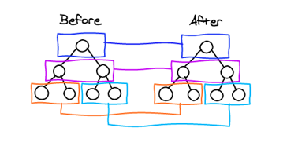

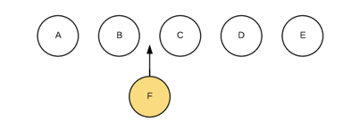

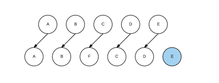

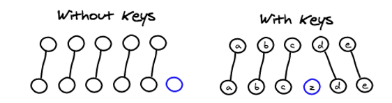

##### 检测数组更新

因为Vue是响应式的，所以当数据发生变化时，Vue会自动检测数据变化，视图会发生对应的更新。

Vue中包含了一组观察数组编译的方法，使用它们改变数组也会触发视图的更新。

- push()

- pop()

- shift()

- unshift()

- splice()

- sort()

- reverse()

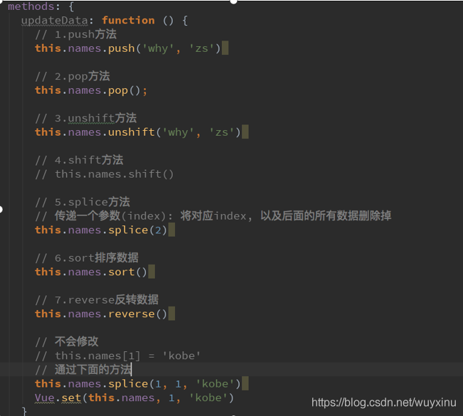

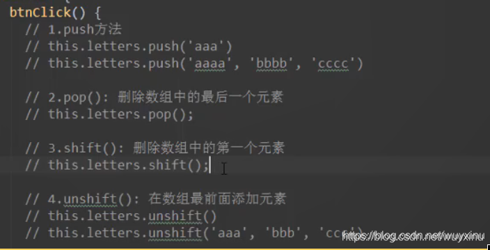

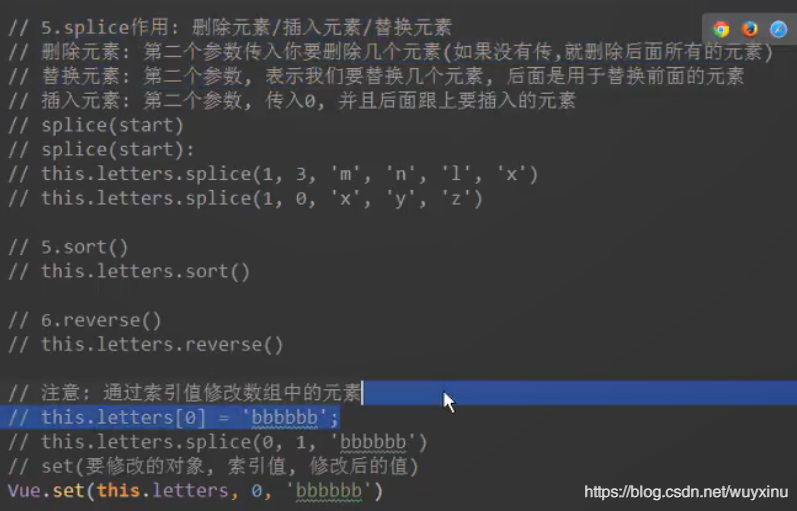

注:通过索引值修改数组中的元素不是响应式的

##### 案例：[图书购物车](#shopCart "图书购物车")

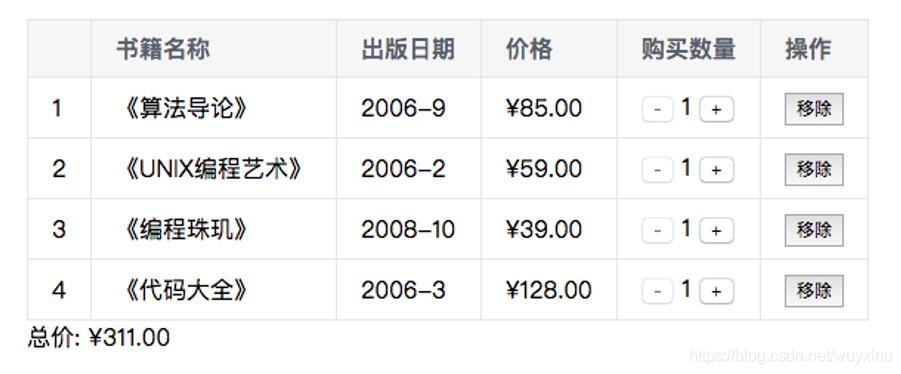

#### v-model

表单控件在实际开发中是非常常见的。特别是对于用户信息的提交，需要大量的表单。

Vue中使用v-model指令来实现表单元素和数据的双向绑定。

案例的解析：

- 当我们在输入框输入内容时

- 因为input中的v-model绑定了message，所以会实时将输入的内容传递给message，message发生改变。

- 当message发生改变时，因为上面我们使用Mustache语法，将message的值插入到DOM中，所以DOM会发生响应的改变。

- 所以，通过v-model实现了双向的绑定。

当然，我们也可以将v-model用于textarea元素

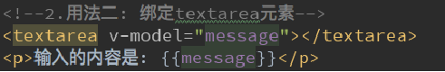

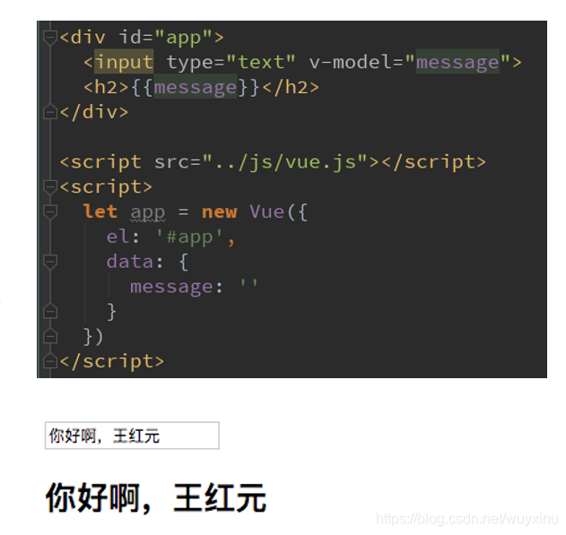

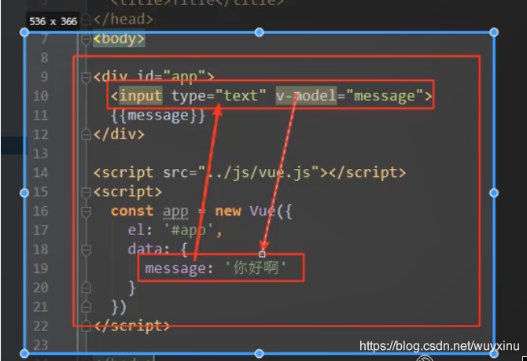

##### v-model原理

v-model其实是一个语法糖，它的背后本质上是包含两个操作：

1.v-bind绑定一个value属性

2.v-on指令给当前元素绑定input事件

也就是说下面的代码：等同于下面的代码：

```java
<input type="text" v-model="message">
等同于
<input type="text" v-bind:value="message" v-on:input="message = $event.target.value">
```


##### v-model：radio

当存在多个单选框时

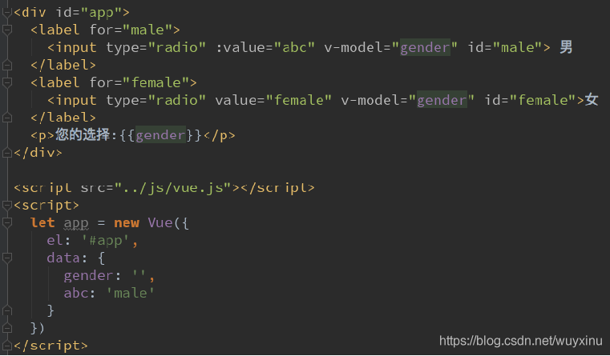

##### v-model：checkbox

复选框分为两种情况：单个勾选框和多个勾选框

单个勾选框：

- v-model即为布尔值。

- 此时input的value并不影响v-model的值。

多个复选框：

- 当是多个复选框时，因为可以选中多个，所以对应的data中属性是一个数组。

- 当选中某一个时，就会将input的value添加到数组中。

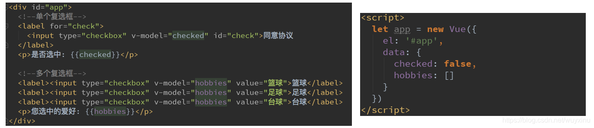

lable好处就是用户可以点击文字也会选中

##### v-model：select

和checkbox一样，select也分单选和多选两种情况。

单选：只能选中一个值。

- v-model绑定的是一个值。

- 当我们选中option中的一个时，会将它对应的value赋值到mySelect中

多选：可以选中多个值。

- v-model绑定的是一个数组。

- 当选中多个值时，就会将选中的option对应的value添加到数组mySelects中

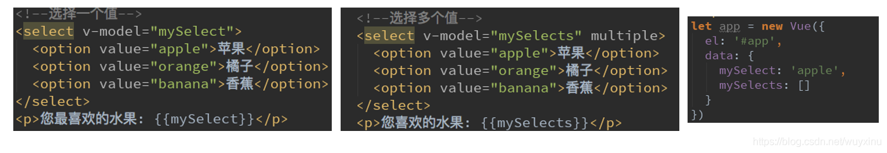

##### v-model双向绑定数组数据时遇到的天坑

```java
<body>
    <div id ="app"> 
        <input type="checkbox" value="篮球"  v-model="hobbies">篮球
        <input type="checkbox" value="羽毛球"  v-model="hobbies">羽毛球
        <input type="checkbox" value="兵乓球"  v-model="hobbies">兵乓球
        <input type="checkbox" value="足球"  v-model="hobbies">足球

        <h2>您的爱好是：{{hobbies}}</h2>

        <label v-for="item in originHobbies" :for="item">
            <input type="checkbox" :value="item" :id="item" v-model="hobbies">{{item}}
        </label>
        
    </div>

    <script>
     //创建Vue实例,得到 ViewModel
     var vm = new Vue({
        el: '#app',
        data: {
            url:'<a href="http://www.baidu.com">百度一下</a>',

            hobbies: [],
            originHobbies:['篮球', '足球', '台球', '高尔夫球', '羽毛球'],
        },
        
        methods: {}
     });
    </script>
</body>
```


用Chrome浏览器

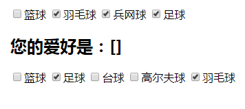

用360浏览器

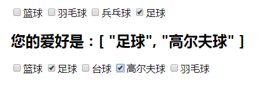

查看了几个文档后发现是Chrome不兼容Object.observe

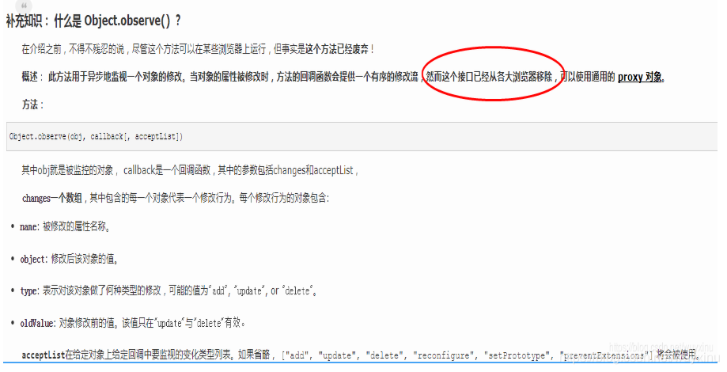

**解决方法**

使用 `Vue.set(object, key, value)` 方法将响应属性添加到嵌套的对象上。 还可以使用 `vm.$set` 实例方法，这也是全局 `Vue.set` 方法的别名。

[vue中遇到的坑 — 变化检测问题（数组相关）](https://www.cnblogs.com/zhuzhenwei918/p/6893496.html "vue中遇到的坑 — 变化检测问题（数组相关）")

[深入响应式原理](https://cn.vuejs.org/v2/guide/reactivity.html "深入响应式原理")

也就是说，因为360浏览器太老（没有更新）的原因，没有废弃object.server，所以才能够这样用。现阶段只能使用vue.set

##### 修饰符

lazy修饰符：

- 默认情况下，v-model默认是在input事件中同步输入框的数据的。

- 也就是说，一旦有数据发生改变对应的data中的数据就会自动发生改变。

- lazy修饰符可以让数据在失去焦点或者回车时才会更新：

number修饰符：

- 默认情况下，在输入框中无论我们输入的是字母还是数字，都会被当做字符串类型进行处理。

- 但是如果我们希望处理的是数字类型，那么最好直接将内容当做数字处理。

- number修饰符可以让在输入框中输入的内容自动转成数字类型：

trim修饰符：

- 如果输入的内容首尾有很多空格，通常我们希望将其去除

- trim修饰符可以过滤内容左右两边的空格

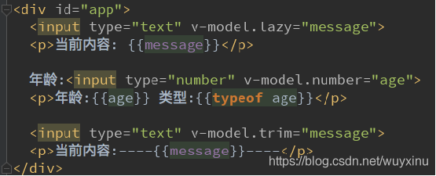

### 4、组件化开发

#### 认识组件化

人面对复杂问题的处理方式：

任何一个人处理信息的逻辑能力都是有限的

所以，当面对一个非常复杂的问题时，我们不太可能一次性搞定一大堆的内容。

但是，我们人有一种天生的能力，就是将问题进行**拆解**。

如果将一个复杂的问题，拆分成很多个可以处理的小问题，再将其放在整体当中，你会发现大的问题也会迎刃而解。

组件化也是类似的思想：

如果我们将一个页面中所有的处理逻辑全部放在一起，处理起来就会变得非常复杂，而且不利于后续的管理以及扩展。

但如果，我们讲一个页面拆分成一个个小的功能块，每个功能块完成属于自己这部分独立的功能，那么之后整个页面的管理和维护就变得非常容易了。

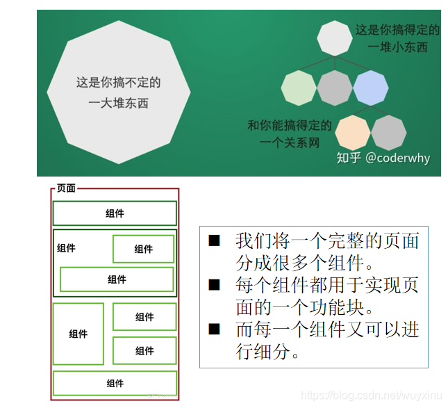

#### Vue组件化思想

组件化是Vue.js中的重要思想
它提供了一种抽象，让我们可以开发出一个个独立可复用的小组件来构造我们的应用。
任何的应用都会被抽象成一颗组件树。

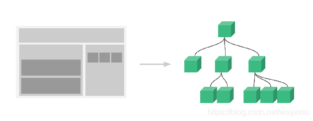

组件化思想的应用：
有了组件化的思想，我们在之后的开发中就要充分的利用它。
尽可能的将页面拆分成一个个小的、可复用的组件。
这样让我们的代码更加方便组织和管理，并且扩展性也更强。

#### 注册组件

组件的使用分成三个步骤：

- 创建组件构造器

- 注册组件

- 使用组件。

我们来看看通过代码如何注册组件

查看运行结果：

- 和直接使用一个div看起来并没有什么区别。

- 但是我们可以设想，如果很多地方都要显示这样的信息，我们是不是就可以直接使用来完成呢？

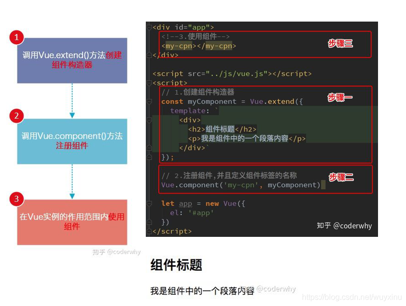

这里的步骤都代表什么含义呢？

1.Vue.extend()：

- 调用Vue.extend()创建的是一个组件构造器。

- 通常在创建组件构造器时，传入template代表我们自定义组件的模板。

- 该模板就是在使用到组件的地方，要显示的HTML代码。

- 事实上，这种写法在Vue2.x的文档中几乎已经看不到了，它会直接使用下面我们会讲到的语法糖，但是在很多资料还是会提到这种方式，而且这种方式是学习后面方式的基础。

2.Vue.component()：

- 调用Vue.component()是将刚才的组件构造器注册为一个组件，并且给它起一个组件的标签名称。

- 所以需要传递两个参数：1、注册组件的标签名 2、组件构造器

3.组件必须挂载在某个Vue实例下，否则它不会生效。

- 我们来看下面我使用了三次`<my-cpn></my-cpn>`

- 而第三次其实并没有生效：

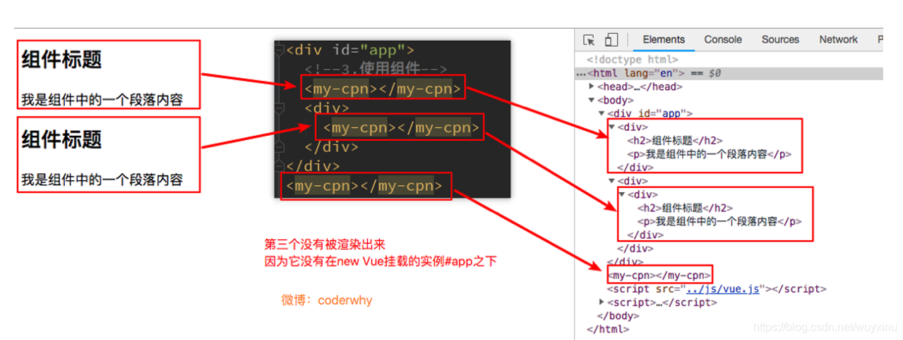

#### 组件其他补充

**全局组件和局部组件**

当我们通过调用Vue.component()注册组件时，组件的注册是全局的
这意味着该组件可以在任意Vue示例下使用。
如果我们注册的组件是挂载在某个实例中, 那么就是一个局部组件

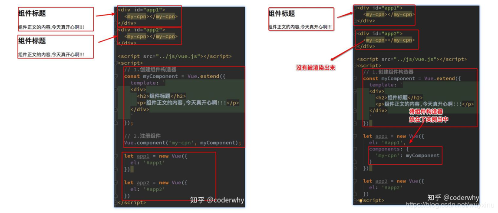

**父组件和子组件**

在前面我们看到了组件树：

- 组件和组件之间存在层级关系

- 而其中一种非常重要的关系就是父子组件的关系

我们来看通过代码如何组成的这种层级关系：

父子组件错误用法：以子标签的形式在Vue实例中使用

- 因为当子组件注册到父组件的components时，Vue会编译好父组件的模块

- 该模板的内容已经决定了父组件将要渲染的HTML（相当于父组件中已经有了子组件中的内容了）

- `<child-cpn></child-cpn>`是只能在父组件中被识别的。

- 类似这种用法，`<child-cpn></child-cpn>`是会被浏览器忽略的。

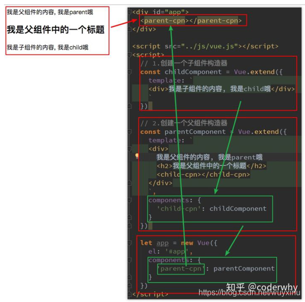

**注册组件语法糖**

在上面注册组件的方式，可能会有些繁琐。
Vue为了简化这个过程，提供了注册的语法糖。
主要是省去了调用Vue.extend()的步骤，而是可以直接使用一个对象来代替。
语法糖注册全局组件和局部组件：

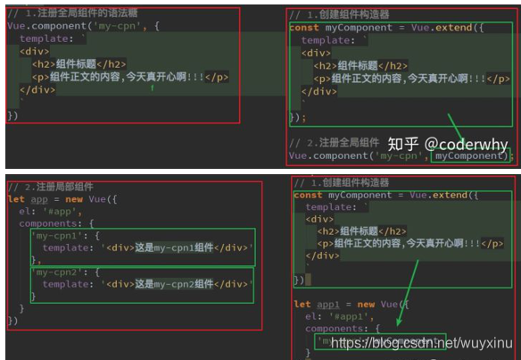

#### 组件数据存放

组件是一个单独功能模块的封装：

这个模块有属于自己的HTML模板，也应该有属性自己的数据data。

组件中的数据是保存在哪里呢？顶层的Vue实例中吗？

我们先来测试一下，组件中能不能直接访问Vue实例中的data

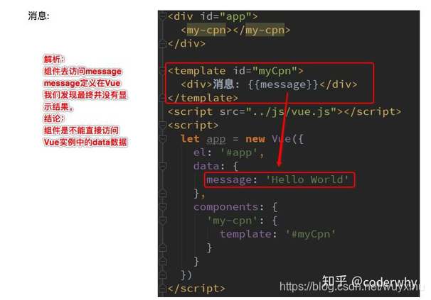

我们发现不能访问，而且即使可以访问，如果将所有的数据都放在Vue实例中，Vue实例就会变的非常臃肿。

**结论：Vue组件应该有自己保存数据的地方。**

**组件数据的存放**

组件自己的数据存放在哪里呢?

组件对象也有一个data属性(也可以有methods等属性，下面我们有用到)

只是这个data属性必须是一个函数

而且这个函数返回一个对象，对象内部保存着数据

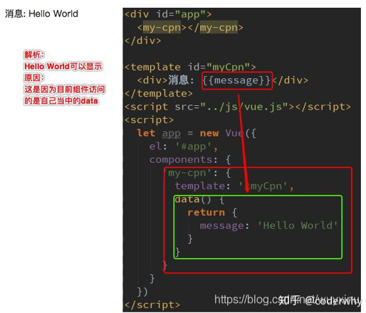

为什么data在组件中必须是一个函数呢?

- 首先，如果不是一个函数，Vue直接就会报错。

- 其次，原因是在于Vue让每个组件对象都返回一个新的对象，因为如果是同一个对象的，组件在多次使用后会相互影响。

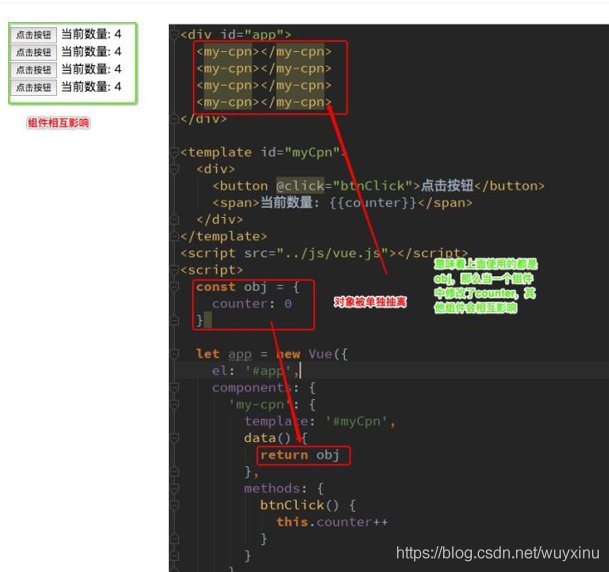

#### 父子组件通信

**父子组件的访问方式： `$children`**

有时候我们需要父组件直接访问子组件，子组件直接访问父组件，或者是子组件访问跟组件。
父组件访问子组件：使用`$children`或`$refs`
子组件访问父组件：使用`$parent`

我们先来看下`$children`的访问
`this.$children`是一个数组类型，它包含所有子组件对象。
我们这里通过一个遍历，取出所有子组件的message状态。

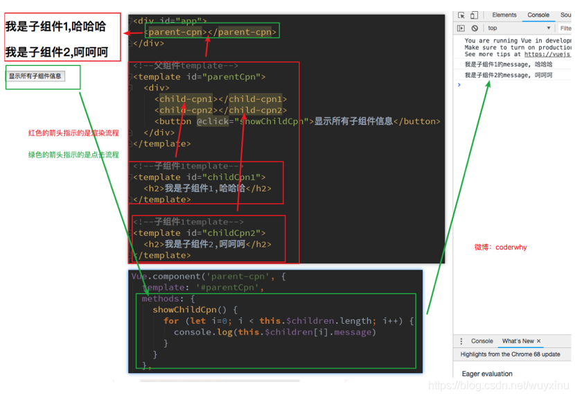

**父子组件的访问方式： $refs**

`$children`的缺陷：

- 通过$children访问子组件时，是一个数组类型，访问其中的子组件必须通过索引值。

- 但是当子组件过多，我们需要拿到其中一个时，往往不能确定它的索引值，甚至还可能会发生变化。

- 有时候，我们想明确获取其中一个特定的组件，这个时候就可以使用$refs

`$refs`的使用：

- `$refs`和ref指令通常是一起使用的。

- 首先，我们通过ref给某一个子组件绑定一个特定的ID。

- 其次，通过`this.$refs.ID`就可以访问到该组件了。

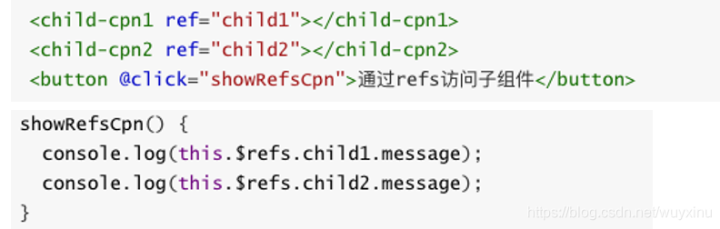

**父子组件的访问方式： `$parent`**

如果我们想在子组件中直接访问父组件，可以通过`$parent`
注意事项：

- 尽管在Vue开发中，我们允许通过`$parent`来访问父组件，但是在真实开发中尽量不要这样做。

- 子组件应该尽量避免直接访问父组件的数据，因为这样耦合度太高了。

- 如果我们将子组件放在另外一个组件之内，很可能该父组件没有对应的属性，往往会引起问题。

- 另外，更不好做的是通过`$parent`直接修改父组件的状态，那么父组件中的状态将变得飘忽不定，很不利于我的调试和维护。

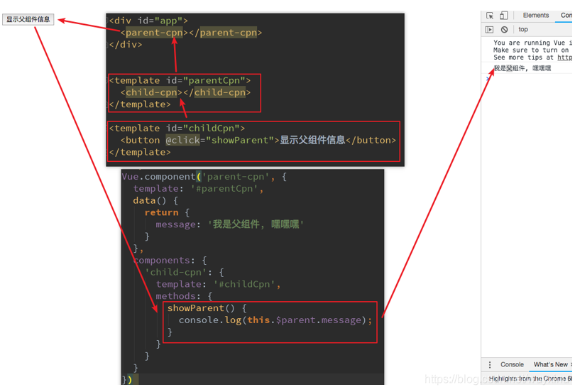

**非父子组件通信**

刚才我们讨论的都是父子组件间的通信，那如果是非父子关系呢?

非父子组件关系包括多个层级的组件，也包括兄弟组件的关系。

在Vue1.x的时候，可以通过`$dispatch`和`$broadcast`完成
$dispatch用于向上级派发事件
$broadcast用于向下级广播事件
但是在Vue2.x都被取消了

在Vue2.x中，有一种方案是通过中央事件总线，也就是一个中介来完成。
但是这种方案和直接使用Vuex的状态管理方案还是逊色很多。
并且Vuex提供了更多好用的功能，所以这里我们暂且不讨论这种方案，后续我们专门学习Vuex的状态管理。

#### 插槽slot(Vue 2.6之前用法)

**编译作用域**

在真正学习插槽之前，我们需要先理解一个概念：编译作用域。

官方对于编译的作用域解析比较简单，我们自己来通过一个例子来理解这个概念：

我们来考虑下面的代码是否最终是可以渲染出来的：

`<my-cpn v-show="isShow"></my-cpn>`中，我们使用了isShow属性。
isShow属性包含在组件中，也包含在Vue实例中。

答案：最终可以渲染出来，也就是使用的是Vue实例的属性。

为什么呢？

官方给出了一条准则：父组件模板的所有东西都会在父级作用域内编译；子组件模板的所有东西都会在子级作用域内编译。

而我们在使用`<my-cpn v-show="isShow"></my-cpn>`的时候，整个组件的使用过程是相当于在父组件中出现的。

那么他的作用域就是父组件，使用的属性也是属于父组件的属性。

因此，isShow使用的是Vue实例中的属性，而不是子组件的属性。

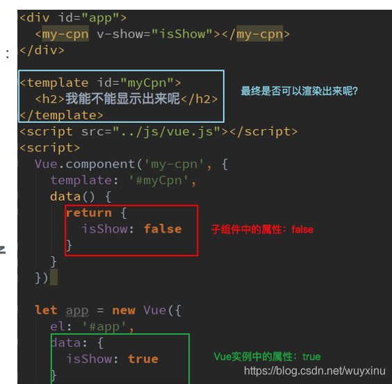

**为什么使用slot**

slot翻译为插槽：

- 在生活中很多地方都有插槽，电脑的USB插槽，插板当中的电源插槽。

- 插槽的目的是让我们原来的设备具备更多的扩展性。

- 比如电脑的USB我们可以插入U盘、硬盘、手机、音响、键盘、鼠标等等。

组件的插槽：

- 组件的插槽也是为了让我们封装的组件更加具有扩展性。

- 让使用者可以决定组件内部的一些内容到底展示什么。

栗子：移动网站中的导航栏。

- 移动开发中，几乎每个页面都有导航栏。

- 导航栏我们必然会封装成一个插件，比如nav-bar组件。

- 一旦有了这个组件，我们就可以在多个页面中复用了。

但是，每个页面的导航是一样的吗？No，我以京东M站为例

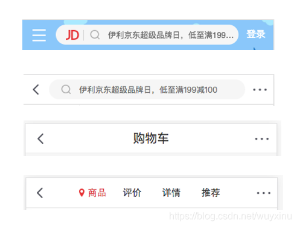

**如何封装这类组件呢？slot**

它们也很多区别，但是也有很多共性。
如果，我们每一个单独去封装一个组件，显然不合适：比如每个页面都返回，这部分内容我们就要重复去封装。
但是，如果我们封装成一个，好像也不合理：有些左侧是菜单，有些是返回，有些中间是搜索，有些是文字，等等。

如何封装合适呢？抽取共性，保留不同。
最好的封装方式就是将共性抽取到组件中，将不同暴露为插槽。
一旦我们预留了插槽，就可以让使用者根据自己的需求，决定插槽中插入什么内容。
是搜索框，还是文字，还是菜单。由调用者自己来决定。

这就是为什么我们要学习组件中的插槽slot的原因。

**slot基本使用**

了解了为什么用slot，我们再来谈谈如何使用slot？
在子组件中，使用特殊的元素`<slot>`就可以为子组件开启一个插槽。
该插槽插入什么内容取决于父组件如何使用。
我们通过一个简单的例子，来给子组件定义一个插槽：
`<slot>`中的内容表示，如果没有在该组件中插入任何其他内容，就默认显示该内容
有了这个插槽后，父组件如何使用呢？

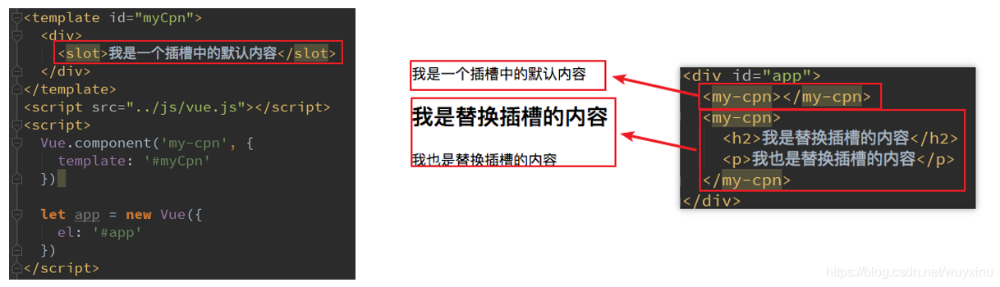

**具名插槽slot**

当子组件的功能复杂时，子组件的插槽可能并非是一个。
比如我们封装一个导航栏的子组件，可能就需要三个插槽，分别代表左边、中间、右边。
那么，外面在给插槽插入内容时，如何区分插入的是哪一个呢？
这个时候，我们就需要给插槽起一个名字
如何使用具名插槽呢？
非常简单，只要给slot元素一个name属性即可
`<slot name='myslot'></slot>`
我们来给出一个案例：
这里我们先不对导航组件做非常复杂的封装，先了解具名插槽的用法。

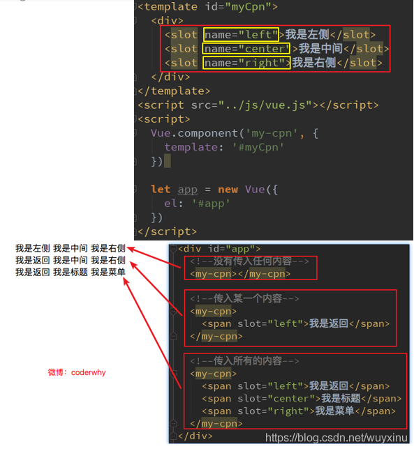

**作用域插槽：准备**

作用域插槽是slot一个比较难理解的点，而且官方文档说的又有点不清晰。

这里，我们用一句话对其做一个总结，然后我们在后续的案例中来体会：
父组件替换插槽的标签，但是内容由子组件来提供。

我们先提一个需求：
子组件中包括一组数据，比如：pLanguages: [‘JavaScript’, ‘Python’, ‘Swift’, ‘Go’, ‘C++’]
需要在多个界面进行展示：

- 某些界面是以水平方向一一展示的，

- 某些界面是以列表形式展示的，

- 某些界面直接展示一个数组

内容在子组件，希望父组件告诉我们如何展示，怎么办呢？
利用slot作用域插槽就可以了
我们来看看子组件的定义：

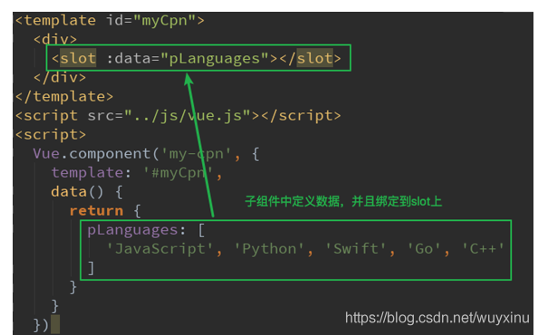

**作用域插槽：使用**

在父组件使用我们的子组件时，从子组件中拿到数据：
我们通过`<template slot-scope="slotProps">`获取到slotProps属性
在通过slotProps.data就可以获取到刚才我们传入的data了

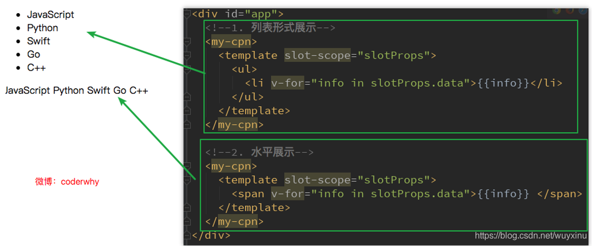

#### **插槽slot(Vue 2.6之后用法)**

>
>>
>>在 2.6.0 中，我们为具名插槽和作用域插槽引入了一个新的统一的语法 (即 `v-slot` 指令)。它取代了 `slot` 和 `slot-scope` 这两个目前已被废弃但未被移除且仍在[文档中](https://cn.vuejs.org/v2/guide/components-slots.html#%E5%BA%9F%E5%BC%83%E4%BA%86%E7%9A%84%E8%AF%AD%E6%B3%95 "文档中")的特性。新语法的由来可查阅这份 [RFC](https://github.com/vuejs/rfcs/blob/master/active-rfcs/0001-new-slot-syntax.md "RFC")。

**slot有三种类型**

- 默认插槽 `default`

- 具名插槽 `name`

- 作用域插槽 `v-slot`

在子组件中：

- 插槽用`<slot>`标签来确定渲染的位置，里面放如果父组件没传内容时的后备内容。一个不带 `name`的 `<slot>` 出口会带有隐含的名字“`default`”。

- 具名插槽用`name`属性来表示插槽的名字

- 作用域插槽在作用域上绑定属性来将子组件的信息传给父组件使用

有时我们需要多个插槽。例如对于一个带有如下模板的 `<base-layout>` 组件：

```java
<div class="container">
  <header>
    <!-- 我们希望把页头放这里 -->
  </header>
  <main>
    <!-- 我们希望把主要内容放这里 -->
  </main>
  <footer>
    <!-- 我们希望把页脚放这里 -->
  </footer>
</div>
```


对于这样的情况，`<slot>` 元素有一个特殊的特性：`name`。这个特性可以用来定义额外的插槽：

```java
<div class="container">
  <header>
    <slot name="header"></slot>
  </header>
  <main>
    <slot></slot>
  </main>
  <footer>
    <slot name="footer"></slot>
  </footer>
</div>
```


一个不带 `name` 的 `<slot>` 出口会带有隐含的名字“default”。

**v-slot**

- 具名插槽通过指令参数**v-slot:插槽名**的形式传入，可以简化为 #插槽名

- 作用域插槽通过**v-slot:xxx=“slotProps”**的slotProps来获取子组件传出的属性

- v-slot属性只能在上使用，但在【只有默认插槽时】可以在组件标签上使用

```java
//具名插槽的缩写
<template>
  <child>
   <!--默认插槽-->
   <template v-slot>  // v-slot:default
     <div>默认插槽</div>
   </template>
   <!--具名插槽-->
   <template #header>  // v-slot:header
     <div>具名插槽</div>
   </template>
   <!--作用域插槽-->
   <template #footer="slotProps">  //v-slot:footer
     <div>
      {{slotProps.testProps}}
     </div>
   </template>
  <child>
</template>
```


在向具名插槽提供内容的时候，我们可以在一个 `<template>` 元素上使用 `v-slot` 指令，并以 `v-slot` 的参数的形式提供其名称：

```java
<base-layout>
  <template v-slot:header>
    <h1>Here might be a page title</h1>
  </template>

  <p>A paragraph for the main content.</p>
  <p>And another one.</p>

  <template v-slot:footer>
    <p>Here's some contact info</p>
  </template>
</base-layout>
```


现在 `<template>` 元素中的所有内容都将会被传入相应的插槽。任何没有被包裹在带有 `v-slot`的 `<template>` 中的内容都会被视为默认插槽的内容。

然而，如果你希望更明确一些，仍然可以在一个 `<template>` 中包裹默认插槽的内容：

```java
<base-layout>
  <template v-slot:header>
    <h1>Here might be a page title</h1>
  </template>

  <template v-slot:default>
    <p>A paragraph for the main content.</p>
    <p>And another one.</p>
  </template>

  <template v-slot:footer>
    <p>Here's some contact info</p>
  </template>
</base-layout>
```


任何一种写法都会渲染出：

```java
<div class="container">
  <header>
    <h1>Here might be a page title</h1>
  </header>
  <main>
    <p>A paragraph for the main content.</p>
    <p>And another one.</p>
  </main>
  <footer>
    <p>Here's some contact info</p>
  </footer>
</div>
```


注意 **v-slot 只能添加在 上** (只有一种例外情况)，这一点和已经废弃的 `slot` 特性)不同。

**v-slot 作用域插槽**

有时让插槽内容能够访问子组件中才有的数据是很有用的。例如，设想一个带有如下模板的 `<current-user>` 组件：

```java
<span>
  <slot>{{ user.lastName }}</slot>
</span>
```


我们可能想换掉备用内容，用名而非姓来显示。如下：

```java
<current-user>
  {{ user.firstName }}
</current-user>
```


然而上述代码不会正常工作，因为只有 `<current-user>` 组件可以访问到 `user` 而我们提供的内容是在父级渲染的。

为了让 `user` 在父级的插槽内容中可用，我们可以将 `user` 作为 `<slot>` 元素的一个特性绑定上去：

```java
<span>
  <slot v-bind:user="user">
    {{ user.lastName }}
  </slot>
</span>
```


绑定在 `<slot>` 元素上的特性被称为**插槽 prop**。现在在父级作用域中，我们可以使用带值的 `v-slot` 来定义我们提供的插槽 prop 的名字：

```java
<current-user>
  <template v-slot:default="slotProps">
    {{ slotProps.user.firstName }}
  </template>
</current-user>
```


在这个例子中，我们选择将包含所有插槽 prop 的对象命名为 `slotProps`，但你也可以使用任意你喜欢的名字。

**独占默认插槽的缩写语法**

在上述情况下，当被提供的内容只有

默认插槽时，组件的标签才可以被当作插槽的模板来使用。这样我们就可以把 `v-slot` 直接用在组件上：

```java
<current-user v-slot:default="slotProps">
  {{ slotProps.user.firstName }}
</current-user>
```


这种写法还可以更简单。就像假定未指明的内容对应默认插槽一样，不带参数的 `v-slot` 被假定对应默认插槽：

```java
<current-user v-slot="slotProps">
  {{ slotProps.user.firstName }}
</current-user>
```


注意默认插槽的缩写语法**不能**和具名插槽混用，因为它会导致作用域不明确：

```java
<!-- 无效，会导致警告 -->
<current-user v-slot="slotProps">
  {{ slotProps.user.firstName }}
  <template v-slot:other="otherSlotProps">
    slotProps is NOT available here
  </template>
</current-user>
```


只要出现多个插槽，请始终为所有的

插槽使用完整的基于 `<template>` 的语法：

```java
<current-user>
  <template v-slot:default="slotProps">
    {{ slotProps.user.firstName }}
  </template>

  <template v-slot:other="otherSlotProps">
    ...
  </template>
</current-user>
```


**解构插槽 Prop**

作用域插槽的内部工作原理是将你的插槽内容包括在一个传入单个参数的函数里：

```java
function (slotProps) {
  // 插槽内容
}
```


这意味着 `v-slot` 的值实际上可以是任何能够作为函数定义中的参数的 JavaScript 表达式。所以在支持的环境下 ([单文件组件](https://cn.vuejs.org/v2/guide/single-file-components.html "单文件组件")或[现代浏览器](https://developer.mozilla.org/zh-CN/docs/Web/JavaScript/Reference/Operators/Destructuring_assignment#%E6%B5%8F%E8%A7%88%E5%99%A8%E5%85%BC%E5%AE%B9 "现代浏览器"))，你也可以使用 [ES2015 解构](https://developer.mozilla.org/zh-CN/docs/Web/JavaScript/Reference/Operators/Destructuring_assignment#%E8%A7%A3%E6%9E%84%E5%AF%B9%E8%B1%A1 "ES2015 解构")来传入具体的插槽 prop，如下：

```java
<current-user v-slot="{ user }">
  {{ user.firstName }}
</current-user>
```


这样可以使模板更简洁，尤其是在该插槽提供了多个 prop 的时候。它同样开启了 prop 重命名等其它可能，例如将 `user` 重命名为 `person`：

```java
<current-user v-slot="{ user: person }">
  {{ person.firstName }}
</current-user>
```


你甚至可以定义后备内容，用于插槽 prop 是 undefined 的情形：

```java
<current-user v-slot="{ user = { firstName: 'Guest' } }">
  {{ user.firstName }}
</current-user>
```


**注意**

1. 默认插槽名为default，可以省略default直接写v-slot。缩写为#时不能不写参数，写成#default（这点所有指令都一样，v-bind、v-on）

2. 多个插槽混用时，v-slot不能省略default

3. 只要出现多个插槽，请始终为所有的插槽使用完整的基于`<template>` 的语法

**动态插槽名**

>
>>
>>2.6.0 新增

[动态指令参数](https://cn.vuejs.org/v2/guide/syntax.html#%E5%8A%A8%E6%80%81%E5%8F%82%E6%95%B0 "动态指令参数")也可以用在 `v-slot` 上，来定义动态的插槽名：

```java
<base-layout>
  <template v-slot:[dynamicSlotName]>
    ...
  </template>
</base-layout>
```


### 5、模块化开发

#### 为什么需要模块化

**JavaScript原始功能**

在网页开发的早期，js制作作为一种脚本语言，做一些简单的表单验证或动画实现等，那个时候代码还是很少的。

那个时候的代码是怎么写的呢？直接将代码写在`<script>`标签中即可

随着ajax异步请求的出现，慢慢形成了前后端的分离
客户端需要完成的事情越来越多，代码量也是与日俱增。
为了应对代码量的剧增，我们通常会将代码组织在多个js文件中，进行维护。
但是这种维护方式，依然不能避免一些灾难性的问题。

比如全局变量同名问题：看右边的例子
另外，这种代码的编写方式对js文件的依赖顺序几乎是强制性的
但是当js文件过多，比如有几十个的时候，弄清楚它们的顺序是一件比较同时的事情。
而且即使你弄清楚顺序了，也不能避免上面出现的这种尴尬问题的发生。

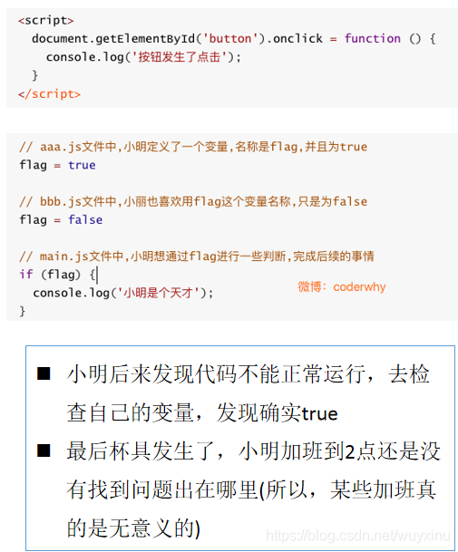

**匿名函数的解决方案**

我们可以使用匿名函数来解决方面的重名问题
在aaa.js文件中，我们使用匿名函数

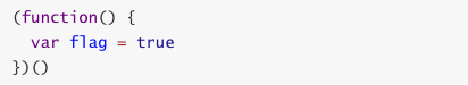

但是如果我们希望在main.js文件中，用到flag，应该如何处理呢？
显然，另外一个文件中不容易使用，因为flag是一个局部变量。

**使用模块作为出口**

我们可以使用将需要暴露到外面的变量，使用一个模块作为出口，什么意思呢？
来看下对应的代码：

我们做了什么事情呢？
非常简单，在匿名函数内部，定义一个对象。
给对象添加各种需要暴露到外面的属性和方法(不需要暴露的直接定义即可)。
最后将这个对象返回，并且在外面使用了一个MoudleA接受。

接下来，我们在main.js中怎么使用呢？
我们只需要使用属于自己模块的属性和方法即可

这就是模块最基础的封装，事实上模块的封装还有很多高级的话题：
但是我们这里就是要认识一下为什么需要模块，以及模块的原始雏形。
幸运的是，前端模块化开发已经有了很多既有的规范，以及对应的实现方案。

常见的模块化规范：
CommonJS、AMD、CMD，也有ES6的Modules

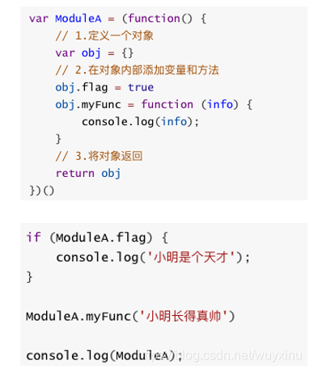

#### CommonJS（了解）

模块化有两个核心：导出和导入
CommonJS的导出：

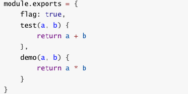

CommonJS的导入

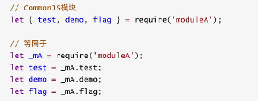

#### ES6的export和import

**export基本使用**

export指令用于导出变量，比如下面的代码：

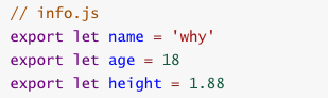

上面的代码还有另外一种写法：

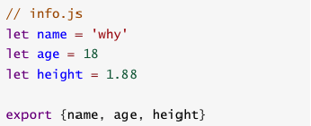

**导出函数或类**

上面我们主要是输出变量，也可以输出函数或者输出类

上面的代码也可以写成这种形式：

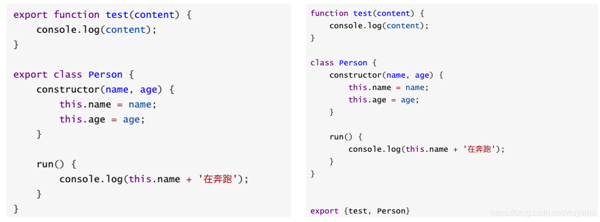

**export default**

某些情况下，一个模块中包含某个的功能，我们并不希望给这个功能命名，而且让导入者可以自己来命名
这个时候就可以使用export default

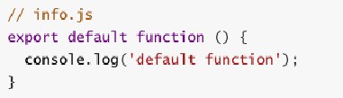

我们来到main.js中，这样使用就可以了
这里的myFunc是我自己命名的，你可以根据需要命名它对应的名字


另外，需要注意：
export default在同一个模块中，不允许同时存在多个。

**import使用**

我们使用export指令导出了模块对外提供的接口，下面我们就可以通过import命令来加载对应的这个模块了
首先，我们需要在HTML代码中引入两个js文件，并且类型需要设置为module

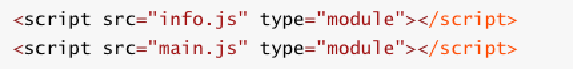

import指令用于导入模块中的内容，比如main.js的代码

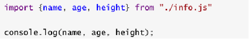

如果我们希望某个模块中所有的信息都导入，一个个导入显然有些麻烦：
通过可以导入模块中所有的export变量
但是通常情况下我们需要给

起一个别名，方便后续的使用

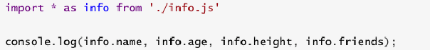


### 6.webpack的使用教程

因为要引入模块化开发流程，同时前端拥有较多其他技术，png图片压缩，sass，less，commonJS等等技术，浏览器并不能直接支持，**故使用webpack做资源打包**，将所有文件转化为浏览器可以解析的数据方式，同时支持复杂的网状结构的模块化开发。

webpack首先要安装node环境，属于前端服务器，

而使用webpack需要引用大量的资源包，为方便管理，故安装npm（node package manager）

> node -v 
>
> npm install webpack@3.6.0 -g
>
> p在终端直接执行webpack命令，使用的全局安装的webpack
>
> p当在package.json中定义了scripts时，其中包含了webpack命令，那么使用的是局部webpack

#### - webpack 初体验

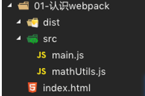

>disk 用于存放打包完成的js文件
>
>src 用于存放源代码，可以采用任何方式的模块化开发（CommonJS，CMD，AMD，ES6等等）

**mathUtils.js**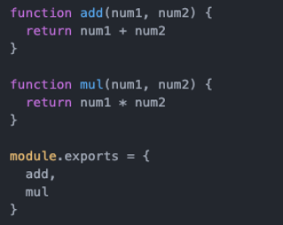


main.js

> 之后在控制台中， 使用命令：
>
> webpack src/main.js dist/bundle.js
>
> 即可完成打包，webpack会自动查找依赖关系，将其全部打包，故只用找到main即可

index.html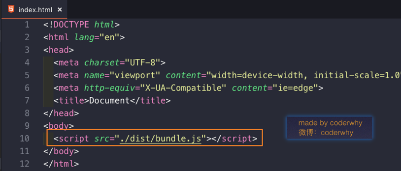


#### - webpack 配置相关

因每次打包都要输入主文件名与目的文件名，所以使用配置可简化操作

创建文件 **webpack.config.js**

webpack.config.js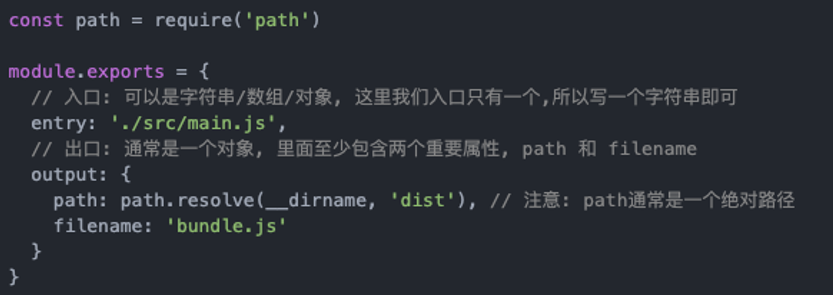

因为出口文件需要动态获取其绝对路径，所以需要使用到node中依赖的包 'path' 包

所以，先进行node初始化，安装相应的包，输入命令：    npm init

执行完成便生成文件 package.json文件  记录相关信息

在执行命令：  npm install   

进行依赖相关的安装，生成package-lock.json 文件, 用于锁定相关依赖的版本包

依上图进行代码编写， 直接执行命令： webpack 即可直接进行打包完成，


因为，后期启动项目，安装项目等等命令， 均为npm install , npm run serve  此种命令，故进行相关配置

打开 package.json 文件进行编写

package.json

当执行 npm run build 时， 直接运行脚本 webpack ， 完成配置

此时，直接执行 npm run build 就相当于在控制台执行 webpack ， 但有一点不同，使用脚本会使用当前项目的局部webpack ，也就是经常看到的node_modules包中使用的，

当想要在项目中安装webpack时， 使用命令：  npm install webpack@3.6.0 --save-dev 

即可在项目中安装**局部开发的webpack版本**，此时查看package.json 会发现新增相关信息配置。


## 四、案例

### 1、<font color=#333333>图书购物车</font>

index.html

```java
<!DOCTYPE html>
<html lang="en">

<head>
    <meta charset="UTF-8">
    <meta name="viewport" content="width=device-width, initial-scale=1.0">
    <meta http-equiv="X-UA-Compatible" content="ie=edge">
    <title>Document</title>
    <link rel="stylesheet" href="style.css">
</head>

<body>
    <div id="app">
        <div v-if="books.length">
            <table>
                <thead>
                    <tr>
                        <th></th>
                        <th>作者</th>
                        <th>书籍名称</th>
                        <th>出版日期</th>
                        <th>价格</th>
                        <th>购买数量</th>
                        <th>操作</th>
                    </tr>
                </thead>
                <tbody>
                    <tr v-for="(item, index) in books">
                        <td>{{item.id}}</td>
                        <td>{{item.author}}</td>
                        <td>{{item.name}}</td>
                        <td>{{item.data}}</td>
                        <td>{{item.price | showPrice}}</td>
                        <td>
                            <button @click="decrement(index)" :disabled="item.count <= 1">-</button>
                            {{item.count}}
                            <button @click="increment(index)">+</button>
                        </td>
                        <td>
                            <button @click="removeHandler(index)">移除</button>
                        </td>
                    </tr>

                </tbody>
            </table>
            <h2>总价格:{{totalPrice}}</h2>
        </div>
        <h2 v-else>
            购物车为空
        </h2>
    </div>

    <script src="../js/vue.js"></script>
    <script src="main.js"></script>
</body>

</html>
```


style.css

```java
table{
    border: 1 px solid #e9e9e9;
    border-collapse: collapse;
    border-spacing: 0;
}

th, td{
    padding: 8px 16px;
    border:1 px solid #e9e9e9;
    text-align: left;
}

th{
    background-color: #f7f7f7;
    color: #5c6b77;
    font-weight:600;
}
```


main.js

```java
const app = new Vue({
    el:"#app",
    data:{
        books:[
            {
                id: 1,
                author: '曹雪芹',
                name: '红楼梦',
                data:"????-??-??",
                price: 32.0,
                count: 1
            }, {
                id: 2,
                author: '施耐庵',
                name: '水浒传',
                data:"????-??-??",
                price: 30.0,
                count: 1
            }, {
                id: '3',
                author: '罗贯中',
                name: '三国演义',
                data:"????-??-??",
                price: 24.0,
                count: 1
            }, {
                id: 4,
                author: '吴承恩',
                name: '西游记',
                data:"????-??-??",
                price: 20.0,
                count: 1
            }
        ]
    },
    methods:{
        decrement(index){
            this.books[index].count--;
        },
        increment(index){
            this.books[index].count++;
        },
        removeHandler(index){
            this.books.splice(index, 1);
        },
    },
    computed:{
        totalPrice(){
            let totalPrice = 0;
            for(let i = 0; i < this.books.length; i++){
                totalPrice += this.books[i].price * this.books[i].count;
            }
            return totalPrice;
        }
    },
    //全局过滤器 ,filter 不能定义在创建的Vue对象后面 ,filters局部过滤器
    filters:{
        showPrice(price){
            return "¥" + price.toFixed(2);
        }
    },
})
```


几种for语法

用的是前面购物车案例的代码

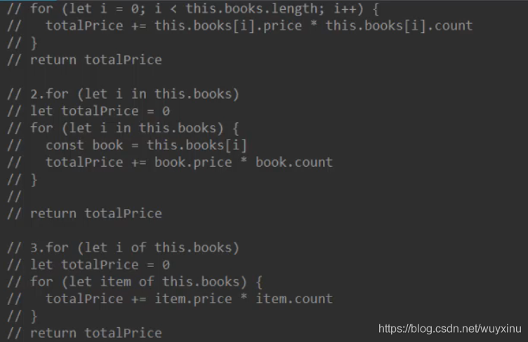

将普通函数转换成JavaScript高阶函数和

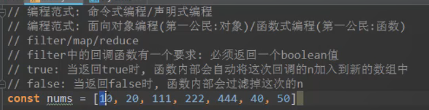

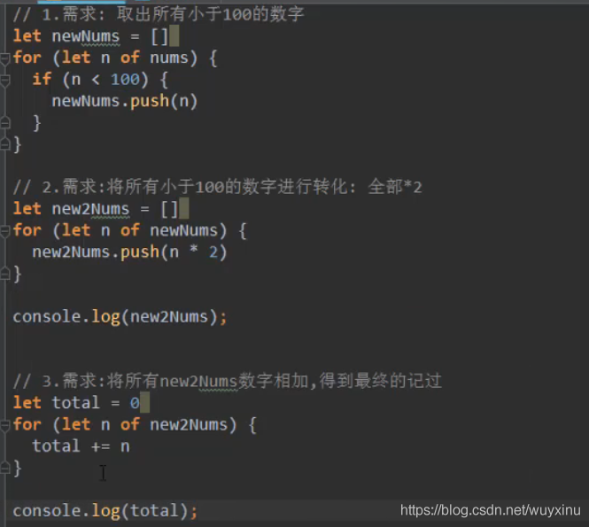

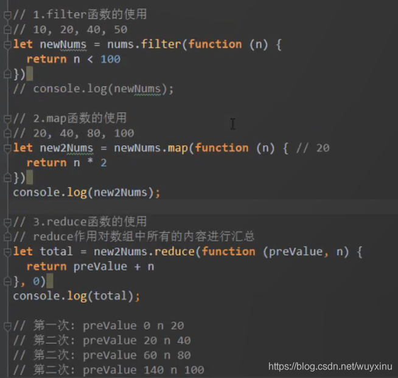

链式编程

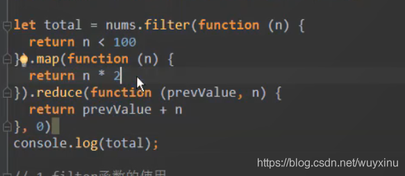

箭头函数

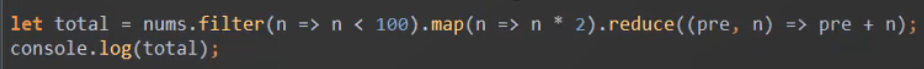

</font>