<font face="Consolas">

### 文章目录

- [Vue](#Vue_2 "Vue")

-
   - 
      - [预备知识与后续知识及项目案例](#_4 "预备知识与后续知识及项目案例")

   - [一、简介](#_17 "一、简介")

   - 
      - [1.Vue (读音 /vjuː/，类似于 view)的简单认识](#1Vue__vju_view_19 "1.Vue (读音 /vjuː/，类似于 view)的简单认识")

      - [2.Vue.js安装](#2Vuejs_40 "2.Vue.js安装")

   - [二、Vue知识量化](#Vue_68 "二、Vue知识量化")

   - [三、内容](#_71 "三、内容")

   - 
      - [1、Webpack 详解](#1Webpack__76 "1、Webpack 详解")

      - 
         - [什么是Webpack？](#Webpack_78 "什么是Webpack？")

         - [前端模块化](#_90 "前端模块化")

         - [**和grunt/gulp的对比**](#gruntgulp_113 "**和grunt/gulp的对比**")

         - [webpack安装](#webpack_139 "webpack安装")

         - [Webpack 起步](#Webpack__156 "Webpack 起步")

         - [Webpack配置](#Webpack_197 "Webpack配置")

         - [css-loader的使用](#cssloader_232 "css-loader的使用")

         - [less文件处理](#less_295 "less文件处理")

         - [图片文件处理](#_313 "图片文件处理")

         - [ES6语法处理](#ES6_375 "ES6语法处理")

         - [Webpack 配置 Vue](#Webpack__Vue_391 "Webpack 配置 Vue")

         - [el和template区别](#eltemplate_419 "el和template区别")

         - [Vue组件化开发引入](#Vue_446 "Vue组件化开发引入")

         - [plugin的使用](#plugin_476 "plugin的使用")

         - [搭建本地服务器](#_545 "搭建本地服务器")

      - [2、Vue CLI](#2Vue_CLI_567 "2、Vue CLI")

      - 
         - [**什么是Vue CLI**](#Vue_CLI_569 "**什么是Vue CLI**")

         - [**Vue CLI使用前提 - Node**](#Vue_CLI__Node_582 "**Vue CLI使用前提 - Node**")

         - [Vue CLI使用前提 - Webpack](#Vue_CLI__Webpack_605 "Vue CLI使用前提 - Webpack")

         - [Vue CLI2详解](#Vue_CLI2_631 "Vue CLI2详解")

         - [Vue CLI3](#Vue_CLI3_681 "Vue CLI3")

      - [3、vue-router详解](#3vuerouter_705 "3、vue-router详解")

      - 
         - [认识路由](#_707 "认识路由")

         - [后端路由阶段](#_725 "后端路由阶段")

         - [前端路由阶段](#_749 "前端路由阶段")

         - [认识vue-router](#vuerouter_911 "认识vue-router")

         - [细节处理](#_975 "细节处理")

         - [路由的懒加载](#_1095 "路由的懒加载")

         - [**路由嵌套**](#_1138 "**路由嵌套**")

         - [传递参数](#_1161 "传递参数")

         - [**导航守卫**](#_1215 "**导航守卫**")

         - [keep-alive遇见vue-router](#keepalivevuerouter_1257 "keep-alive遇见vue-router")

         - [案例：[TabBar](#TabBar)](#TabBarTabBar_1269 "案例：[TabBar](#TabBar)")

      - [4、Promise](#4Promise_1302 "4、Promise")

      - 
         - [什么是Promise呢？](#Promise_1304 "什么是Promise呢？")

         - [Promise的基本使用](#Promise_1339 "Promise的基本使用")

         - [Promise的链式调用](#Promise_1384 "Promise的链式调用")

      - [5、Vuex详解](#5Vuex_1403 "5、Vuex详解")

      - 
         - [认识Vuex](#Vuex_1405 "认识Vuex")

         - [Vuex的基本使用](#Vuex_1482 "Vuex的基本使用")

         - [Vuex核心概念](#Vuex_1523 "Vuex核心概念")

         - [项目结构](#_1716 "项目结构")

      - [6、网络模块封装](#6_1722 "6、网络模块封装")

      - 
         - [网络模块的选择](#_1724 "网络模块的选择")

         - [jsonp](#jsonp_1753 "jsonp")

         - [**axios**](#axios_1771 "**axios**")

         - [axios的实例](#axios_1852 "axios的实例")

         - [拦截器](#_1867 "拦截器")

   - [四、案例](#_1893 "四、案例")

   - 
      - [1、TabBar](#1span_idTabBarTabBarspan_1894 "1、TabBar")

# Vue

### 预备知识与后续知识及项目案例

[HTML入门与进阶以及HTML5](https://blog.csdn.net/wuyxinu/article/details/103515157 "HTML入门与进阶以及HTML5")
[CSS ](https://blog.csdn.net/wuyxinu/article/details/103583618 "CSS ")
[JS-上](https://blog.csdn.net/wuyxinu/article/details/103642800 "JS-上")
[JS-下](https://blog.csdn.net/wuyxinu/article/details/103646041 "JS-下")
[jQuery](https://blog.csdn.net/wuyxinu/article/details/103669718 "jQuery")
[Node.js + Gulp 知识点汇总](https://blog.csdn.net/wuyxinu/article/details/103774211 "Node.js + Gulp 知识点汇总")
[MongoDB + Express 入门及案例代码](https://blog.csdn.net/wuyxinu/article/details/103836507 "MongoDB + Express 入门及案例代码")
[Vue项目开发-仿蘑菇街电商APP](https://blog.csdn.net/wuyxinu/article/details/103684950 "Vue项目开发-仿蘑菇街电商APP")

[Vue 知识点汇总（上）–附案例代码及项目地址](https://blog.csdn.net/wuyxinu/article/details/103965753 "Vue 知识点汇总（上）–附案例代码及项目地址")

## 一、简介

### 1.Vue (读音 /vjuː/，类似于 view)的简单认识

（1）Vue是一个渐进式的框架，什么是渐进式的呢？

- 渐进式意味着你可以将Vue作为你应用的一部分嵌入其中，带来更丰富的交互体验。

- 或者如果你希望将更多的业务逻辑使用Vue实现，那么Vue的核心库以及其生态系统。

- 比如Core+Vue-router+Vuex，也可以满足你各种各样的需求。

（2）Vue有很多特点和Web开发中常见的高级功能

- 解耦视图和数据

- 可复用的组件

- 前端路由技术

- 状态管理

- 虚拟DOM

这些特点，你不需要一个个去记住，我们在后面的学习和开发中都会慢慢体会到的，一些技术点我也会在后面进行讲解。
（3）学习Vuejs的前提？
从零学习Vue开发，并不需要你具备其他类似于Angular、React，甚至是jQuery的经验。
但是你需要具备一定的HTML、CSS、JavaScript基础。

### 2.Vue.js安装

使用一个框架，我们第一步要做什么呢？安装下载它

安装Vue的方式有很多：

**方式一：直接CDN引入**
你可以选择引入开发环境版本还是生产环境版本

```java
<!-- 开发环境版本，包含了有帮助的命令行警告 --> 
<script src="https://cdn.jsdelivr.net/npm/vue/dist/vue.js"></script>
<!-- 生产环境版本，优化了尺寸和速度 -->
<script src="https://cdn.jsdelivr.net/npm/vue"></script>
```


**方式二：下载和引入**

开发环境 https://vuejs.org/js/vue.js

生产环境 https://vuejs.org/js/vue.min.js

**方式三：NPM安装**

后续通过webpack和CLI的使用，我们使用该方式。

## 二、Vue知识量化

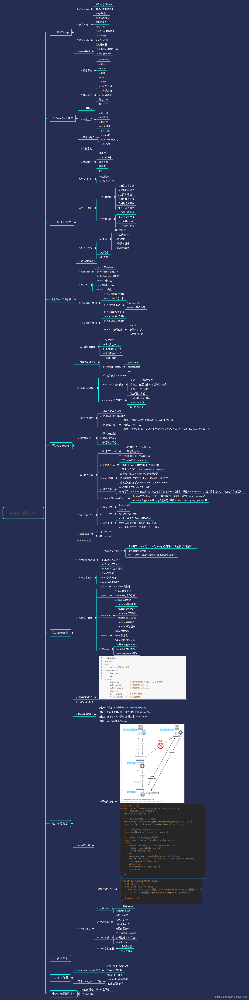

## 三、内容

注：本文多数内容属于Vue2.6之前的内容，只有较为重要的地方才会补充2.6版本之后的内容，望周知。

### 1、Webpack 详解

#### 什么是Webpack？

什么是webpack？
这个webpack还真不是一两句话可以说清楚的。
我们先看看官方的解释：
At its core, webpack is a static module bundler for modern JavaScript applications.
从本质上来讲，webpack是一个现代的JavaScript应用的静态模块打包工具。
但是它是什么呢？用概念解释概念，还是不清晰。
我们从两个点来解释上面这句话：模块 和 打包

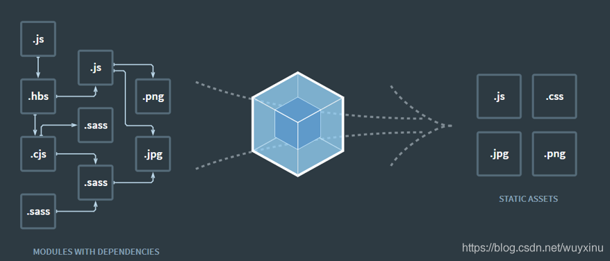

#### 前端模块化

前端模块化：

在前面学习中，我已经用了大量的篇幅解释了为什么前端需要模块化。
而且我也提到了目前使用前端模块化的一些方案：AMD、CMD、CommonJS、ES6。
**在ES6之前**，我们要想进行模块化开发，就必须借助于其他的工具，让我们可以进行模块化开发。
并且在通过模块化开发完成了项目后，还需要处理模块间的各种依赖，并且将其进行整合打包。
而webpack其中一个核心就是让我们可能进行模块化开发，并且会帮助我们处理模块间的依赖关系。
而且不仅仅是JavaScript文件，我们的CSS、图片、json文件等等在webpack中都可以被当做模块来使用（在后续我们会看到）。
这就是webpack中模块化的概念。

**打包**如何理解呢？

理解了webpack可以帮助我们进行模块化，并且处理模块间的各种复杂关系后，打包的概念就非常好理解了。
就是将webpack中的各种资源模块进行打包合并成一个或多个包(Bundle)。
并且在打包的过程中，还可以对资源进行处理，比如压缩图片，将scss转成css，将ES6语法转成ES5语法，将TypeScript转成JavaScript等等操作。
但是打包的操作似乎grunt/gulp也可以帮助我们完成，它们有什么不同呢？

#### **和grunt/gulp的对比**

grunt/gulp的核心是Task

- 我们可以配置一系列的task，并且定义task要处理的事务（例如ES6、ts转化，图片压缩，scss转成css）

- 之后让grunt/gulp来依次执行这些task，而且让整个流程自动化。

- 所以grunt/gulp也被称为前端自动化任务管理工具。

我们来看一个gulp的task

下面的task就是将src下面的所有js文件转成ES5的语法。
并且最终输出到dist文件夹中。

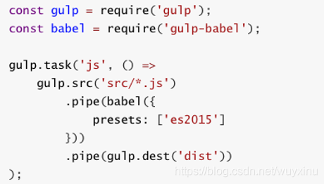

什么时候用grunt/gulp呢？

如果你的工程模块依赖非常简单，甚至是没有用到模块化的概念。
只需要进行简单的合并、压缩，就使用grunt/gulp即可。
但是如果整个项目使用了模块化管理，而且相互依赖非常强，我们就可以使用更加强大的webpack了。

所以，grunt/gulp和webpack有什么不同呢？

grunt/gulp更加强调的是前端流程的自动化，模块化不是它的核心。
webpack更加强调模块化开发管理，而文件压缩合并、预处理等功能，是他附带的功能。

#### webpack安装

安装webpack首先需要安装Node.js，Node.js自带了软件包管理工具npm
查看自己的node版本：


全局安装webpack(这里我先指定版本号3.6.0，因为vue cli2依赖该版本)


局部安装webpack（后续才需要）
–save-dev`是开发时依赖，项目打包后不需要继续使用的。
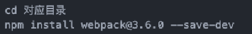

为什么全局安装后，还需要局部安装呢？
在终端直接执行webpack命令，使用的全局安装的webpack
当在package.json中定义了scripts时，其中包含了webpack命令，那么使用的是局部webpack

#### Webpack 起步

**准备工作**

我们创建如下文件和文件夹：
文件和文件夹解析：

- dist文件夹：用于存放之后打包的文件

- src文件夹：用于存放我们写的源文件
   - main.js：项目的入口文件。具体内容查看下面详情。

   - mathUtils.js：定义了一些数学工具函数，可以在其他地方引用，并且使用。具体内容查看下面的详情。

- index.html：浏览器打开展示的首页html

- package.json：通过npm init生成的，npm包管理的文件（暂时没有用上，后面才会用上）

mathUtils.js文件中的代码：

main.js文件中的代码：

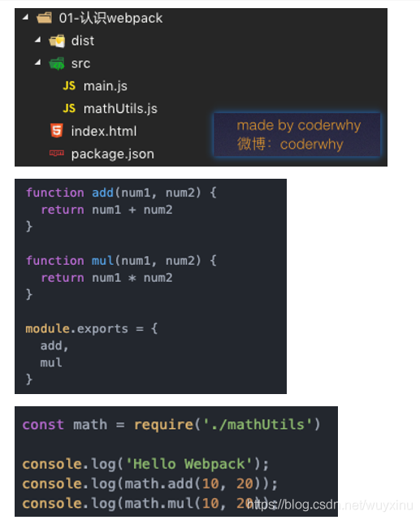

**js文件的打包**

现在的js文件中使用了模块化的方式进行开发，他们可以直接使用吗？不可以。
因为如果直接在index.html引入这两个js文件，浏览器并不识别其中的模块化代码。
另外，在真实项目中当有许多这样的js文件时，我们一个个引用非常麻烦，并且后期非常不方便对它们进行管理。

我们应该怎么做呢？使用webpack工具，对多个js文件进行打包。
我们知道，webpack就是一个模块化的打包工具，所以它支持我们代码中写模块化，可以对模块化的代码进行处理。（如何处理的，待会儿在原理中，我会讲解）
另外，如果在处理完所有模块之间的关系后，将多个js打包到一个js文件中，引入时就变得非常方便了。
OK，如何打包呢？使用webpack的指令即可

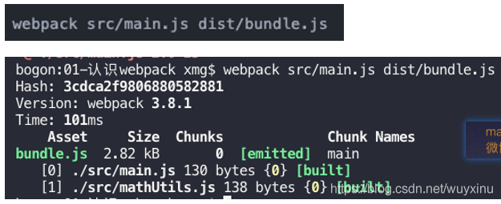

**使用打包后的文件**

打包后会在dist文件下，生成一个bundle.js文件
文件内容有些复杂，这里暂时先不看，后续再进行分析。
bundle.js文件，是webpack处理了项目直接文件依赖后生成的一个js文件，我们只需要将这个js文件在index.html中引入即可

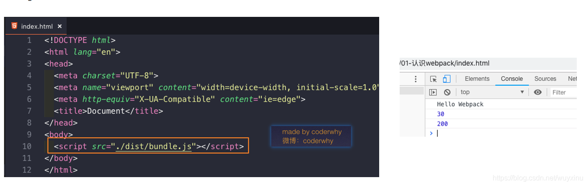

#### Webpack配置

**入口和出口**

我们考虑一下，如果每次使用webpack的命令都需要写上入口和出口作为参数，就非常麻烦，有没有一种方法可以将这两个参数写到配置中，在运行时，直接读取呢？
当然可以，就是创建一个webpack.config.js文件

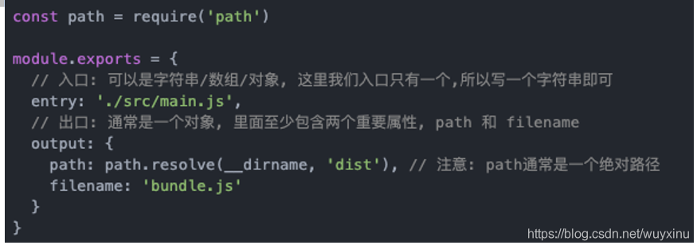

**局部安装webpack**

目前，我们使用的webpack是全局的webpack，如果我们想使用局部来打包呢？
因为一个项目往往依赖特定的webpack版本，全局的版本可能很这个项目的webpack版本不一致，导出打包出现问题。
所以通常一个项目，都有自己局部的webpack。
第一步，项目中需要安装自己局部的webpack
这里我们让局部安装webpack3.6.0
Vue CLI3中已经升级到webpack4，但是它将配置文件隐藏了起来，所以查看起来不是很方便。


第二步，通过node_modules/.bin/webpack启动webpack打包

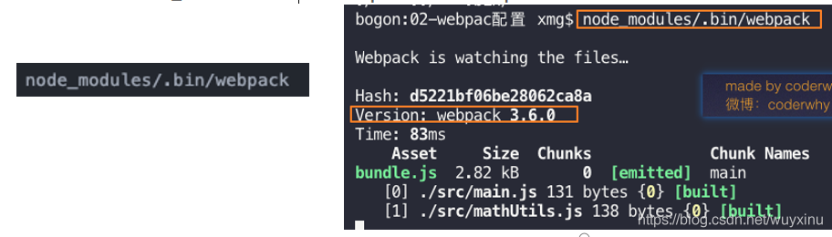

**package.json中定义启动**

但是，每次执行都敲这么一长串有没有觉得不方便呢？
OK，我们可以在package.json的scripts中定义自己的执行脚本。

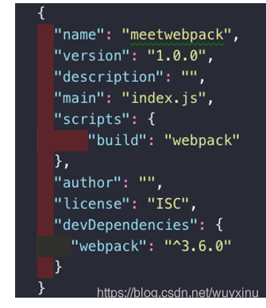

package.json中的scripts的脚本在执行时，会按照一定的顺序寻找命令对应的位置。
首先，会寻找本地的node_modules/.bin路径中对应的命令。
如果没有找到，会去全局的环境变量中寻找。
如何执行我们的build指令呢？


#### css-loader的使用

loader是webpack中一个非常核心的概念。

webpack用来做什么呢？
在我们之前的实例中，我们主要是用webpack来处理我们写的js代码，并且webpack会自动处理js之间相关的依赖。
但是，在开发中我们不仅仅有基本的js代码处理，我们也需要加载css、图片，也包括一些高级的将ES6转成ES5代码，将TypeScript转成ES5代码，将scss、less转成css，将.jsx、.vue文件转成js文件等等。
对于webpack本身的能力来说，对于这些转化是不支持的。
那怎么办呢？给webpack扩展对应的loader就可以啦。

loader使用过程：
步骤一：通过npm安装需要使用的loader
步骤二：在webpack.config.js中的modules关键字下进行配置
大部分loader我们都可以在webpack的官网中找到，并且学习对应的用法。

https://www.webpackjs.com/concepts/

**css文件处理 - 准备工作**

项目开发过程中，我们必然需要添加很多的样式，而样式我们往往写到一个单独的文件中。
在src目录中，创建一个css文件，其中创建一个normal.css文件。
我们也可以重新组织文件的目录结构，将零散的js文件放在一个js文件夹中。
normal.css中的代码非常简单，就是将body设置为red
但是，这个时候normal.css中的样式会生效吗？
当然不会，因为我们压根就没有引用它。
webpack也不可能找到它，因为我们只有一个入口，webpack会从入口开始查找其他依赖的文件。

在入口文件中引用：

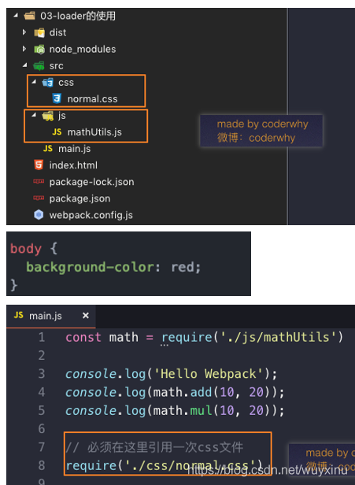

**css文件处理 – 打包报错信息**

重新打包，会出现如下错误：

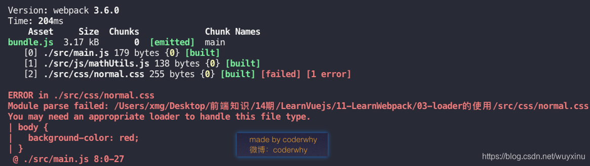

这个错误告诉我们：加载normal.css文件必须有对应的loader。

**css文件处理 – css-loader**

在webpack的官方中，我们可以找到如下关于样式的loader使用方法：
按照官方配置webpack.config.js文件
注意：配置中有一个style-loader，我们并不知道它是什么，所以可以暂时不进行配置。
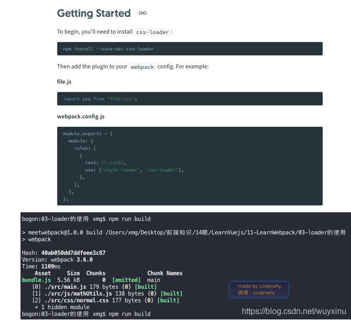

重新打包项目：
但是，运行index.html，你会发现样式并没有生效。
原因是css-loader只负责加载css文件，但是并不负责将css具体样式嵌入到文档中。
这个时候，我们还需要一个style-loader帮助我们处理。

**css文件处理 – style-loader**

我们来安装style-loader


注意：style-loader需要放在css-loader的前面。
疑惑：不对吧？按照我们的逻辑，在处理css文件过程中，应该是css-loader先加载css文件，再由style-loader来进行进一步的处理，为什么会将style-loader放在前面呢？
答案：这次因为webpack在读取使用的loader的过程中，是按照从右向左的顺序读取的。
目前，webpack.config.js的配置如下：

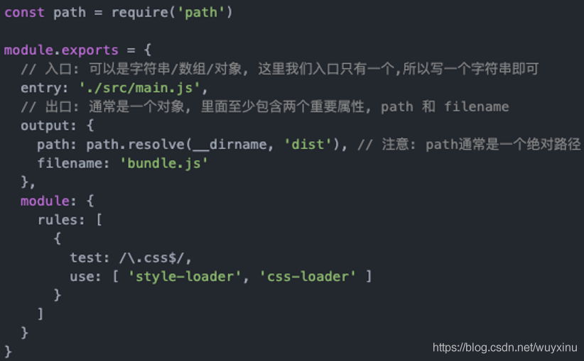

#### less文件处理

**less文件处理 – 准备工作**

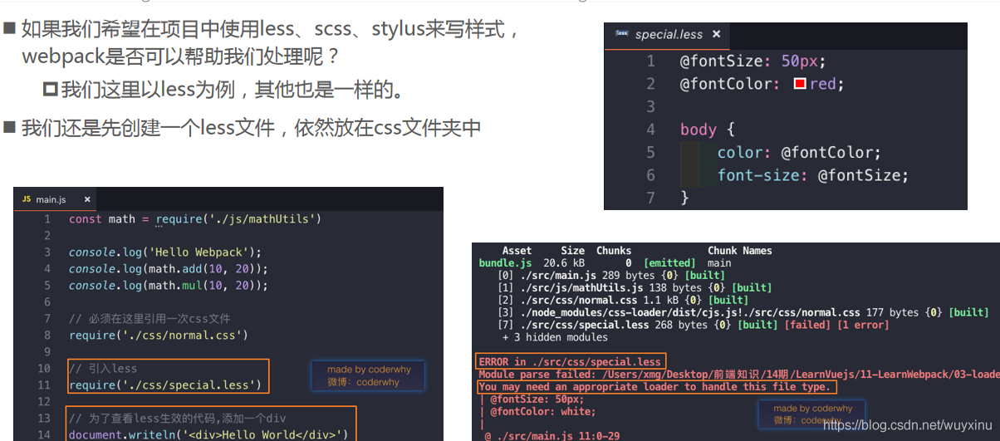

**less文件处理 – less-loader**

继续在官方中查找，我们会找到less-loader相关的使用说明
首先，还是需要安装对应的loader
注意：我们这里还安装了less，因为webpack会使用less对less文件进行编译


其次，修改对应的配置文件
添加一个rules选项，用于处理.less文件

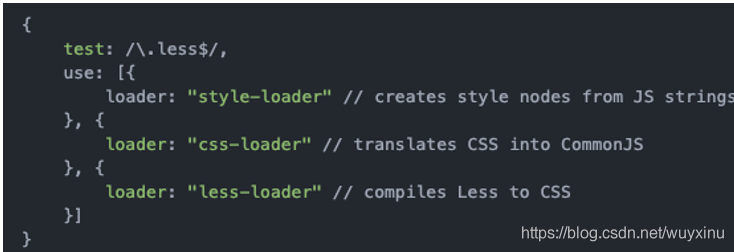

#### 图片文件处理

**图片文件处理 – 资源准备阶段**

首先，我们在项目中加入两张图片：
一张较小的图片test01.jpg(小于8kb)，一张较大的图片test02.jpeg(大于8kb)
待会儿我们会针对这两张图片进行不同的处理
我们先考虑在css样式中引用图片的情况，所以我更改了normal.css中的样式：
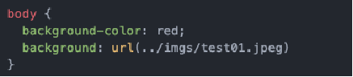

如果我们现在直接打包，会出现如下问题

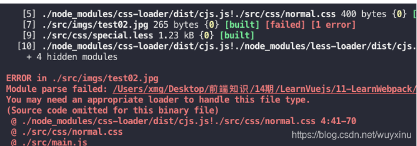

**图片文件处理 – url-loader**

图片处理，我们使用url-loader来处理，依然先安装url-loader


修改webpack.config.js配置文件：

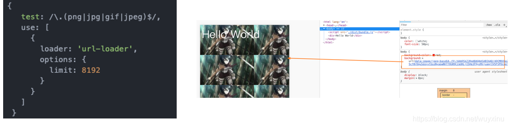

再次打包，运行index.html，就会发现我们的背景图片选出了出来。
而仔细观察，你会发现背景图是通过base64显示出来的
OK，这也是limit属性的作用，当图片小于8kb时，对图片进行base64编码

**图片文件处理 – file-loader**

那么问题来了，如果大于8kb呢？我们将background的图片改成test02.jpg
这次因为大于8kb的图片，会通过file-loader进行处理，但是我们的项目中并没有file-loader
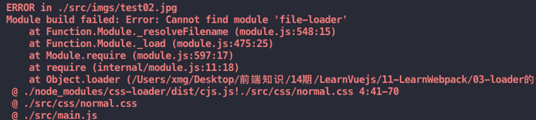

所以，我们需要安装file-loader
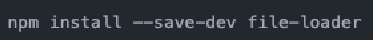

再次打包，就会发现dist文件夹下多了一个图片文件

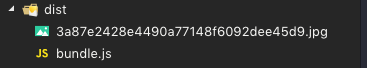

**图片文件处理 – 修改文件名称**

我们发现webpack自动帮助我们生成一个非常长的名字
这是一个32位hash值，目的是防止名字重复
但是，真实开发中，我们可能对打包的图片名字有一定的要求
比如，将所有的图片放在一个文件夹中，跟上图片原来的名称，同时也要防止重复

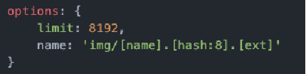

所以，我们可以在options中添加上如下选项：
img：文件要打包到的文件夹
name：获取图片原来的名字，放在该位置
hash:8：为了防止图片名称冲突，依然使用hash，但是我们只保留8位
ext：使用图片原来的扩展名

但是，我们发现图片并没有显示出来，这是因为图片使用的路径不正确
默认情况下，webpack会将生成的路径直接返回给使用者
但是，我们整个程序是打包在dist文件夹下的，所以这里我们需要在路径下再添加一个dist/

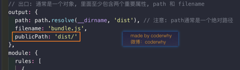

#### ES6语法处理

如果你仔细阅读webpack打包的js文件，发现写的ES6语法并没有转成ES5，那么就意味着可能一些对ES6还不支持的浏览器没有办法很好的运行我们的代码。
在前面我们说过，如果希望将ES6的语法转成ES5，那么就需要使用babel。
而在webpack中，我们直接使用babel对应的loader就可以了。

```java
npm install --save-dev babel-loader@7 babel-core babel-preset-es2015
```


配置webpack.config.js文件

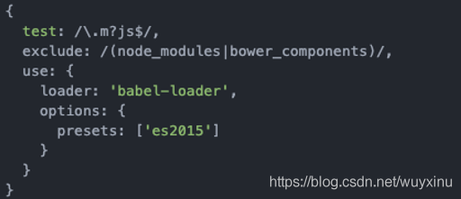

重新打包，查看bundle.js文件，发现其中的内容变成了ES5的语法

#### Webpack 配置 Vue

**引入vue.js**

后续项目中，我们会使用Vuejs进行开发，而且会以特殊的文件来组织vue的组件。
所以，下面我们来学习一下如何在我们的webpack环境中集成Vuejs
现在，我们希望在项目中使用Vuejs，那么必然需要对其有依赖，所以需要先进行安装
注：因为我们后续是在实际项目中也会使用vue的，所以并不是开发时依赖


那么，接下来就可以按照我们之前学习的方式来使用Vue了

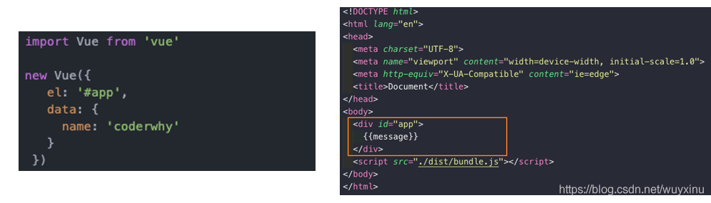

**打包项目 – 错误信息**

修改完成后，重新打包，运行程序：
打包过程没有任何错误(因为只是多打包了一个vue的js文件而已)
但是运行程序，没有出现想要的效果，而且浏览器中有报错

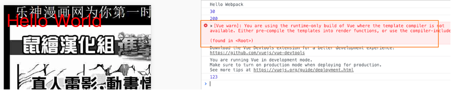

这个错误说的是我们使用的是runtime-only版本的Vue，什么意思呢？
这里我只说解决方案：Vue不同版本构建，后续我具体讲解runtime-only和runtime-compiler的区别。
所以我们修改webpack的配置，添加如下内容即可

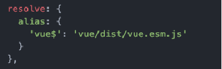

#### el和template区别

正常运行之后，我们来考虑另外一个问题：
如果我们希望将data中的数据显示在界面中，就必须是修改index.html
如果我们后面自定义了组件，也必须修改index.html来使用组件
但是html模板在之后的开发中，我并不希望手动的来频繁修改，是否可以做到呢？

定义template属性：
在前面的Vue实例中，我们定义了el属性，用于和index.html中的#app进行绑定，让Vue实例之后可以管理它其中的内容
这里，我们可以将div元素中的{{message}}内容删掉，只保留一个基本的id为div的元素
但是如果我依然希望在其中显示{{message}}的内容，应该怎么处理呢？
我们可以再定义一个template属性，代码如下：

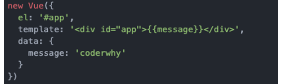

重新打包，运行程序，显示一样的结果和HTML代码结构

那么，el和template模板的关系是什么呢？
在我们之前的学习中，我们知道el用于指定Vue要管理的DOM，可以帮助解析其中的指令、事件监听等等。
而如果Vue实例中同时指定了template，那么template模板的内容会替换掉挂载的对应el的模板。

这样做有什么好处呢？
这样做之后我们就不需要在以后的开发中再次操作index.html，只需要在template中写入对应的标签即可
但是，书写template模块非常麻烦怎么办呢？
没有关系，稍后我们会将template模板中的内容进行抽离。
会分成三部分书写：template、script、style，结构变得非常清晰。

#### Vue组件化开发引入

在学习组件化开发的时候，我说过以后的Vue开发过程中，我们都会采用组件化开发的思想。
那么，在当前项目中，如果我也想采用组件化的形式进行开发，应该怎么做呢？
查看下面的代码：
当然，我们也可以将下面的代码抽取到一个js文件中，并且导出。

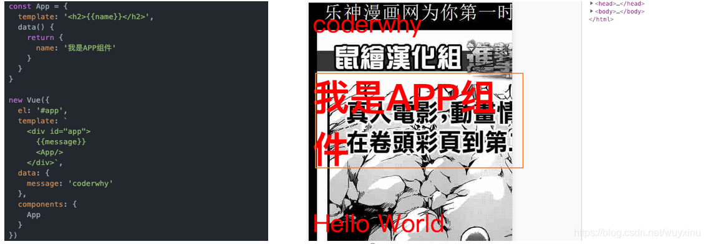

**.vue文件封装处理**

但是一个组件以一个js对象的形式进行组织和使用的时候是非常不方便的
一方面编写template模块非常的麻烦
另外一方面如果有样式的话，我们写在哪里比较合适呢？

现在，我们以一种全新的方式来组织一个vue的组件

但是，这个时候这个文件可以被正确的加载吗？
必然不可以，这种特殊的文件以及特殊的格式，必须有人帮助我们处理。
谁来处理呢？vue-loader以及vue-template-compiler。
安装vue-loader和vue-template-compiler

```java
npm install vue-loader vue-template-compiler --save-dev
```


修改webpack.config.js的配置文件：

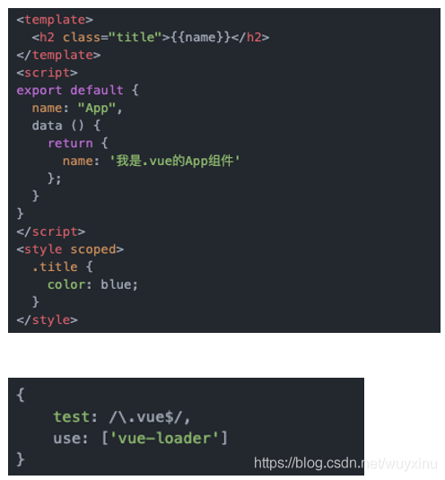

#### plugin的使用

plugin是什么？
plugin是插件的意思，通常是用于对某个现有的架构进行扩展。
webpack中的插件，就是对webpack现有功能的各种扩展，比如打包优化，文件压缩等等。

loader和plugin区别
loader主要用于转换某些类型的模块，它是一个转换器。
plugin是插件，它是对webpack本身的扩展，是一个扩展器。

plugin的使用过程：
步骤一：通过npm安装需要使用的plugins(某些webpack已经内置的插件不需要安装)
步骤二：在webpack.config.js中的plugins中配置插件。
下面，我们就来看看可以通过哪些插件对现有的webpack打包过程进行扩容，让我们的webpack变得更加好用。

**添加版权的Plugin**

我们先来使用一个最简单的插件，为打包的文件添加版权声明
该插件名字叫BannerPlugin，属于webpack自带的插件。
按照下面的方式来修改webpack.config.js的文件：

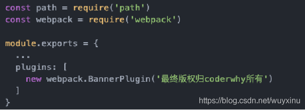

重新打包程序：查看bundle.js文件的头部，看到如下信息

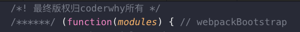

**打包html的plugin**

目前，我们的index.html文件是存放在项目的根目录下的。
我们知道，在真实发布项目时，发布的是dist文件夹中的内容，但是dist文件夹中如果没有index.html文件，那么打包的js等文件也就没有意义了。
所以，我们需要将index.html文件打包到dist文件夹中，这个时候就可以使用

HtmlWebpackPlugin插件
HtmlWebpackPlugin插件可以为我们做这些事情：
自动生成一个index.html文件(可以指定模板来生成)
将打包的js文件，自动通过script标签插入到body中

安装HtmlWebpackPlugin插件

```java
npm install html-webpack-plugin --save-dev
```


使用插件，修改webpack.config.js文件中plugins部分的内容如下：
这里的template表示根据什么模板来生成index.html
另外，我们需要删除之前在output中添加的publicPath属性
否则插入的script标签中的src可能会有问题

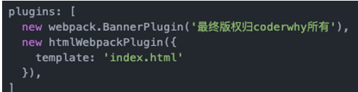

**js压缩的Plugin**

在项目发布之前，我们必然需要对js等文件进行压缩处理
这里，我们就对打包的js文件进行压缩
我们使用一个第三方的插件uglifyjs-webpack-plugin，并且版本号指定1.1.1，和CLI2保持一致

```java
npm install uglifyjs-webpack-plugin@1.1.1 --save-dev
```


修改webpack.config.js文件，使用插件：

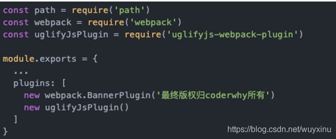

查看打包后的bunlde.js文件，是已经被压缩过了。

#### 搭建本地服务器

webpack提供了一个可选的本地开发服务器，这个本地服务器基于node.js搭建，内部使用express框架，可以实现我们想要的让浏览器自动刷新显示我们修改后的结果。
不过它是一个单独的模块，在webpack中使用之前需要先安装它

```java
npm install --save-dev webpack-dev-server@2.9.1
```


devserver也是作为webpack中的一个选项，选项本身可以设置如下属性：
contentBase：为哪一个文件夹提供本地服务，默认是根文件夹，我们这里要填写./dist
port：端口号
inline：页面实时刷新
historyApiFallback：在SPA页面中，依赖HTML5的history模式
webpack.config.js文件配置修改如下：
我们可以再配置另外一个scripts：
–open参数表示直接打开浏览器

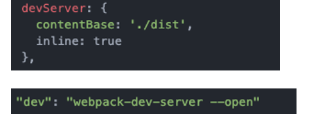

### 2、Vue CLI

#### **什么是Vue CLI**

如果你只是简单写几个Vue的Demo程序, 那么你不需要Vue CLI.

如果你在开发大型项目, 那么你需要, 并且必然需要使用Vue CLI
使用Vue.js开发大型应用时，我们需要考虑代码目录结构、项目结构和部署、热加载、代码单元测试等事情。
如果每个项目都要手动完成这些工作，那无以效率比较低效，所以通常我们会使用一些脚手架工具来帮助完成这些事情。

CLI是什么意思?
CLI是Command-Line Interface, 翻译为命令行界面, 但是俗称脚手架.
Vue CLI是一个官方发布 vue.js 项目脚手架
使用 vue-cli 可以快速搭建Vue开发环境以及对应的webpack配置.

#### **Vue CLI使用前提 - Node**

安装NodeJS
可以直接在官方网站中下载安装.
网址: http://nodejs.cn/download/
检测安装的版本
默认情况下自动安装Node和NPM
Node环境要求8.9以上或者更高版本

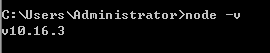

什么是NPM呢?
NPM的全称是Node Package Manager
是一个NodeJS包管理和分发工具，已经成为了非官方的发布Node模块（包）的标准。
后续我们会经常使用NPM来安装一些开发过程中依赖包.

**cnpm安装**
由于国内直接使用 npm 的官方镜像是非常慢的，这里推荐使用淘宝 NPM 镜像。
你可以使用淘宝定制的 cnpm (gzip 压缩支持) 命令行工具代替默认的 npm:
npm install -g cnpm --registry=https://registry.npm.taobao.org
这样就可以使用 cnpm 命令来安装模块了：
cnpm install [name]

#### Vue CLI使用前提 - Webpack

Vue.js官方脚手架工具就使用了webpack模板
对所有的资源会压缩等优化操作
它在开发过程中提供了一套完整的功能，能够使得我们开发过程中变得高效。
Webpack的全局安装
npm install webpack -g


**Vue CLI的使用**

安装Vue脚手架
npm install -g @vue/cli


注意：上面安装的是Vue CLI3的版本，如果需要想按照Vue CLI2的方式初始化项目时不可以的。

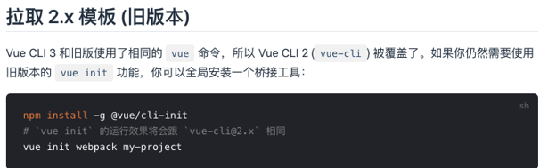

**Vue CLI2初始化项目**
vue init webpack my-project

**Vue CLI3初始化项目**
vue create my-project

#### Vue CLI2详解

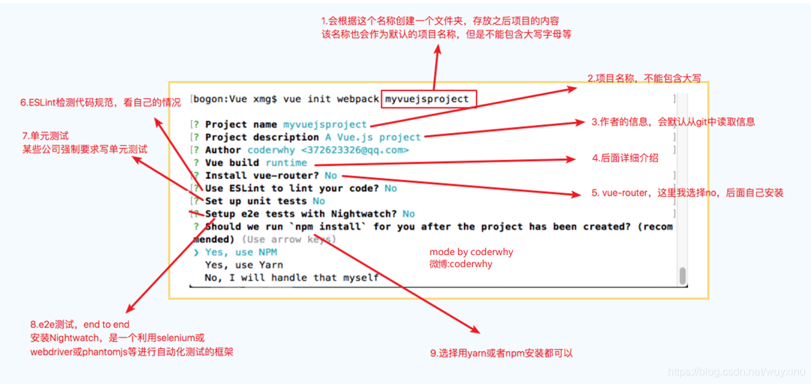

**目录结构详解**

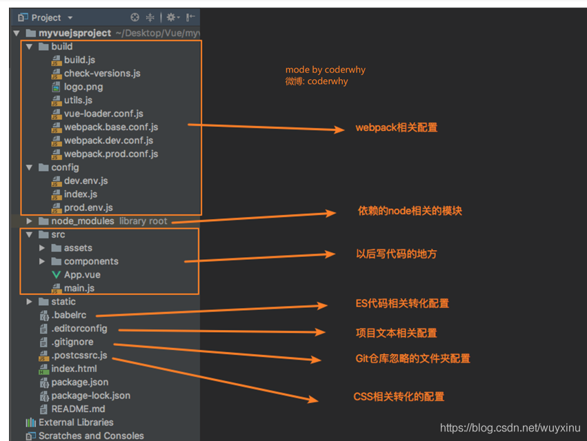

**Runtime-Compiler和Runtime-only的区别**

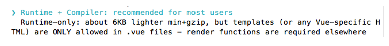

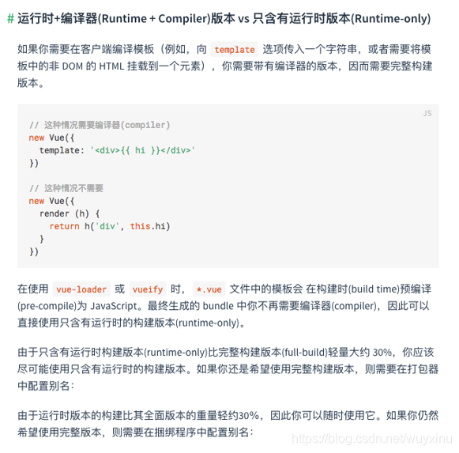

简单总结
如果在之后的开发中，你依然使用template，就需要选择Runtime-Compiler
如果你之后的开发中，使用的是.vue文件夹开发，那么可以选择Runtime-only

**render和template**

Runtime-Compiler 和 Runtime-only

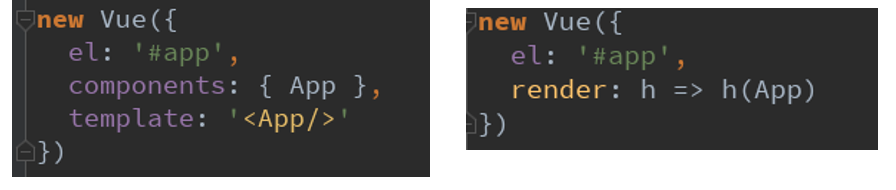

为什么存在这样的差异呢？
我们需要先理解Vue应用程序是如何运行起来的。
Vue中的模板如何最终渲染成真实DOM。
我们来看下面的一幅图。

**Vue程序运行过程**

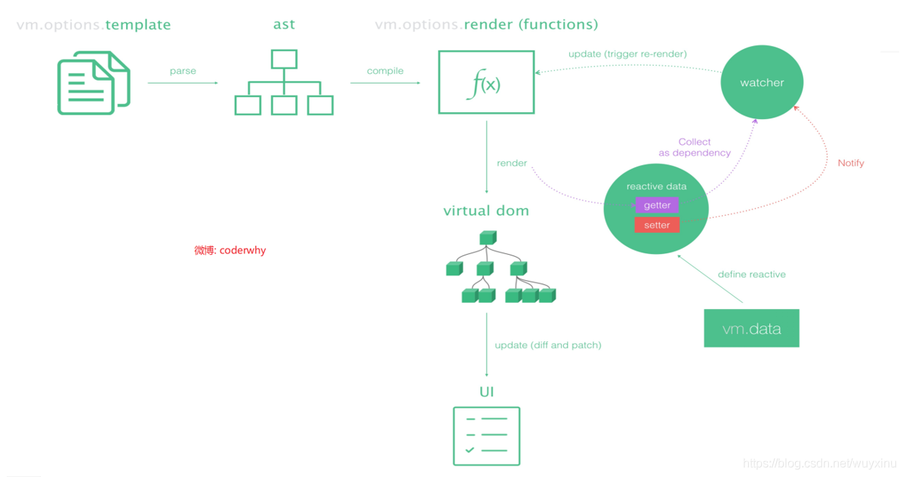

**render函数的使用**

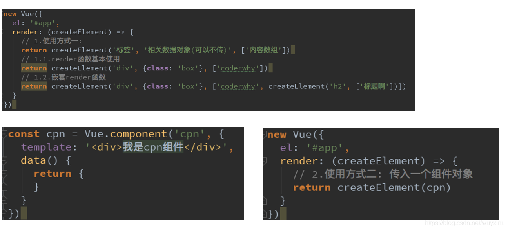

npm run build

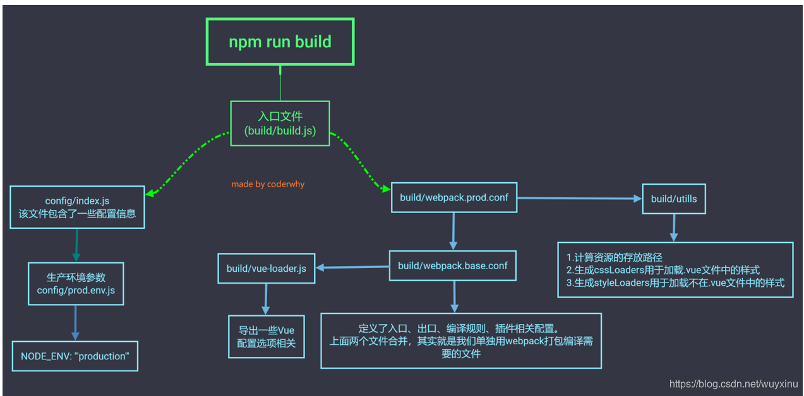

npm run dev


修改配置：webpack.base.conf.js起别名

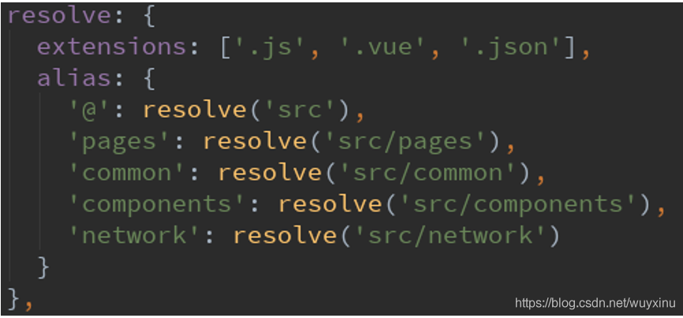

#### Vue CLI3


vue-cli 3 与 2 版本有很大区别
vue-cli 3 是基于 webpack 4 打造，vue-cli 2 还是 webapck 3
vue-cli 3 的设计原则是“0配置”，移除的配置文件根目录下的，build和config等目录
vue-cli 3 提供了 vue ui 命令，提供了可视化配置，更加人性化
移除了static文件夹，新增了public文件夹，并且index.html移动到public中

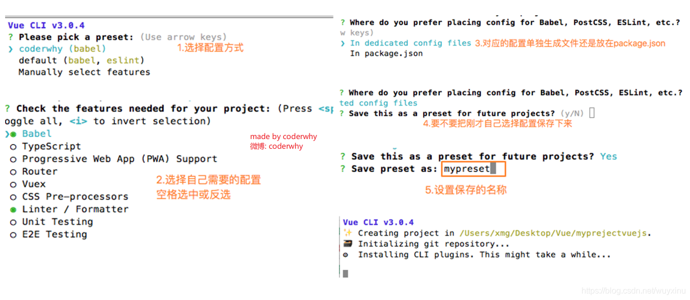

**目录结构详解**

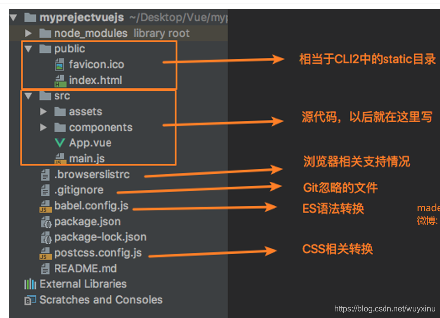

**配置去哪里了？**

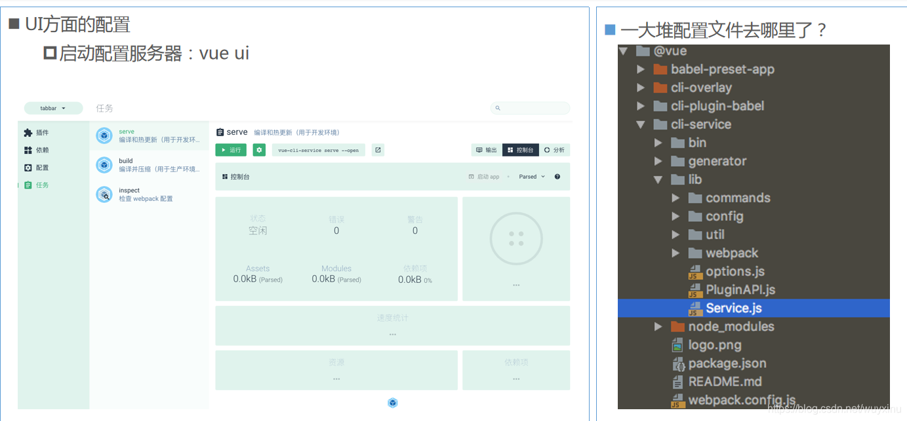

**自定义配置：起别名**

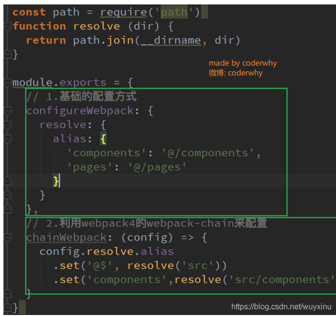

### 3、vue-router详解

#### 认识路由

说起路由你想起了什么？
路由是一个网络工程里面的术语。
路由（routing）就是通过互联的网络把信息从源地址传输到目的地址的活动. — 维基百科

在生活中, 我们有没有听说过路由的概念呢? 当然了, 路由器嘛.
路由器是做什么的? 你有想过吗?

路由器提供了两种机制: 路由和转送.

- 路由是决定数据包从来源到目的地的路径.

- 转送将输入端的数据转移到合适的输出端.

路由中有一个非常重要的概念叫路由表.

路由表本质上就是一个映射表, 决定了数据包的指向.

#### 后端路由阶段

早期的网站开发整个HTML页面是由服务器来渲染的.
服务器直接生产渲染好对应的HTML页面, 返回给客户端进行展示.

但是, 一个网站, 这么多页面服务器如何处理呢?

- 一个页面有自己对应的网址, 也就是URL.

- URL会发送到服务器, 服务器会通过正则对该URL进行匹配, 并且最后交给一个Controller进行处理.

- Controller进行各种处理, 最终生成HTML或者数据, 返回给前端.

- 这就完成了一个IO操作.

上面的这种操作, 就是后端路由.

当我们页面中需要请求不同的路径内容时, 交给服务器来进行处理, 服务器渲染好整个页面, 并且将页面返回给客户顿.
这种情况下渲染好的页面, 不需要单独加载任何的js和css, 可以直接交给浏览器展示, 这样也有利于SEO的优化.

后端路由的缺点:
一种情况是整个页面的模块由后端人员来编写和维护的.
另一种情况是前端开发人员如果要开发页面, 需要通过PHP和Java等语言来编写页面代码.
而且通常情况下HTML代码和数据以及对应的逻辑会混在一起, 编写和维护都是非常糟糕的事情.

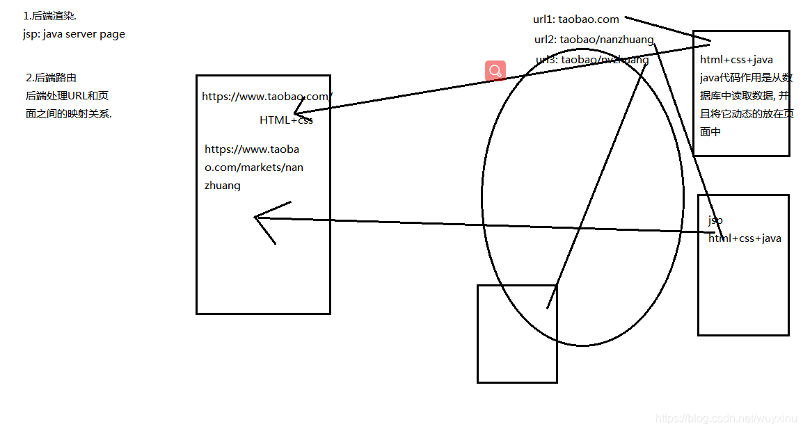

#### 前端路由阶段

前后端分离阶段：

- 随着Ajax的出现, 有了前后端分离的开发模式.

- 后端只提供API来返回数据, 前端通过Ajax获取数据, 并且可以通过JavaScript将数据渲染到页面中.

- 这样做最大的优点就是前后端责任的清晰, 后端专注于数据上, 前端专注于交互和可视化上.

- 并且当移动端(iOS/Android)出现后, 后端不需要进行任何处理, 依然使用之前的一套API即可.

- 目前很多的网站依然采用这种模式开发.

单页面富应用阶段:
其实SPA最主要的特点就是在前后端分离的基础上加了一层前端路由.
也就是前端来维护一套路由规则.

前端路由的核心是什么呢？
改变URL，但是页面不进行整体的刷新。
如何实现呢？

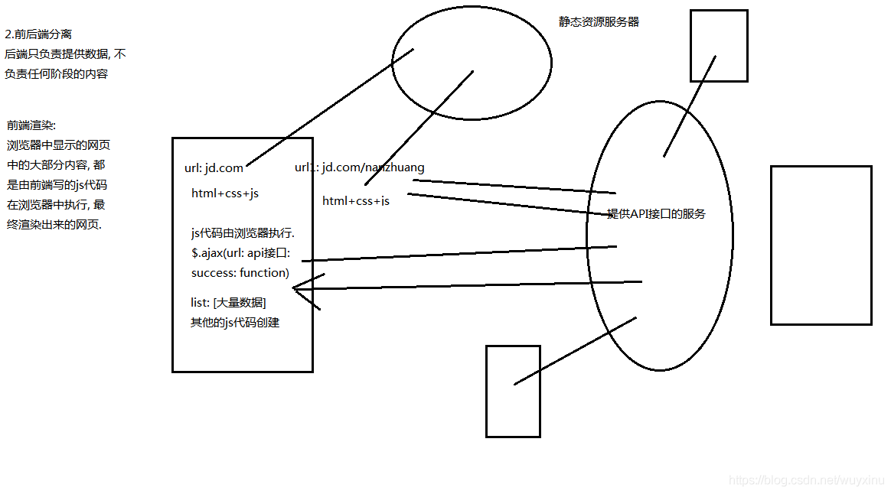

**URL的hash**
URL的hash也就是锚点(#), 本质上是改变window.location的href属性.
我们可以通过直接赋值location.hash来改变href, 但是页面不发生刷新

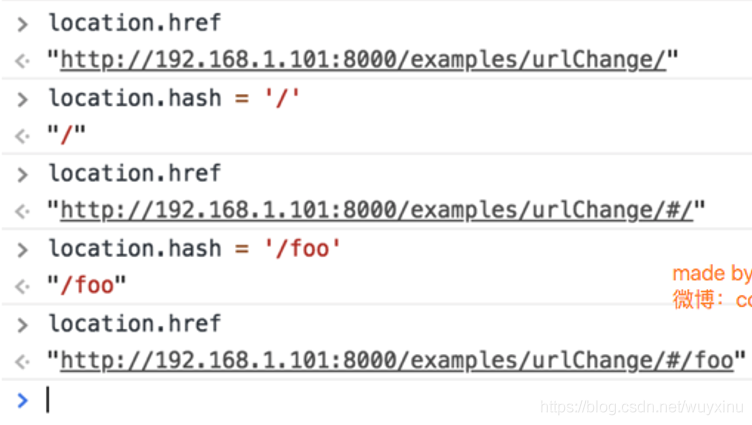

**HTML5的history模式：pushState**

history接口是HTML5新增的, 它有五种模式改变URL而不刷新页面.
history.pushState()

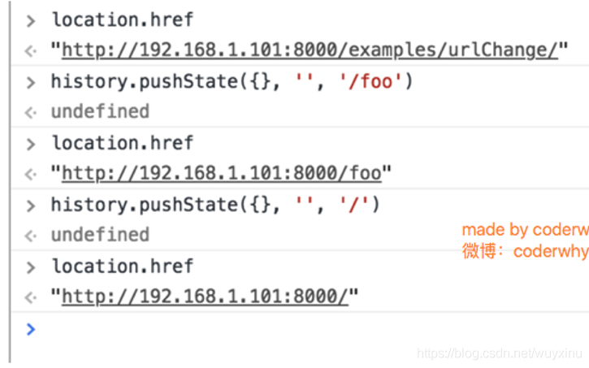

**HTML5的history模式：replaceState**

history.replaceState()

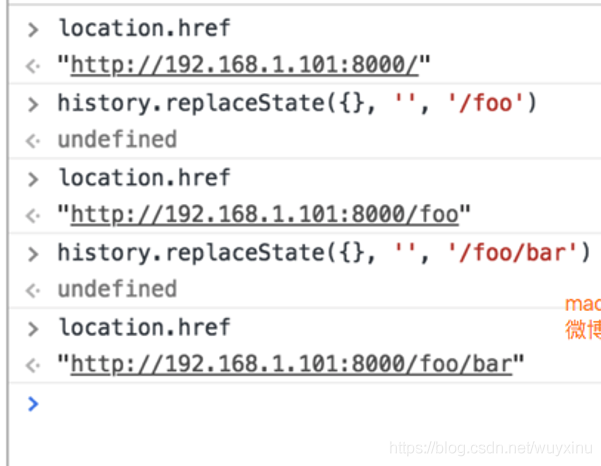

**HTML5的history模式：go**

history.go()

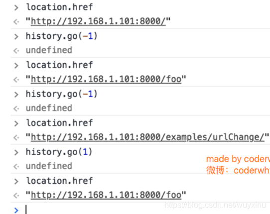

补充说明：
上面只演示了三个方法

- 因为 history.back() 等价于 history.go(-1)

- history.forward() 则等价于 history.go(1)

- 这三个接口等同于浏览器界面的前进后退。

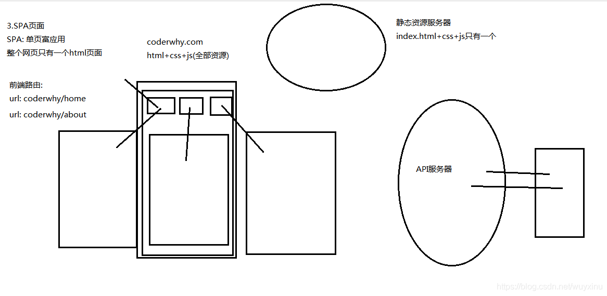

看到这里，你可以自问自答一下，下面这个几个问题。

（1）什么是前端渲染, 什么是后端渲染?

（2）什么是前后端分离?

（3）什么是前端路由, 什么是后端路由?

（1）什么是前端渲染, 什么是后端渲染?

前端渲染：

指的是后端返回JSON数据，前端利用预先写的html模板，循环读取JSON数据，拼接字符串（es6的模板字符串特性大大减少了拼接字符串的的成本），并插入页面。

好处：网络传输数据量小。不占用服务端运算资源（解析模板），模板在前端（很有可能仅部分在前端），改结构变交互都前端自己来了，改完自己调就行。

坏处：前端耗时较多，对前端工作人员水平要求相对较高。前端代码较多，因为部分以前在后台处理的交互逻辑交给了前端处理。占用少部分客户端运算资源用于解析模板。

后端渲染：

前端请求，后端用后台模板引擎直接生成html，前端接受到数据之后，直接插入页面。

好处：前端耗时少，即减少了首屏时间，模板统一在后端。前端（相对）省事，不占用客户端运算资源（解析模板）

坏处：占用服务器资源。

前端渲染与后端渲染对比：

后端渲染：

页面呈现速度：快，受限于用户的带宽
流量消耗：少一点点（可以省去前端框架部分的代码）
可维护性：差（前后端东西放一起，掐架多年，早就在闹分手啦）
seo友好度：好
编码效率：低（这个跟不同的团队不同，可能不对）

前端渲染：

页面呈现速度：主要受限于带宽和客户端机器的好坏，优化的好，可以逐步动态展开内容，感觉上会更快一点。

流量消耗：多一点点（一个前端框架大概50KB）当然，有的用后端渲染的项目前端部分也有在用框架。

可维护性：好，前后端分离，各施其职，代码一目明了。
SEO友好度：差，大量使用ajax，多数浏览器不能抓取ajax数据。
编码效率：高，前后端各自只做自己擅长的东西，后端最后只输出接口，不用管页面呈现，只要前后端人员能力不错，效率不会低。

（2）什么是前后端分离?

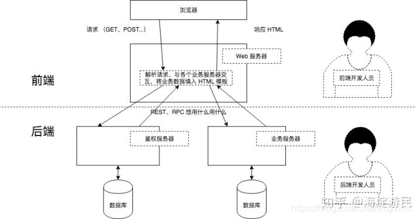

现在 Web 服务器不再处理任何业务，它接收到请求后，经过转换，发送给各个相关后端服务器，将各个后端服务器返回的，处理过的业务数据填入 HTML 模板，最后发送给浏览器。Web 服务器和后端服务器间，可以选用任何你觉得合适的通信手段，可以是 REST，可以是 RPC，选用什么样的通信手段，这是另一个议题了。

这样，前端人员和后端人员约定好接口后，前端人员彻底不用再关心业务处理是怎么回事，他只需要把界面做好就可以了，后端人员也不用再关系前端界面是什么样的，他只需要做好业务逻辑处理即可。服务的切离，代码管理，服务部署也都独立出来分别管理，系统的灵活性也获得了极大的提升。

**注意，这不是个微服务架构，那是另外一个议题了**

总结，任何系统架构设计，实际上是对组织结构在系统上进行映射，前后端分离，就是在对前端开发人员和后端开发人员的工作进行解耦，尽量减少他她们之间的交流成本，帮助他她们更能专注于自己擅长的工作。

最后是几个常见误解的说明：

1、前后端分离是说浏览器和后端服务分离吗？

不是，前后端分离里的前端不是浏览器，指的是生成 HTML 的那个服务，它可以是一个仅仅生成 HTML 的 Web 服务器，也可以是在浏览器中通过 JS 动态生成 HTML 的 单页应用。实践中，有实力的团队往往在实现前后端分离里时，前端选用 node 服务器，后端选用 C#、Java 等（排名不分先后）

2、前后端分离是种技术吗？

不是，前后端分离是种架构模式，或者说是最佳实践。所谓模式就是大家这么用了觉得不错，你可以直接抄来用的固定套路。

3、前后端分离是最佳实践吗？

看你团队和项目的情况，如果是短平快的小项目，真的没必要。如果是面向简历开发，那绝对在任何时候都应该使用前后端分离这种架构。

（3）什么是前端路由, 什么是后端路由?

1、什么是前端路由？

很重要的一点是页面不刷新，前端路由就是把不同路由对应不同的内容或页面的任务交给前端来做，每跳转到不同的URL都是使用前端的锚点路由. 随着（SPA）单页应用的不断普及，前后端开发分离，目前项目基本都使用前端路由，在项目使用期间页面不会重新加载。

2、什么是后端路由？

 浏览器在地址栏中切换不同的url时，每次都向后台服务器发出请求，服务器响应请求，在后台拼接html文件传给前端显示, 返回不同的页面, 意味着浏览器会刷新页面，网速慢的话说不定屏幕全白再有新内容。后端路由的另外一个极大的问题就是 前后端不分离。

 优点：分担了前端的压力，html和数据的拼接都是由服务器完成。

 缺点：当项目十分庞大时，加大了服务器端的压力，同时在浏览器端不能输入制定的url路径进行指定模块的访问。另外一个就是如果当前网速过慢，那将会延迟页面的加载，对用户体验不是很友好。

3，什么时候使用前端路由？

 在单页面应用，大部分页面结构不变，只改变部分内容的使用

4，前端路由有什么优点和缺点？

**优点:**

 1.用户体验好，和后台网速没有关系，不需要每次都从服务器全部获取，快速展现给用户

 2.可以再浏览器中输入指定想要访问的url路径地址。

 3.实现了前后端的分离，方便开发。有很多框架都带有路由功能模块。

**缺点:**

 1.使用浏览器的前进，后退键的时候会重新发送请求，没有合理地利用缓存

 2.单页面无法记住之前滚动的位置，无法在前进，后退的时候记住滚动的位置

#### 认识vue-router

目前前端流行的三大框架, 都有自己的路由实现:
Angular的ngRouter
React的ReactRouter
Vue的vue-router

当然, 我们的重点是vue-router
vue-router是Vue.js官方的路由插件，它和vue.js是深度集成的，适合用于构建单页面应用。
我们可以访问其官方网站对其进行学习: https://router.vuejs.org/zh/
vue-router是基于路由和组件的
路由用于设定访问路径, 将路径和组件映射起来.
在vue-router的单页面应用中, 页面的路径的改变就是组件的切换.

**安装和使用vue-router**

因为我们已经学习了webpack, 后续开发中我们主要是通过工程化的方式进行开发的.
所以在后续, 我们直接使用npm来安装路由即可.
步骤一: 安装vue-router
npm install vue-router --save
步骤二: 在模块化工程中使用它(因为是一个插件, 所以可以通过Vue.use()来安装路由功能)
第一步：导入路由对象，并且调用 Vue.use(VueRouter)
第二步：创建路由实例，并且传入路由映射配置
第三步：在Vue实例中挂载创建的路由实例

使用vue-router的步骤:
第一步: 创建路由组件
第二步: 配置路由映射: 组件和路径映射关系
第三步: 使用路由: 通过`<router-link>`和`<router-view>`

import Vue from ‘vue’
import VueRouter from ‘vue-router’

Vue.use(VueRouter)

**创建router实例**

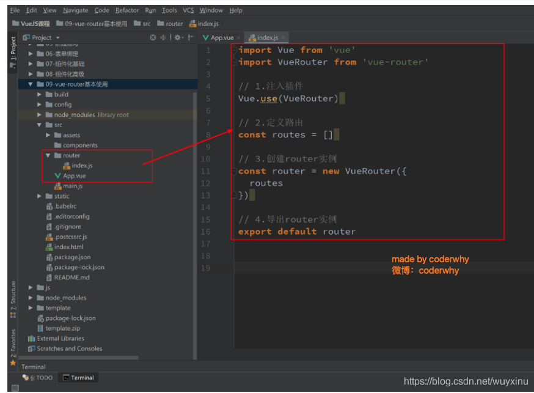

**挂载到Vue实例中**

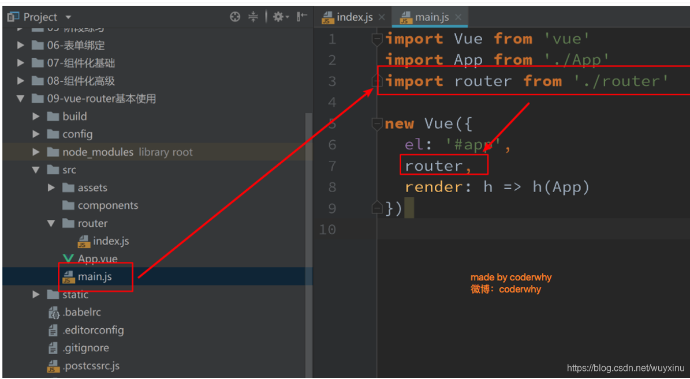

**步骤一：创建路由组件**

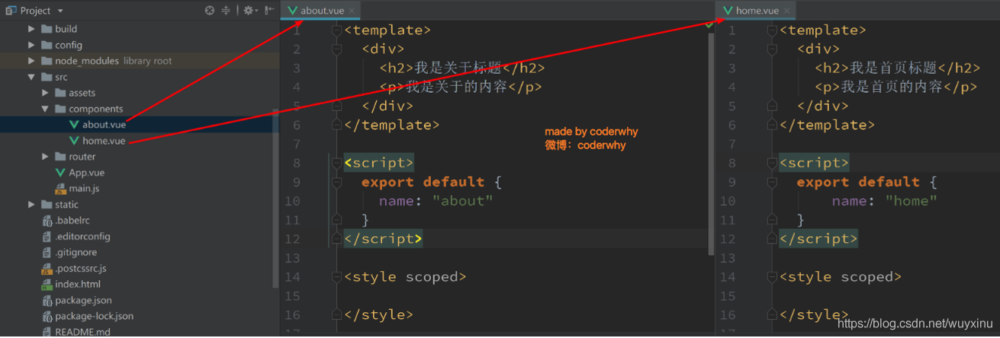

**步骤二：配置组件和路径的映射关系**

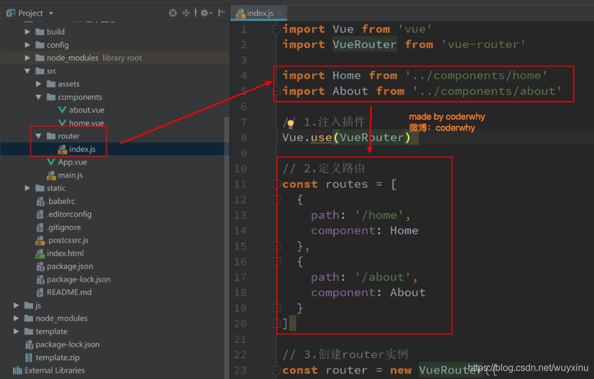

**步骤三：使用路由.**

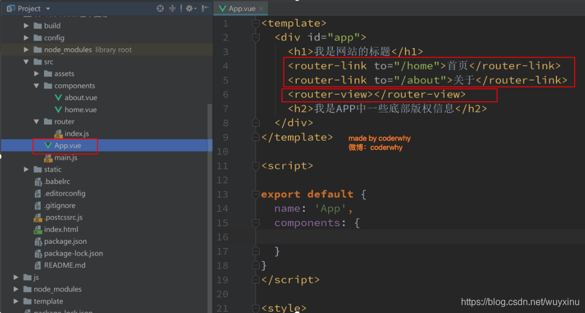

`<router-link>`: 该标签是一个vue-router中已经内置的组件, 它会被渲染成一个`<a>`标签.
`<router-view>`: 该标签会根据当前的路径, 动态渲染出不同的组件.
网页的其他内容, 比如顶部的标题/导航, 或者底部的一些版权信息等会和`<router-view>`处于同一个等级.
在路由切换时, 切换的是`<router-view>`挂载的组件, 其他内容不会发生改变.

**最终效果如下**

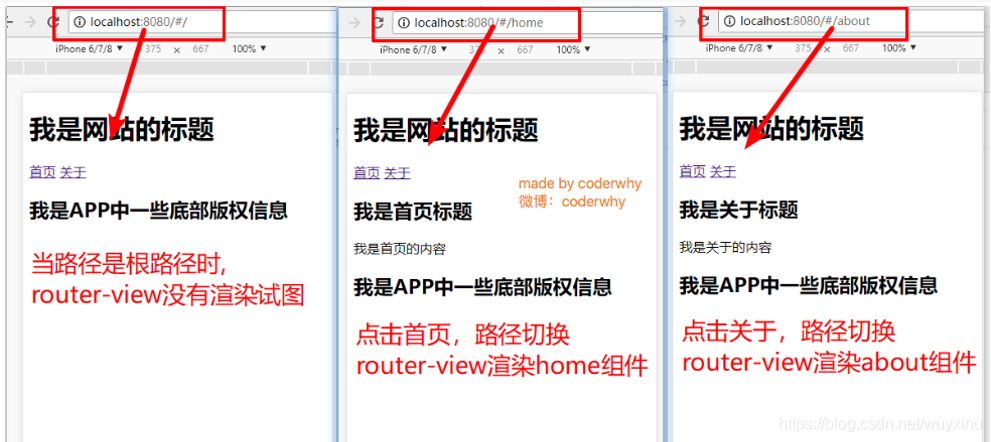

#### 细节处理

**路由的默认路径**

我们这里还有一个不太好的实现:
默认情况下, 进入网站的首页, 我们希望`<router-view>`渲染首页的内容.
但是我们的实现中, 默认没有显示首页组件, 必须让用户点击才可以.
如何可以让路径默认跳到到首页, 并且`<router-view>`渲染首页组件呢?
非常简单, 我们只需要配置多配置一个映射就可以了.
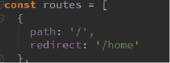

配置解析:
我们在routes中又配置了一个映射.
path配置的是根路径: /
redirect是重定向, 也就是我们将根路径重定向到/home的路径下, 这样就可以得到我们想要的结果了.

**HTML5的History模式**

我们前面说过改变路径的方式有两种:
URL的hash
HTML5的history
默认情况下, 路径的改变使用的URL的hash.
如果希望使用HTML5的history模式, 非常简单, 进行如下配置即可:

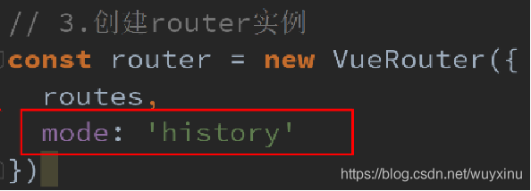

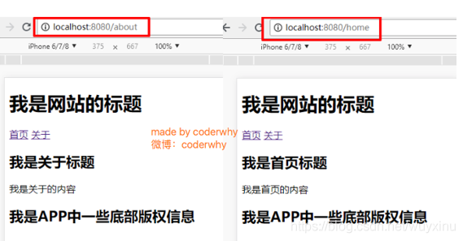

**router-link补充**

在前面的`<router-link>`中, 我们只是使用了一个属性: to, 用于指定跳转的路径.

`<router-link>`还有一些其他属性:
**tag:** tag可以指定`<router-link>`之后渲染成什么组件, 比如上面的代码会被渲染成一个`<li>`元素, 而不是

`<router-link to='/home' tag='li'>`

**replace:** replace不会留下history记录, 所以指定replace的情况下, 后退键返回不能返回到上一个页面中
**active-class:** 当`<router-link>`对应的路由匹配成功时, 会自动给当前元素设置一个router-link-active的class, 设置active-class可以修改默认的名称.

- 在进行高亮显示的导航菜单或者底部tabbar时, 会使用到该类.

- 但是通常不会修改类的属性, 会直接使用默认的router-link-active即可.

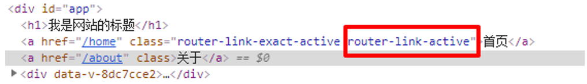

**修改linkActiveClass**

该class具体的名称也可以通过router实例的属性进行修改

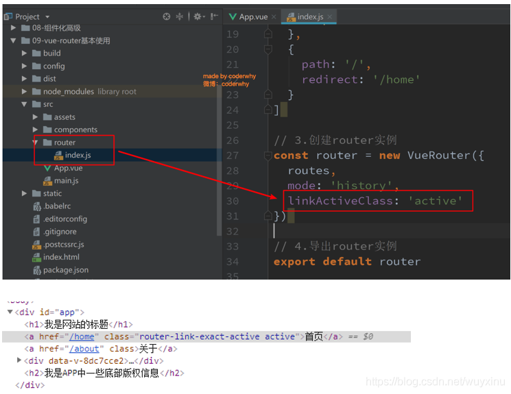

exact-active-class
类似于active-class, 只是在精准匹配下才会出现的class.
后面看到嵌套路由时, 我们再看下这个属性.

一.在点击导航栏的时候，让被点击的那一个有背景色，其他的没有背景色？

```java
const router = new VueRouter({
    routes,
    linkActiveClass: 'is-active'
});
.is-active{
  background:red;
}
```


这样`<router-link>`被点击激活的时候就会被加上is-active这个class了。注意如果没有设置router-link的标签类型，会是标签,标签是没有宽度和高度的。将`<router-link>`这样的a标签转化为li标签

```java
<router-link to='index' tag="li" event="mouseover">
```


二.自己来操控 active Class 给加的位置，并不想它随着路由的改变而改变
假如侧边栏我的钱包，路由为’/myWallet’，在’/myWallet’页面可以操作提现，会进入’/withdraw’提现页面，路由发生变化，从’/myWallet’ 身上移到’/withdraw’上了。如何让 ‘/myWallet’ 这个页面的active Class 保留住呢？给’/withdraw’ 加上一个路由元信息，在侧边栏去检查路由元信息，然后看是否需要给其active class

```java
{
  path: '/myWallet',
  name: 'MyWallet',
  component: MyWallet,
  meta: { 
    requiresAuth: true,
    active: '/MyWallet'
  }
},
{
  path: '/withdraw',
  name: 'Withdraw',
  component: withdraw,
  meta: { 
    requiresAuth: true ,
    active: '/MyWallet'
  }
},
<router-link tag="li" class="li-item" to="/MyWallet" :class="{'is-active':$route.meta.active === '/MyWallet'}">我的钱包</router-link>
```


如果只有一个页面 对应一个active的,就不用添加 meta下面的active属性了

```java
<router-link tag="li" class="li-item" to="/userinfo" :class="{'is-active':$route.path === '/userinfo'}"></router-link>
```


**路由代码跳转**

有时候, 页面的跳转可能需要执行对应的JavaScript代码, 这个时候, 就可以使用第二种跳转方式了
比如, 我们将代码修改如下:

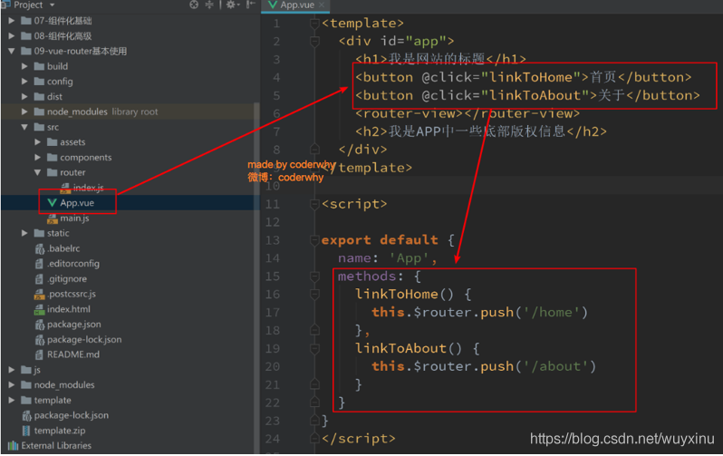

**动态路由**

在某些情况下，一个页面的path路径可能是不确定的，比如我们进入用户界面时，希望是如下的路径：
/user/aaaa或/user/bbbb
除了有前面的/user之外，后面还跟上了用户的ID
这种path和Component的匹配关系，我们称之为动态路由(也是路由传递数据的一种方式)。

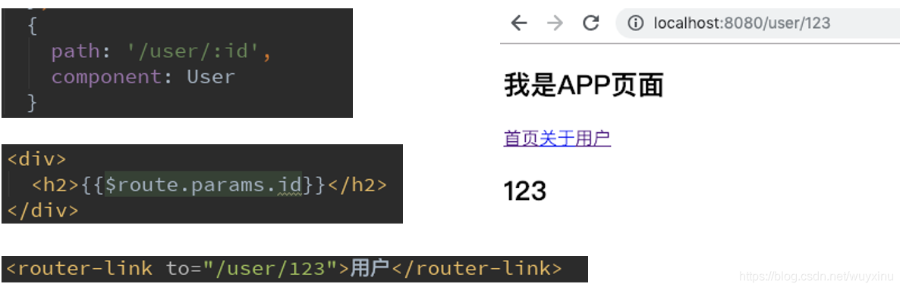

#### 路由的懒加载

**认识路由的懒加载**

官方给出了解释:
当打包构建应用时，Javascript 包会变得非常大，影响页面加载。
如果我们能把不同路由对应的组件分割成不同的代码块，然后当路由被访问的时候才加载对应组件，这样就更加高效了

官方在说什么呢?
首先, 我们知道路由中通常会定义很多不同的页面.
这个页面最后被打包在哪里呢? 一般情况下, 是放在一个js文件中.
但是, 页面这么多放在一个js文件中, 必然会造成这个页面非常的大.
如果我们一次性从服务器请求下来这个页面, 可能需要花费一定的时间, 甚至用户的电脑上还出现了短暂空白的情况.
如何避免这种情况呢? 使用路由懒加载就可以了.

路由懒加载做了什么?
路由懒加载的主要作用就是将路由对应的组件打包成一个个的js代码块.
只有在这个路由被访问到的时候, 才加载对应的组件

**路由懒加载的效果**、

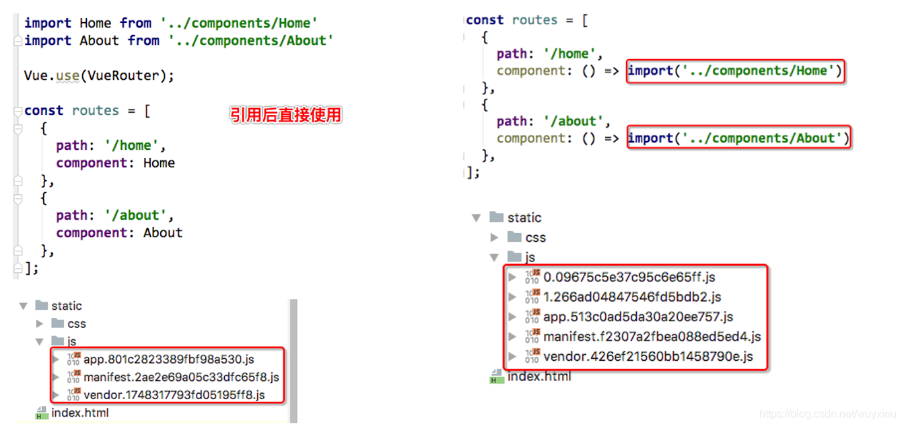

**懒加载的方式**

方式一: 结合Vue的异步组件和Webpack的代码分析.

```java
const Home = resolve => { require.ensure(['../components/Home.vue'], () => { resolve(require('../components/Home.vue')) })};
```


方式二: AMD写法

```java
const About = resolve => require(['../components/About.vue'], resolve);
```


方式三: 在ES6中, 我们可以有更加简单的写法来组织Vue异步组件和Webpack的代码分割.

```java
const Home = () => import('../components/Home.vue')
```


#### **路由嵌套**

嵌套路由是一个很常见的功能
比如在home页面中, 我们希望通过/home/news和/home/message访问一些内容.
一个路径映射一个组件, 访问这两个路径也会分别渲染两个组件.
路径和组件的关系如下:

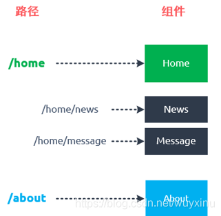

实现嵌套路由有两个步骤:

1. 创建对应的子组件, 并且在路由映射中配置对应的子路由.

2. 在组件内部使用< router-view>标签.

**嵌套路由实现**

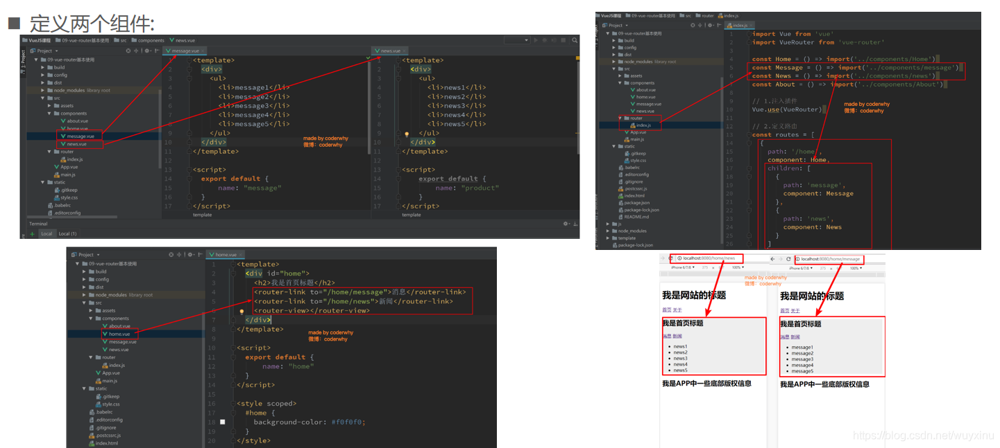

**嵌套默认路径**

嵌套路由也可以配置默认的路径, 配置方式如下:

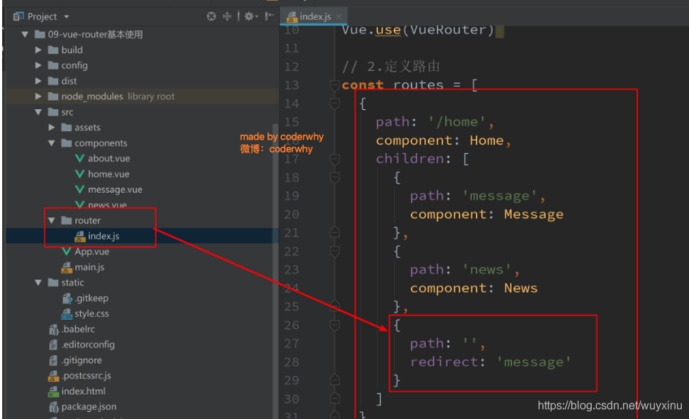

#### 传递参数

**准备工作**

为了演示传递参数, 我们这里再创建一个组件, 并且将其配置好
第一步: 创建新的组件Profile.vue
第二步: 配置路由映射
第三步: 添加跳转的< router-link>

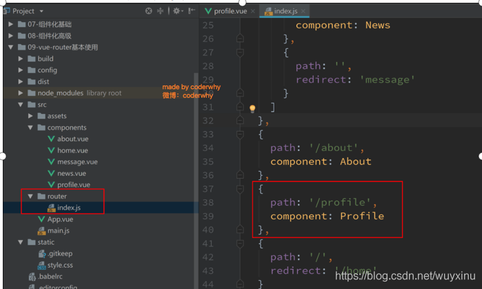

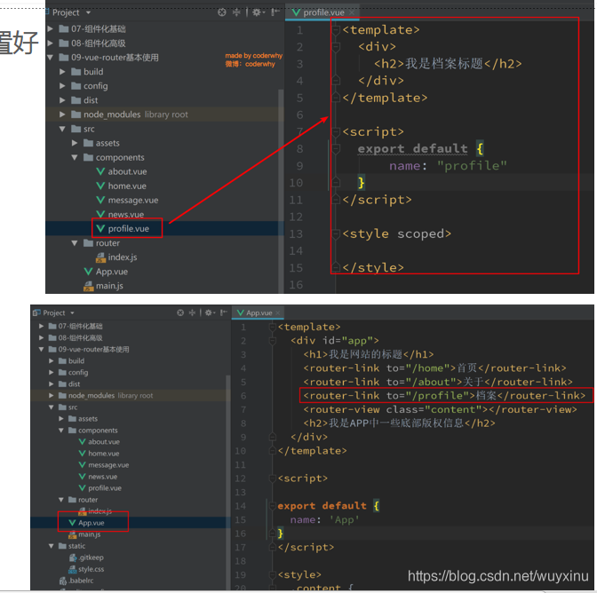

**传递参数的方式**

传递参数主要有两种类型: params和query
params的类型:

- 配置路由格式: /router/:id

- 传递的方式: 在path后面跟上对应的值

- 传递后形成的路径: /router/123, /router/abc

query的类型:

- 配置路由格式: /router, 也就是普通配置

- 传递的方式: 对象中使用query的key作为传递方式

- 传递后形成的路径: /router?id=123, /router?id=abc

如何使用它们呢? 也有两种方式: `<router-link>`的方式和JavaScript代码方式

**传递参数方式一: `<router-link>`**

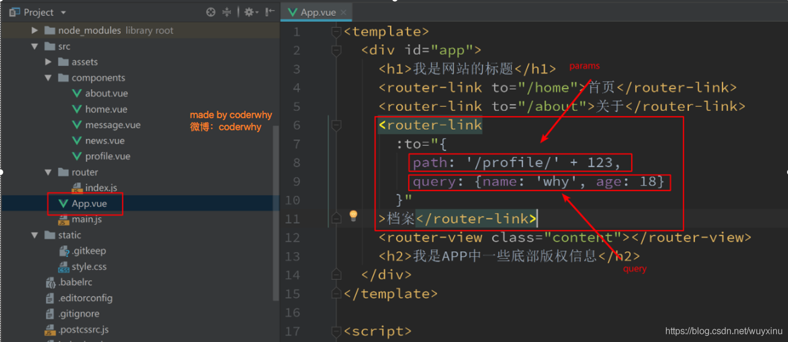

**传递参数方式二: JavaScript代码**、

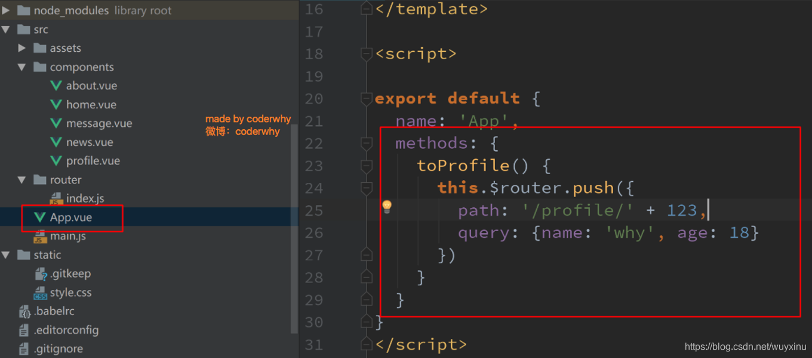

**获取参数**

获取参数通过<font color=#333333><font color=#333333><font color=#333333> r o u t e 对 象 获 取 的 . 在 使 用 了 v u e − r o u t e r 的 应 用 中 ， 路 由 对 象 会 被 注 入 每 个 组 件 中 ， 赋 值 为 t h i s . route对象获取的. 在使用了 vue-router 的应用中，路由对象会被注入每个组件中，赋值为 this. </font><font color=#333333><font color=#333333><font color=#333333></font><font color=#333333>r</font><font color=#333333>o</font><font color=#333333>u</font><font color=#333333>t</font><font color=#333333>e</font><font color=#333333>对</font><font color=#333333>象</font><font color=#333333>获</font><font color=#333333>取</font><font color=#333333>的</font><font color=#333333>.</font><font color=#333333>在</font><font color=#333333>使</font><font color=#333333>用</font><font color=#333333>了</font><font color=#333333>v</font><font color=#333333>u</font><font color=#333333>e</font><font color=#333333></font><font color=#333333>−</font><font color=#333333></font></font><font color=#333333><font color=#333333></font><font color=#333333>r</font><font color=#333333>o</font><font color=#333333>u</font><font color=#333333>t</font><font color=#333333>e</font><font color=#333333>r</font><font color=#333333>的</font><font color=#333333>应</font><font color=#333333>用</font><font color=#333333>中</font><font color=#333333>，</font><font color=#333333>路</font><font color=#333333>由</font><font color=#333333>对</font><font color=#333333>象</font><font color=#333333>会</font><font color=#333333>被</font><font color=#333333>注</font><font color=#333333>入</font><font color=#333333>每</font><font color=#333333>个</font><font color=#333333>组</font><font color=#333333>件</font><font color=#333333>中</font><font color=#333333>，</font><font color=#333333>赋</font><font color=#333333>值</font><font color=#333333>为</font><font color=#333333>t</font><font color=#333333>h</font><font color=#333333>i</font><font color=#333333>s</font><font color=#333333>.</font></font></font></font></font>route ，并且当路由切换时，路由对象会被更新。
通过$route获取传递的信息如下:

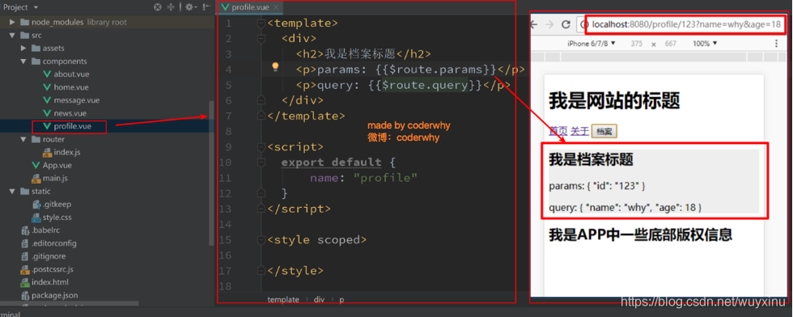

**<font color=#333333><font color=#333333><font color=#333333> r o u t e 和 route和 </font><font color=#333333><font color=#333333><font color=#333333></font><font color=#333333>r</font><font color=#333333>o</font><font color=#333333>u</font><font color=#333333>t</font><font color=#333333>e</font><font color=#333333>和</font></font></font></font></font>router是有区别的**

<font color=#333333><font color=#333333><font color=#333333> r o u t e 和 route和 </font><font color=#333333><font color=#333333><font color=#333333></font><font color=#333333>r</font><font color=#333333>o</font><font color=#333333>u</font><font color=#333333>t</font><font color=#333333>e</font><font color=#333333>和</font></font></font></font></font>router是有区别的
<font color=#333333><font color=#333333><font color=#333333> r o u t e r 为 V u e R o u t e r 实 例 ， 想 要 导 航 到 不 同 U R L ， 则 使 用 router为VueRouter实例，想要导航到不同URL，则使用 </font><font color=#333333><font color=#333333><font color=#333333></font><font color=#333333>r</font><font color=#333333>o</font><font color=#333333>u</font><font color=#333333>t</font><font color=#333333>e</font><font color=#333333>r</font><font color=#333333>为</font><font color=#333333>V</font><font color=#333333>u</font><font color=#333333>e</font><font color=#333333>R</font><font color=#333333>o</font><font color=#333333>u</font><font color=#333333>t</font><font color=#333333>e</font><font color=#333333>r</font><font color=#333333>实</font><font color=#333333>例</font><font color=#333333>，</font><font color=#333333>想</font><font color=#333333>要</font><font color=#333333>导</font><font color=#333333>航</font><font color=#333333>到</font><font color=#333333>不</font><font color=#333333>同</font><font color=#333333>U</font><font color=#333333>R</font><font color=#333333>L</font><font color=#333333>，</font><font color=#333333>则</font><font color=#333333>使</font><font color=#333333>用</font></font></font></font></font>router.push方法
$route为当前router跳转对象里面可以获取name、path、query、params等

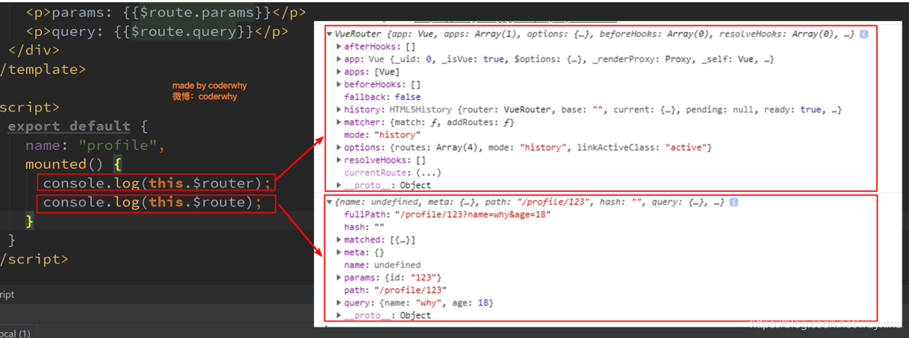

#### **导航守卫**

**为什么使用导航守卫?**

我们来考虑一个需求: 在一个SPA应用中, 如何改变网页的标题呢?
网页标题是通过来显示的, 但是SPA只有一个固定的HTML, 切换不同的页面时, 标题并不会改变.<br/> 但是我们可以通过JavaScript来修改<title>的内容.window.document.title = ‘新的标题’.<br/> 那么在Vue项目中, 在哪里修改? 什么时候修改比较合适呢?

普通的修改方式:
我们比较容易想到的修改标题的位置是每一个路由对应的组件.vue文件中.
通过mounted声明周期函数, 执行对应的代码进行修改即可.
但是当页面比较多时, 这种方式不容易维护(因为需要在多个页面执行类似的代码).

有没有更好的办法呢? 使用导航守卫即可.
什么是导航守卫?
vue-router提供的导航守卫主要用来监听监听路由的进入和离开的.
vue-router提供了beforeEach和afterEach的钩子函数, 它们会在路由即将改变前和改变后触发.

**导航守卫使用**

我们可以利用beforeEach来完成标题的修改.
首先, 我们可以在钩子当中定义一些标题, 可以利用meta来定义
其次, 利用导航守卫,修改我们的标题.

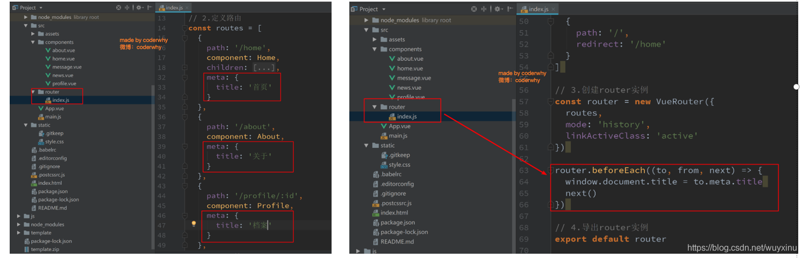

导航钩子的三个参数解析:
to: 即将要进入的目标的路由对象.
from: 当前导航即将要离开的路由对象.
next: 调用该方法后, 才能进入下一个钩子.

**导航守卫补充**

补充一:如果是后置钩子, 也就是afterEach, 不需要主动调用next()函数.
补充二: 上面我们使用的导航守卫, 被称之为全局守卫.
路由独享的守卫.
组件内的守卫.

更多内容, 可以查看官网进行学习:
[导航守卫补充](https://router.vuejs.org/zh/guide/advanced/navigation-guards.html#%E8%B7%AF%E7%94%B1%E7%8B%AC%E4%BA%AB%E7%9A%84%E5%AE%88%E5%8D%AB "导航守卫补充")

#### keep-alive遇见vue-router

keep-alive 是 Vue 内置的一个组件，可以使被包含的组件保留状态，或避免重新渲染。
它们有两个非常重要的属性:
include - 字符串或正则表达，只有匹配的组件会被缓存
exclude - 字符串或正则表达式，任何匹配的组件都不会被缓存
router-view 也是一个组件，如果直接被包在 keep-alive 里面，所有路径匹配到的视图组件都会被缓存：

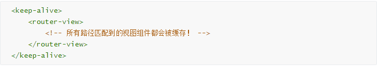

通过create声明周期函数来验证

#### 案例：[TabBar](#TabBar "TabBar")

1. 如果在下方有一个单独的TabBar组件，你如何封装
自定义TabBar组件，在APP中使用
让TabBar出于底部，并且设置相关的样式

2. TabBar中显示的内容由外界决定
定义插槽
flex布局平分TabBar

3. 自定义TabBarItem，可以传入 图片和文字
定义TabBarItem，并且定义两个插槽：图片、文字。
给两个插槽外层包装div，用于设置样式。
填充插槽，实现底部TabBar的效果

4. 传入 高亮图片
定义另外一个插槽，插入active-icon的数据
定义一个变量isActive，通过v-show来决定是否显示对应的icon

5. TabBarItem绑定路由数据
安装路由：npm install vue-router —save
完成router/index.js的内容，以及创建对应的组件
main.js中注册router
APP中加入`<router-view>`组件

6. 点击item跳转到对应路由，并且动态决定isActive
监听item的点击，通过`this.$router.replace()`替换路由路径
通过`this.$route.path.indexOf(this.link) !== -1`来判断是否是active

7. 动态计算active样式
封装新的计算属性：this.isActive ? {‘color’: ‘red’} : {}

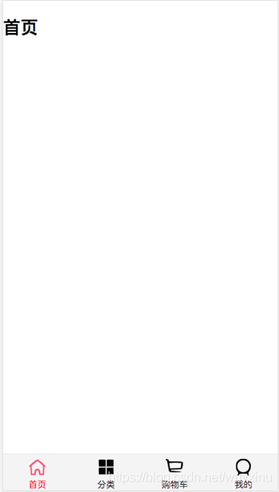

### 4、Promise

#### 什么是Promise呢？

ES6中一个非常重要和好用的特性就是Promise
但是初次接触Promise会一脸懵逼，这TM是什么东西？
看看官方或者一些文章对它的介绍和用法，也是一头雾水。

Promise到底是做什么的呢？
Promise是异步编程的一种解决方案。

那什么时候我们会来处理异步事件呢？
一种很常见的场景应该就是网络请求了。
我们封装一个网络请求的函数，因为不能立即拿到结果，所以不能像简单的3+4=7一样将结果返回。
所以往往我们会传入另外一个函数，在数据请求成功时，将数据通过传入的函数回调出去。
如果只是一个简单的网络请求，那么这种方案不会给我们带来很大的麻烦。

但是，当网络请求非常复杂时，就会出现回调地狱。
OK，我以一个非常夸张的案例来说明。

**网络请求的回调地狱**

我们来考虑下面的场景(有夸张的成分)：
我们需要通过一个url1从服务器加载一个数据data1，data1中包含了下一个请求的url2
我们需要通过data1取出url2，从服务器加载数据data2，data2中包含了下一个请求的url3
我们需要通过data2取出url3，从服务器加载数据data3，data3中包含了下一个请求的url4
发送网络请求url4，获取最终的数据data4

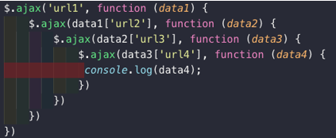

上面的代码有什么问题吗？
正常情况下，不会有什么问题，可以正常运行并且获取我们想要的结果。
但是，这样额代码难看而且不容易维护。
我们更加期望的是一种更加优雅的方式来进行这种异步操作。
如何做呢？就是使用Promise。
Promise可以以一种非常优雅的方式来解决这个问题。

#### Promise的基本使用

**定时器的异步事件**

我们先来看看Promise最基本的语法。
这里，我们用一个定时器来模拟异步事件：
假设下面的data是从网络上1秒后请求的数据
console.log就是我们的处理方式。
这是我们过去的处理方式，我们将它换成Promise代码
这个例子会让我们感觉脱裤放屁，多此一举
首先，下面的Promise代码明显比上面的代码看起来还要复杂。
其次，下面的Promise代码中包含的resolve、reject、then、catch都是些什么东西？
我们先不管第一个复杂度的问题，因为这样的一个屁大点的程序根本看不出来Promise真正的作用。


**定时器异步事件解析**

我们先来认认真真的读一读这个程序到底做了什么？

- new Promise很明显是创建一个Promise对象

- 小括号中((resolve, reject) => {})也很明显就是一个函数，而且我们这里用的是之前刚刚学习过的箭头函数。
   - 但是resolve, reject它们是什么呢？

   - 我们先知道一个事实：在创建Promise时，传入的这个箭头函数是固定的（一般我们都会这样写）

   - resolve和reject它们两个也是函数，通常情况下，我们会根据请求数据的成功和失败来决定调用哪一个。

- 成功还是失败？
   - 如果是成功的，那么通常我们会调用resolve(messsage)，这个时候，我们后续的then会被回调。

   - 如果是失败的，那么通常我们会调用reject(error)，这个时候，我们后续的catch会被回调。

OK，这就是Promise最基本的使用了。

**Promise三种状态**

首先, 当我们开发中有异步操作时, 就可以给异步操作包装一个Promise
异步操作之后会有三种状态

我们一起来看一下这三种状态:
pending：等待状态，比如正在进行网络请求，或者定时器没有到时间。
fulfill：满足状态，当我们主动回调了resolve时，就处于该状态，并且会回调.then()
reject：拒绝状态，当我们主动回调了reject时，就处于该状态，并且会回调.catch()

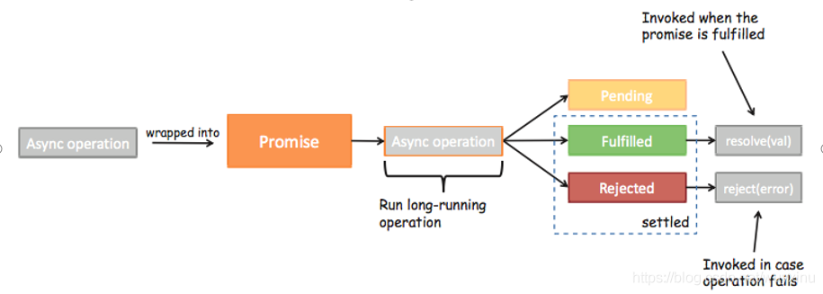

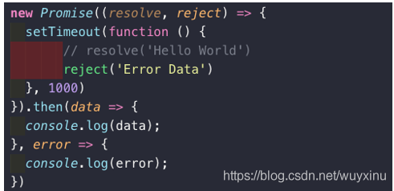

#### Promise的链式调用

我们在看Promise的流程图时，发现无论是then还是catch都可以返回一个Promise对象。
所以，我们的代码其实是可以进行链式调用的：
这里我们直接通过Promise包装了一下新的数据，将Promise对象返回了
Promise.resovle()：将数据包装成Promise对象，并且在内部回调resolve()函数
Promise.reject()：将数据包装成Promise对象，并且在内部回调reject()函数

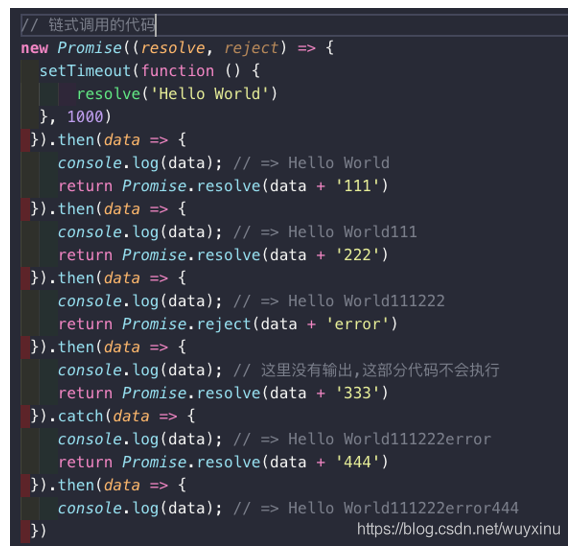

**链式调用简写**

简化版代码：
如果我们希望数据直接包装成Promise.resolve，那么在then中可以直接返回数据
注意下面的代码中，我讲return Promise.resovle(data)改成了return data
结果依然是一样的

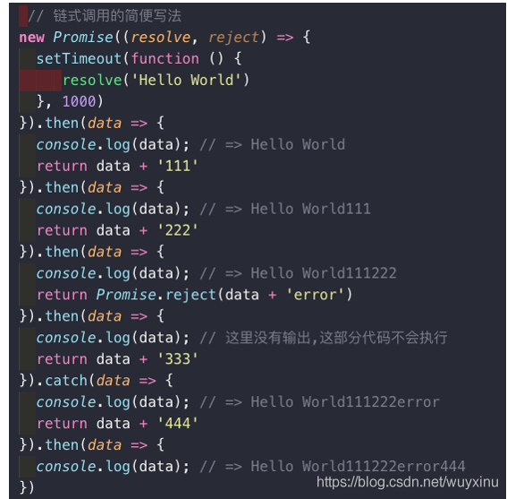

### 5、Vuex详解

#### 认识Vuex

**Vuex是做什么的?**

官方解释：Vuex 是一个专为 Vue.js 应用程序开发的状态管理模式。

- 它采用 集中式存储管理 应用的所有组件的状态，并以相应的规则保证状态以一种可预测的方式发生变化。

- Vuex 也集成到 Vue 的官方调试工具 devtools extension，提供了诸如零配置的 time-travel 调试、状态快照导入导出等高级调试功能。

状态管理到底是什么？
状态管理模式、集中式存储管理这些名词听起来就非常高大上，让人捉摸不透。
其实，你可以简单的将其看成把需要多个组件共享的变量全部存储在一个对象里面。
然后，将这个对象放在顶层的Vue实例中，让其他组件可以使用。
那么，多个组件是不是就可以共享这个对象中的所有变量属性了呢？
等等，如果是这样的话，为什么官方还要专门出一个插件Vuex呢？难道我们不能自己封装一个对象来管理吗？

当然可以，只是我们要先想想VueJS带给我们最大的便利是什么呢？没错，就是响应式。
如果你自己封装实现一个对象能不能保证它里面所有的属性做到响应式呢？当然也可以，只是自己封装可能稍微麻烦一些。
不用怀疑，Vuex就是为了提供这样一个在多个组件间共享状态的插件，用它就可以了。

**管理什么状态呢?**

但是，有什么状态时需要我们在多个组件间共享的呢？
如果你做过大型开放，你一定遇到过多个状态，在多个界面间的共享问题。
比如用户的登录状态、用户名称、头像、地理位置信息等等。
比如商品的收藏、购物车中的物品等等。
这些状态信息，我们都可以放在统一的地方，对它进行保存和管理，而且它们还是响应式的（待会儿我们就可以看到代码了，莫着急）。

OK，从理论上理解了状态管理之后，让我们从实际的代码再来看看状态管理。
毕竟，Talk is cheap, Show me the code.(来自Linus)

我们先来看看但界面的状态管理吧.

**单界面的状态管理**

我们知道，要在单个组件中进行状态管理是一件非常简单的事情
什么意思呢？我们来看下面的图片。
这图片中的三种东西，怎么理解呢？
State：不用多说，就是我们的状态。（你姑且可以当做就是data中的属性）
View：视图层，可以针对State的变化，显示不同的信息。（这个好理解吧？）
Actions：这里的Actions主要是用户的各种操作：点击、输入等等，会导致状态的改变。

写点代码，加深理解：
看下右边的代码效果, 肯定会实现吧?

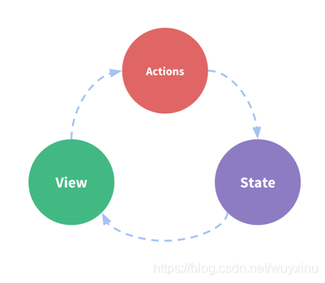

**单界面状态管理的实现**

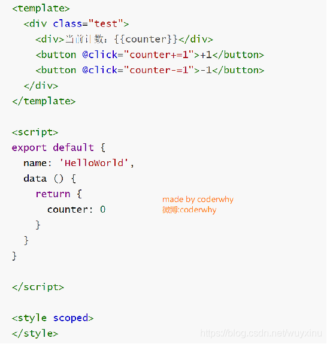

在这个案例中，我们有木有状态需要管理呢？没错，就是个数counter。
counter需要某种方式被记录下来，也就是我们的State。
counter目前的值需要被显示在界面中，也就是我们的View部分。
界面发生某些操作时（我们这里是用户的点击，也可以是用户的input），需要去更新状态，也就是我们的Actions
这不就是上面的流程图了吗？

**多界面状态管理**

Vue已经帮我们做好了单个界面的状态管理，但是如果是多个界面呢？
多个试图都依赖同一个状态（一个状态改了，多个界面需要进行更新）
不同界面的Actions都想修改同一个状态（Home.vue需要修改，Profile.vue也需要修改这个状态）

也就是说对于某些状态(状态1/状态2/状态3)来说只属于我们某一个试图，但是也有一些状态(状态a/状态b/状态c)属于多个试图共同想要维护的
状态1/状态2/状态3你放在自己的房间中，你自己管理自己用，没问题。
但是状态a/状态b/状态c我们希望交给一个大管家来统一帮助我们管理！！！
没错，Vuex就是为我们提供这个大管家的工具。

全局单例模式（大管家）
我们现在要做的就是将共享的状态抽取出来，交给我们的大管家，统一进行管理。
之后，你们每个试图，按照我规定好的规定，进行访问和修改等操作。
这就是Vuex背后的基本思想。

**Vuex状态管理图例**

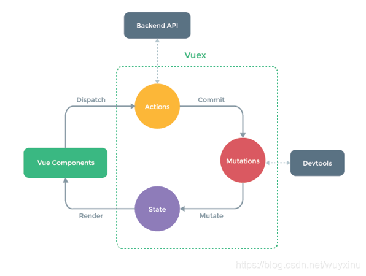

#### Vuex的基本使用

**简单的案例**

我们还是实现一下之前简单的案例


首先，我们需要在某个地方存放我们的Vuex代码：
这里，我们先创建一个文件夹store，并且在其中创建一个index.js文件
在index.js文件中写入如下代码：

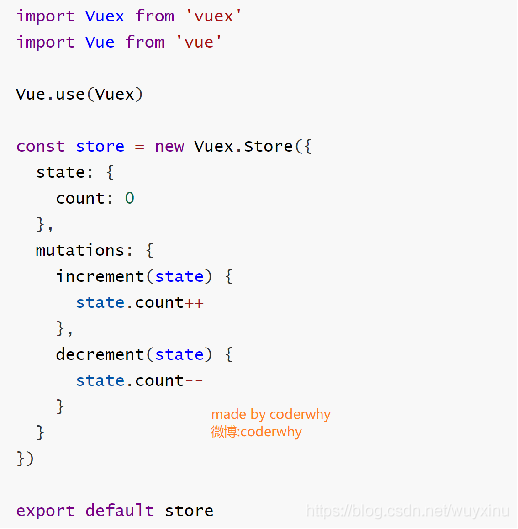

**挂载到Vue实例中**

其次，我们让所有的Vue组件都可以使用这个store对象
来到main.js文件，导入store对象，并且放在new Vue中
这样，在其他Vue组件中，我们就可以通过this.$store的方式，获取到这个store对象了

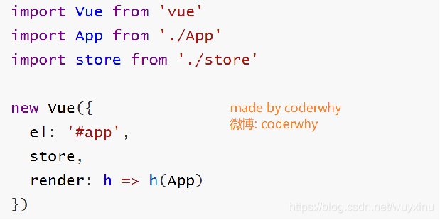

**使用Vuex的count**

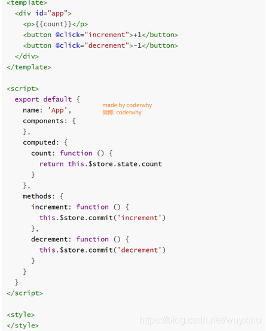

好的，这就是使用Vuex最简单的方式了。
我们来对使用步骤，做一个简单的小节：
1.提取出一个公共的store对象，用于保存在多个组件中共享的状态
2.将store对象放置在new Vue对象中，这样可以保证在所有的组件中都可以使用到
3.在其他组件中使用store对象中保存的状态即可

- 通过this.$store.state.属性的方式来访问状态

- 通过this.$store.commit(‘mutation中方法’)来修改状态

注意事项：
我们通过提交mutation的方式，而非直接改变store.state.count。
这是因为Vuex可以更明确的追踪状态的变化，所以不要直接改变store.state.count的值。

#### Vuex核心概念

**State单一状态树**

Vuex提出使用单一状态树, 什么是单一状态树呢？
英文名称是Single Source of Truth，也可以翻译成单一数据源。

’但是，它是什么呢？我们来看一个生活中的例子。
OK，我用一个生活中的例子做一个简单的类比。
我们知道，在国内我们有很多的信息需要被记录，比如上学时的个人档案，工作后的社保记录，公积金记录，结婚后的婚姻信息，以及其他相关的户口、医疗、文凭、房产记录等等（还有很多信息）。
这些信息被分散在很多地方进行管理，有一天你需要办某个业务时(比如入户某个城市)，你会发现你需要到各个对应的工作地点去打印、盖章各种资料信息，最后到一个地方提交证明你的信息无误。
这种保存信息的方案，不仅仅低效，而且不方便管理，以及日后的维护也是一个庞大的工作(需要大量的各个部门的人力来维护，当然国家目前已经在完善我们的这个系统了)。

这个和我们在应用开发中比较类似：
如果你的状态信息是保存到多个Store对象中的，那么之后的管理和维护等等都会变得特别困难。
所以Vuex也使用了单一状态树来管理应用层级的全部状态。
单一状态树能够让我们最直接的方式找到某个状态的片段，而且在之后的维护和调试过程中，也可以非常方便的管理和维护。

**Getters**

有时候，我们需要从store中获取一些state变异后的状态，比如下面的Store中：
获取学生年龄大于20的个数。

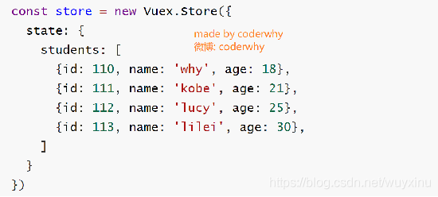

我们可以在Store中定义getters

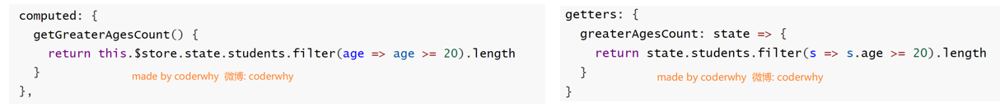

**Getters作为参数和传递参数**

如果我们已经有了一个获取所有年龄大于20岁学生列表的getters, 那么代码可以这样来写
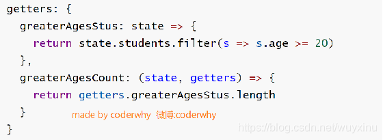

getters默认是不能传递参数的, 如果希望传递参数, 那么只能让getters本身返回另一个函数.
比如上面的案例中,我们希望根据ID获取用户的信息

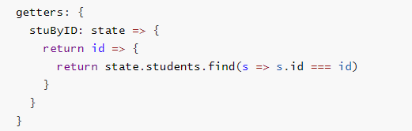

**Mutation状态更新**

Vuex的store状态的更新唯一方式：提交Mutation
Mutation主要包括两部分：
字符串的事件类型（type）
一个回调函数（handler）,该回调函数的第一个参数就是state。
mutation的定义方式：

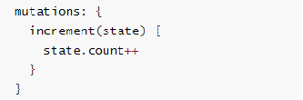

通过mutation更新

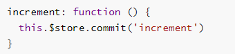

Mutation传递参数

在通过mutation更新数据的时候, 有可能我们希望携带一些额外的参数
参数被称为是mutation的载荷(Payload)
Mutation中的代码:

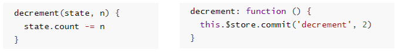

但是如果参数不是一个呢?
比如我们有很多参数需要传递.
这个时候, 我们通常会以对象的形式传递, 也就是payload是一个对象.
这个时候可以再从对象中取出相关的信息.

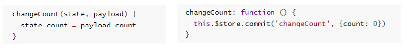

**Mutation提交风格**

上面的通过commit进行提交是一种普通的方式
Vue还提供了另外一种风格, 它是一个包含type属性的对象

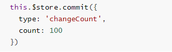

Mutation中的处理方式是将整个commit的对象作为payload使用, 所以代码没有改变, 依然如下:

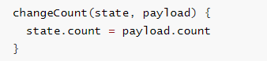

**Mutation响应规则**

Vuex的store中的state是响应式的, 当state中的数据发生改变时, Vue组件会自动更新.
这就要求我们必须遵守一些Vuex对应的规则:

- 提前在store中初始化好所需的属性.

- 当给state中的对象添加新属性时, 使用下面的方式:
   - 方式一: 使用Vue.set(obj, ‘newProp’, 123)

   - 方式二: 用心对象给旧对象重新赋值

我们来看一个例子:
当我们点击更新信息时, 界面并没有发生对应改变.

如何才能让它改变呢?
查看下面代码的方式一和方式二
都可以让state中的属性是响应式的.

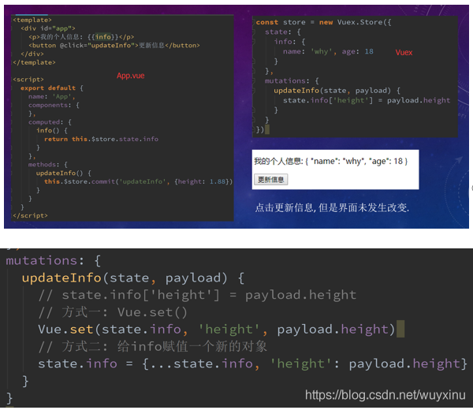

**Mutation常量类型 – 概念**

我们来考虑下面的问题:
在mutation中, 我们定义了很多事件类型(也就是其中的方法名称).
当我们的项目增大时, Vuex管理的状态越来越多, 需要更新状态的情况越来越多, 那么意味着Mutation中的方法越来越多.
方法过多, 使用者需要花费大量的经历去记住这些方法, 甚至是多个文件间来回切换, 查看方法名称, 甚至如果不是复制的时候, 可能还会出现写错的情况.

如何避免上述的问题呢?
在各种Flux实现中, 一种很常见的方案就是使用常量替代Mutation事件的类型.
我们可以将这些常量放在一个单独的文件中, 方便管理以及让整个app所有的事件类型一目了然.

具体怎么做呢?
我们可以创建一个文件: mutation-types.js, 并且在其中定义我们的常量.
定义常量时, 我们可以使用ES2015中的风格, 使用一个常量来作为函数的名称.

**Mutation常量类型 – 代码**

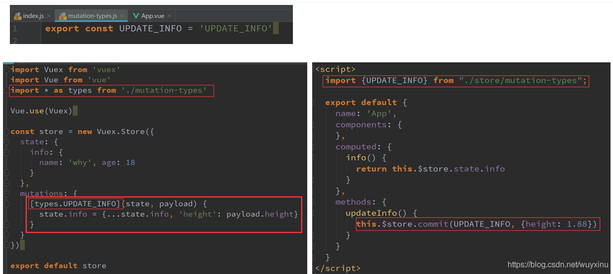

**Mutation同步函数**

通常情况下, Vuex要求我们Mutation中的方法必须是同步方法.
主要的原因是当我们使用devtools时, 可以devtools可以帮助我们捕捉mutation的快照.
但是如果是异步操作, 那么devtools将不能很好的追踪这个操作什么时候会被完成.
比如我们之前的代码, 当执行更新时, devtools中会有如下信息: 图1

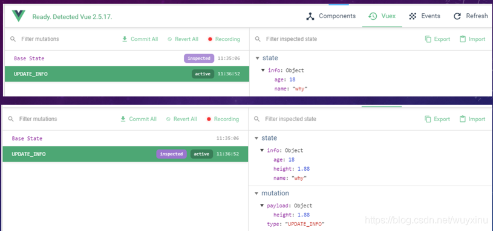

但是, 如果Vuex中的代码, 我们使用了异步函数: 图2

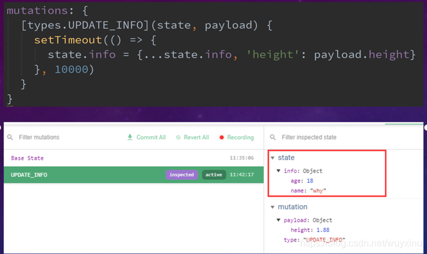

你会发现state中的info数据一直没有被改变, 因为他无法追踪到.
So, 通常情况下, 不要再mutation中进行异步的操作

**Actions**

我们强调, 不要再Mutation中进行异步操作.
但是某些情况, 我们确实希望在Vuex中进行一些异步操作, 比如网络请求, 必然是异步的. 这个时候怎么处理呢?
Action类似于Mutation, 但是是用来代替Mutation进行异步操作的.

Action的基本使用代码如下:
context是什么?
context是和store对象具有相同方法和属性的对象.
也就是说, 我们可以通过context去进行commit相关的操作, 也可以获取context.state等.
但是注意, 这里它们并不是同一个对象, 为什么呢? 我们后面学习Modules的时候, 再具体说.

这样的代码是否多此一举呢?
我们定义了actions, 然后又在actions中去进行commit, 这不是脱裤放屁吗?
事实上并不是这样, 如果在Vuex中有异步操作, 那么我们就可以在actions中完成了.

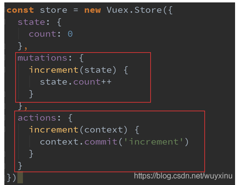

**Action的分发**


**Action返回的Promise**

前面我们学习ES6语法的时候说过, Promise经常用于异步操作.
在Action中, 我们可以将异步操作放在一个Promise中, 并且在成功或者失败后, 调用对应的resolve或reject.
OK, 我们来看下面的代码:

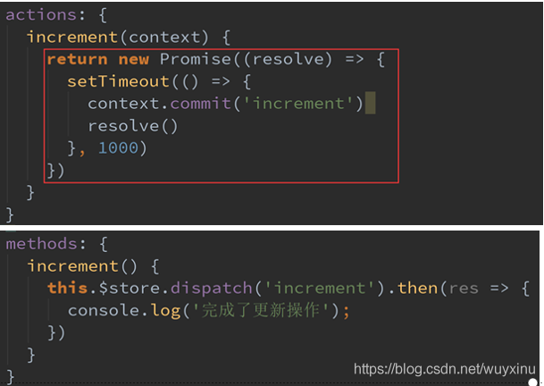

**Module**

Module是模块的意思, 为什么在Vuex中我们要使用模块呢?
Vue使用单一状态树,那么也意味着很多状态都会交给Vuex来管理.
当应用变得非常复杂时,store对象就有可能变得相当臃肿.
为了解决这个问题, Vuex允许我们将store分割成模块(Module), 而每个模块拥有自己的state、mutation、action、getters等

我们按照什么样的方式来组织模块呢?
我们来看下边的代码

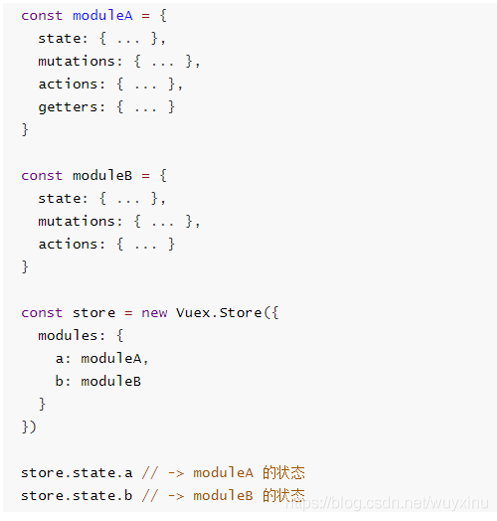

**Module局部状态**

上面的代码中, 我们已经有了整体的组织结构, 下面我们来看看具体的局部模块中的代码如何书写.
我们在moduleA中添加state、mutations、getters
mutation和getters接收的第一个参数是局部状态对象

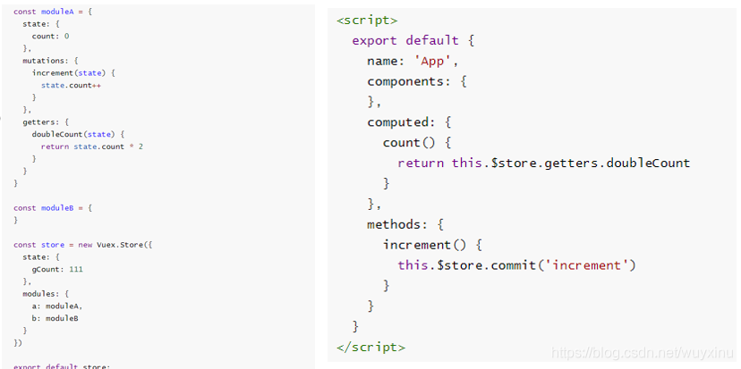

注意:
虽然, 我们的doubleCount和increment都是定义在对象内部的.
但是在调用的时候, 依然是通过this.$store来直接调用的.

**Actions的写法**

actions的写法呢? 接收一个context参数对象
局部状态通过 context.state 暴露出来，根节点状态则为 context.rootState

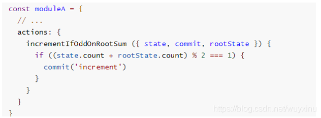

如果getters中也需要使用全局的状态, 可以接受更多的参数

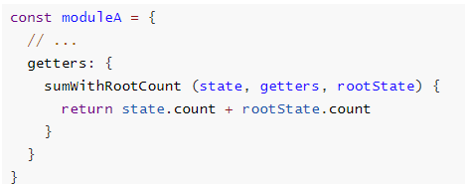

#### 项目结构

当我们的Vuex帮助我们管理过多的内容时, 好的项目结构可以让我们的代码更加清晰.

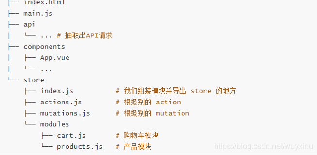

### 6、网络模块封装

#### 网络模块的选择

选择一: 传统的Ajax是基于XMLHttpRequest(XHR)
为什么不用它呢?
非常好解释, 配置和调用方式等非常混乱.
编码起来看起来就非常蛋疼.
所以真实开发中很少直接使用, 而是使用jQuery-Ajax

选择二: 在前面的学习中, 我们经常会使用jQuery-Ajax
相对于传统的Ajax非常好用.
为什么不选择它呢?
首先, 我们先明确一点: 在Vue的整个开发中都是不需要使用jQuery了.
那么, 就意味着为了方便我们进行一个网络请求, 特意引用一个jQuery, 你觉得合理吗?
jQuery的代码1w+行.
Vue的代码才1w+行.
完全没有必要为了用网络请求就引用这个重量级的框架.

选择三: 官方在Vue1.x的时候, 推出了Vue-resource.
Vue-resource的体积相对于jQuery小很多.
另外Vue-resource是官方推出的.
为什么不选择它呢?
在Vue2.0退出后, Vue作者就在GitHub的Issues中说明了去掉vue-resource, 并且以后也不会再更新.
那么意味着以后vue-reource不再支持新的版本时, 也不会再继续更新和维护.
对以后的项目开发和维护都存在很大的隐患.

选择四: 在说明不再继续更新和维护vue-resource的同时, 作者还推荐了一个框架: axios为什么不用它呢?
axios有非常多的优点, 并且用起来也非常方便.
稍后, 我们对他详细学习.

#### jsonp

在前端开发中, 我们一种常见的网络请求方式就是JSONP
使用JSONP最主要的原因往往是为了解决跨域访问的问题.
JSONP的原理是什么呢?
JSONP的核心在于通过`<script>`标签的src来帮助我们请求数据.
原因是我们的项目部署在domain1.com服务器上时, 是不能直接访问domain2.com服务器上的资料的.
这个时候, 我们利用`<script>`标签的src帮助我们去服务器请求到数据, 将数据当做一个javascript的函数来执行, 并且执行的过程中传入我们需要的json.
所以, 封装jsonp的核心就在于我们监听window上的jsonp进行回调时的名称.
JSONP如何封装呢?
我们一起自己来封装一个处理JSONP的代码吧.

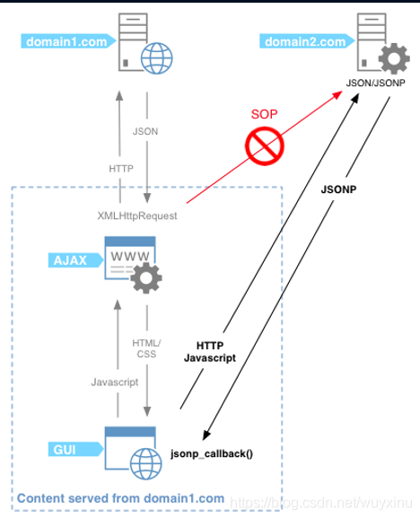

**JSONP封装**

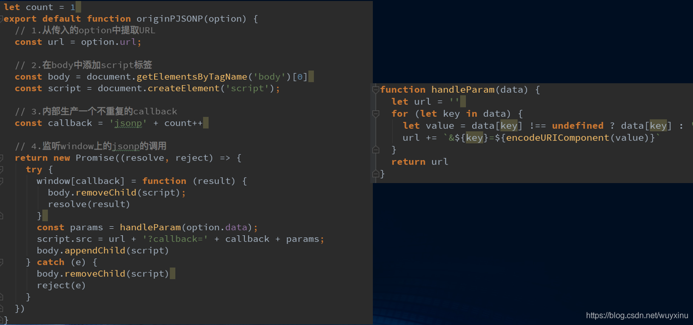

#### **axios**

功能特点:
在浏览器中发送 XMLHttpRequests 请求
在 node.js 中发送 http请求
支持 Promise API
拦截请求和响应
转换请求和响应数据
等等

**axiox请求方式**

支持多种请求方式:
axios(config)
axios.request(config)
axios.get(url[, config])
axios.delete(url[, config])
axios.head(url[, config])
axios.post(url[, data[, config]])
axios.put(url[, data[, config]])
axios.patch(url[, data[, config]])
如何发送请求呢?
我们看一下下边的案例

**发送get请求演示**

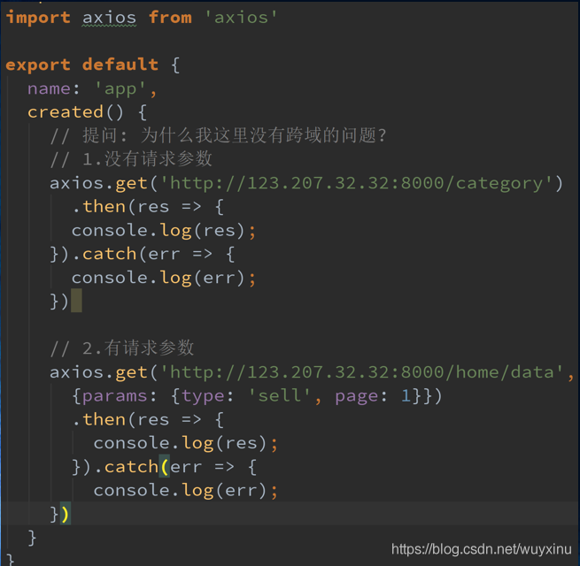

**发送并发请求**

有时候, 我们可能需求同时发送两个请求
使用axios.all, 可以放入多个请求的数组.
axios.all([]) 返回的结果是一个数组，使用 axios.spread 可将数组 [res1,res2] 展开为 res1, res2

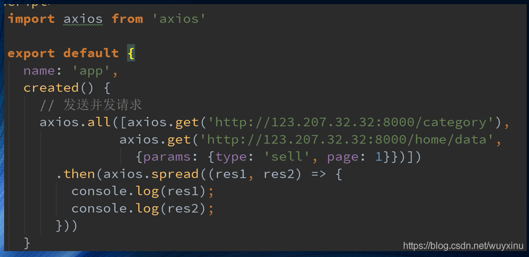

**全局配置**

在上面的示例中, 我们的BaseURL是固定的
事实上, 在开发中可能很多参数都是固定的.
这个时候我们可以进行一些抽取, 也可以利用axiox的全局配置

```java
axios.defaults.baseURL = '123.207.32.32:8000'
axios.defaults.headers.post['Content-Type'] = 'application/x-www-form-urlencoded';
```


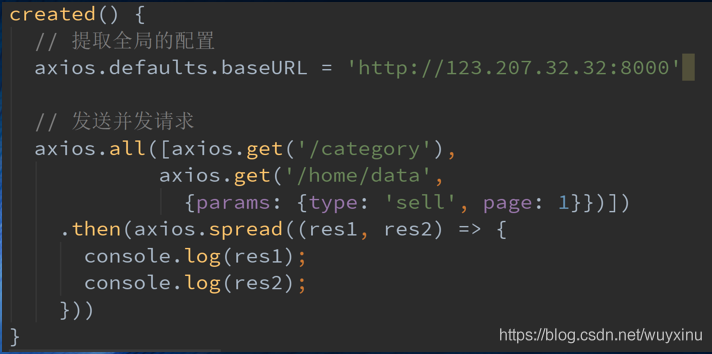

**常见的配置选项**

请求地址
url: ‘/user’,
请求类型
method: ‘get’,
请根路径
baseURL: ‘http://www.mt.com/api’,
请求前的数据处理
transformRequest:[function(data){}],
请求后的数据处理
transformResponse: [function(data){}],
自定义的请求头
headers:{‘x-Requested-With’:‘XMLHttpRequest’},
URL查询对象
params:{ id: 12 },

查询对象序列化函数
paramsSerializer: function(params){ }
request body
data: { key: ‘aa’},
超时设置s
timeout: 1000,
跨域是否带Token
withCredentials: false,
自定义请求处理
adapter: function(resolve, reject, config){},
身份验证信息
auth: { uname: ‘’, pwd: ‘12’},
响应的数据格式 json / blob /document /arraybuffer / text / stream
responseType: ‘json’,

#### axios的实例

为什么要创建axios的实例呢?

- 当我们从axios模块中导入对象时, 使用的实例是默认的实例.

- 当给该实例设置一些默认配置时, 这些配置就被固定下来了.

- 但是后续开发中, 某些配置可能会不太一样.

- 比如某些请求需要使用特定的baseURL或者timeout或者content-Type等.

- 这个时候, 我们就可以创建新的实例, 并且传入属于该实例的配置信息.

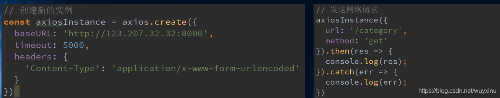

**axios封装**

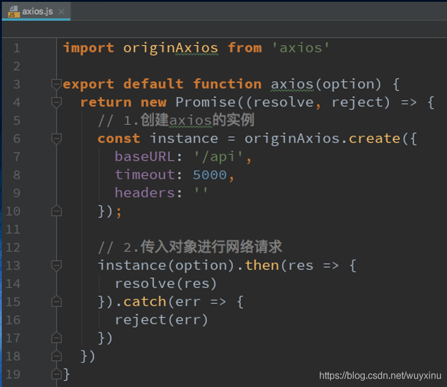

#### 拦截器

axios提供了拦截器，用于我们在发送每次请求或者得到相应后，进行对应的处理。
如何使用拦截器呢？

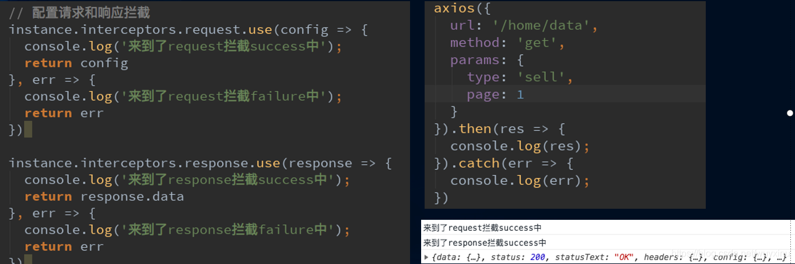

**拦截器中都做什么呢？**

请求拦截可以做到的事情：

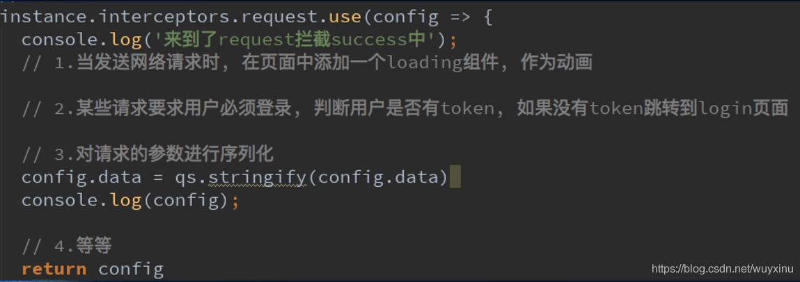

请求拦截中错误拦截较少，通常都是配置相关的拦截
可能的错误比如请求超时，可以将页面跳转到一个错误页面中。

响应拦截中完成的事情：
响应的成功拦截中，主要是对数据进行过滤。

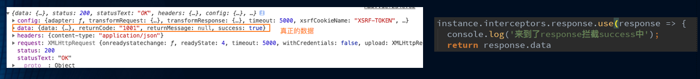

响应的失败拦截中，可以根据status判断报错的错误码，跳转到不同的错误提示页面。

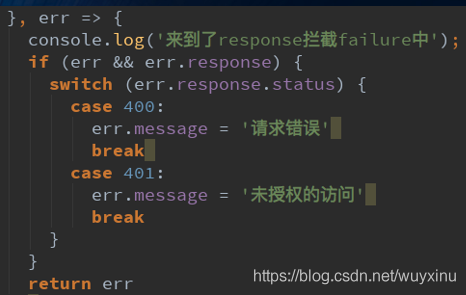

## 四、案例

### 1、<font color=#333333>TabBar</font>

TabBar.vue

```java
<template>
  <div class="tab-bar">     
      <slot></slot>
  </div>
</template>

<script>
export default {
  name: 'TabBar',
  data() { 
    return {
    }
  }
 }
</script>

<style scoped>
.tab-bar{
  display: flex;
  background-color: #f6f6f6;
  
  position: fixed;
  left: 0;
  right: 0;
  bottom: 0;

  box-shadow: 0 -3px 1px rgba(100, 100, 100, 0.1);
}

</style>
```


TabBarItem.vue

```java
<template>
  <div class="tab-bar-item" @click="itemClick()">
      <div v-if = "!isActive"><slot name = "item-icon"></slot></div>
      <div v-else><slot name = "item-icon-active"></slot></div>
      
      <div :style="activeStyle"><slot name = "item-text"></slot></div>
      
    <!-- 
    <div>首页</div> -->
  </div>
</template>

<script>
export default {
  name: 'TabBarItem',
  props: {
    path: String,
    activeColor:{
      type: String,
      default: 'red',
    }
  },
  data() { 
    return {
        // isActive: false
    }
  },
  computed:{
    isActive(){
      return this.$route.path.indexOf(this.path) !== -1
    },
    activeStyle(){
      return this.isActive ? {color:this.activeColor}:{}
    }
  },
  methods:{
    itemClick(){
      if(this.$route.path != this.path)
       { this.$router.replace(this.path)}
    }
  }
 }
</script>

<style scoped>
.tab-bar-item{
  flex: 1;
  text-align: center;
  height: 49px;
}
.tab-bar-item img{
    width:24px;
    height: 24px;
    margin-top: 3px;
    vertical-align: middle;
}
.active{
    color: blueviolet;
}
</style>
```


</font>