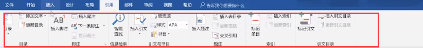
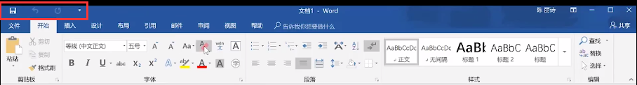
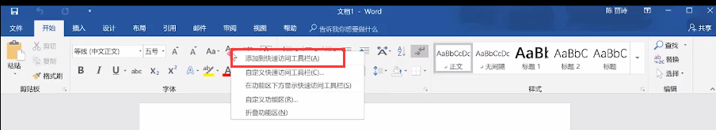
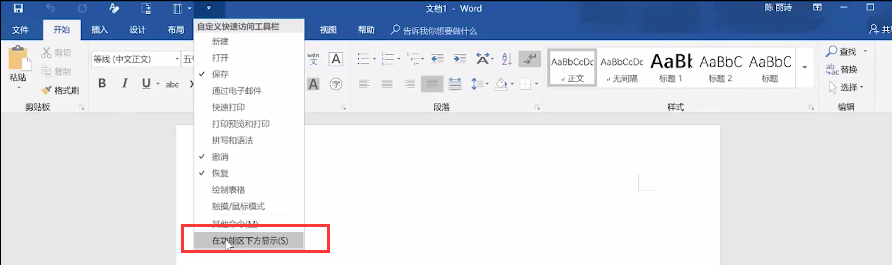
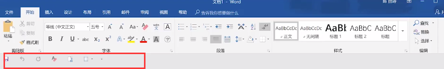
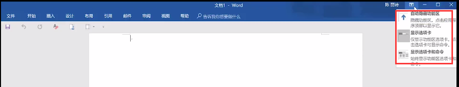
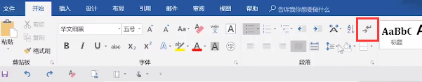
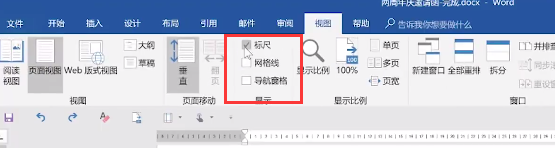

### 系统学习word

B战视频： https://www.bilibili.com/video/BV1t64y1x7GA?p=3&spm_id_from=pageDriver

#### 第一课： （均为s开头的序号，不是视频的P序号）

##### word界面说明

查看word版本信息：

> 文件-> 账户 -> 产品信息

推荐2013以上

> office 与 wps 是两款不同的软件

> 选项卡：

> 功能组：

>  功能组右下角的小三角，叫做启动器

> 自定义快速访问工具栏

>  添加至快速访问工具栏

> 在下方显示

> 隐藏功能区， 一般选项卡和命令都显示出来

##### word高效习惯养成

> 保存和命名

随时随地Ctrl + S

自动保存

> 文件-> 选项 -> 保存

自动恢复文件路径，如果没保存，电脑死机可以尝试去路径中找到

>  规范的命名
>
> 日期+文件信息+时间
>
> 20210829-毕业论文-0830.doc

建立标准的编辑环境

> 显示隐藏标记     （用于显示文档的各种编辑符号）

> 标尺
>
> 导航窗格

>  常用快捷键：

| 说明           | 快捷键      |
| -------------- | ----------- |
| 返回到文章开头 | Ctrl + Home |
| 返回文章结尾   | Ctrl + End  |
| 居中           | Ctrl + E    |
| 左对齐         | Ctrl + L    |
| 右对齐         | Ctrl + R    |
|                |             |
|                |             |
|                |             |
|                |             |

#### 第二课：

##### 基础排版

什么是一个段落：

>  产生一个回车符，是一个段落   直接回车
>
> 换行符    shift + 回车
>
>  

格式刷：

> 普通格式刷， 是把字体格式+ 段落格式同时刷过去
>
> 只刷字体格式： 只选中字体（不能选中换行符）， 然后进行格式刷（也只选中字符）
>
>  只刷段落格式： 放在段落上直接点击格式刷， 然后直接点击需要刷的段落就ok

段落标记不显示

> 文件 -> 选项 -> 显示 -> 取消勾选段落选项 ， （此时仍旧可以被显示隐藏标记控制）

#### 第四课：

##### 文件保护

可以在保存的时候工具栏输入密码，打开需要密码，一定要记好了，忘了就没了

防止编辑：

> 审阅 -> 限制编辑 -> 

属性作用：

> 插入 -> 文档部件 -> 文档属性   
>
> 此时可直接编辑， 然后保存则自动修改文档属性中的值。

#### 第五课（极其好的案例学习）

##### P6实战 好好看 好好学

#### 第七课：

##### 表格操作

表格中数据的前后顺序调换， 使用 alt + shift + ↑ / ↓

#### 第八课

##### 下载软件： 神奇网站

msdn我告诉你  （ 百度即可）

#### 第九课（极其好的案例学习）

###### 跳着学

#### 第12课（商务案例学习）

##### 商务模板

#### 第19课（好的案例学习） 极其不好， 版本较老，不推荐

##### 论文排版

