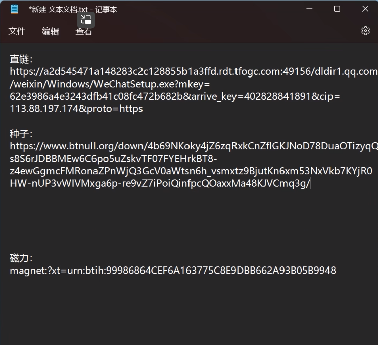
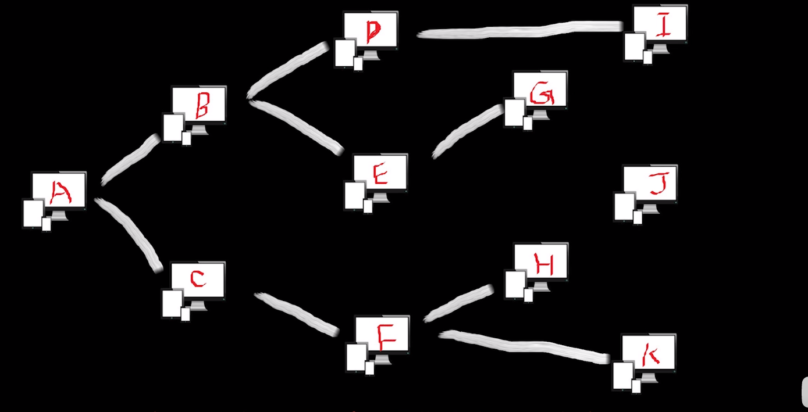
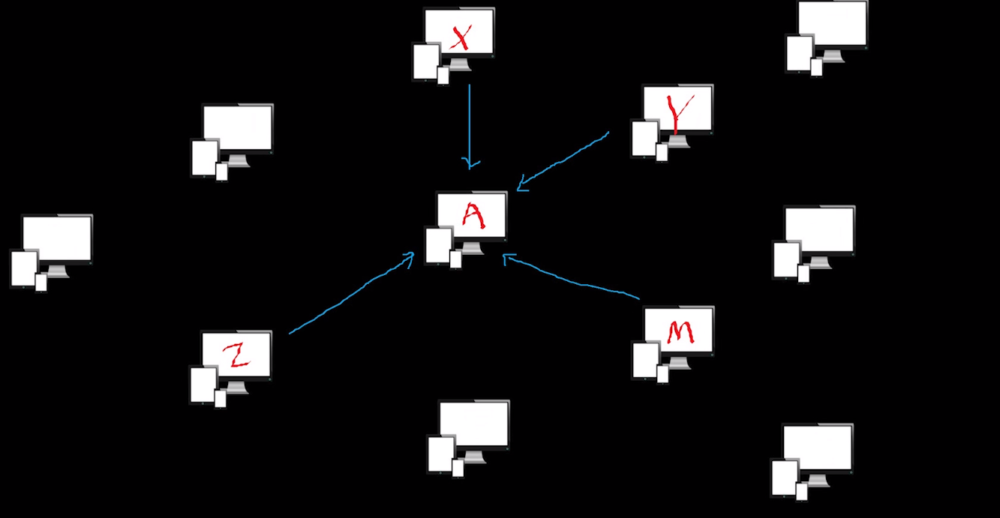
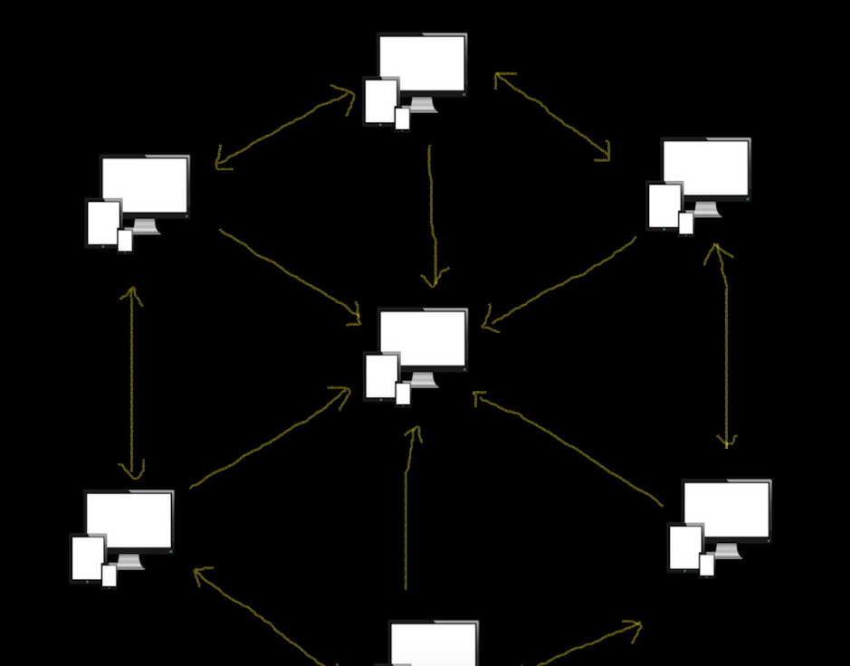

# 下载相关的知识点

## 什么是直链

直链就是直接从服务器上下载数据，他是我们日常生活中最最常见的下载方式，从应用商店下载软件，从网页下载图片音乐视频等，可以直接被下载的就是直链，

## 什么是BT种子

通过直链下载到种子文件，种子文件以torrent做为后缀。用户拿着种子通过下载器进行下载。

种子解析之后会包含哪些服务器有资源，之后即可进行资源的下载。

## 什么是磁力

采用的DHT协议，全程: Distributed Hash Table, 分布式哈希表，是一种分布式的存储方式。

A通过寻找匹配找到谁有资源，然后进行下载。

## 什么是P2P

全称：peer to peer

去中心化，每个人都是服务器，下载的同时进行上传数据，上传的数据供别人下载。

BT种子 和 磁力连接 的下载方式都是P2P

他们的区别知识寻找资源的方式不同。

BT种子：通过种子解析的朱总服务器得知在哪里有资源，并进行寻址下载

磁力链接：通过哈希值提取的key挨个进行行校验（寻找匹配），找到对应的id后进行寻址下载。