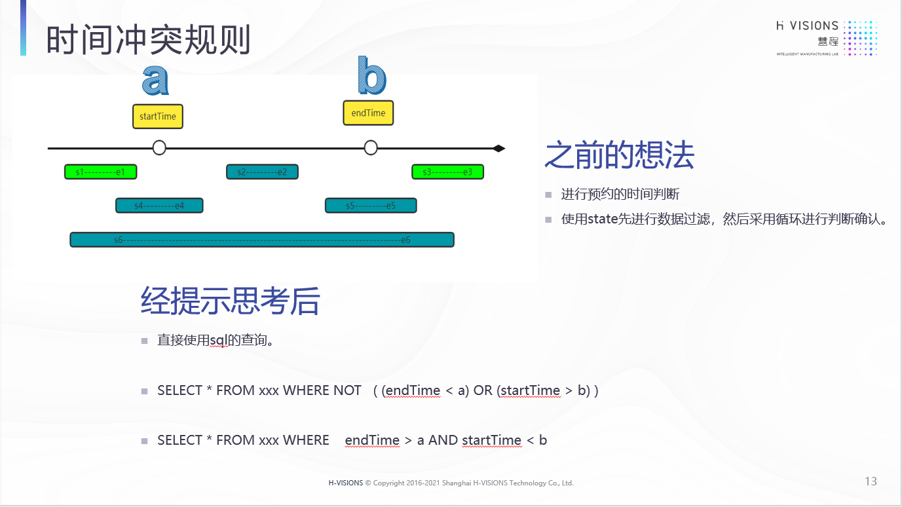

### 记录在工作中遇到的巧用sql提升效率


#### 时间冲突

> 场景描述： 预定会议室，防止时间冲突。


```java

/**
 *                              时间冲突规则：
 *
 *                  a                                   b
 *
 *  -------------startTime---------------------------endTime--------------------------
 *   "s1...e1"                "s2.......e2"                       "s3....e3"
 *          "s4...............e4"          "s5.....................e5"
 *    "s6.............................................................e6"
 *
 *    s1 s3 可放行，其余均被占用
 *
 *    可写 两种sql
 *
 *    1. select * from xxx where not ( (endTime < a) or (startTime > b) )
 *    2. select * from xxx where endTime > a and startTime < b
 *
 *    本次采用第二种， 数据库有例子，ok
 *
 */

```





具体 实现可看 jxhRoom 相关代码

