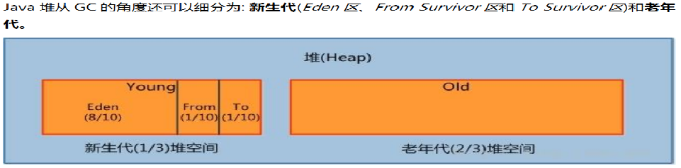
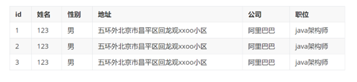
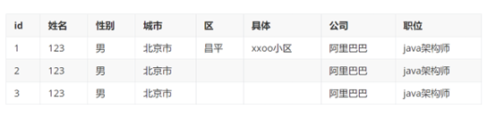
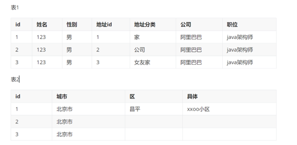
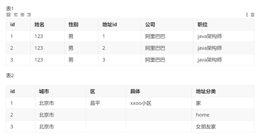

[toc]

# 1 mysql使用innodb引擎，请简述mysql索引的最左前缀如何优化orderby语句。

## 关键点：

1. 如果排序字段不在索引列上，filesort有两种算法： mysql就要启动双路排序和单路排序
2. **无过滤不索引**
3. order by非最左 filesort
4. 顺序错 filesort
5. 方向反  filesort
6. 记不住多动手做实验，熟练使用explain，必要时使用optimizer_trace
7. 更多参考尚硅谷mysql课程


## **答案：**


1. 首先要对sql进行分析检查必要的查询字段，过滤字段，排序字段是否按顺序创建好了索引
2. 如果查询字段不再索引中可能会产生回表操作会导致filesort，降低性能
3. 一定要有过滤字段不然不能使用索引
4. 排序字段和索引顺序不一致会导致filesort，降低性能
5. 多个字段排序时如果方向不一致也会导致filesort，降低性能
6. 使用explain观察查询类型和索引利用情况
7. 尽可能减少不必要的filesort


## **实验准备**：向表中插入50w条数据


在做优化之前，要准备大量数据。接下来创建两张表，并往员工表里插入50W数据，部门表中插入1W条数据。

怎么快速插入50w条数据呢？ `存储过程`

怎么保证插入的数据不重复？`函数`

**部门表：**

- id：自增长


- deptName：随机字符串，允许重复
- address：随机字符串，允许重复
- CEO：1-50w之间的任意数字

**员工表：**

- id：自增长
- empno：可以使用随机数字，或者`从1开始的自增数字`，不允许重复
- name：随机生成，允许姓名重复
- age：区间随机数
- deptId：1-1w之间随机数

**总结：**需要产生随机字符串和区间随机数的函数。

### **创建表**

```sql
CREATE TABLE `dept` (
	`id` INT(11) NOT NULL AUTO_INCREMENT,
	`deptName` VARCHAR(30) DEFAULT NULL,
	`address` VARCHAR(40) DEFAULT NULL,
	ceo INT NULL ,
	PRIMARY KEY (`id`)
) ENGINE=INNODB AUTO_INCREMENT=1;

CREATE TABLE `emp` (
	`id` INT(11) NOT NULL AUTO_INCREMENT,
	`empno` INT NOT NULL ,
	`name` VARCHAR(20) DEFAULT NULL,
	`age` INT(3) DEFAULT NULL,
	`deptId` INT(11) DEFAULT NULL,
	PRIMARY KEY (`id`)
	#CONSTRAINT `fk_dept_id` FOREIGN KEY (`deptId`) REFERENCES `t_dept` (`id`)
) ENGINE=INNODB AUTO_INCREMENT=1;
```


### 创建函数

```sql
-- 查看mysql是否允许创建函数：
SHOW VARIABLES LIKE 'log_bin_trust_function_creators';
-- 命令开启：允许创建函数设置：（global-所有session都生效）
SET GLOBAL log_bin_trust_function_creators=1; 
```


```sql
-- 随机产生字符串
DELIMITER $$
CREATE FUNCTION rand_string(n INT) RETURNS VARCHAR(255)
BEGIN    
	DECLARE chars_str VARCHAR(100) DEFAULT 'abcdefghijklmnopqrstuvwxyzABCDEFJHIJKLMNOPQRSTUVWXYZ';
	DECLARE return_str VARCHAR(255) DEFAULT '';
	DECLARE i INT DEFAULT 0;
	WHILE i < n DO  
		SET return_str =CONCAT(return_str,SUBSTRING(chars_str,FLOOR(1+RAND()*52),1));  
		SET i = i + 1;
	END WHILE;
	RETURN return_str;
END $$

-- 假如要删除
-- drop function rand_string;
```


```sql
-- 用于随机产生区间数字
DELIMITER $$
CREATE FUNCTION rand_num (from_num INT ,to_num INT) RETURNS INT(11)
BEGIN   
 DECLARE i INT DEFAULT 0;  
 SET i = FLOOR(from_num +RAND()*(to_num -from_num+1));
RETURN i;  
END$$

-- 假如要删除
-- drop function rand_num;
```


### 创建存储过程

```sql
-- 插入员工数据
DELIMITER $$
CREATE PROCEDURE  insert_emp(START INT, max_num INT)
BEGIN  
	DECLARE i INT DEFAULT 0;   
	#set autocommit =0 把autocommit设置成0  
	SET autocommit = 0;    
	REPEAT  
		SET i = i + 1;  
		INSERT INTO emp (empno, NAME, age, deptid ) VALUES ((START+i) ,rand_string(6), rand_num(30,50), rand_num(1,10000));  
		UNTIL i = max_num  
	END REPEAT;  
	COMMIT;  
END$$
 
-- 删除
-- DELIMITER ;
-- drop PROCEDURE insert_emp;
```


```sql
-- 插入部门数据
DELIMITER $$
CREATE PROCEDURE insert_dept(max_num INT)
BEGIN  
	DECLARE i INT DEFAULT 0;   
	SET autocommit = 0;    
	REPEAT  
		SET i = i + 1;  
		INSERT INTO dept ( deptname,address,ceo ) VALUES (rand_string(8),rand_string(10),rand_num(1,500000));  
		UNTIL i = max_num  
	END REPEAT;  
	COMMIT;  
END$$
 
-- 删除
-- DELIMITER ;
-- drop PROCEDURE insert_dept;
```


### 调用存储过程

```sql
-- 执行存储过程，往dept表添加1万条数据
CALL insert_dept(10000); 

-- 执行存储过程，往emp表添加50万条数据，编号从100000开始
CALL insert_emp(100000,500000); 
```


### 批量删除表索引

```sql
-- 批量删除某个表上的所有索引
DELIMITER $$
CREATE PROCEDURE `proc_drop_index`(dbname VARCHAR(200),tablename VARCHAR(200))
BEGIN
	DECLARE done INT DEFAULT 0;
	DECLARE ct INT DEFAULT 0;
	DECLARE _index VARCHAR(200) DEFAULT '';
	DECLARE _cur CURSOR FOR SELECT index_name FROM information_schema.STATISTICS WHERE table_schema=dbname AND table_name=tablename AND seq_in_index=1 AND index_name <>'PRIMARY'  ;
	DECLARE CONTINUE HANDLER FOR NOT FOUND set done=2 ;      
	OPEN _cur;
		FETCH _cur INTO _index;
		WHILE  _index<>'' DO 
			SET @str = CONCAT("drop index ",_index," on ",tablename ); 
			PREPARE sql_str FROM @str ;
			EXECUTE sql_str;
			DEALLOCATE PREPARE sql_str;
			SET _index=''; 
			FETCH _cur INTO _index; 
		END WHILE;
	CLOSE _cur;
END$$
```


```sql
-- 执行批量删除：dbname 库名称, tablename 表名称
CALL proc_drop_index("dbname","tablename"); 
```


## 最左前缀法则示例

假设index(a,b,c)

| Where语句                                                  | 索引是否被使用                                               |
| ---------------------------------------------------------- | ------------------------------------------------------------ |
| where a = 3                                                | Y,使用到a                                                    |
| where a =  3 and b = 5                                     | Y,使用到a，b                                                 |
| where a =  3 and b = 5 and c = 4                           | Y,使用到a,b,c                                                |
| where b =  3 或者 where b = 3 and c =  4 或者 where c =  4 | N                                                            |
| where a =  3 and c = 5                                     | 使用到a， 但是c不可以，b中间断了                             |
| where a =  3 and b > 4 and c = 5                           | 使用到a和b， c不能用在范围之后，b断了                        |
| where a is  null and b is not null                         | is null 支持索引  但是is not null 不支持,所以 a 可以使用索引,但是 b不一定能用上索引（8.0） |
| where a  <> 3                                              | 不能使用索引                                                 |
| where  abs(a) =3                                           | 不能使用 索引                                                |
| where a =  3 and b like 'kk%' and c = 4                    | Y,使用到a,b,c                                                |
| where a =  3 and b like '%kk' and c = 4                    | Y,只用到a                                                    |
| where a =  3 and b like '%kk%' and c = 4                   | Y,只用到a                                                    |
| where a =  3 and b like 'k%kk%' and c =  4                 | Y,使用到a,b,c                                                |

##  一般性建议

Ø 对于单键索引，尽量选择过滤性更好的索引（例如：手机号，邮件，身份证）

Ø 在选择组合索引的时候，过滤性最好的字段在索引字段顺序中，位置越靠前越好。

Ø 选择组合索引时，尽量包含where中更多字段的索引

Ø 组合索引出现范围查询时，尽量把这个字段放在索引次序的最后面

Ø 尽量避免造成索引失效的情况


## 实验

删除索引

```
 drop index idx_age_name_deptid on emp;
```


创建索引

```
CREATE INDEX idx_age_deptid_name ON emp (age,deptid,NAME);
```

#### 

**无过滤不索引**

```

EXPLAIN SELECT * FROM emp ORDER BY age,deptid; 
EXPLAIN SELECT * FROM emp ORDER BY age,deptid LIMIT 10; 

增加过滤条件，使用上索引了。
EXPLAIN SELECT age FROM emp where age>1000 ORDER BY age,deptid,name;

```


**查询条件与筛选条件**

```
const查询排序后回表操作，不会filesort
EXPLAIN SELECT * FROM emp WHERE age=45 ORDER BY age,deptid,NAME; 

range查询，Using index condition 没有完全使用索引
EXPLAIN SELECT * FROM emp WHERE age>45 ORDER BY age,deptid,NAME;
range查询，Using where; Using index 完全使用索引
EXPLAIN SELECT age FROM emp WHERE age>45 ORDER BY age,deptid,NAME;
```

**顺序错 filesort**

```
正常情况
EXPLAIN SELECT age FROM emp WHERE age>45 ORDER BY age,deptid,NAME;
order by顺序变化会导致filesort
EXPLAIN SELECT age FROM emp WHERE age>45 ORDER BY deptid,age,NAME;

```

**order by非最左 filesort**

```
EXPLAIN SELECT age FROM emp WHERE age>45 ORDER BY deptid,NAME;
```

**方向反 必排序**

```
8.0为Backward index scan 倒序索引
EXPLAIN SELECT age FROM emp WHERE age>45 ORDER BY age desc,deptid desc,NAME desc

方向反 产生filesort
EXPLAIN SELECT age FROM emp WHERE age>45 ORDER BY age desc,deptid desc,NAME asc;

```


# 2 JVM 内存模型中，为什么要区分新生代和年老代，对于新生代，为什么又要区分eden 区survial区?



## 关键点：

1. 分清jvm标准与实现
2. 分代收集算法在g1上是逻辑上的划分之前的垃圾回收器可以理解是物理上的
3. 标记算法
4. 清除算法
5. **内存连续空间**
6. 记不住联想一下下片儿
7. 更多参考尚硅谷jvm课程


## **答案：**

1. 主流垃圾回收器 cms g1都使用了分代收集算法
2. 正常系统运行时会有**海量****临时对象**产生，这些对象短期内大部分就会失效，对于这些对象我们把他们临时放到新生代
3. 新生代满了之后需要清理垃圾对象，我们会把有效对象复制到老年代，以便后续继续使用
4. 为了更有效的区分哪些对象应该被复制到老年代，所以在新生代划分出了eden去和s0,s1区域
5. 细化后的新生代内部被再次划分以便保证高速读写同时内存连续，
   1. 新对象会被保存到eden区（开始是空的所以内存连续），eden区满了会把有效对象复制到s0（s0也是空的所以也是连续空间）
   2. 清空eden区（再次写入时又是连续空间）
   3. s0 和 s1 在命名上互换 原来的s1等待写入（空的）
   4. eden区再次满了，重复上面步骤
6. eden区通过复制/清除算法保证了读写连续性（因为新生代的对象产生和销毁非常频繁，所以才采用了清空的方式）

# 3 典型的JDBC程序按()顺序编写( 排序)

答案：dbecfa


**下列语句哪一个正确(b)，**
A.Java 程序经编译后会产生 machine code
B.Java 程序经编译后会产生 byte code
C.Java 程序经编译后会产生 DLL
D.以上都不正确

# 4 请编写一个Java类Testjava，求出100以内既能被2 除又能被3 除的数，并输出到控制台上

```java
public class Test01 {
    public static void main(String[] args) {
        for (int i = 1; i <= 100; i++) {

            if (i % 2 == 0 && i % 3 ==0){

                System.out.println(i);
            }
        }
    }
}
```


# 5 A 系统远程调用 B 系统的接口，A 系统在完成调用之后，需要更新A 系统本地表

# 问题1:常见的远程调用有几种?

**关键点：**

1. 网络协议与封装,所有的网络请求都是基于TCP或UDP协议的
2. 常用框架
3. 长短连接(复用)

**答案：**

1. 自定义协议实现C/S RPC调用（实现复杂，需解决的问题多）
2. UDP广播类型（常见用于即时通讯类，速度快，但需要二次确认）
3. 目前主流的基于http协议调用（Restful风格的api，springcloud微服务调用使用的就是http）
4. dubbo协议（阿里出品，长连接，二进制封装数据，性能较高）
5. soap协议（古老的webservice系列框架，基于xml实现数据封装，http协议传输）
6. 异步响应式（WebFlux+Spring Data Reactive）
7. 服务器推（不主动调用，常见系统通知类）

# 问题 2: 对于有这些外部衔接的方法需要注意哪些问题?请写出注意问题及伪代码

1. 写好接口文档，方便后续维护和团队协作

2. 统一化的报文结构 

3. 标准化的服务状态码

   1. ```
      status_code 200;//请求成功
      ```

4. 统一化请求日志记录,及异常记录

5. ```
   GlobalExceptionHandler...
   
   logger.error("服务异常"，exception);
   ```

6. 当请求延迟过高，可以快速失败

7. 重试机制

8. ```java
   // 服务列表
   serverList = {ser1,ser2,ser3}
   retrycount = 0;
   retrymax=10;
   maxrequesttime = 200ms；
   getxxoo(){
   
       try{
       // 尝试请求数据
       calldata(serverList)
   
       }catch (请求失败 500类异常 || 请求超时 calldata的网络请求方法中){
   
    //   拦截器记录日志
       serverList.remove(刚才请求的服务器)
    //   重试次数过多
       if (retrycount == retrymax)
       return "当前访问不可用稍后再试"
       
       retrycount ++;
       递归调用本方法
   
       }
   }
   ```

9. 事务问题，可回滚

10. ```
    getData(){
    分布式事务开启
    
    get1();
    get2();
    get3();
    事务结束
    要么全成功 要么全失败
    修改数据时使用 tryModify() 临时保存数据或通过Seata类似的框架实现
    }
    ```

11. 数据一致性问题

12. ```
    有并发修改数据时，如果需要保证一致性，需要使用分布式锁
    修改方法
    modifyxx(){
    // 尝试加锁
    boolean haslock = tryLock(id)
    
    if(haslock){
    httppost(url,data)
    releaseLock(id)
    }
    else{
    
    // 提示用户一会再试试
    // 尝试再次获取锁
    }
    
    }
    ```

# 6 在如下代码中，当调用insertA 方法的时候，是否能做当insertA 到当调用insertB的时候，如果imnsertB 插入b表的时候有异常，能否保证 insertA0中的a 表插入成功，如果不能，应该如何修改。

关键点：

1. 数据库事务
2. 编程式事务 beginTransaction、commit、rollback
3. 声明式事务 @Transactional


答:

1. 不能，在类上使用了@Transactional注解，默认开启了全局读写事务
2. 可以细粒度在方法上加注解


# 7 springboot是如何管理版本依赖的？什么是自动配置、起步依赖?

## springboot是如何管理版本依赖的？

关键点：

1.maven

2.springboot pom.xml 父子关系

3.spring-boot-starter


答：

1. springboot底层使用maven管理依赖，通过控制pom.xml父子关系来完成细节配置，在父pom中定义具体框架和版本号以及额外的信息。
2. 提供了很多场景的spring-boot-starter 的 pom.xml文件，来标准化的引入依赖避免冲突

## 什么是自动配置？

关键点：

1. 看springboot的源码
2. @SpringBootApplication 中包含的@EnableAutoConfiguration，@SpringBootConfiguration，@ComponentScan 注解
3. @EnableAutoConfiguration 开启自动配置功能 内部还包含 @AutoConfigurationPackage、@Import
   1. @AutoConfigurationPackage 中 @Import(AutoConfigurationPackages.Registrar.class) 引入了 Registrar.class 完成批量注册，默认扫描主启动类的包@Bean或者@Compont等注解
   2. @Import(AutoConfigurationImportSelector.class)
4. @ComponentScan 扫描被@Compent(@Service@Controller)注解的bean 加载到容器中
5. @SpringBootConfiguration 表示这是一个SpringBoot的配置类

答：

1. **所加载使用的jar包 如果是比较常见的，spring都提供了默认配置，也就是不像以前一样需要把框架的每一个属性都要配置一遍，主要目的是简化开发**
2. springboot 通过在启动类上添加注解 @SpringBootApplication 完成自动配置
3. 内部完成了读取每个jar包下的`META-INF/spring.factories`和spring-boot-autoconfigure-2.6.7.jar中的默认配置


## 起步依赖?

答：

指的是各种starter重点是pom.xml,其中包含了框架所需要的其他依赖以及默认配置文件，不需要我们手动配置了。

# 8 数据库索引的原理?创建索引的缺点是什么，什么情况索引失效?优化数据库的方法有哪些?

**关键点：**

1. 哪种数据库（其实关系型的都差不多）
2. 以mysql 为例 b+树
3. 索引的好处和代价
4. 索引失效的情况
5. 优化：
   1. 硬件 层面
   2. 软件 层面


**答：**

## 数据库索引的原理?

1. 以mysql为例，默认引擎InnoDB使用了b+树实现索引，在索引查找时 实现了log（n）的时间复杂度
2. 聚簇索引记录了主键id（完整数据），非聚簇索引的索引树中记录数据（索引字段+主键）
3. 在聚簇索引的叶子节点中记录了完整的值，非聚簇索引的叶子节点记录的是主键以及索引字段，如果需要完整值的话需要回表操作，即使用主键去聚簇索引中再次查找完整数据
4. 索引的叶子节点以链表的形式存储，方便顺序查找和排序

## 创建索引的缺点是什么？

1. 会占用空间
2. 更新时会级联更新索引
3. 高并发写影响性能

## 什么情况索引失效?

1. 计算、函数导致索引失效
2. LIKE以%开头索引失效
3. 不等于(!= 或者<>)索引失效
4. IS NOT NULL 可能失效（不同版本和数据决定） IS NULL有效
5. 类型转换导致索引失效
6. 数据库优化器觉得不用索引更快的时候失效


## **优化数据库的方法有哪些?**

1. 硬件 主要在存储层优化
2. 网络
3. 操作系统调优
4. 表结构设计优化
5. sql优化
6. 减少函数使用
7. 索引优化
8. 大字段及全文检索优化
9. 连接池优化
10. 事务优化
11. 数据库集群化
12. 加入缓存
13. 冷热存储
14. 分库分表

# 9.Integer和int 的区别

关键点：

1. 堆栈存储基础数据类型与对象
2. 值比对的时候注意java的自动拆箱
3. Integer 值大小在 -128到127之内 使用IntegerCache

答：

1. Integer是int的包装类，int则是java的一种基本的数据类型；
2. Integer实际是对象的引用，当new一个Integer时，实际上生成一个指针指向对象，而int则直接存储数值
3. Integer的默认值是null，而int的默认值是0。

# 10 jsp的八个隐含对象有哪些

关键点：

1. jsp本质上就是servlet
2. 答不上来关系也不大


答：

**1 pageContext**

类型：PageContext

代表：当前页面的上下文

作用：可以获取到页面中的其他隐含对象，同时它还是一个域对象。

**2 request**

类型：HttpServletRequest

代表：请求

作用：可以获取用户发送的请求信息，它也是一个域对象。

**3 session**

类型：HttpSession

代表：当前会话

作用：可以作为域对象，用来共享数据。

**4 application** 

类型：ServletContext

代表：代表整个WEB应用

作用：是JavaWeb中最大的域对象。

**5 response**

类型：HttpServletResponse

代表：响应

作用：向浏览器发送响应信息

**6 out**

类型：JspWriter

代表：输出流

作用：可以向页面输出内容

**7 config**

类型：ServletConfig

代表：当前JSP的配置信息

作用：可以获取到Servlet标签中初始化参数

**8 page**

类型：Object 在service方法中有如下代码 Object page = this;

代表：代表当前JSP的对象

**9 exception**

类型：Throwable

代表：异常信息

作用：获取页面中的异常

# 11 数据库三范式是什么

### 第一范式

·    单表（字段）拆分到不可拆分为止

o  张，三，街道地址方便分组 联系方式（手机号，email）

o  有主键，具有原子性，字段不可分割

 

​                               

 

改动后

 

### 第二范式

·    每一行数据唯一性

o   - 订单地址重复，引用其他表

o   - 多表关联

 

 

### 第三范式

表之间关联主键依赖

·    单行数据中保留唯一主键，建立外键关联表

 




答：

1. 数据库三范式是设计数据库表的方法论，能够充分的利用关系型数据库把实体有机的关联起来
2. 降低耦合度节省存储空间

# 12 什么是 Spring 的依赖注入?有哪些方法进行依赖注入


关键点：

1. Ioc Inversion of Control 控制翻转 
2. DI Dependency Injection 依赖注入


答：依赖注入是指将依赖的对象实例交给spring帮我们注入 管理，从而释放对对象的管理权，比如可以统一替换接口的实现，更高效的开发程序

1. set方法注入
2. 构造方法注入
3. @autowire 自动注入

# 13  说一下你理解的JVM 原理


关键点：

1. jvm标准与实现
2. 解决了跨平台问题
3. JMM内存管理
4. JVM模型
5. 不同的垃圾回收器


答： jvm是java虚拟机，我们的class文件运行在虚拟机上，通过虚拟机解决了跨平台的问题，jvm中有jmm来管理java内存访问的方式，不同的jvm实现性能关注有差异，现在主流的实现是Hotspot，垃圾回收器是G1，jvm运行时内存中分为方法区，堆，栈，本地方法栈，执行代码时需要执行引擎

# 14 浅谈 ReentrantLock 的设计

答：

1. ReentrantLock 是在**多线程竞争资源**时使用的锁，他是一个独占锁、可重入锁，也是悲观锁
2. ReentrantLock 支持公平锁，对公平和非公平锁有不同的实现逻辑
3. ReentrantLock  使用 aqs（AbstractQueuedSynchronizer）来实现的获取锁的线程队列等待的过程
4. 内部使用了原子操作类 cas 比较线程与对应的锁关系
5. 内部支持newCondition来灵活的控制获取到锁的线程的阻塞与释放

# 15 说一下 mysql 中事务的实现原理

https://dev.mysql.com/doc/refman/5.7/en/innodb-multi-versioning.html

Multi-Version Concurrency Control 多版本并发控制，*MVCC* 是一种并发控制的方法，一般在数据库管理系统中，实现对数据库的并发访问

InnoDB是一个多版本的存储引擎。它保存有关已更改行的旧版本的信息，以支持并发和回滚等事务特性。这些信息存储在一个称为回滚段的数据结构中的系统表空间或undo表空间中。参见第14.6.3.4节“撤消表空间”。InnoDB使用回滚段中的信息来执行事务回滚所需的撤消操作。它还使用这些信息构建行的早期版本，以实现一致的读取

MVCC 的实现依赖于：隐藏字段、Read View、undo log

**隐藏字段**

- A 6-byte `DB_TRX_ID` 用来标识最近一次对本行记录做修改 (insert 、update) 的事务的标识符 ，即最后一次修改本行记录的事务 id。 如果是 delete 操作， 在 InnoDB 存储引擎内部也属于一次 update 操作，即更新行中的一个特殊位 ，将行标识为己删除，并非真正删除。
- A 7-byte `DB_ROLL_PTR` 回滚指针，指向该行的 undo log 。如果该行未被更新，则为空.
- A 6-byte `DB_ROW_ID` 如果没有设置主键且该表没有唯一非空索引时，`InnoDB` 会使用该 id 来生成聚簇索引.

**Read View**

不同的事务隔离级别中，当有事物在执行过程中修改了数据（更新版本号），在并发事务时需要判断一下版本链中的哪个版本是当前事务可见的。为此InnoDB有了ReadView的概念，使用ReadView来记录和隔离不同事务并发时此记录的哪些版本是对当前访问事物可见的。

**undo log**

除了用来回滚数据，还可以读取可见版本的数据。以此实现非锁定读


答：

1. mysql是由mvcc实现的事务控制
2. MVCC 的实现依赖于：隐藏字段、Read View、undo log
3. 在不同的事务隔离级别下通过设置readview内容，控制了哪些数据可见于不可见

# 16 编写一个基于线程安全的懒加载单例模式

关键点：

1. 多线程访问
2. 防止直接new对象
3. 使用锁
4. 内部类加载实现、cas实现等


```java
public class Test03 {

    private Test03(){}


    private static Test03 instance = null;

    public  static  Test03 getInstance(){

        // 有可能在多线程访问的时候，重复new 了对象
        if (instance == null){

            // 可能会有多个线程 进入抢锁等待状态
            synchronized (Test03.class){
                if(instance == null){
                    instance = new Test03();
                }else{
                    return instance;
                }
            }
        }

        return instance;

    }
}
```


# 17 值传递和引用传递问题

关键点：

1. 引用传递
2. 堆栈内存分析

```
	public static void main(String args[]) {
				StringBuffer a = new StringBuffer("A");
				StringBuffer b = new StringBuffer("B");
				operater(a,b);
				
				System.out.println(a+" "+b);
			
			}

	public static void operater(StringBuffer x, StringBuffer y) {

		x.append(y);
		y = x;
	}
```


答： ab b

# 18 异常代码分析1


关键点：

1. 异常会阻断正常代码运行
2. finally 一定会执行


```
	public static void main(String[] args) {

		try {
			int i = 100 / 0;
			System.out.print(i);
		} catch (Exception e) {

			System.out.println(1);
			throw new RuntimeException();
		} finally {
			System.out.println(2);
		}
		System.out.println(3);
	}
```

答： 1 2 异常


# 19 异常代码分析2

关键点：

1. 在finally中return 后不再执行后续代码
2. catch中return 不影响finally的执行
3. try catch 后的finally一定会执行

```
	public static String output = " ";

	public static void foo(int i) {
		try {
			if (i == 1) {
				throw new Exception();
			}
		} catch (Exception e) {
			output += "2";
			return;
		} finally {
			output += "3";
			return;
		}

		output += "4";
	}

	public static void main(String[] args) {
		foo(0);
		foo(1);
		System.out.println(output);
	}
```


# 20 Spring的AOP的使用情景有哪些?简述其实现原理

关键点：

1. aop面向切面编程使用非常广泛，几乎适用于一切需要统一化处理的场景

答：

1. 统一日志处理
2. 统一异常处理
3. 访问限制（权限，限流等）
4. 事务处理
5. 缓存管理等
6. aop是面向切面编程，通过代理的方式（jdk或cglib）为程序统一添加功能，解决公共问题


# 21 列举linux的常用命令

答：

1. find 、rm、rmdir、mv、cp、cat、pwd、chmod、kill、ping、ifconfig 

2. tail、ps、grep、netstat、echo、ssh、scp、top、mpstat、free、df

# 22 列举知道并用过的其他前沿技术

关键点：

1. 加分项，经常出现在笔试题中，目的是快速了解你的知识宽度并且希望团队中能吸收外界的知识
2. 前沿的技术多数是业务创新，技术还是这几十年的积累
3. 平时多看书 多学习

答：

1. go语言
2. 物联网 IoT 嵌入式开发 树莓派小车 摄像头
3. 低代码数据中台
4. jdk新特性，g1,zgc
5. 区块链
6. 容器化云原生与监控Prometheus + Grafana
7. java高性能游戏开发
8. DDD
9. 响应式编程与异步网络编程
10. 推荐系统
11. 高并发系统架构 nginx+lua
12. chatgpt
13. 量子计算 三进制实现 火箭回收技术 常温超导。。。


# 23 JVM 运行时数据区域包含哪几部分?


答：

1. 堆

2. 栈

3. 本地方法栈

4. 方法区

   

# 24 多线程中 start（)方法和 run（）方法的区别是什么?

答：

1. start用来启动线程，改变的是线程的状态，由就绪进入执行
2. run方法中包含要执行的代码，在执行状态时运行里面的代码，方法返回值是void

# 25 简单写一个会导致死锁的程序

1. 获得锁后不释放，其他线程一直拿不到锁
2. 解决：不要嵌套获得多个锁


```

    static Object lockA = new Object();
    static Object lockB = new Object();
    public static void main(String[] args) {


        new Thread(new Runnable() {
            @Override
            public void run() {


                System.out.println(Thread.currentThread() + " 尝试获取锁A");
                synchronized (lockA){

                    System.out.println(Thread.currentThread() + " 获取到了锁A");

                    try {
                        Thread.sleep(100);
                    } catch (InterruptedException e) {
                        throw new RuntimeException(e);
                    }
                    System.out.println(Thread.currentThread() + " 尝试获取锁B");
                    synchronized (lockB){
                        System.out.println(Thread.currentThread() + " 获取到了锁B");
                    }
                }
            }
        }).start();


        new Thread(new Runnable() {
            @Override
            public void run() {


                System.out.println(Thread.currentThread() + " 尝试获取锁B");
                synchronized (lockB){

                    System.out.println(Thread.currentThread() + " 获取到了锁B");

                    try {
                        Thread.sleep(100);
                    } catch (InterruptedException e) {
                        throw new RuntimeException(e);
                    }

                    System.out.println(Thread.currentThread() + " 尝试获取锁A");
                    synchronized (lockA){
                        System.out.println(Thread.currentThread() + " 获取到了锁A");
                    }
                }
            }
        }).start();
    }
```


# 26 对于高并发、高可用问题的常用处理方式

## 对于高并发

关键点：

1. 寻找瓶颈
2. 分治思想，业务拆分，流程拆分
3. 扩容
4. 限流
5. 分流 ，cdn 缓存
6. 流量清洗 waf
7. 多级缓存设计 后端缓存，客户端缓存
8. 日志溯源
9. 资源隔离
10. 弹性扩缩容
11. 降级处理 前后端 兜底数据


## 对于高可用

1. 容器化管理 HA
2. keepalived

# 27 JVM 是什么?请简述一下JVM 加载 class 文件的原理机制。


关键点：

1. 类加载器
2. 魔数
3. 元空间

负责加载class文件，class文件在文件开头有特定的文件标示，并且ClassLoader只负责class文件的加载，至于它是否可以运行，则由Execution Engine决定。


**魔数**

- Class文件开头的四个字节的无符号整数称为魔数(Magic Number)。
- 魔数是Class文件的标识。值是固定的，为**0xCAFEBABE**
- 如果一个Class文件的头四个字节不是0xCAFEBABE，虚拟机在进行文件校验的时候会报错。使用魔数而不是扩展名来识别Class文件，主要是基于安全方面的考虑，因为文件扩展名可以随意更改。


类加载器分为四种：前三种为虚拟机自带的加载器。

- 启动类加载器（Bootstrap）C++

  负责加载$JAVA_HOME中jre/lib/**rt.jar**里所有的class，由C++实现，不是ClassLoader子类

  也叫系统类加载器，负责加载**classpath**中指定的jar包及目录中class

- 扩展类加载器（Extension）Java

  负责加载java平台中**扩展功能**的一些jar包，包括$JAVA_HOME中jre/lib/*.jar或-Djava.ext.dirs指定目录下的jar包

  

- 应用程序类加载器（AppClassLoader）Java

  

- 用户自定义加载器  Java.lang.ClassLoader的子类，用户可以定制类的加载方式


工作过程：

- 1、当AppClassLoader加载一个class时，它首先不会自己去尝试加载这个类，而是把类加载请求委派给父类加载器ExtClassLoader去完成。
- 2、当ExtClassLoader加载一个class时，它首先也不会自己去尝试加载这个类，而是把类加载请求委派给BootStrapClassLoader去完成。
- 3、如果BootStrapClassLoader加载失败（例如在$JAVA_HOME/jre/lib里未查找到该class），会使用ExtClassLoader来尝试加载；
- 4、若ExtClassLoader也加载失败，则会使用AppClassLoader来加载
- 5、如果AppClassLoader也加载失败，则会报出异常ClassNotFoundException

其实这就是所谓的**双亲委派模型**。简单来说：如果一个类加载器收到了类加载的请求，它首先不会自己去尝试加载这个类，而是把**请求委托给父加载器去完成，依次向上**。


好处：**防止内存中出现多份同样的字节码**(安全性角度)
比如加载位于 rt.jar 包中的类 java.lang.Object，不管是哪个加载器加载这个类，最终都是委托给顶层的启动类加载器进行加载，这样就保证了使用不同的类加载器最终得到的都是同样一个 Object对象。 

# 28 数据连接池的工作机制是什么?

1. 连接池与线程池实现原理一样
2. 限流与复用
3. 数据库建立一个连接的开销要比客户端大
4. 数据库连接池负责分配、管理和释放数据库连接，它允许应用程序重复使用一个现有的数据库连接，而再不是重新建立一个

答：

1. 预先创建好一些数据库连接，放到连接池中
2. 连接池中设置最小连接数和最大连接数
3. 最小连接不断开和数据库的连接
4. 超过最小链接的那些线程，在长时间不使用时会被回收，也就是断开和数据库的连接
5. 所有向数据库发送请求的业务必须通过连接池获得数据库连接
6. 当连接全部在使用中，可以使用队列等待

# 29 写一个正则表达式，验证用户输入的数据是不是身份证号码


# 30 代码题 继承

```java
public class Test extends Father {

	public static void main(String[] args) {
		Test test = new Test();
		System.out.println(test.getName());
	}

}

class Father {
	
	private String name = "father";
	
	public String getName() {
		return name;
	}
}

```

答案：father

# 31 代码题 父子异常

```
public class Test {
	public int div(int a, int b) {
		try {

			return a / b;
		} catch (Exception e) {
			System.out.println("Exception");
		} catch (NullPointerException e) {
			System.out.println("ArithmeticException");
		}

		catch (ArithmeticException e) {
			System.out.println("ArithmeticException");

		} finally {
			System.out.println("finally");
		}
		return 0;
	}

	public static void main(String[] args) {
		Test demo = new Test();
		System.out.println("商是:" + demo.div(9, 0));
	}

}
```


答： 编译失败

# 32 哪一个List实现了最快插入?

arraylist ：数组实现的，查询，修改比较快

linkedlist：链表实现，插入，删除比较快，直接在最后插入数据即可

vector：jdk1.0就有 线程安全，效率特别低


答：linkedlist


## 33 存在使i+1<i的数吗 

关键点：

1. 基础数据类型的最大值 + 1 会变负数

## 下面哪个流类属于面向字符的输入流

InputStreamReader

## 不通过构造函数也能创建对象吗

是 


# 34 Java 接口的修饰符可以为

接口默认是abstract的，默认可以不写

接口的方法 1.8 以后可以有static和default的默认实现，static不能重写

## 35 ArrayList list = new ArrayList(20)中的 list 扩充几次

因为有传参，没必要扩容，所以次数是0；

## 下面哪些是对称加密算法

ab

## 新建一个流对象，下面哪个选项的代码是错误的?

## 代码题 这什么玩意（挠头）？？？

关键点：

1. null 是可以被强转成任何类型的
2. 静态方法不需要实例对象

```
public class NULL {
	public static void haha() {
		System.out.println("haha");
	}
	public static void main(String[] args) {
		((NULL)null).haha();
	}
}
```


# 36 多线程变量同步

```

public class ThreadSafeCache {

	private int result;

	public int getResult() {
		return result;
	}

	public synchronized void setResult(int result) {
		this.result = result;
	}

	public static void main(String[] args) {
		ThreadSafeCache threadSafeCache = new ThreadSafeCache();

		for (int i = 0; i < 8; i++) {

			new Thread(() -> {
				while (threadSafeCache.getResult() < 100) {

				}
				System.out.println("我执行了");
			}).start();
		}
			try {
				Thread.sleep(1000);
			} catch (InterruptedException e) {
				// TODO Auto-generated catch block
				e.printStackTrace();
			}
			threadSafeCache.setResult(200);
	}
}

```

答：

1. 共享变量在多线程读取的时候，会被拉倒线程本地，white 在执行时，一直使用的都是本地变量的值，所以后续更改，线程内一直访问不到最新变量，程序会卡死
2. 给变量增加  volatile关键字，保证多线程之间 变量可见性

# 37 定义了一个类T,其中定义了一个synchronized 方法do（）; A=newT（）;B = new T（）。当一个线程进入A对象的 do 方法后，另一个线程是否可进入B对象的do 方法?

答：

互不影响

1. synchronize 普通方法，锁的是当前对象
2. synchronize 静态方法，锁的是class
3. 同步代码块，可以手动指定锁对象是啥

# 38 多线程有几种实现方法,都是什么?

1. 实现Runnable接口 void返回值
2. 实现Callable接口  可以指定返回值

```
/**
 * 1. 创建Callable的实现类，并重写call()方法，该方法为线程执行体，并且该方法有返回值
 */
class MyCallableThread implements Callable<Integer>{

    @Override
    public Integer call() throws Exception {
        System.out.println(Thread.currentThread().getName() + "执行了！");
        return 200;
    }
}

public class CallableDemo {

    public static void main(String[] args) throws ExecutionException, InterruptedException {
        // 2. 创建Callable的实例，并用FutureTask类来包装Callable对象
        // 3. 创建FutureTask对象，需要一个Callable类型的参数
        FutureTask task = new FutureTask<Integer>(new MyCallableThread());
        // 4. 创建多线程，由于FutureTask的本质是Runnable的实现类，所以第一个参数可以直接使用task
        new Thread(task, "threadName").start();
        //new Thread(task, "threadName2").start();
		
        /*while (!task.isDone()) {
            System.out.println("wait...");
        }*/
        System.out.println(task.get());
        System.out.println(Thread.currentThread().getName() + " over!");
    }
}
```


# 39 同步有几种实现方法,都是什么?


非阻塞

1. volatile
2. cas及atomic系列实现


阻塞

1. wait()
2. sleep
3. synchronized
4. Lock 的实现
   1. ReentrantLock
   2. ReentrantReadWriteLock 等
   3. condition.await()
5. CountDownLatch
6. CyclicBarrier
7. Semaphore
8. BlockingQueue