### 探索RuoYi-vue 框架

**当前版本:** v3.6.0


后端技术栈：

- springboot 
- mybatis
- redis

前端技术栈：

- vue


#### **2021.7.28**      			`探索树形结构的展示`

##### 请求超时配置

因为debug导致一直超时，发现请求超时处理在前端配置，具体位置：

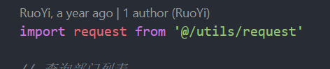

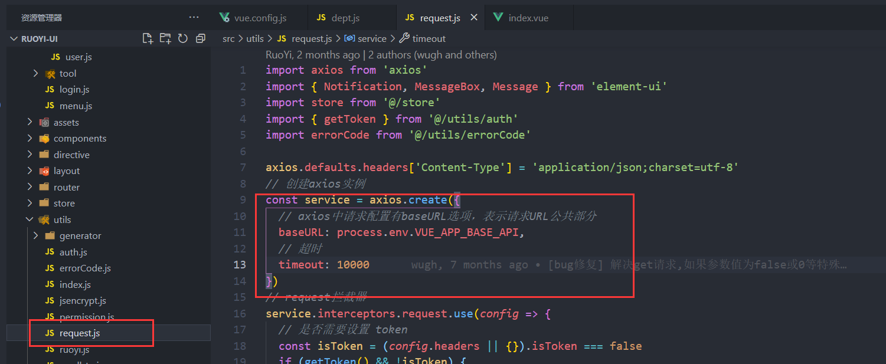


修改即可！


##### 缓存信息

在打开多个页面，导航栏具有多个时，依次删除后发现并无请求信息，直接缓存在本地。 、


尚未发现配置或源码位置？


##### 部门展示接口1

在首次点击部门管理时，发送接口 `/system/dept/list`， 发现此时后端处理 直接通过mybatis的 xml文件进行sql写入 拼接条件而后写入，具体如下：

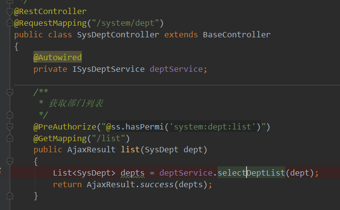

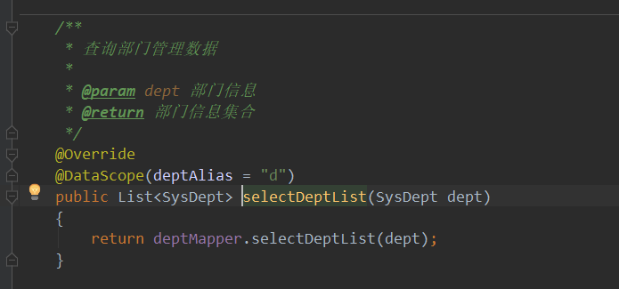

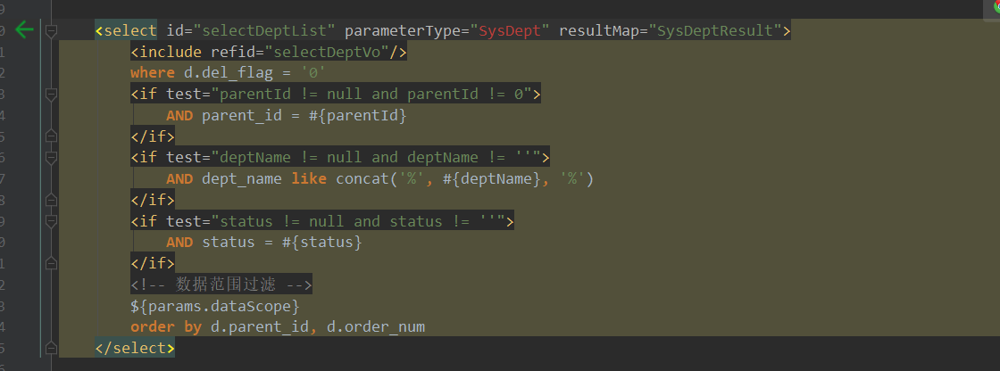

直接返回一个大型的List数据，而后前端进行拆解并组装为树形结构。

可知： 框架就是通过mybatis作为数据库层操作，同时复习mybatis，一个对象参数的话，直接可以#{对象属性}即可进行取值。

且传递参数直接为 entity 类， 在其中的getter方法中直接进行了数据校验：

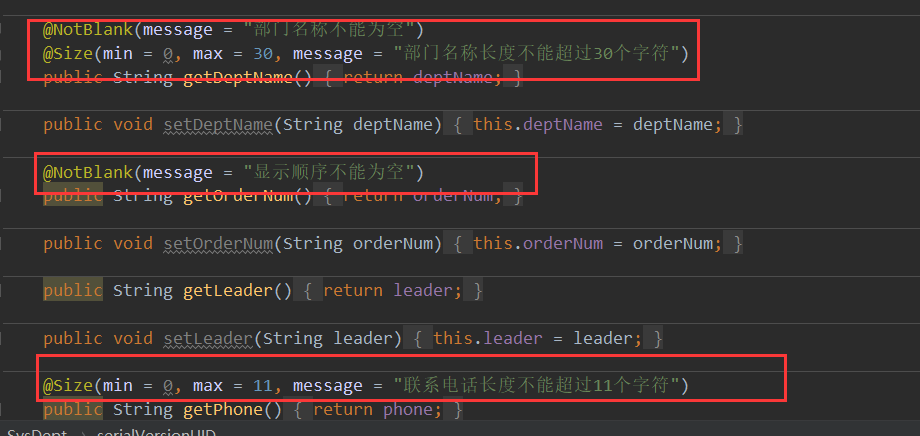

因其并没有采用lombok插件，故在getter方法上进行数据校验。

具体导包：

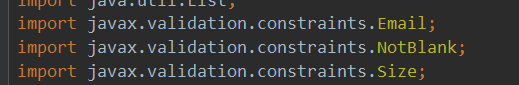


产生新的疑惑： 

在进行接口

```java
/**
 * 获取部门列表
 */
@PreAuthorize("@ss.hasPermi('system:dept:list')")
@GetMapping("/list")
public AjaxResult list(SysDept dept){
        List<SysDept> depts = deptService.selectDeptList(dept);
        return AjaxResult.success(depts);
}
```

get请求，在参数中使用了对象进行接收，且并没有增加@RequestBody注解， 与 @Validated 校验注解。

尚不清楚为何？


同时： 在进行新增接口中： 

```java
/**
 * 新增部门
 */
@PreAuthorize("@ss.hasPermi('system:dept:add')")
@Log(title = "部门管理", businessType = BusinessType.INSERT)
@PostMapping
public AjaxResult add(@Validated @RequestBody SysDept dept)
{
    if (UserConstants.NOT_UNIQUE.equals(deptService.checkDeptNameUnique(dept)))
    {
        return AjaxResult.error("新增部门'" + dept.getDeptName() + "'失败，部门名称已存在");
    }
    dept.setCreateBy(SecurityUtils.getUsername());
    return toAjax(deptService.insertDept(dept));
}
```

进行了标准的@Validated @RequestBody 注解配置。

达成共识！


而后深究又发现疑惑： 

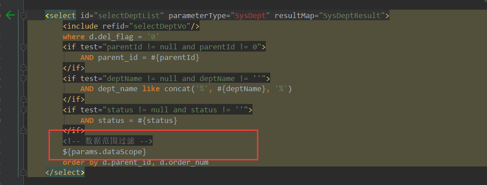

经发现， 因传递参数为实体类：Entity ，ruoyi 框架中实体类均继承类：

**BaseEntity**

```java
/**
 * Entity基类
 * 
 * @author ruoyi
 */
public class BaseEntity implements Serializable
{
    private static final long serialVersionUID = 1L;
    /** 搜索值 */
    private String searchValue;
    /** 创建者 */
    private String createBy;
    /** 创建时间 */
    @JsonFormat(pattern = "yyyy-MM-dd HH:mm:ss")
    private Date createTime;
    /** 更新者 */
    private String updateBy;
    /** 更新时间 */
    @JsonFormat(pattern = "yyyy-MM-dd HH:mm:ss")
    private Date updateTime;
    /** 备注 */
    private String remark;
    /** 请求参数 */
    private Map<String, Object> params;
```

对比数据库与源entity类得知： ruoyi框架中，并不通用采用逻辑删除，若使用逻辑删除自主进行增加字段并重写删除方法，且所有数据表均拥有共同的四个标准字段： createBy  createTime   updateBy   updateTime

发现关键的params参数，找到xml配置中 ${params.dataScope} 来源

探索发现：

在controller 层进行参数传递时，并无params参数，

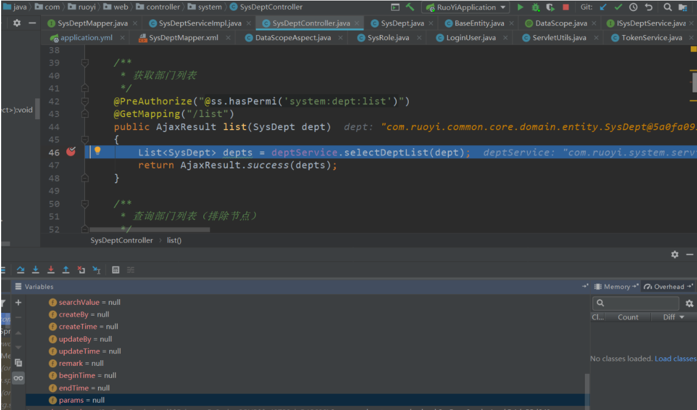

往后进行到service层时

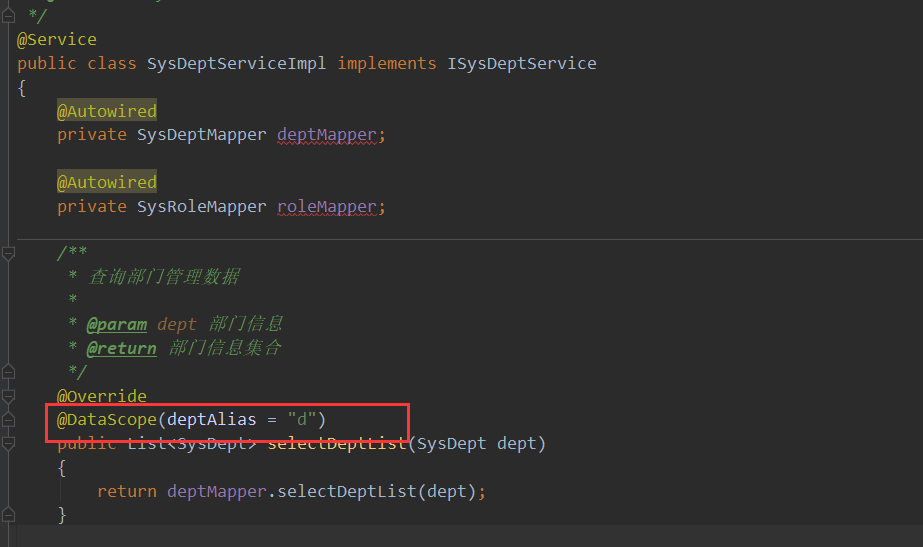

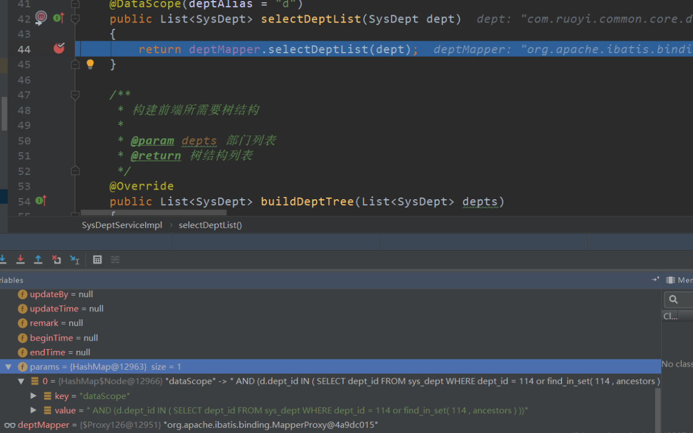

因为此注解导致params拥有参数

搜索相关资料，得知该注解会根据其角色所拥有的权限来给key为dataScope的集合元素赋值value

实现在DataScopeAspect

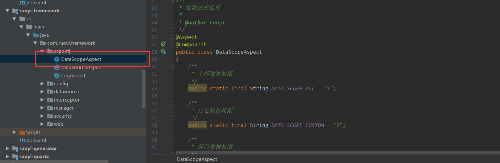

通过aop切片方式进行了数据范围过滤

大致流通走通，并不完全了解！


##### 部门展示接口2

`/system/dept/roleDeptTreeselect/{roleId} ` 		**加载对应角色部门列表树**

在此时发现，经由传递的roleId ，进行角色查询对应部门树并不使用连表查等等，而是进行了像是部门列表树全部查询一样进行所有的查询，而后再进行3个大方法的递归实现将List列表转为前端需要的树形结构。

失望！ 并没有封装通用的树形结构方法。


##### 菜单展示接口1

`/system/menu/list` 		**获取菜单列表**

具体实现与部门展示接口1基本一致，直接返回整个list，而后前端进行数据的拆解拼装。


##### **`并无发现通用树形节点的处理`**


